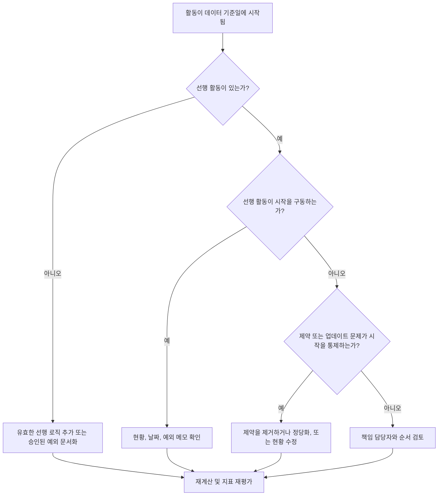

## 목적

이 가이드는 일정 담당자와 프로젝트 컨트롤 팀이 유효한 선행 로직의 구동 없이 Primavera P6 데이터 기준일(Data Date)에 시작하도록 예정된 활동을 줄이거나 제거하는 데 도움을 줍니다. 일정 품질 검토, PMO 건강 점검, 업데이트 주기 검증에 적용됩니다.

목표는 단기 작업이 명확한 CPM 로직으로 지원되고, 누락된 관계, 제약, 수동 날짜, 또는 불완전한 진행 업데이트 때문만으로 활동이 데이터 기준일에 시작되지 않음을 확인하는 것입니다.

## 시작 전

조치를 취하기 전에 다음 정보를 수집하십시오:

- 이 지표에 대한 현재 평가 결과.
- 최신 일정 계산에 사용된 프로젝트 데이터 기준일.
- 데이터 기준일과 동일한 시작 날짜를 가진 미착수 또는 미시작 활동 목록.
- 각 활동에 대한 선행 및 후속 관계 세부 정보.
- 제약, 예상 날짜, 실제 날짜, 캘린더 할당.
- 업데이트에 사용된 P6 일정 옵션 (해당하는 경우 유지 로직 또는 진행 재정의 설정 포함).
- 프로젝트 시작 활동, 외부 인터페이스 마일스톤, 또는 발주처 지시 시작과 같은 승인된 예외.

## 결과 이해

강력한 결과는 구동 선행 로직 없이 데이터 기준일에 시작되는 미해결 활동이 0인 것입니다. 이는 현재 및 단기 작업이 일정 네트워크에 연결되어 있고 데이터 기준일이 누락된 시퀀싱을 숨기지 않음을 의미합니다.

허용 가능한 결과는 소수의 문서화된 예외를 포함할 수 있습니다. 이것들은 무시되지 않고 검토되고 승인되어야 합니다. 예를 들어, 착공 통보 마일스톤 또는 외부적으로 승인된 활동은 정상적인 선행 활동이 필요하지 않을 수 있지만, 이유는 검토자에게 보여야 합니다.

취약한 결과는 여러 활동이 명확한 논리적 구동 요인 없이 데이터 기준일에 시작됨을 의미합니다. 이는 열린 시작(open starts), 누락된 선행 관계, 과도한 제약, 불완전한 진행 업데이트, 또는 최신 업데이트 후 올바르게 재시퀀싱되지 않은 활동을 나타낼 수 있습니다.

## 개선 목표

목표는 유효한 구동 로직 없이 데이터 기준일에 시작되는 미해결 활동 수 0입니다.

개선 목표는 단순히 수를 줄이는 것이 아닙니다. 더 깊은 목표는 데이터 기준일 근처의 각 활동이 예측 시작에 대한 방어 가능한 이유를 가지고 있음을 확인하는 것입니다. 수정 후, 각 영향을 받은 활동은 적절한 선행 로직, 문서화된 예외, 또는 수정된 현황/날짜 조건 중 하나를 가져야 합니다.

## 실행 계획

### 1단계: 주요 문제 식별

데이터 기준일과 동일한 시작 날짜를 가진 미착수 또는 미시작 활동을 필터링하는 P6 레이아웃 또는 보고서를 만드십시오. Activity ID, 활동명, WBS, 시작, 완료, 현황, 전체 여유 시간(Total Float), 캘린더, 기본 제약, 선행 활동, 후속 활동, 가용한 경우 구동 관계 지표에 대한 열을 포함하십시오.

각 활동을 검토하고 물어보십시오:

- 활동에 선행 활동이 있는가?
- 선행 활동이 존재한다면, 실제로 시작을 구동하는가?
- 활동이 제약에 의해 유지되거나 이동되는가?
- 활동에 실제 시작 또는 진행 업데이트가 누락되어 있는가?
- 활동이 프로젝트 시작 마일스톤과 같은 유효한 예외인가?
- 활동이 로직이 일반적으로 취약한 WBS 영역에 속하는가?

발견 사항을 실용적인 원인으로 그룹화하십시오: 누락된 선행 활동, 구동하지 않는 선행 활동, 제약 또는 예상 날짜, 업데이트/현황 오류, 또는 승인된 예외.

### 2단계: 권장 수정 적용

누락되거나 취약한 로직부터 시작하십시오. Finish-to-Start, Start-to-Start, 또는 적절한 경우 Finish-to-Finish 관계와 같이 실제 작업 순서를 나타내는 유효한 선행 관계를 추가하십시오. 지표를 충족시키기 위해서만 관계를 추가하지 마십시오; 각 관계는 실제 건설, 엔지니어링, 조달, 접근, 승인, 또는 인계 의존 관계를 반영해야 합니다.

다음으로 제약을 검토하십시오. 활동이 시작 제약 때문에 데이터 기준일에 시작되고 있다면, 제약이 계약적 또는 운영적으로 정당화되는지 확인하십시오. 불필요한 제약을 제거하고 활동이 로직에 의해 구동되도록 하십시오. 제약이 유효하다면, 이유를 문서화하고 주공정을 왜곡하지 않는지 확인하십시오.

진행 현황을 확인하십시오. 작업이 이미 시작되었다면, 실제 시작과 남은 기간을 올바르게 업데이트하십시오. 작업이 시작되지 않았다면, 예측 시작이 데이터 기준일에 남아 있어야 하는지 확인하십시오. 업데이트 주기가 현재 날짜로 활동을 당겼기 때문에 활동이 시작 준비된 것처럼 나타나서는 안 됩니다.

변경이 이루어진 후, 일정을 재계산하고 영향을 받은 활동을 다시 검토하십시오. 시작 날짜가 이제 로직에 의해 구동되거나, 올바르게 현황 파악되거나, 승인된 예외로 문서화되었는지 확인하십시오.

### 3단계: 일반적인 장애물 제거

일반적인 장애물에는 불명확한 현장 피드백, 누락된 인터페이스 정보, 단기 작업을 준비된 것처럼 보이게 하려는 압력이 있습니다. 공종 리드, 건설 관리자, 조달 담당자, 또는 패키지 관리자와 함께 영향을 받은 활동을 검토함으로써 이를 해결하십시오.

또 다른 일반적인 장애물은 로직의 대체물로 제약을 잘못 사용하는 것입니다. 제약은 일부 경우에 필요할 수 있지만, 일정 네트워크를 대체해서는 안 됩니다. 제약이 유지된다면, 왜 존재하는지와 여유 시간 및 최장 경로에 어떤 영향을 미치는지 문서화하십시오.

또한 문제가 일정 계산 설정 또는 업데이트 관행으로 인한 것인지 확인하십시오. 진행 재정의(progress override), 유지 로직(retained logic), 순서 외 진행, 또는 불완전한 실적화가 결과에 영향을 미치고 있다면, 지표를 재평가하기 전에 업데이트 방법을 프로젝트 컨트롤 절차와 일치시키십시오.

### 4단계: 변경 사항 검증

다음 평가 전에 수정된 일정을 검증하십시오. 구동 로직 없이 데이터 기준일에 시작되는 미착수 또는 미시작 활동에 대한 필터를 다시 실행하십시오. 각 남은 항목이 수정되었거나 승인된 예외로 문서화되었는지 확인하십시오.

재계산 후 전체 여유 시간, 최장 경로, 단기 단기 계획 활동을 검토하십시오. 로직 수정이 주공정을 변경하거나 추가적인 시퀀싱 문제를 드러낼 수 있습니다. 일정 이동이 중요하다면, 프로젝트 컨트롤 리드 또는 PMO 검토자에게 영향을 전달하십시오.

## 개선 일정

### 1일차: 검토 및 진단

지표를 실행하고, 데이터 기준일을 확인하고, 활동 목록을 생성하십시오. 결과를 누락된 로직, 구동하지 않는 로직, 제약, 현황 오류, 잠재적 예외로 분류하십시오.

### 2-3일차: 우선순위 조치 실행

가장 높은 영향을 미치는 활동부터 수정하십시오, 특히 주공정 또는 근접 주공정 활동. 유효한 선행 로직을 추가하고, 불필요한 제약을 제거하고, 잘못된 현황을 업데이트하고, 예외를 문서화하십시오.

### 4-5일차: 초기 결과 모니터링

일정을 재계산하고 영향을 받은 활동이 이제 로직 구동인지 검토하십시오. 전체 여유 시간, 최장 경로, 마일스톤 날짜에 대한 예상치 못한 변경 사항을 확인하십시오.

### 6일차: 최종 조정

책임 공종 또는 패키지 담당자와 남은 장애물을 해결하십시오. 유지된 예외가 정당화되고 명확하게 문서화되었는지 확인하십시오.

### 7일차: 재평가 및 비교

평가를 다시 실행하고 새 결과를 이전 결과 및 목표 임계값과 비교하십시오. 지표가 이제 미해결 활동 수 0인지, 또는 추가 조치가 필요한지 확인하십시오.

## 진행 추적

수정 및 승인을 관리하기 위한 간단한 추적기를 사용하십시오.

| 날짜 | 취한 조치 | 예상 영향 | 결과 / 관찰 | 다음 단계 |
| --- | --- | --- | --- | --- |
| [날짜] | 구동 로직 없이 데이터 기준일에 시작되는 활동 검토 | 누락되거나 취약한 로직 식별 | [관찰된 결과] | 책임 담당자에게 수정 할당 |
| [날짜] | 유효한 선행 관계 추가 | CPM 시퀀싱 개선 | [관찰된 결과] | 재계산 및 여유 시간 영향 검토 |
| [날짜] | 제약 제거 또는 정당화 | 인위적인 시작 감소 | [관찰된 결과] | 남은 예외 확인 |
| [날짜] | 잘못된 활동 현황 업데이트 | 업데이트 정확도 개선 | [관찰된 결과] | 평가 재실행 |

## 결과가 개선되지 않을 경우

결과가 개선되지 않는다면, 동일한 활동이 여전히 실패하는지 또는 새 활동이 데이터 기준일에 나타나는지 검토하십시오. 반복적인 실패는 WBS 영역의 불완전한 로직, 취약한 업데이트 규율, 또는 제약의 일관성 없는 사용과 같은 더 넓은 일정 개발 문제를 나타낼 수 있습니다.

지속적인 문제는 프로젝트 컨트롤 리드, 계획 관리자, 또는 PMO 검토자에게 에스컬레이션하십시오. 주요 일정의 경우, 영향을 받은 작업 패키지에 대한 집중 로직 검토 워크숍을 고려하십시오. 일정이 계약 보고, 지연 분석, 또는 획득 가치 예측에 사용된다면, 미해결 항목은 품질 우려 사항으로 처리해야 합니다.

## 유지 관리

일정을 발행하기 전 모든 업데이트 주기 중에 이 지표를 검토하십시오. 점검은 특히 진행 업데이트, 재시퀀싱, 주요 범위 변경, 또는 회복 계획 후 표준 일정 건강 검토의 일부가 되어야 합니다.

좋은 유지 관리 습관에는 P6 레이아웃에서 선행 및 후속 열을 가시적으로 유지하고, 각 제출 전에 열린 시작을 검토하고, 승인된 예외를 문서화하고, 데이터 기준일 이동이 새로운 구동되지 않는 활동 그룹을 만들지 않는지 확인하는 것이 포함됩니다.

## 요약 체크리스트

- [ ] 현재 결과 검토됨
- [ ] 목표 임계값 확인됨
- [ ] 데이터 기준일 확인됨
- [ ] 데이터 기준일에 시작되는 활동 식별됨
- [ ] 주요 문제 식별됨
- [ ] 누락되거나 취약한 로직 수정됨
- [ ] 제약 검토 및 정당화 또는 제거됨
- [ ] 현황 날짜 확인됨
- [ ] 승인된 예외 문서화됨
- [ ] 일정 재계산됨
- [ ] 결과 모니터링됨
- [ ] 평가 반복됨
- [ ] 다음 단계 문서화됨
