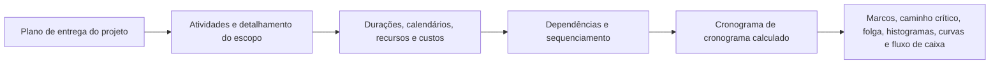

# O que é um cronograma

O cronograma de um projeto é mais do que uma lista de datas. É uma representação gráfica e lógica do plano de entrega do projeto. Explica como o projeto será executado do início ao fim, como os pacotes de trabalho se conectam, quando os principais marcos devem ser alcançados e quais informações a equipe do projeto deve usar para tomar decisões.

Em termos simples, o cronograma transforma o plano do projeto em um roteiro. Ajuda todos os envolvidos a compreender o que precisa ser feito, quando precisa acontecer e quem é responsável por fazer acontecer. Para gerentes de projetos, planejadores, equipes de construção, engenheiros, líderes de compras e revisores de PMO, o cronograma se torna uma das principais ferramentas de coordenação e controle.

O cronograma é uma linha do tempo, mas não é apenas uma linha do tempo. Uma programação fraca pode mostrar datas. Um calendário forte explica porque é que essas datas são credíveis.

## O cronograma como um roteiro de entrega

Todo projeto começa com intenção. A equipe sabe o que deve ser entregue: um edifício, uma instalação, um sistema industrial, uma paralisação, um ativo de infraestrutura ou um pacote de trabalho. Mas a entrega exige mais do que conhecer o objetivo final. A equipe deve entender a sequência.

O que vem primeiro? O que pode acontecer em paralelo? O que deve esperar pela aprovação do projeto, entrega do material, acesso, liberação da licença, teste ou entrega? Quais atividades controlam a data de término? Quais marcos são mais importantes para o cliente?

Um cronograma responde a essas perguntas convertendo o plano em atividades, durações, dependências, calendários, recursos, custos e marcos.

A linha do tempo gráfica é útil porque as pessoas podem ver o trabalho. A rede lógica é útil porque o software pode calcular o trabalho. Juntos, eles permitem que o cronograma se torne tanto uma ferramenta de comunicação quanto uma ferramenta de controle.

## O que alimenta a programação

Um cronograma é tão confiável quanto as informações usadas para construí-lo. No Primavera P6, o cronograma é alimentado por vários insumos importantes.

A primeira entrada é a lista de atividades. As atividades dividem o projeto em partes de trabalho gerenciáveis. Cada atividade deve ser clara o suficiente para ser planejada, status e medida.

A segunda entrada é a duração determinística. Este é o tempo de trabalho planejado necessário para concluir cada atividade. A duração deve refletir o método de execução, as premissas de produtividade, o tamanho da equipe, o acesso, as restrições da área de trabalho e as condições do projeto.

A terceira entrada é a lógica de dependência. As dependências explicam como as atividades se relacionam entre si. Uma atividade pode precisar ser concluída antes de outra começar. Duas atividades podem começar juntas. Dois acabamentos podem precisar ser alinhados. Esses relacionamentos criam a rede CPM.

A quarta entrada é o sequenciamento. O sequenciamento é a ordem prática de execução. Considera a construtibilidade, o fluxo de engenharia, o prazo de aquisição, o acesso, a lógica de comissionamento, a estratégia de entrega e as prioridades do cliente.

A quinta entrada são recursos e custos. O carregamento de recursos permite que o cronograma mostre a demanda de mão de obra, equipamentos e materiais ao longo do tempo. O carregamento de custos permite que o cronograma dê suporte ao fluxo de caixa, ao valor agregado e à previsão financeira.

Quando essas entradas são completas e realistas, o cronograma pode produzir resultados úteis.

## O que a programação nos diz

Um cronograma bem construído informa a duração geral do projeto. Ele mostra os marcos de conclusão planejados e as entregas intermediárias. Produz histogramas de recursos que mostram quando a demanda por mão de obra ou equipamento aumenta e diminui. Ele oferece suporte a curvas de progresso, curvas de fluxo de caixa, relatórios de valor agregado e planejamento antecipado.

Mais importante ainda, identifica o caminho crítico ou o caminho mais longo. Essa é a cadeia de trabalho que impulsiona a finalização do projeto. Se as atividades nesse caminho falharem, a data de conclusão do projeto poderá atrasar. É por isso que a lógica é tão importante. Sem boas dependências, o caminho crítico pode não mostrar os verdadeiros impulsionadores do projeto.

A folga é outra saída importante. A folga informa quanta flexibilidade uma atividade tem antes de afetar outra atividade ou o término do projeto. Mas a folga só tem sentido quando a rede do cronograma está completa. Se faltar lógica às atividades, a folga pode parecer melhor ou pior que a realidade.

## Por que a lógica torna a linha do tempo confiável

É aqui que a métrica “Atividades iniciadas na data dos dados sem lógica direcionadora” se torna importante.

A Data Date em P6 é o limite entre o desempenho real e a previsão. Tudo antes da Data Date deve representar o que já aconteceu. Tudo após a Data Date deve representar o plano a partir de agora.

Quando as atividades começam exatamente na Data Date sem nenhuma lógica que as conduza, o cronograma está enviando um sinal de alerta. Pode parecer que o trabalho está pronto para começar imediatamente, mas o cronograma pode não explicar o porquê. Pode não haver nenhum antecessor mostrando que a área está disponível, nenhum vínculo com a entrega de material, nenhum vínculo com a aprovação do projeto, nenhuma conexão com a liberação de inspeção e nenhuma lógica de trabalho anterior.

Isso é importante porque um cronograma não deve simplesmente colocar o trabalho em uma data. Deve explicar o caminho até essa data.

Se uma atividade começar na Data Date porque todo o trabalho predecessor necessário foi concluído e a lógica suporta o início, a data é defensável. Se começar aí porque a atividade está aberta, sem direção, restrita ou mal atualizada, a data é fraca. A equipa do projecto pode acreditar que o trabalho está pronto quando as condições reais de fácilitação não tiverem sido modeladas.

## Um exemplo prático

Imagine um cronograma de projeto com Data Date de 01 de junho. Após a atualização, diversas atividades iniciam no dia 01 de junho:

- Instale a bandeja de cabos na Área B.
- Inicie o teste de pressão do tubo.
- Comece o alinhamento do equipamento.
- Mobilize a equipe de isolamento.

À primeira vista, o lookahead parece ocupado e pronto. Mas quando o escalonador revisa a lógica, o problema fica claro. A instalação da eletrocalha não está vinculada à entrega do material. O teste de pressão não está vinculado à conclusão da tubulação. O alinhamento do equipamento está faltando o antecessor para completação mecânica. A mobilização da tripulação de isolamento não tem antecessor de liberação de acesso.

O cronograma mostra o trabalho na Data Date, mas não explica por que o trabalho pode começar. Esse não é um roteiro confiável. É uma lista de intenções de curto prazo.

A solução é adicionar ou corrigir a lógica real do CPM. Se a entrega de material impulsionar a instalação da bandeja de cabos, vincule-a. Se a conclusão da tubulação conduzir ao teste de pressão, conecte-a. Se a liberação de acesso acionar o isolamento, modele essa condição. Após o recálculo, algumas atividades ainda podem começar perto da Data Date, mas agora o cronograma pode explicar o porquê.

## O que uma boa programação deve fazer

Um bom cronograma deve ajudar a equipe a ver o plano, testá-lo e gerenciá-lo.

Deve mostrar o que precisa ser feito. Deve explicar a ordem do trabalho. Deve identificar quem precisa agir e quando. Deve revelar o caminho crítico. Deve apoiar o planejamento de recursos, a medição do progresso, a previsão de fluxo de caixa e os relatórios do PMO.

Deve também tornar visíveis os pontos fracos. Lógica ausente, restrições rígidas, datas obsoletas, inícios em aberto, términos em aberto e agrupamento de atividades na data de dados não são apenas problemas técnicos. Eles afetam o modo como a equipe do projeto entende a prontidão, o risco e o controle.

## Conclusão

Um cronograma é o plano de entrega do projeto expresso como tempo, lógica e trabalho mensurável. É um roteiro, um modelo de cálculo e uma ferramenta de comunicação.

Quando bem construído, informa à equipe do projeto o que precisa acontecer, quando precisa acontecer e por que as datas são confiáveis. Quando as atividades começam na Data Date sem nenhuma lógica orientadora, essa credibilidade fica enfraquecida. O cronograma para de explicar o plano e começa a adivinhar a próxima etapa.

Por esse motivo, as revisões da qualidade do cronograma devem sempre fazer uma pergunta simples: o cronograma explica por que o trabalho começa quando começa? Se a resposta for sim, o cronograma está fazendo seu trabalho. Se a resposta for não, o roteiro precisa de mais lógica antes de ser confiável.
## Conteúdo relacionado
- [Atividades começando na data dos dados sem nenhuma lógica direcionadora: por que essa métrica de cronograma é importante - Visão geral](../../metrics/01_activities_starting_in_dd_with_no_logic_driving/02_guide_template.md)
- [Lógica Robusta](../02_ROBUST%20LOGIC/02_ROBUST%20LOGIC.md)
