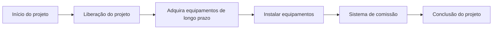

# Caminho Crítico

O caminho crítico é a sequência mais longa de atividades dependentes de um cronograma. Determina a menor duração possível do projeto e define diretamente a data de término do projeto.

Em termos práticos, o caminho crítico é a cadeia de tarefas que não pode ser adiada sem afetar o prazo final. Se uma atividade do caminho crítico falhar e nada mais mudar, a data de conclusão do projeto também cairá.

É por isso que o caminho crítico é um dos resultados mais importantes do cronograma do Primavera P6. Não é apenas um filtro, uma cor ou um relatório. É a explicação do cronograma sobre o que está impulsionando a conclusão.

## O que significa o caminho crítico

Um cronograma contém muitas atividades, mas nem todas as atividades têm o mesmo impacto na data de término. Algumas atividades possuem folga. Eles podem se mover um pouco antes de afetarem a próxima atividade ou o término do projeto. As atividades críticas não têm essa flexibilidade, ou têm a menor flexibilidade, dependendo do método e das configurações do cronograma.

O caminho crítico mostra o tempo mínimo necessário para concluir o projeto com base na lógica, durações, calendários, restrições e status atuais.

Se esta for a cadeia de controlo, um atraso na aquisição pode atrasar a instalação. Um atraso na instalação pode atrasar o comissionamento. Um atraso no comissionamento pode atrasar a conclusão do projeto. O caminho crítico ajuda a equipe a ver essa conexão.

## É a corrente que você não pode atrasar

O caminho crítico não é simplesmente o trabalho que parece importante. É a sequência dependente de trabalho que define a data de término.

Esta distinção é importante. Uma atividade de alto valor pode não ser crítica se tiver folga. Um marco visível do cliente pode não ser crítico se outro caminho estiver conduzindo à conclusão. Uma pequena actividade técnica pode ser crítica se estiver na única cadeia que conduz à entrega final.

Para as equipes de controle de projetos, isso torna o caminho crítico uma ferramenta de decisão. Ajuda a responder:

- O que está impulsionando o término do projeto?
- Quais atividades precisam de mais atenção no cronograma?
- Onde um atraso afetaria imediatamente a conclusão?
- Quais ações de recuperação poderiam proteger a data de término?
- O caminho relatado faz sentido?

A última pergunta é aquela que os agendadores nunca devem ignorar.

## Não aceite cegamente o filtro crítico

O Primavera P6 pode identificar atividades críticas, mas o software não entende a intenção do projeto. Ele calcula com base nos dados fornecidos: lógica, calendários, restrições, durações, progresso e opções de cronograma.

Se os dados forem fracos, o caminho crítico pode parecer estranho.

Atividades ou marcos podem aparecer no filtro crítico mesmo que não estejam realmente impulsionando o projeto. Isso pode acontecer devido à falta de lógica, restrições rígidas, datas obsoletas, fins em aberto, calendários incomuns, folga negativa, status incorreto ou configurações lógicas retidas.

O planejador deve usar julgamento profissional. O caminho crítico deve ser desafiado. Deve parecer razoável. Deve contar uma história que a equipe do projeto reconheça.

Se o caminho diz que a conclusão final é impulsionada por um marco administrativo sem nenhum trabalho posterior real, desafie-o. Se o caminho começar com um marco que não controla realmente a execução, desafie-o. Se o caminho passar por áreas não relacionadas da EAP sem uma interface clara, desafie-o.

O caminho crítico é tão bom quanto o modelo de cronograma por trás dele.

## Cronogramas de Linha de Base e o Caminho Crítico

Num cronograma que nunca foi atualizado, como uma primeira linha de base, o caminho crítico geralmente começa com o marco de início do projeto e termina com o marco de conclusão do projeto.

Isso é comum, mas não é uma regra escrita em pedra.

Alguns projetos têm um caminho crítico que começa em um marco intermediário importante. Por exemplo, a construção pode não ser iniciada até que um proprietário entregue uma área, uma licença seja emitida ou um pacote de projeto atinja o status de aprovado. Nesse caso, o marco de entrega ou liberação pode desencadear o início do caminho de controle.

A mesma ideia se aplica perto do final do projeto. O caminho crítico pode terminar na conclusão final, mas também pode gerar um marco contratual intermediário, um estágio de transferência, uma rotatividade do sistema ou uma data de acesso do cliente que atualmente é mais restritiva.

A chave não é se o caminho começa e termina no local mais tradicional. A chave é se o caminho é lógico, completo e defensável.

## Programações em andamento

Quando um cronograma está em andamento, o caminho crítico muda de formato. O trabalho concluído não deve mais impulsionar a conclusão futura. O caminho deve começar no limite do status atual.

Num cronograma atualizado, o caminho crítico geralmente começa com uma atividade atualmente em andamento, uma atividade não iniciada pronta para começar ou um marco válido que controla o acesso a trabalhos futuros. Também pode começar a partir de uma interface do projeto ou de um marco de transferência, quando esse evento estiver genuinamente impulsionando o próximo trabalho crítico.

É aqui que a data dos dados é importante. A Data Date separa o desempenho real do trabalho de previsão. Um caminho crítico após a Data Date deve explicar como o trabalho restante leva à conclusão.

Se o caminho começar com uma atividade sem lógica direcionadora, um início de data de dados inexplicável ou um marco questionável, o revisor deverá investigar. O cronograma pode mostrar um caminho calculado, mas não confiável.

## Tenha cuidado com os marcos

Os marcos são úteis porque marcam pontos-chave: notificação para prosseguir, entrega da área, aprovação do projeto, conclusão mecânica, rotatividade do sistema, conclusão substancial e conclusão final.

Mas os marcos também podem induzir em erro uma revisão do caminho crítico.

Um marco pode parecer crítico porque tem uma restrição. Pode parecer crítico porque não tem duração e fica dentro de um limite de data. Pode parecer crítico porque falta lógica em torno dele. Isso não significa automaticamente que o marco seja realmente parte da cadeia de execução de controle.

Tenha muito cuidado quando o caminho crítico começar com um marco. Perguntar:

- Este marco representa um evento de controle real?
- Que atividade ou condição externa impulsiona o marco?
- Que trabalho é liberado pelo marco?
- O marco é restrito e não orientado pela lógica?
- O caminho ainda seria crítico se a lógica dos marcos fosse corrigida?

Se o marco não controlar o trabalho, não deverá ser permitido definir a história do caminho crítico.

## A lógica retida pode mudar a história

A lógica retida é uma configuração do Primavera P6 usada para lidar com o progresso fora de sequência. Pode ser apropriado, mas também pode afetar o caminho crítico de maneiras que os revisores precisam compreender.

Quando a lógica retida é usada, P6 pode preservar a lógica predecessora mesmo quando o trabalho sucessor já tiver começado fora de sequência. Isso pode fazer com que o trabalho restante seja retido ou sequenciado de uma forma que altere o caminho crítico calculado.

A questão não é que a lógica retida esteja sempre errada. A questão é que o planejador deve compreender se está produzindo uma previsão realista.

Se a lógica retida fizer o caminho crítico percorrer relacionamentos que não refletem mais como o trabalho está sendo executado, a equipe deverá revisar o status, a lógica e as opções de cronograma. O caminho deve reflectir um plano remanescente defensável e não apenas um cálculo mecânico.

## Como revisar o caminho crítico

Uma boa revisão do caminho crítico deve combinar a saída P6 com o julgamento do cronograma.

Comece gerando o relatório do caminho mais longo ou do caminho crítico. Em seguida, revise o caminho atividade por atividade. Observe predecessores, sucessores, tipos de relacionamento, defasagens, restrições, calendários, datas reais, duração restante e folga total.

Pergunte se o caminho faz sentido:

- O caminho segue uma sequência de execução confiável?
- Começa com um direcionador atual válido?
- Termina na conclusão correta ou no marco de controle?
- As restrições estão forçando o caminho?
- Os relacionamentos perdidos estão escondendo o verdadeiro motivador?
- A lógica retida está afetando o caminho de maneira enganosa?
- A equipe do projeto reconhece isso como trabalho de controle?

Se a resposta for não, o cronograma precisa ser revisado antes que o caminho crítico possa ser usado com segurança.

## Conclusão

O caminho crítico é a sequência de tarefas dependentes que define a data de término do projeto. Mostra o tempo mínimo necessário para concluir o projeto e identifica as obras que não podem falhar sem afetar o prazo.

Mas o caminho crítico não é algo que se possa aceitar cegamente. P6 calcula o que os dados dizem para calcular. O escalonador deve questionar se o resultado é razoável, lógico e alinhado com o plano de execução real.

Num cronograma forte, o caminho crítico conta uma história clara. Ele começa a partir de um direcionador atual válido, segue dependências reais, evita restrições enganosas, trata o progresso corretamente e leva ao marco de conclusão correto.

Quando essa história faz sentido, o caminho crítico se torna uma das ferramentas mais poderosas no controle do projeto. Quando isso não acontece, é um aviso de que o cronograma precisa de mais revisão antes que a previsão possa ser confiável.
## Conteúdo relacionado
- [Caminho crítico ou caminho de folga começando com uma restrição - Visão geral](../../metrics/09_cp_or_float_path_starting_with_constraint/02_guide_template.md)
- [Lógica Robusta](../02_ROBUST%20LOGIC/02_ROBUST%20LOGIC.md)
- [Matriz de Criticidade](../04_CRITICALITY%20MATRIX/04_CRITICALITY%20MATRIX.md)
