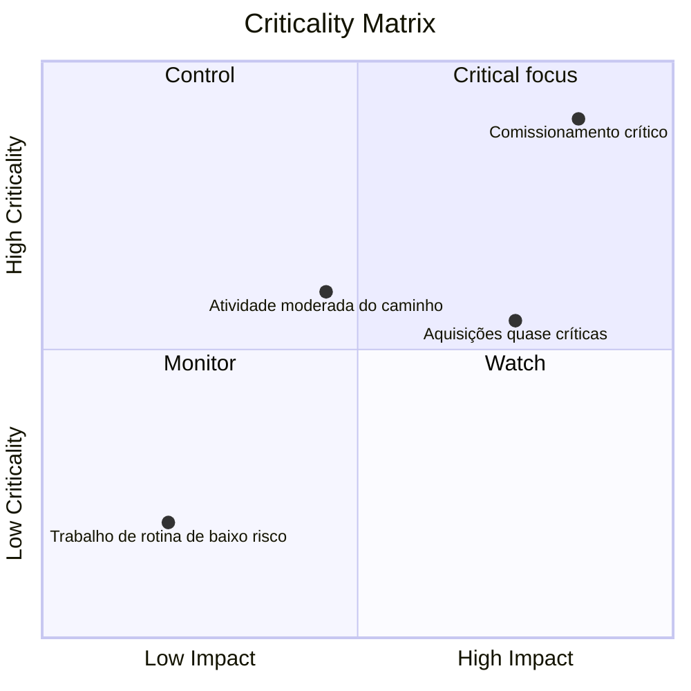

# Matriz de Criticidade

Uma matriz de criticidade é um método visual ou analítico usado para classificar e priorizar as atividades do projeto com base em quão críticas elas são para a conclusão do projeto. No contexto do Primavera P6, ajuda gerentes de projeto, planejadores e revisores de PMO a identificar quais atividades criam o maior risco de cronograma.

O caminho crítico conta a história determinística atual do cronograma. Uma matriz de criticidade vai um passo além. Ajuda a equipe a entender quais atividades já são críticas, quais estão perto de se tornarem críticas e quais causariam sérios impactos se escorregassem.

Isto é importante porque a actividade que é crítica hoje nem sempre é a única que merece atenção. Uma atividade quase crítica com alto impacto de atraso pode se tornar o problema de amanhã. Uma actividade de aquisição de longa duração pode não estar no actual caminho crítico, mas pode comportar riscos suficientes para justificar um controlo rigoroso.

## O que significa criticidade em P6

No Primavera P6, criticidade geralmente se refere a se uma atividade pode afetar a data de término do projeto caso seja atrasada. Tradicionalmente, o P6 identifica atividades críticas usando configurações de folga total ou caminho mais longo.

A definição determinística comum é simples:

- Atividades críticas são atividades com folga zero ou negativa.
- Essas atividades estão no caminho crítico ou estão intimamente ligadas a ele.
- Se atrasarem, a data de término do projeto provavelmente será atrasada.

Essa definição é útil, mas não está completa. Baseia-se em uma condição de cronograma calculada. Não explica completamente a incerteza, a probabilidade ou a dimensão do impacto se uma actividade falhar.

Uma matriz de criticidade expande a discussão de “esta atividade é crítica hoje?” para "qual a probabilidade de esta atividade se tornar crítica e quanto dano ela poderia causar?"

## O que uma matriz de criticidade combina

Uma matriz de criticidade normalmente combina duas dimensões.

A primeira dimensão é a sensibilidade ou probabilidade do cronograma. Isso pode ser medido pela frequência com que uma atividade se torna crítica durante a simulação de Monte Carlo, ou pelo quão próxima ela está do ponto crítico com base na folga total ou em limites quase críticos.

A segunda dimensão é o impacto. Isso significa a gravidade do atraso se a atividade falhar. O impacto pode basear-se na duração da actividade, no efeito do atraso na conclusão do projecto, no índice de sensibilidade, na exposição aos custos, no impacto dos marcos contratuais ou no julgamento da gestão.

Juntas, essas dimensões ajudam a equipe a priorizar as atividades.

Este tipo de visão é útil porque separa as atividades que apenas aparecem no filtro crítico das atividades que merecem atenção ativa da gestão.

## Uma estrutura matricial simples

Uma matriz básica de criticidade pode ser mostrada como uma grade:

| Criticidade/Impacto | Baixo impacto | Impacto Médio | Alto Impacto |
| --- | --- | --- | --- |
| Baixa criticidade | Monitor | Monitor | Assistir |
| Criticidade Média | Análise | Controlar | Alta prioridade |
| Alta criticidade | Controlar | Alta prioridade | Foco crítico |

Os rótulos exatos podem mudar de acordo com a organização, mas a ideia permanece a mesma. Atividades com baixa criticidade e baixo impacto podem ser monitoradas. Atividades com alta criticidade e alto impacto requerem controle focado.

## Dados P6 usados ​​na matriz

O Primavera P6 geralmente não fornece uma visualização de matriz de criticidade integrada por padrão. A matriz é normalmente construída utilizando dados de atividade P6 combinados com análise externa.

Os campos P6 úteis incluem:

- Folga total.
- Folga livre.
- Duração da atividade.
- Duração restante.
- Status da atividade.
- Datas de início e término.
- Restrições.
- Lógica de relacionamento.
- Calendário.
- EAP ou códigos de atividade.
- Indicadores de caminho crítico ou mais longo.

Esses dados fornecem a visão determinística do cronograma. Mostra o caminho calculado atual, trabalho quase crítico, atividades restritas e atividades com longa exposição restante.

## Entradas de análise de risco

Para tornar a matriz mais poderosa, a equipe pode adicionar dados probabilísticos de risco de cronograma da análise de Monte Carlo. Isto pode vir de ferramentas como Primavera Risk Analysis ou outras plataformas de simulação de risco.

Métricas de risco importantes incluem Índice de Criticidade, Folga total, Índice de Sensibilidade ao Cronograma e duração ou valor de impacto.

O Índice de Criticidade, frequentemente chamado de IC, mostra a porcentagem de simulações em que uma atividade aparece no caminho crítico. Por exemplo, se uma atividade possui IC = 80%, ela foi crítica em 80% dos cenários simulados.

A folga total mostra o quão perto uma atividade está de afetar o término do projeto no cronograma determinístico. A folga próxima de zero é um sinal de alerta.

O Índice de Sensibilidade ao Cronograma combina criticidade e impacto. Ajuda a mostrar não só se a actividade se torna crítica, mas também se afecta significativamente o resultado.

A duração ou o valor do impacto ajudam a estimar a gravidade. Uma atividade mais longa, um pacote de aquisições de alto risco ou uma tarefa ligada a um marco contratual podem ter mais impacto se forem adiadas.

## Exemplo

Considere o seguinte conjunto simplificado de atividades:

| Atividade | De folga | Índice de criticidade | Duração | Resultado da Matriz |
| --- | ---: | ---: | ---: | --- |
| UM | 0 dias | 95% | 20 dias | Foco crítico |
| B | 5 dias | 60% | 15 dias | Alta prioridade |
| C | 20 dias | 15% | 10 dias | Monitor |

A atividade A pertence à área de alta criticidade e alto impacto. Não tem folga, parece crítico na maioria das simulações e tem longa duração. Merece controle focado.

A Atividade B pode não ser tão urgente quanto a Atividade A, mas ainda assim merece atenção. Tem folga limitada e uma probabilidade significativa de se tornar crítica.

A atividade C tem mais folga e menor criticidade. Não deve ser ignorado, mas não requer o mesmo nível de foco de gestão.

## Por que é útil

Uma matriz de criticidade ajuda a equipe do projeto a evitar depender apenas de um único caminho crítico determinístico. O caminho determinístico é importante, mas é apenas uma visão do cronograma.

A matriz ajuda as equipes:

- Priorize o que monitorar de perto.
- Concentre a mitigação nas principais atividades de risco.
- Identifique atividades quase críticas antes que se tornem críticas.
- Entenda o risco do cronograma probabilístico.
- Compare a probabilidade e o impacto em uma visualização.
- Comunique o risco do cronograma à gestão de forma mais clara.

Para relatórios de PMO, isso é especialmente útil porque traduz a complexidade do cronograma em uma estrutura de decisão. Em vez de apresentar centenas de atividades, a equipe pode mostrar quais atividades estão nas zonas de “foco crítico”, “alta prioridade”, “controle” ou “monitoramento”.

## Uma maneira simples de construir um

Comece exportando dados de atividades do P6. Inclua ID da atividade, nome da atividade, EAP, folga total, duração restante, início, término, calendário, restrições e indicadores de caminho crítico ou mais longo.

Em seguida, adicione campos opcionais de análise de risco, como Índice de Criticidade e Índice de Sensibilidade do Cronograma. Se os dados de simulação não estiverem disponíveis, utilize limites práticos baseados na folga e na duração. Por exemplo, alta criticidade pode significar folga total menor ou igual a 0 dias, ou IC acima de 70%. A criticidade média pode significar folga quase crítica ou CI entre 40% e 70%.

Defina limites de impacto. Uma atividade de alto impacto pode ser de longa duração, vinculada a um marco contratual, parte de um pacote de alto risco ou demonstrada por simulação como afetando o término do projeto.

Por fim, plote as atividades no Excel, Power BI ou outra ferramenta de relatório. O resultado não precisa ser complicado. O valor vem de tornar a prioridade visível.

## Usar julgamento

Uma matriz de criticidade é uma ferramenta de apoio à decisão, não uma resposta automática. Os limites devem ser revisados ​​pela equipe de controles do projeto e ajustados ao tipo de projeto, sensibilidade do contrato e maturidade do cronograma.

Lembre-se também que a matriz depende da qualidade do cronograma. Se o cronograma P6 tiver falta de lógica, durações irrealistas, restrições rígidas, calendários ruins ou atualizações de status fracas, a matriz herdará essas fraquezas.

O melhor uso da matriz é combinar resultados analíticos com julgamento profissional de programação.

## Conclusão

Uma matriz de criticidade classifica as atividades do projeto de acordo com a probabilidade de se tornarem críticas e o impacto que teriam se fossem adiadas. Ele usa dados P6, como folga total, duração, restrições e lógica, e pode ser fortalecido com resultados de Monte Carlo, como Índice de Criticidade e Índice de Sensibilidade ao Cronograma.

Para gerentes de projetos e revisores de PMO, a matriz transforma o risco do cronograma em uma conversa gerencial mais clara. Ajuda a equipe a se concentrar nas atividades mais importantes, e não apenas nas atividades que aparecem no filtro crítico de hoje.

Bem utilizada, uma matriz de criticidade ajuda a equipe do projeto a passar de relatórios reativos para controle proativo do cronograma.
## Conteúdo relacionado
- [Caminho crítico ou caminho de folga começando com uma restrição - Visão geral](../../metrics/09_cp_or_float_path_starting_with_constraint/02_guide_template.md)
- [Caminho Crítico](../03_CRITICAL%20PATH/03_CRITICAL%20PATH.md)
- [Tipos de atividades em P6](../05_ACTIVITY%20TYPES%20IN%20P6/05_ACTIVITY%20TYPES%20IN%20P6.md)
