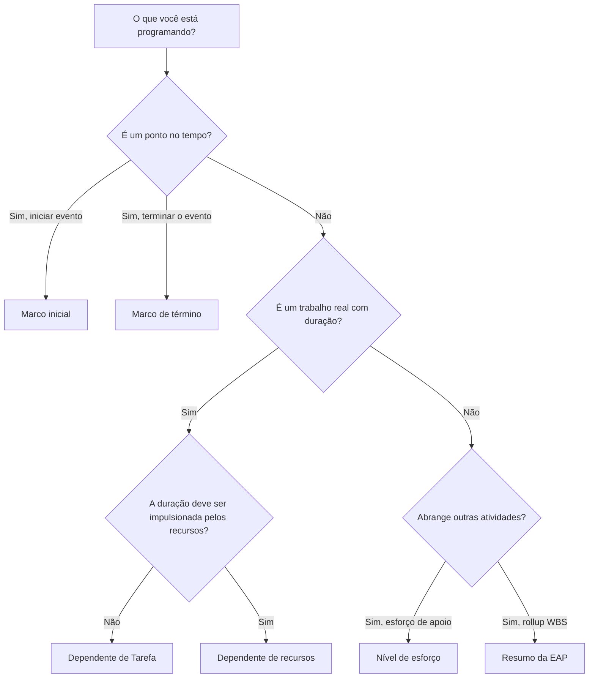

# Tipos de atividades em P6

Activity Type é um dos campos de configuração mais importantes no Primavera P6. Informa ao P6 que tipo de atividade ele está calculando e como essa atividade deve se comportar no cronograma.

Muitos agendadores concentram-se primeiro nos nomes, durações, datas e relacionamentos das atividades. Isso é essencial, mas o tipo de atividade também é importante. Uma atividade de tarefa, um marco, uma atividade de Nível de Esforço e uma atividade de Resumo da EAP não se comportam da mesma maneira. Escolher o tipo errado pode distorcer datas, progresso, carregamento de recursos, folga e relatórios.

O objetivo deste blog é explicar os principais tipos de atividades disponíveis no P6, para que serve cada uma e como decidir qual tipo se adapta ao trabalho que está sendo planejado.

## Por que o tipo de atividade é importante

Um tipo de atividade deve corresponder ao propósito de agendamento do item. É um trabalho real com duração? É um ponto no tempo? É um resumo do trabalho que abrange outras atividades? É um esforço que depende de recursos e não de uma duração fixa da tarefa?

Se o tipo de atividade não corresponder ao objetivo, o cronograma pode ficar confuso. Um marco com duração não é um marco. Uma tarefa normal usada como resumo pode ocultar a lógica. Uma atividade de Nível de Esforço usada para impulsionar o trabalho pode distorcer o caminho crítico. Uma atividade Dependente de Recurso usada incorretamente pode calcular de forma diferente do esperado.

Em P6, o tipo de atividade ajuda a responder uma questão prática: como esse item deve se comportar no cálculo do cronograma?

## Os principais tipos de atividades no P6

Os tipos de atividades mais comuns do Primavera P6 são:

- Dependente de Tarefa.
- Dependente de recursos.
- Nível de esforço.
- Iniciar marco.
- Marco de término.
- Resumo da EAP.

Cada um tem um propósito diferente.

## Atividades Dependentes de Tarefa

Dependente de Tarefa é o tipo de atividade mais comum em P6. Use-o para trabalho planejado normal em que a duração da atividade é controlada pelo calendário atribuído à atividade e não por calendários de recursos individuais.

Os exemplos incluem:

- Escavar a fundação.
- Instale a bandeja de cabos.
- Despeje a laje de concreto.
- Prepare o pacote de design.
- Execute o teste de pressão.

As atividades dependentes de tarefas geralmente são a melhor escolha para a maioria das tarefas de construção, engenharia, aquisição, testes e comissionamento. Eles são claros, estáveis ​​e fáceis de entender. O agendador define a duração, atribui o calendário de atividades, conecta a lógica e o P6 calcula as datas.

Use Dependente de Tarefa quando a atividade representa um escopo de trabalho discreto e a duração do trabalho não deve mudar com base nos calendários de recursos.

## Atividades Dependentes de Recursos

Atividades dependentes de recursos são usadas quando a duração e o comportamento do cronograma devem ser influenciados pelos recursos atribuídos à atividade. Neste caso, P6 pode utilizar calendários de recursos e disponibilidade de recursos para calcular como a atividade é agendada.

Isto pode ser útil quando a disponibilidade de recursos é um verdadeiro impulsionador do trabalho. Por exemplo, uma equipe especializada, um inspetor ou um recurso de equipamento podem estar disponíveis apenas em determinados dias ou turnos.

Os exemplos podem incluir:

- Inspeção especializada por um inspetor limitado.
- Suporte técnico do fornecedor.
- Calibração de equipamentos utilizando recurso escasso.
- Trabalho de manutenção baseado em recursos.

As atividades dependentes de recursos devem ser usadas com cuidado. Se o projeto não estiver ativamente carregado ou nivelado com recursos, usar Dependente de Recursos por hábito pode criar confusão. Muitos agendamentos usam Task Dependent como padrão porque o calendário de atividades é a base principal do cronograma.

Use Dependente de Recurso quando os recursos e seus calendários se destinam a influenciar o cálculo do cronograma.

## Marco inicial

Um Marco Inicial é uma atividade de duração zero que representa o início de um evento, fase, janela de acesso, autorização ou condição de trabalho principal.

Os exemplos incluem:

- Aviso para prosseguir recebido.
- Acesso à área concedido.
- Início da construção.
- Pacote de design liberado para execução.
- Janela de início de comissionamento.

Os marcos iniciais não representam o trabalho sendo executado. Eles representam um ponto no tempo que permite o início do trabalho ou marca um evento inicial significativo.

Use um marco inicial quando o cronograma precisar marcar o início de algo importante. Normalmente deve estar conectado com uma lógica que explica o que impulsiona o marco e que trabalho ele libera.

## Marco de término

Um marco de término é uma atividade de duração zero que representa a conclusão de um evento, fase, entrega ou ponto contratual.

Os exemplos incluem:

- Conclusão mecânica alcançada.
- Rotatividade do sistema concluída.
- Aprovação da licença recebida.
- Conclusão substancial.
- Conclusão definitiva.

Os marcos finais são úteis para relatórios porque marcam conquistas. Eles não devem ser usados ​​como atividades normais de trabalho. Se for necessário esforço para atingir o marco, esse esforço deve ser modelado como tarefas que conduzem ao marco.

Use um marco de conclusão quando o cronograma precisar marcar que algo foi concluído ou alcançado.

## Nível de esforço

O Nível de Esforço, muitas vezes chamado de LOE, é usado para atividades que abrangem outros trabalhos, em vez de conduzir o projeto diretamente. As atividades LOE são comumente usadas para gerenciamento, supervisão, apoio à inspeção, controles de projetos ou coordenação contínua.

Os exemplos incluem:

- Apoio à gestão de projetos.
- Supervisão do local.
- Gestão de engenharia.
- Gestão de construção.
- Suporte à inspeção de qualidade.

Uma atividade LOE normalmente deriva suas datas de outras atividades. Deve representar um esforço de apoio que continua enquanto outro trabalho está acontecendo. Geralmente não se destina a ser um impulsionador de tarefas discretas de construção ou engenharia.

Use LOE quando a atividade representa suporte, supervisão ou gerenciamento contínuo que deve abranger um grupo de atividades.

Tenha cuidado com a lógica LOE. Se uma LOE estiver vinculada incorretamente, pode parecer que ela direciona as datas ou distorce a folga. As atividades de LOE devem ser revisadas durante as verificações de qualidade do cronograma, especialmente quando aparecem no caminho crítico ou têm relacionamentos FS ou SF incomuns.

## Resumo da EAP

As atividades de resumo da EAP resumem um grupo de atividades dentro de um elemento da EAP. Suas datas são derivadas das atividades da EAP e não de sua própria lógica detalhada.

Os exemplos incluem:

- Resumo de engenharia.
- Resumo de aquisições.
- Área Um resumo da construção.
- Resumo de comissionamento do sistema 01.

As atividades de resumo da EAP podem ser úteis para relatórios de alto nível, mas não devem substituir atividades reais ou lógica. São ferramentas de rollup, não tarefas de execução.

Use atividades de resumo da EAP quando precisar de uma visão resumida de uma seção da EAP e somente quando o método de relatório do projeto suportar seu uso.

## Escolhendo o tipo certo

Uma regra simples ajuda:

- Se for um trabalho real com duração, use Dependente de Tarefa, a menos que os calendários de recursos devam orientá-lo.
- Se a disponibilidade de recursos for a causa disso, use Dependente de Recursos.
- Se for um evento inicial, use Start Milestone.
- Se for um evento de conclusão, use Finish Milestone.
- Se for um suporte contínuo que abrange outro trabalho, use Nível de Esforço.
- Se for um rollup de relatórios, use o Resumo da EAP.

O tipo de atividade deve fácilitar a compreensão do cronograma. Se os revisores precisarem perguntar por que um marco tem duração, por que um LOE está impulsionando o trabalho ou por que um Resumo da EAP aparece na lógica detalhada, o tipo de atividade pode estar errado.

## Erros Comuns

Um erro comum é usar marcos como substitutos do trabalho. Um marco deve marcar um ponto no tempo. Se for necessário trabalho, crie atividades para o trabalho.

Outro erro é usar atividades LOE para controlar o trabalho discreto. A LOE deve apoiar ou abranger o trabalho, e não substituir a lógica entre as atividades reais.

Um terceiro erro é usar o Resource Dependent sem um processo de programação orientado por recursos. Se os calendários de recursos não estiverem sendo mantidos, o tipo de atividade poderá criar mais confusão do que valor.

Por fim, evite usar atividades de Resumo da EAP como um substituto para uma EAP bem construída e lógica detalhada. Os resumos são úteis para relatórios, mas o cronograma ainda precisa de atividades reais por baixo.

## Conclusão

Os tipos de atividades em P6 definem como as atividades se comportam. Eles não são apenas rótulos. O tipo de atividade certo ajuda o cronograma a ser calculado corretamente e a ser comunicado com clareza.

As atividades dependentes de tarefas representam a maior parte do trabalho normal. As atividades dependentes de recursos são úteis quando os calendários de recursos devem controlar o agendamento. Os marcos inicial e final marcam pontos-chave no tempo. As atividades de nível de esforço representam suporte que abrange outros trabalhos. As atividades de resumo da EAP suportam relatórios cumulativos.

A escolha do tipo de atividade correto torna o cronograma mais fácil de revisar, mais fácil de explicar e mais confiável para os controles do projeto. Uma agenda forte não tem apenas boas datas e lógica. Também utiliza o tipo certo de atividade para o trabalho representado.
## Conteúdo relacionado
- [Atividades começando na data dos dados sem nenhuma lógica direcionadora: por que essa métrica de cronograma é importante - Visão geral](../../06_metrics_pt/01_activities_starting_in_dd_with_no_logic_driving/01_overview_template.md)
- [Matriz de Criticidade](../04_CRITICALITY%20MATRIX/04_CRITICALITY%20MATRIX.md)
- [Tipos de duração em P6](../06_DURATION%20TYPES%20IN%20P6/06_DURATION%20TYPES%20IN%20P6.md)
