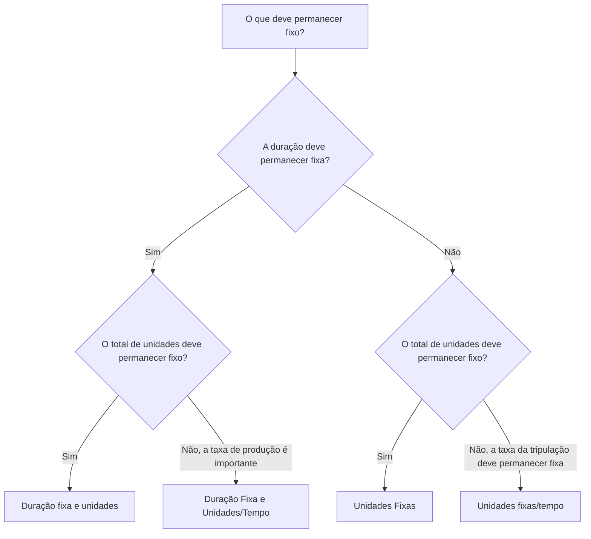

# Tipos de duração em P6

Tipo de duração é um dos campos no Primavera P6 que controla como uma atividade se comporta quando a duração, as unidades e a produtividade dos recursos mudam. É fácil ignorar, mas pode afetar datas de programação, carregamento de recursos, previsões de custos, valor agregado e comportamento de atualização.

Muitos programadores pensam na duração apenas como um número de dias. No P6, a duração é mais que um número. Uma atividade também pode ter unidades de trabalho, unidades não trabalhistas, unidades por tempo, calendários de recursos, calendários de atividades e trabalho restante. O Tipo de Duração informa ao P6 o que deve permanecer fixo quando o agendamento for recalculado ou quando o agendador alterar recursos e durações.

Este blog explica os principais tipos de duração disponíveis para atividades no P6, como eles diferem, para que serve cada um e quando usar um em vez de outro.

## O tipo de duração não é igual ao campo Duração

Antes de examinar os tipos, é útil separar duas ideias.

Os campos de duração são valores como Duração original, Duração restante, Duração real e Duração na conclusão. Estes descrevem o tempo.

Tipo de duração é uma configuração de cálculo. Diz ao P6 como equilibrar a duração, o total de unidades e as unidades por vez quando algo muda.

Por exemplo, se você adicionar mais recursos a uma atividade, a atividade deverá terminar mais cedo? Ou a duração deveria permanecer a mesma e o esforço total aumentar? A resposta depende do tipo de duração.

## Os principais tipos de duração

Os tipos de duração P6 comuns são:

- Duração fixa e unidades.
- Duração fixa e unidades/tempo.
- Unidades Fixas.
- Unidades/Tempo Fixos.

Os nomes podem parecer técnicos à primeira vista, mas cada um responde a uma questão prática: que parte da atividade o P6 deve proteger quando algo muda?

## Duração fixa e unidades

Duração e Unidades Fixas mantém fixas a duração da atividade e o total de unidades. Se as unidades por tempo mudarem, P6 ajusta a frequência em vez de alterar a duração ou o esforço total.

Este tipo é útil quando se pretende que tanto a janela de tempo planejada quanto o esforço total permaneçam estáveis.

Exemplo:

Uma atividade está prevista para 10 dias com 400 horas de mão de obra. A equipe de cronograma deseja que a duração permaneça em 10 dias e que o esforço total orçado permaneça em 400 horas. Se os detalhes da atribuição de recursos mudarem, a duração planejada e o total de unidades não deverão ser movidos automaticamente.

Use Duração Fixa e Unidades quando:

- A atividade possui uma janela de trabalho fixa.
- O esforço total já está acordado.
- As alterações na taxa de recursos não devem alterar automaticamente a duração da atividade.
- O cronograma é usado para controle estável de custos ou valor agregado.

Isto é frequentemente útil para pacotes de trabalho gerenciados onde tanto a duração do cronograma quanto o esforço orçado são controlados.

## Duração Fixa e Unidades/Tempo

Duração Fixa e Unidades/Tempo mantém a duração e a taxa de recursos fixas. Se recursos forem adicionados ou removidos, P6 poderá ajustar o total de unidades.

Este tipo é útil quando a atividade deve ocorrer durante uma janela de tempo fixa e a taxa de carregamento de recursos deve permanecer consistente.

Exemplo:

Uma atividade de suporte ao gerenciamento de projetos dura 20 dias. A equipe designa um engenheiro de projeto para 8 horas por dia. A duração deve permanecer em 20 dias e a diária em 8 horas por dia. O total de unidades é resultado da janela de tempo e da taxa.

Use Duração Fixa e Unidades/Tempo quando:

- A duração da atividade é fixa.
- A taxa de recursos diária ou horária é importante.
- O total de unidades deve ser calculado a partir da duração e da taxa.
- A atividade representa suporte contínuo ou um período de trabalho fixo.

Isto pode ser útil para atividades de supervisão, gestão, apoio à inspeção ou apoio baseado no tempo.

## Unidades Fixas

Unidades Fixas mantém o total de unidades fixas. Se a taxa de recursos mudar, P6 poderá ajustar a duração.

Este tipo é útil quando a quantidade de trabalho é fixa, mas a duração depende da produtividade ou da disponibilidade de recursos.

Exemplo:

Uma atividade requer 800 horas de trabalho. Se a equipe atribuir mais tripulação, a atividade poderá terminar mais cedo. Se houver menos tripulação disponível, a atividade poderá demorar mais. O trabalho total fica em 800 horas.

Use unidades fixas quando:

- A quantidade de trabalho ou esforço total é fixa.
- A duração deve responder à disponibilidade ou produtividade dos recursos.
- O tamanho da tripulação pode alterar o tempo necessário para concluir a atividade.
- O planejamento de recursos está ativo e mantido.

Isto pode ser útil para trabalhos de estilo de produção onde o esforço total é conhecido e se espera que a duração responda à carga da tripulação.

## Unidades fixas/tempo

Unidades/Tempo Fixo mantém a taxa de recursos fixa. Se a duração mudar, o total de unidades também mudará.

Este tipo é útil quando uma equipe ou recurso trabalha a uma taxa fixa enquanto durar a atividade.

Exemplo:

Uma atividade de supervisão de local utiliza um supervisor 8 horas por dia. Se a duração da atividade aumentar de 10 para 15 dias, o total de unidades deverá aumentar porque o supervisor será necessário por mais dias. A diária permanece fixa.

Use unidades/tempo fixos quando:

- A tripulação ou taxa de recursos é fixa.
- O total de unidades deve aumentar ou diminuir quando a duração muda.
- A atividade representa um esforço baseado no tempo.
- O recurso é atribuído durante toda a atividade.

Isto é muitas vezes útil para atividades de suporte, supervisão, inspeção e gerenciamento onde o tempo impulsiona o esforço total.

## Como escolher o tipo certo de duração

O melhor tipo de duração depende do que a atividade representa e de como a equipe de controles do projeto espera que o P6 calcule as mudanças.

Uma maneira simples de escolher é perguntar:

- A duração é fixada por plano, contrato, janela ou acesso?
- O esforço total é fixado por quantidade, orçamento ou estimativa?
- A taxa de recursos é fixada pelo plano de tripulação ou pelo plano de pessoal?
- A adição de recursos deve encurtar a atividade?
- A extensão da atividade deveria aumentar o total de unidades?

Se a duração e o total de unidades permanecerem fixos, use Duração e Unidades Fixas.

Se a duração e a taxa de produção permanecerem fixas, use Duração Fixa e Unidades/Tempo.

Se o trabalho total permanecer fixo e a duração responder ao carregamento de recursos, use Unidades Fixas.

Se a taxa de recursos permanecer fixa e as unidades mudarem com a duração, use Unidades/Tempo Fixas.

## Exemplos práticos

Para uma concretagem planejada como uma operação fixa de 1 dia com equipe definida e orçamento de custos, Duração Fixa e Unidades podem ser apropriadas.

Para suporte de gerenciamento de projetos atribuído a uma taxa diária constante durante um período de relatório fixo, Duração Fixa e Unidades/Tempo ou Unidades Fixas/Tempo podem ser apropriadas dependendo se o total de unidades ou alterações de duração devem orientar a previsão.

Para uma atividade de instalação com uma quantidade total de trabalho conhecida, onde o tamanho da equipe afeta o tempo de conclusão, Unidades Fixas podem ser apropriadas.

Para a supervisão do local que continua enquanto o período de construção se prolongar, Unidades/Tempo Fixos podem ser apropriados.

O importante é que a escolha reflita o método de controle do projeto, e não o hábito.

## Erros Comuns

Um erro comum é deixar o Tipo de Duração padrão em todas as atividades sem verificar se ele corresponde ao propósito da atividade.

Outro erro é usar o comportamento de duração orientado por recursos quando o projeto não mantém as atribuições de recursos com cuidado. Se os dados dos recursos forem fracos, o cálculo baseado em recursos pode gerar resultados não confiáveis.

Um terceiro erro é alterar as durações durante as atualizações sem entender como o P6 irá recalcular unidades ou taxas. Isso pode afetar o carregamento de custos, o valor agregado e os histogramas de recursos.

Por fim, evite tratar o Tipo de Duração como uma configuração puramente técnica. Afeta o comportamento do cronograma quando o plano muda.

## Tipo de duração e qualidade do cronograma

O tipo de duração faz parte da qualidade do cronograma porque afeta a veracidade da previsão. Se a duração, as unidades e a taxa de recursos de uma atividade não se comportarem conforme o esperado, o cronograma poderá mostrar datas ou demanda de recursos enganosas.

Para revisões de PMO, é útil verificar se os tipos de duração são consistentes em grupos de atividades semelhantes. As atividades de engenharia, atividades de aquisição, atividades de construção, atividades de LOE e atividades de apoio podem exigir regras diferentes, mas as escolhas devem ser intencionais.

Se o cronograma estiver carregado de recursos, o Tipo de Duração se tornará ainda mais importante. Ajuda a determinar se as alterações nos recursos afetam a duração, o total de unidades ou as unidades por tempo.

## Conclusão

Os tipos de duração em P6 definem como as atividades respondem quando a duração, o total de unidades e as taxas de recursos mudam. Elas não são apenas configurações de fundo.

Duração fixa e unidades protegem o tempo e o esforço total. Duração fixa e unidades/tempo protegem o tempo e a taxa. Unidades Fixas protegem o esforço total. Unidades/tempo fixas protegem a taxa de recursos.

Escolher o tipo de duração correto ajuda o cronograma a ser calculado de maneira que corresponda ao plano do projeto. Também torna o carregamento de recursos, as atualizações de progresso, as previsões de custos e os relatórios de cronograma mais fáceis de entender e defender.
## Conteúdo relacionado
- [Atividades começando na data dos dados sem nenhuma lógica direcionadora: por que essa métrica de cronograma é importante - Visão geral](../../06_metrics_pt/01_activities_starting_in_dd_with_no_logic_driving/01_overview_template.md)
- [Tipos de atividades em P6](../05_ACTIVITY%20TYPES%20IN%20P6/05_ACTIVITY%20TYPES%20IN%20P6.md)
- [Datas em P6](../07_DATES%20IN%20P6/07_DATES%20IN%20P6.md)
