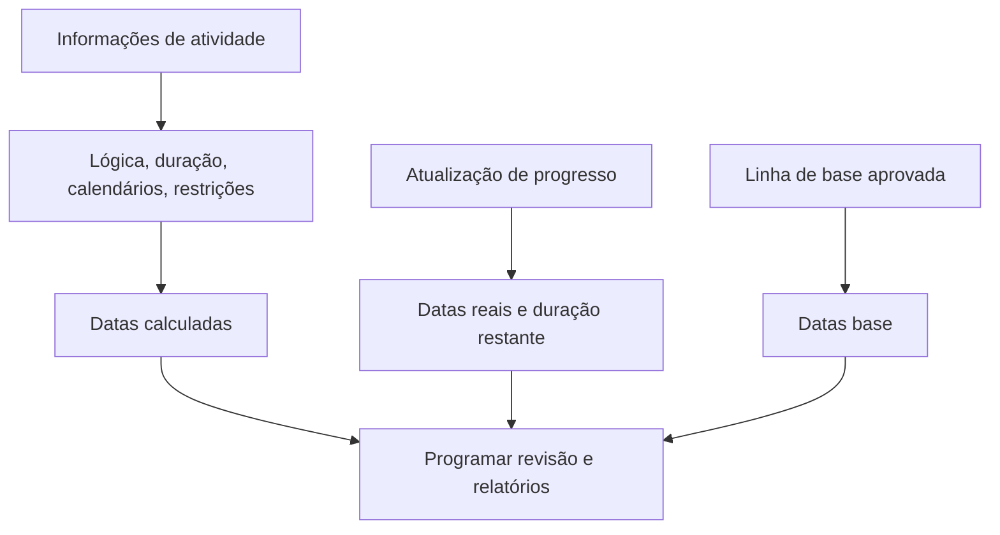

# Datas em P6

As datas no Primavera P6 podem ser confusas porque uma atividade não tem apenas uma data de início e uma data de término. Ele pode ter datas planejadas, datas atuais do cronograma, datas iniciais, datas atrasadas, datas reais, datas de linha de base, datas de restrição, datas esperadas e, às vezes, datas externas ou relacionadas à previsão, dependendo do layout e das configurações do projeto.

Estas datas não significam todas a mesma coisa. Alguns são calculados pela lógica CPM. Alguns são inseridos durante atualizações de progresso. Alguns são usados ​​para comparação. Alguns são usados ​​para controlar ou limitar a programação. Compreender a diferença é essencial para a qualidade do cronograma, relatórios do PMO, prontidão para análise de atrasos e controle básico do projeto.

A questão mais importante é simples: o que esta data me diz e de onde veio?

## Por que P6 tem tantas datas

P6 não é apenas uma lista de datas. É um modelo de cálculo. O software calcula datas a partir de durações de atividades, calendários, relacionamentos, restrições, recursos, status de progresso e data dos dados.

Existem diferentes campos de data porque os planejadores precisam responder a perguntas diferentes:

- Qual era o plano original?
- Qual é a previsão atual?
- O que realmente aconteceu?
- Qual é o horário mais cedo que a atividade pode começar ou terminar?
- Qual é o máximo que pode começar ou terminar sem afetar o projeto?
- Uma restrição está forçando a atividade?
- Como o plano atual se compara à linha de base?

O problema começa quando esses tipos de datas são misturados sem entender sua finalidade.

## Data Date

A Data Date não é uma data de atividade, mas controla como todas as datas de atividade devem ser interpretadas.

A Data Date é o limite entre o desempenho real e o trabalho previsto. O trabalho antes da Data Date deve ser atualizado ou status. O trabalho após a data dos dados deve ser previsto.

Se uma atividade tiver datas reais posteriores à Data Date, isso geralmente é um erro de status. Se uma atividade aberta começar exatamente na data dos dados sem nenhuma lógica direcionadora, isso pode indicar falta de sequenciamento. Se o término esperado for anterior à data dos dados, isso pode indicar informações de atualização desatualizadas.

Antes de revisar qualquer data de atividade, confirme a Data Date.

## Iniciar e terminar

Início e Término são as principais datas da programação que a maioria dos usuários vê nos layouts P6. Eles representam as datas atuais calculadas ou programadas para a atividade com base nos dados do cronograma.

Para atividades não iniciadas, Início e Término são datas previstas. Para atividades em andamento, eles podem combinar o status real e a previsão restante. Para atividades concluídas, elas devem estar alinhadas com as datas reais.

Geralmente são as datas usadas em relatórios, cronogramas antecipados e discussões gerenciais. No entanto, eles não devem ser aceitos sem verificar a lógica e o status por trás deles.

Use Início e Término para responder: quando a atividade está programada para começar e terminar?

## Início antecipado e término antecipado

Início antecipado e término antecipado são datas de cálculo de CPM. Eles mostram as primeiras datas em que uma atividade pode iniciar e terminar com base na lógica predecessora, nos calendários, nas restrições e nas condições atuais do cronograma.

As datas antecipadas são importantes porque ajudam a explicar o avanço do cálculo do cronograma. Eles mostram como o trabalho pode se mover pela rede assim que a lógica permitir.

Se muitas atividades tiverem início antecipado na data dos dados, o revisor deverá verificar se estão realmente prontas ou se são inícios abertos, atividades restritas ou atividades fracamente vinculadas.

Use Início Antecipado e Término Antecipado para responder: qual é o período mais cedo que esta atividade pode acontecer de acordo com a rede atual?

## Início tardio e término tardio

Início tardio e Término tardio mostram as últimas datas em que uma atividade pode iniciar ou terminar sem atrasar o término do projeto ou o ponto de término de controle, dependendo da configuração do cronograma.

As datas atrasadas fazem parte do retrocesso. Eles são usados ​​para calcular a folga. A diferença entre as datas iniciais e tardias ajuda a mostrar quanta flexibilidade a atividade possui.

Se as datas atrasadas parecerem estranhas, procure restrições, sucessores ausentes, encerramentos em aberto, calendários ou configurações incomuns de término do projeto.

Use Início Tardio e Término Tardio para responder: até que ponto esta atividade pode se mover antes de afetar a data de conclusão de controle?

## Início real e término real

Início Real e Término Real são fatos de status. Devem representar o que realmente aconteceu no campo ou na execução do projeto.

Início Real significa que a atividade realmente começou. Término Real significa a atividade realmente concluída. Estas datas não devem ser usadas como metas de planejamento ou datas de previsão.

As datas reais normalmente devem ser iguais ou anteriores à Data Date. Se as datas reais forem posteriores à Data Date, o cronograma reporta o trabalho futuro como já iniciado ou concluído, o que enfraquece a credibilidade da atualização.

Use Actual Start e Actual Finish para responder: o que realmente aconteceu?

## Início planejado e término planejado

O início planejado e o término planejado são frequentemente mal compreendidos. Dependendo de como o cronograma é criado, atualizado e exibido, esses campos podem não se comportar como uma linha de base formal aprovada.

Alguns usuários esperam que as datas planejadas mostrem o plano original para sempre. Essa nem sempre é uma suposição segura. Para relatórios formais de variação, uma linha de base atribuída é geralmente mais confiável do que confiar casualmente em datas planejadas.

Use Início planejado e Término planejado somente quando o procedimento de controles do projeto definir claramente como eles são mantidos e o que significam.

## Início da linha de base e término da linha de base

As datas de referência provêm de um cronograma de referência atribuído. Eles são usados ​​para comparar o cronograma atual com o plano aprovado.

Por exemplo, BL1 Início e BL1 Término podem mostrar as datas de início e término da atividade a partir da linha de base aprovada. O início e o fim atuais mostram a previsão mais recente. A diferença entre eles mostra variação.

As datas base são fundamentais para relatórios de desempenho, variação de cronograma, controle de mudanças e preparação para análise de atrasos.

Use o início da linha de base e o término da linha de base para responder: como o cronograma atual se compara ao plano aprovado?

## Data de restrição

As datas de restrição são controles de data impostos. Eles estão conectados a tipos de restrição como Iniciar em, Iniciar ou depois, Terminar em, Terminar em ou antes, Início obrigatório ou Término obrigatório.

As restrições não são automaticamente erradas. Alguns representam datas reais de contratos, restrições de acesso, liberações de licenças, períodos de interrupção ou requisitos do proprietário. Mas as restrições também podem ocultar a falta de lógica ou forçar datas irrealistas.

Restrições rígidas, especialmente Partida Obrigatória e Finalização Obrigatória, devem ser raras e documentadas.

Use a Data de Restrição para responder: uma data imposta está controlando ou limitando esta atividade?

## Datas de término esperadas e tipo de previsão

Término Esperado é frequentemente usado durante atualizações para capturar quando a equipe do projeto espera que uma atividade termine. Dependendo das configurações e procedimentos, as datas esperadas podem influenciar a forma como o P6 calcula ou exibe as datas das atividades.

Término esperado pode ser útil para trabalhos em andamento quando as equipes de campo fornecem uma expectativa de finalização realista. Mas se não for mantido, pode ficar obsoleto. Um término esperado antes da data dos dados é um sinal de alerta comum.

Alguns projetos também usam campos de data relacionados à previsão ou campos definidos pelo usuário para relatórios. O segredo é defini-los claramente para que a equipe saiba se foram calculados, inseridos manualmente ou importados.

Use datas esperadas ou previstas para responder: qual é a expectativa mais recente da equipe e ela é controlada por um procedimento de atualização definido?

## Datas de restrição primária e secundária

P6 pode conter mais de uma condição de restrição em uma atividade, dependendo dos campos de restrição selecionados. A restrição primária geralmente é a principal mostrada em layouts padrão, mas uma restrição secundária também pode afetar a interpretação.

Durante a revisão do cronograma, não olhe apenas para Início e Término. Adicione campos de tipo de restrição e data de restrição ao layout. Se as datas não estiverem se comportando conforme o esperado, as restrições são uma das primeiras coisas a verificar.

## Quais datas você deve usar?

Use cada data para sua finalidade:

- Use Início e Término para a previsão do cronograma atual.
- Use datas iniciais e finais para entender o cálculo e a folga do CPM.
- Use Datas reais para trabalhos concluídos ou iniciados.
- Use as datas base para variação em relação ao plano aprovado.
- Use datas de restrição para identificar controles de data impostos.
- Use campos de conclusão esperada ou de previsão somente quando o procedimento de atualização os definir.
- Use a Data Date para separar o desempenho real do trabalho previsto.

## Erros Comuns

Um erro comum é comparar datas erradas. Por exemplo, comparar o Início actual com o Início Planeado pode não ser significativo se as datas planeadas não forem controladas pelo procedimento do projecto.

Outro erro é tratar o Actual Start como uma previsão. As datas reais devem representar o desempenho real, não a intenção.

Um terceiro erro é ignorar a hora do dia. P6 armazena datas com hora, e diferenças de calendário podem criar aparentes turnos de um dia ou surpresas relacionadas à folga.

Finalmente, evite ocultar datas de restrição. Se uma data for imposta, os revisores precisam vê-la.

## Conclusão

As datas em P6 são poderosas porque contam diferentes partes da história do cronograma. As datas atuais mostram a previsão. As datas iniciais e posteriores explicam o cálculo do CPM. As datas reais registram o que aconteceu. As datas de base suportam a comparação. As datas de restrição revelam os controles impostos. As datas esperadas podem suportar atualizações quando são mantidas adequadamente.

Uma revisão rigorosa do cronograma não pergunta apenas "qual é a data?" Pergunta "que tipo de data é esta, de onde veio e é credível?"

Quando a equipe do projeto entende o significado de cada campo de data, o cronograma se torna mais fácil de explicar, mais fácil de auditar e mais confiável para o controle do projeto.
## Conteúdo relacionado
- [Datas reais posteriores à data dos dados no Primavera P6 - Visão geral](../../06_metrics_pt/12_actual_date_greater_than_data_date/01_overview_template.md)
- [Tipos de duração em P6](../06_DURATION%20TYPES%20IN%20P6/06_DURATION%20TYPES%20IN%20P6.md)
- [Calendários em P6](../08_CALENDARS%20IN%20P6/08_CALENDARS%20IN%20P6.md)
