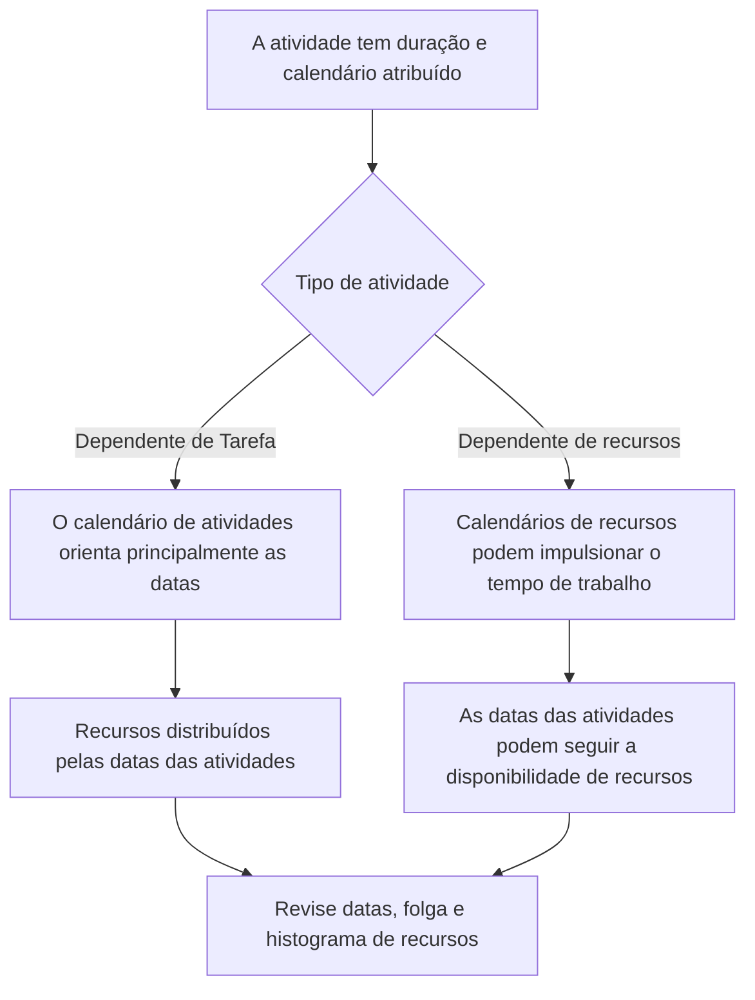

# Calendários em P6

Os calendários são uma das bases silenciosas da programação do Primavera P6. Eles definem quando o trabalho pode acontecer. Eles informam ao P6 quais dias são dias úteis, quais dias são dias não úteis, quantas horas estão disponíveis em um dia e a que horas do dia começa e termina o trabalho.

Como os calendários funcionam nos bastidores, é fácil subestimá-los. Um cronograma pode ter uma lógica forte e durações razoáveis, mas se os calendários estiverem errados ou inconsistentes, as datas ainda poderão ser enganosas.

Compreender os calendários é essencial para a qualidade do cronograma, planejamento de recursos, revisão do caminho crítico e disciplina de atualização.

## O que um calendário faz no P6

No P6, um calendário converte a duração em datas. Se uma atividade tem duração de 10 dias úteis, P6 precisa saber o que significa jornada útil. É de segunda a sexta? Sábado está incluído? A jornada de trabalho é de 8 horas, 10 horas ou 12 horas? O trabalho começa às 7h ou às 8h? Os feriados estão excluídos?

O calendário responde a essas perguntas.

Influência dos calendários:

- Datas de início e término da atividade.
- Datas antecipadas e tardias.
- Folga total.
- Caminho crítico e caminho mais longo.
- Tempo de uso de recursos.
- Interpretação do atraso no relacionamento.
- A data muda durante as atualizações.
- Precisão antecipada e de relatórios.

Um calendário não é apenas um item de configuração administrativa. Faz parte do cálculo do cronograma.

## Por que mais de um calendário pode ser necessário

Muitos projetos precisam de mais de um calendário porque nem todos os trabalhos seguem o mesmo padrão de trabalho.

Os exemplos incluem:

- Trabalho de engenharia de escritório em um calendário de 5 dias.
- Obras de construção do local em um calendário de 6 dias.
- Trabalho de desligamento ou interrupção em um calendário de 24 horas.
- Trabalho de comissionamento no turno da noite.
- Janelas de acesso do proprietário.
- Restrições ambientais.
- Atividades de aquisição com base nos dias úteis do fornecedor.
- Calendários específicos de recursos para inspetores, fornecedores ou equipes especializadas.

Usar um calendário para tudo pode parecer simples, mas pode produzir datas irrealistas. Se o comissionamento só puder ocorrer à noite, um calendário diurno normal pode estar errado. Se um fornecedor trabalhar apenas durante a semana, um calendário de construção de 7 dias pode exagerar a disponibilidade.

O objetivo não é criar muitos calendários. O objetivo é criar calendários suficientes para modelar condições reais de trabalho sem tornar o cronograma desnecessariamente complexo.

## Calendários de atividades

O calendário de atividades é atribuído diretamente a uma atividade. Define o tempo de trabalho utilizado para calcular a duração e as datas daquela atividade, especialmente para atividades Dependentes de Tarefas.

Por exemplo, se “Instalar bandeja de cabos” tiver um calendário de construção de 6 dias, o P6 calculará seu trabalho com base nesse calendário. Se sábado for um dia útil, a atividade poderá terminar mais cedo do que em um calendário de 5 dias.

Os calendários de atividades geralmente são o principal controle de calendário para atividades normais do cronograma.

Use calendários de atividades quando o trabalho em si seguir um padrão de trabalho definido, como turno diurno, turno noturno, desligamento ou trabalho de escritório.

## Calendários de recursos

Os calendários de recursos definem quando um recurso está disponível. Um recurso pode ser uma pessoa, uma equipe, um item de equipamento, um fornecedor especializado ou outro recurso atribuído.

Os calendários de recursos tornam-se especialmente importantes quando as atividades dependem de recursos ou quando o projeto usa nivelamento de recursos ou planejamento detalhado de recursos.

Por exemplo, uma atividade pode estar atribuída a um calendário de construção de 6 dias, mas o inspetor especialista designado para ela só poderá estar disponível de segunda a quarta-feira. Se a atividade for orientada por recursos, o P6 poderá calcular datas com base no calendário de recursos e não apenas no calendário de atividades.

Os calendários de recursos são úteis quando a disponibilidade de recursos é uma restrição real de agendamento. Eles também podem criar confusão se forem atribuídos, mas não mantidos.

## Como os calendários de atividades e recursos se relacionam

A relação entre calendários de atividades e calendários de recursos depende do tipo de atividade, das configurações de recurso e do comportamento de cálculo do cronograma.

Para atividades dependentes de tarefas, o calendário de atividades geralmente é a base principal para a duração da atividade. Os calendários de recursos ainda podem afetar a distribuição e o uso dos recursos.

Para atividades Dependentes de Recursos, os calendários de recursos podem influenciar quando o trabalho é executado. Isto significa que o calendário de recursos pode afetar as datas das atividades de forma mais direta.

O ponto principal é que os calendários devem ser revisados ​​em conjunto. Um calendário de atividades pode indicar que o trabalho é possível, enquanto o calendário de recursos indica que o recurso atribuído não está disponível. Essa incompatibilidade pode criar dessincronização.

## O que significa dessincronização de calendário

A dessincronização de calendários acontece quando diferentes calendários do cronograma não estão alinhados com a real forma como o projeto deveria funcionar.

Exemplos comuns incluem:

- A atividade utiliza um calendário de 6 dias, mas os recursos atribuídos utilizam um calendário de 5 dias.
- A atividade usa um calendário de turno diurno, mas os recursos usam turno noturno.
- Duas atividades vinculadas usam horários de início e término diferentes no dia.
- O atraso é interpretado através de um calendário que não corresponde ao trabalho.
- Uma atividade copiada mantém um calendário antigo de outro projeto.
- Um calendário de recursos possui feriados que o calendário de atividades não possui.

O resultado pode ser confuso. As datas podem mudar inesperadamente. As atividades podem parecer terminar um dia depois. A folga pode mudar sem uma razão lógica óbvia. Os histogramas de recursos podem não corresponder ao plano de execução. O caminho crítico pode mudar devido ao comportamento do calendário e não à sequência real.

## Problemas causados ​​por incompatibilidade de calendário

A incompatibilidade de calendário pode criar vários problemas de qualidade do cronograma.

Primeiro, pode criar datas enganosas. Uma tarefa pode parecer mais demorada porque o calendário tem menos períodos de trabalho.

Em segundo lugar, pode distorcer a folga. As atividades em calendários diferentes podem calcular datas antecipadas e atrasadas de formas difíceis de explicar.

Terceiro, pode afetar o caminho crítico. Um caminho pode tornar-se crítico porque um calendário restringe o trabalho, e não porque a sequência lógica seja verdadeiramente controladora.

Quarto, pode danificar os relatórios de recursos. Um histograma de recursos pode mostrar a demanda de recursos em datas em que o recurso não está realmente disponível ou pode perder a demanda que deveria aparecer.

Finalmente, isso pode criar confusão na atualização. Quando a data dos dados muda, as atividades em calendários diferentes podem responder de maneira diferente, dificultando o status e a revisão do cronograma.

## Como resolver dessincronizações

Comece identificando o padrão de calendário do projeto. Defina a semana normal de trabalho, horários de início e término dos dias úteis, feriados, períodos de desligamento e janelas especiais de trabalho.

Em seguida, revise todos os calendários da programação. Verificar:

- Nome e finalidade do calendário.
- Dias úteis.
- Horário de trabalho diário.
- Horários de início e término.
- Feriados e exceções.
- Tipo de calendário.
- Atividades atribuídas ao calendário.
- Recursos atribuídos ao calendário.

A seguir, revise as atividades onde as datas parecem estranhas. Adicione colunas para Calendário de Atividades, Tipo de Atividade, Início, Término, Início Antecipado, Término Antecipado, Folga total, recursos e calendários de recursos, se disponíveis.

Se um calendário estiver errado, corrija-o. Se a atividade estiver atribuída ao calendário errado, altere a atribuição. Se o calendário de recursos for válido, mas causar resultados inesperados, confirme se a atividade deve ser Dependente de Recurso ou Dependente de Tarefa.

Após fazer as correções, recalcule o cronograma e revise as datas afetadas, folga, caminho crítico e histograma de recursos.

## Boa governança do calendário

Os calendários devem ser governados como lógica e restrições. Eles não deveriam se multiplicar sem controle.

As boas práticas incluem:

- Use uma convenção de nomenclatura clara.
- Mantenha um conjunto limitado de calendários de projetos aprovados.
- Documente por que existem calendários especiais.
- Evite copiar calendários não utilizados de agendas antigas.
- Revise as atribuições do calendário de atividades antes da aprovação da linha de base.
- Revise os calendários de recursos se o carregamento de recursos for usado.
- Verifique os horários de início e término do calendário, não apenas os dias úteis.

A governança do calendário é especialmente importante em agendas grandes, onde muitos usuários podem adicionar ou copiar atividades.

## Exemplo prático

Um projeto de construção usa um calendário de 6 dias para o trabalho no local. A maioria das atividades de construção ocorre de segunda a sábado, das 7h00 às 17h00. Uma equipe de comissionamento trabalha no turno noturno das 22h às 6h porque os testes só podem acontecer quando as operações estão off-line.

Ambos os calendários são válidos.

O problema aparece quando atividades de construção copiadas herdam acidentalmente o calendário do turno noturno. Seus encontros começam a mudar estranhamente. Alguns relacionamentos parecem empurrar os sucessores para o dia seguinte. A folga muda de uma forma que a equipe não consegue explicar.

A solução é não excluir o calendário do turno noturno. A solução é corrigir a atribuição do calendário de atividades, confirmar quais atividades realmente precisam do calendário do turno noturno e recalcular a programação.

## Conclusão

Os calendários no P6 definem quando o trabalho pode acontecer. Eles afetam datas de atividades, folga, caminho crítico, carregamento de recursos, atrasos e comportamento de atualização.

Freqüentemente, é necessário mais de um calendário porque os projetos incluem diferentes padrões de trabalho: trabalho no local, trabalho de escritório, turnos noturnos, paralisações, trabalho de fornecedores e disponibilidade de recursos. Mas vários calendários devem ser controlados cuidadosamente.

O principal risco é a dessincronização. Quando os calendários de atividades e os calendários de recursos não correspondem ao plano de execução real, o cronograma pode mostrar datas confusas, flutuações enganosas e informações de recursos não confiáveis.

Uma programação forte usa calendários intencionalmente. Cada calendário tem uma finalidade, cada calendário especial é documentado e as atribuições do calendário de atividades e recursos são revisadas antes que o cronograma seja confiável.
## Conteúdo relacionado
- [Calendários com diferentes horários de início e término no Primavera P6 - Visão geral](../../metrics/20_calendars_with_different_start_finish_time_in_day/02_guide_template.md)
- [Datas em P6](../07_DATES%20IN%20P6/07_DATES%20IN%20P6.md)
- [Duração em P6](../09_DURATION%20IN%20P6/09_DURATION%20IN%20P6.md)
