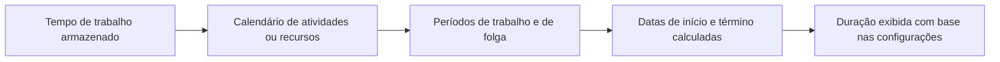

# Duração em P6

A duração no Primavera P6 parece simples à primeira vista: uma atividade leva um certo número de dias. Na prática, a duração é uma das partes mais importantes e mais incompreendidas de um cronograma.

A duração está ligada a calendários, tipo de atividade, atribuições de recursos, atualizações de progresso e configurações de exibição do usuário. Uma duração mostrada como “5 dias” pode não significar a mesma coisa em cada programação, em cada calendário ou em cada layout de usuário. É por isso que os planejadores precisam entender não apenas o que é a duração, mas também como o P6 a armazena, calcula e exibe.

## O que significa duração

Duração é a quantidade de tempo de trabalho necessário para realizar uma atividade. Não se trata simplesmente do número de dias corridos entre uma data de início e uma data de término.

Por exemplo, uma atividade com 5 dias de duração pode abranger:

- 5 dias corridos de segunda a sexta-feira, sem interrupção.
- 7 dias corridos se um fim de semana estiver dentro do período de trabalho.
- Menos de 5 dias corridos em um calendário de 24 horas ou turno estendido.
- Mais de 5 dias corridos se feriados ou dias não úteis interromperem o trabalho.

Esta é a primeira lição fundamental: a duração é o tempo de trabalho, enquanto as datas de início e término são posições do calendário.

## Como o P6 armazena a duração

P6 armazena a duração como tempo, geralmente no nível da hora nos dados do cronograma subjacente. O que o usuário vê no layout pode ser mostrado como dias, semanas, meses ou anos, dependendo das preferências.

Isso significa que a duração exibida geralmente é uma conversão. Se o P6 armazenar uma atividade como 40 horas de trabalho, um usuário poderá vê-la como 5 dias se a conversão de exibição usar 8 horas por dia. Outra configuração pode mostrá-lo de forma diferente se a conversão do período de tempo ou a base do calendário forem diferentes.

É por isso que duas pessoas podem olhar para a mesma programação e ficar confusas se suas preferências de usuário ou configurações de período administrativo não estiverem alinhadas.

## Duração e calendários

Os calendários informam ao P6 quando o trabalho pode acontecer. A duração informa ao P6 quanto tempo de trabalho é necessário. O calendário então coloca esse horário de trabalho em datas reais.

Se uma atividade tiver 40 horas de duração restante, o calendário determinará como essas 40 horas serão distribuídas.

Em um calendário de 8 horas por dia, 40 horas podem aparecer como 5 dias úteis. Num calendário de 10 horas por dia, as mesmas 40 horas podem aparecer como 4 dias úteis. Em um calendário de 24 horas, pode abranger muito menos tempo do calendário.

É por isso que as atribuições do calendário são importantes. A alteração do calendário pode alterar a data de término mesmo que a duração de trabalho armazenada permaneça a mesma.

## Duração Original

A Duração Original é a duração planejada da atividade antes que o progresso seja aplicado. Representa a estimativa inicial do tempo de trabalho necessário para concluir a atividade.

A duração original é importante durante o planejamento e o desenvolvimento da linha de base. Ajuda a definir o esforço esperado ou a janela de tempo para uma tarefa. Também é usado em discussões sobre progresso e desempenho porque fornece um ponto de referência sobre quanto tempo se esperava que a atividade levasse.

Use a duração original para responder: quanto tempo essa atividade foi planejada para durar antes das atualizações de status?

## Duração restante

A Duração Restante é a quantidade de tempo de trabalho ainda necessária para concluir a atividade a partir da Data de Dados atual.

Para uma atividade não iniciada, a Duração Restante geralmente corresponde à Duração Original, a menos que tenha sido revisada. Para uma atividade em andamento, a Duração Restante deve refletir o trabalho realista ainda necessário. Para uma atividade concluída, a Duração Restante deve ser 0.

A Duração Restante é um dos campos de atualização mais importantes no P6. Se estiver errado, a previsão estará errada.

Utilize a Duração Restante para responder: quanto tempo de trabalho ainda é necessário?

## Duração real

A Duração Real representa a quantidade de tempo já gasto na atividade com base no progresso real. Ele está vinculado ao início real, ao término real, à data dos dados, aos calendários e ao método de atualização.

A duração real deve apoiar a história do status. Se uma atividade tiver sido iniciada, a duração real deverá fazer sentido em relação ao Início Real e à Data Date. Se a atividade for concluída, a Duração Real deverá estar alinhada com o período de trabalho real.

Use a Duração Real para responder: quanto tempo de trabalho já foi consumido?

## Na duração da conclusão

A Duração na Conclusão representa a duração total esperada da atividade após a combinação do trabalho real e restante.

Em termos simples:

Duração real + Duração restante = Duração na conclusão

Isto é útil porque mostra se se espera que uma actividade demore mais ou menos tempo do que o inicialmente planeado. Se a Duração Original era de 10 dias, mas a Duração de Conclusão agora é de 15 dias, a previsão é que a atividade demore mais do que o planejado.

Use a duração da conclusão para responder: quanto tempo se espera que esta atividade leve no total?

## Duração e preferências do usuário

As Preferências do Usuário controlam como as unidades de tempo são exibidas para um usuário individual. Um usuário pode escolher se as durações serão mostradas em horas, dias, semanas, meses ou anos.

Isto afeta o que o usuário vê, não necessariamente o cálculo do cronograma subjacente. Por exemplo, a mesma duração armazenada pode ser exibida como horas em um layout e dias em outro.

Isto é útil, mas também pode criar confusão. Um planejador que revisa o trabalho detalhado pode preferir horas. Um gerente de projeto pode preferir dias. Um relatório de portfólio pode mostrar meses. Se a base de conversão não for compreendida, os números podem parecer inconsistentes.

Ao revisar as durações, confirme a unidade de exibição. Pergunte se a duração mostrada está em horas, dias, semanas ou outra unidade.

## Preferências de administrador e períodos de tempo

As preferências do administrador incluem configurações de período que definem como o P6 converte horas em unidades maiores, como dias, semanas, meses e anos. Essas configurações são importantes porque influenciam como os valores de duração são exibidos e convertidos.

Por exemplo, se o sistema usar 8 horas por dia, 40 horas serão exibidas como 5 dias. Se o sistema usar 10 horas por dia, 40 horas serão exibidas como 4 dias.

Isso não significa necessariamente que o trabalho mudou. Isso pode significar apenas que a conversão mudou.

Em algumas configurações P6, a exibição da duração também pode depender de o sistema ou o usuário estar usando horas de calendário atribuídas para conversão de período de tempo. É por isso que as equipes de projeto devem alinhar os padrões de calendário, as preferências do usuário e as configurações de período administrativo antes do relatório formal.

## Por que a duração pode parecer diferente

A duração pode ser diferente por vários motivos:

- Diferentes usuários exibem o tempo em unidades diferentes.
- As configurações de período de administração convertem as horas de maneira diferente.
- Os calendários de atividades têm horários diferentes por dia.
- Os calendários de recursos são diferentes dos calendários de atividades.
- As atividades usam diferentes tipos de atividades.
- A duração restante foi atualizada manualmente.
- O progresso foi aplicado incorretamente.
- A hora do dia fica oculta no layout.

É por isso que um problema de duração nem sempre é um problema de duração. Às vezes é um problema de calendário. Às vezes é um problema de configuração de exibição. Às vezes é um problema de atualização de progresso.

## Relacionamento com Tipos de Atividades e Tipos de Duração

O tipo de atividade afeta qual base de calendário é mais importante. As atividades dependentes de tarefas geralmente dependem principalmente do calendário de atividades. As atividades dependentes de recursos podem ser mais influenciadas pelos calendários de recursos.

O tipo de duração afeta como o P6 equilibra a duração, as unidades de recursos e as unidades por tempo. Por exemplo, adicionar recursos pode ou não encurtar a atividade dependendo do Tipo de Duração.

Portanto, quando uma duração se comporta de forma inesperada, verifique três coisas juntas:

- Calendário de atividades e calendário de recursos.
- Tipo de atividade.
- Tipo de duração.

Esses campos funcionam juntos. Rever apenas um deles pode levar a conclusões erradas.

## Problemas comuns

Um problema comum é inserir uma duração em dias sem perceber que o calendário de atividades usa um número de horas por dia diferente do esperado.

Outro problema é comparar durações entre atividades que utilizam calendários diferentes. Cinco dias num calendário podem não representar a mesma quantidade de tempo de trabalho que cinco dias noutro.

Um terceiro problema são as preferências inconsistentes do usuário. Um revisor pode ver horas enquanto outro vê dias, e ambos podem pensar que a programação mudou.

Outro problema comum é alterar as preferências do administrador após já existirem agendamentos. Isso pode fazer com que as durações exibidas pareçam diferentes, mesmo quando as horas armazenadas subjacentes não foram alteradas.

## Como revisar a duração corretamente

Ao revisar a duração em P6, não olhe apenas para o número mostrado na coluna Duração.

Verificar:

- Duração Original.
- Duração restante.
- Duração real.
- Na duração da conclusão.
- Calendário de atividades.
- Calendário de recursos se os recursos forem usados.
- Tipo de atividade.
- Tipo de duração.
- Exibição da unidade de tempo das preferências do usuário.
- Conversão de período de tempo nas preferências do administrador.

Se as datas ou durações parecerem estranhas, adicione campos de calendário e hora ao layout. Não oculte a hora do dia durante a solução de problemas.

## Conclusão

A duração em P6 é o tempo de trabalho e não apenas o tempo decorrido no calendário. O P6 armazena a duração como tempo, aplica calendários para colocar esse horário na programação e o exibe de acordo com as preferências do usuário e configurações administrativas de período de tempo.

Isso significa que a duração deve ser revista com contexto. Um valor mostrado como "5 dias" depende das horas do calendário, unidades de exibição, configurações de conversão, tipo de atividade, tipo de duração e status de atualização.

Um agendador forte entende que a duração não é apenas uma entrada. Faz parte do mecanismo de cálculo. Quando a duração, os calendários e as preferências estão alinhados, o cronograma se torna mais fácil de explicar e mais confiável para o controle do projeto.
## Conteúdo relacionado
- [Atividades começando na data dos dados sem nenhuma lógica direcionadora: por que essa métrica de cronograma é importante - Visão geral](../../metrics/01_activities_starting_in_dd_with_no_logic_driving/02_guide_template.md)
- [Calendários em P6](../08_CALENDARS%20IN%20P6/08_CALENDARS%20IN%20P6.md)
- [Porcentagem de tipos completos em P6](../10_PERCENT%20COMPLETION%20TYPES%20IN%20P6/10_PERCENT%20COMPLETION%20TYPES%20IN%20P6.md)
