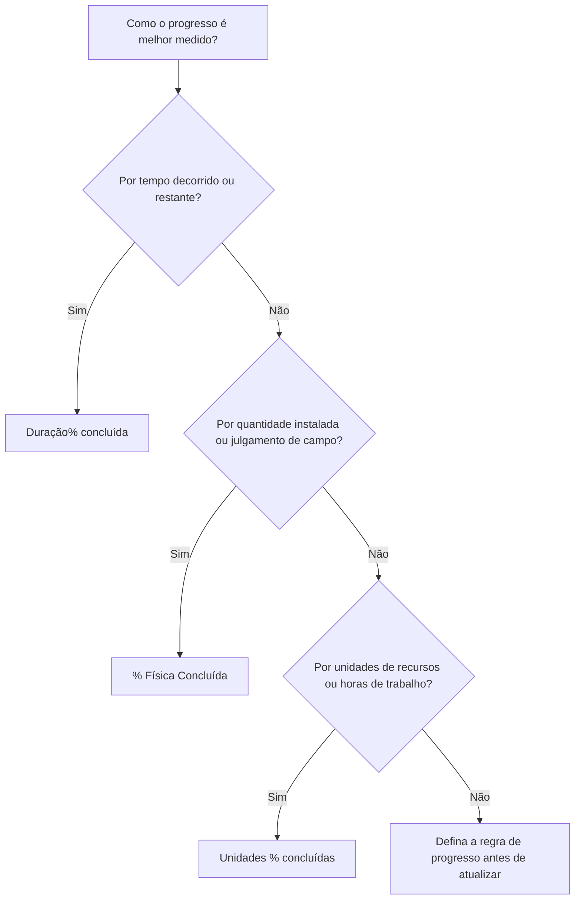

# Porcentagem de tipos completos em P6

A porcentagem concluída é um dos campos de progresso mais visíveis no Primavera P6, mas também é um dos mais incompreendidos. Um valor de 50% concluído pode significar coisas diferentes dependendo de como a atividade está configurada e de como o projeto mede o progresso.

No P6, o tipo Porcentagem concluída controla como a % concluída da atividade é calculada ou atualizada. Diz ao P6 se ​​o progresso deve ser baseado no tempo, na realização física ou em unidades de recursos.

Os principais tipos de porcentagem concluída para atividades são:

- Duração % concluída.
- Físico % Concluído.
- Unidades % concluídas.

Escolher o caminho certo é importante porque o progresso não é apenas um número de relatório. Afeta a duração restante, o valor agregado, os relatórios de recursos, a credibilidade do cronograma e a qualidade de cada ciclo de atualização.

## Por que o tipo percentual completo é importante

Atividades diferentes necessitam de formas diferentes de medir o progresso.

Para algumas atividades, o tempo é um substituto razoável. Se uma tarefa teve 10 dias de duração e 5 dias úteis foram concluídos, pode ser razoável dizer que a atividade está cerca de 50% concluída.

Para outras atividades o tempo não é suficiente. Uma equipe pode passar 5 dias em uma tarefa de 10 dias e concluir apenas 20% do trabalho físico. Outra tripulação poderá completar 80% do número na primeira metade da duração. Nesses casos, o progresso baseado na duração pode enganar a equipe do projeto.

Para cronogramas carregados de recursos, as unidades podem ser a melhor base de progresso. Se uma atividade for planejada para 1.000 horas de trabalho e 600 horas de trabalho tiverem sido ganhas ou consumidas, a % de Unidades Concluídas poderá refletir melhor o progresso.

O tipo correto de porcentagem concluída depende do que a atividade representa e de como o progresso é realmente medido.

## % de atividade concluída

% de atividade concluída é o valor geral do progresso exibido para a atividade. Sua origem depende do tipo de percentual concluído selecionado.

Se a atividade usar % de duração concluída, a % de conclusão da atividade será orientada pelo relacionamento entre a duração original, real e restante.

Se a atividade usar % Física Concluída, % de Atividade Concluída seguirá o valor de % Física Concluída inserido pelo usuário.

Se a atividade usar Unidades % Concluídas, a Atividade % Concluída será baseada no progresso das unidades de recurso.

É por isso que duas atividades podem mostrar 50% concluídas, mas significar coisas muito diferentes.

## Duração% concluída

Duração % Concluído mede o progresso com base no tempo. Ele compara quanta duração foi consumida com a duração total esperada.

Em termos simples, se uma atividade tiver 10 dias de duração planejada ou concluída e 5 dias tiverem sido consumidos, a atividade poderá apresentar cerca de 50% de duração% concluída.

A % de duração concluída é útil quando o progresso é razoavelmente proporcional ao tempo.

Os exemplos incluem:

- Períodos de revisão administrativa.
- Períodos de espera ou cura.
- Tarefas de suporte baseadas em tempo.
- Algumas atividades simples onde a produção de trabalho é constante.

Use % de duração concluída quando o tempo for uma medida justa do progresso e a duração restante for mantida com cuidado.

O risco é que o tempo gasto nem sempre seja igual ao trabalho realizado. Uma tarefa pode consumir metade da duração planejada e ainda assim ficar muito atrasada fisicamente. Se o agendador depender apenas da duração, os relatórios de progresso poderão parecer melhores do que a realidade.

## % Física Concluída

A % física concluída é inserida manualmente ou atualizada com base no progresso físico real. Representa o que realmente foi alcançado no trabalho, independentemente da duração ou das unidades de recursos.

Esta é muitas vezes a melhor opção para construção, entregas de engenharia, trabalhos de instalação, pacotes de comissionamento ou qualquer atividade onde o progresso deva ser baseado em realizações mensuráveis.

Os exemplos incluem:

- 40% dos desenhos emitidos.
- 60% da eletrocalha instalada.
- 75% da tubulação soldada.
- 30% do pacote de teste concluído.
- 100% do alinhamento dos equipamentos finalizado.

Use % física concluída quando o progresso precisar ser medido por quantidade, status de entrega, verificação de campo ou julgamento do proprietário responsável.

A vantagem é que pode refletir melhor a realidade do que o tempo decorrido. O risco é que isso exija disciplina. A equipe do projeto deve definir como o progresso físico é medido, quem o aprova e como as evidências são coletadas.

## Unidades % concluídas

Unidades % Concluído mede o progresso com base em unidades de recursos. Ele compara as unidades reais com as unidades concluídas.

Isto é útil quando o cronograma está carregado de recursos e o progresso é monitorado através de horas de trabalho, horas de equipamento ou outras unidades de recursos mensuráveis.

Os exemplos incluem:

- Horas de trabalho reais ganhas em relação às horas de trabalho orçadas.
- Horas de equipamento usadas em relação às horas planejadas de equipamento.
- Trabalho instalado vinculado ao progresso da unidade de recursos.
- Fluxos de trabalho de valor agregado com base em unidades.

Use Unidades % Concluídas quando as unidades de recursos forem confiáveis, mantidas e fizerem parte do método de progresso do projeto.

O risco é que o consumo de recursos nem sempre seja igual ao progresso físico. Uma equipe pode passar muitas horas sem concluir o trabalho esperado. Por esse motivo, a % de unidades concluídas funciona melhor quando os relatórios de recursos e a medição do progresso são bem controlados.

## Como escolher o tipo certo

Uma forma prática de escolher o tipo Percentual Concluído é perguntar o que significa progresso para a atividade.

Se o progresso significar que o tempo passou, use Duração % Concluída.

Se o progresso significar que o trabalho físico foi alcançado, use % Física Concluída.

Se o progresso significar que unidades de recursos foram ganhas ou consumidas, use % de unidades concluídas.

A escolha deve ser consistente em grupos de atividades semelhantes. As entregas de engenharia podem usar % Física Concluída. A instalação de construção pode usar % física concluída com base nas quantidades. O suporte de gerenciamento baseado em tempo pode usar % de duração concluída. Pacotes de trabalho com muitos recursos podem usar Unidades % Concluídas se os dados dos recursos forem confiáveis.

## Relação com Duração Restante

A porcentagem concluída e a duração restante devem contar uma história consistente.

Uma atividade pode estar 80% fisicamente concluída, mas ainda ter 10 dias de Duração Restante se o trabalho restante for difícil, atrasado ou dependente de outra condição. Isso pode ser válido.

Uma atividade pode estar com 50% de duração% concluída porque metade do tempo planejado já passou, mas se apenas 20% do trabalho estiver fisicamente concluído, a duração restante provavelmente deverá ser revisada.

É por isso que boas atualizações exigem tanto o progresso quanto a revisão das previsões. A porcentagem concluída informa quanto foi alcançado. A duração restante informa quanto tempo ainda é necessário.

## Erros Comuns

Um erro comum é usar Duração % Concluída para atividades onde o progresso físico não é proporcional ao tempo. Isto pode fazer com que o progresso pareça melhor ou pior do que o trabalho real.

Outro erro é usar % Concluído Físico sem uma regra de medição. Se uma disciplina reporta progresso físico por quantidade instalada e outra reporta por opinião, o cronograma torna-se inconsistente.

Um terceiro erro é usar unidades% concluídas quando os dados dos recursos estão incompletos ou não são confiáveis. Se as unidades reais não forem mantidas, o valor do progresso não será confiável.

Outro problema é a atualização percentual concluída, mas ignorando a duração restante. Uma atividade pode mostrar progresso e ainda assim ter uma previsão irrealista.

## Boas Práticas

Defina regras de progresso antes do início do ciclo de atualização. A equipe do projeto deve saber quais grupos de atividades usam Duração, Física ou Unidades % Concluídas.

Use layouts que mostram Tipo de porcentagem concluída, % de atividade concluída, % física concluída, % de duração concluída, % de unidades concluídas, duração restante, início real, término real e status da atividade.

Verifique se há inconsistências como:

- Atividades iniciadas com 0% de progresso.
- Duração restante = 0, mas o status não foi concluído.
- 100% de progresso sem Real Finish.
- % física concluída que não corresponde à evidência de campo.
- Unidades % concluídas com base em atualizações de recursos ausentes.

Estas verificações ajudam a garantir que o progresso não é apenas registado, mas também credível.

## Conclusão

O tipo de porcentagem concluída em P6 define como o progresso da atividade é medido. Duração % Concluído mede o progresso baseado no tempo. % Física Concluída mede o trabalho real alcançado. Unidades % Concluído mede o progresso da unidade de recursos.

Nenhum tipo é melhor para todas as atividades. A escolha certa depende de como o trabalho é planejado, medido e controlado.

Uma programação forte usa tipos de porcentagem completa intencionalmente. Quando o método corresponde ao trabalho, as atualizações do progresso tornam-se mais claras, a duração restante torna-se mais confiável e os relatórios do projeto tornam-se mais fáceis de defender.
## Conteúdo relacionado
- [Atividades começando na data dos dados sem nenhuma lógica direcionadora: por que essa métrica de cronograma é importante - Visão geral](../../metrics/01_activities_starting_in_dd_with_no_logic_driving/02_guide_template.md)
- [Duração em P6](../09_DURATION%20IN%20P6/09_DURATION%20IN%20P6.md)
- [Onde está o custo em P6](../11_WHERE%20THE%20COST%20LIVE%20IN%20P6/11_WHERE%20THE%20COST%20LIVE%20IN%20P6.md)
