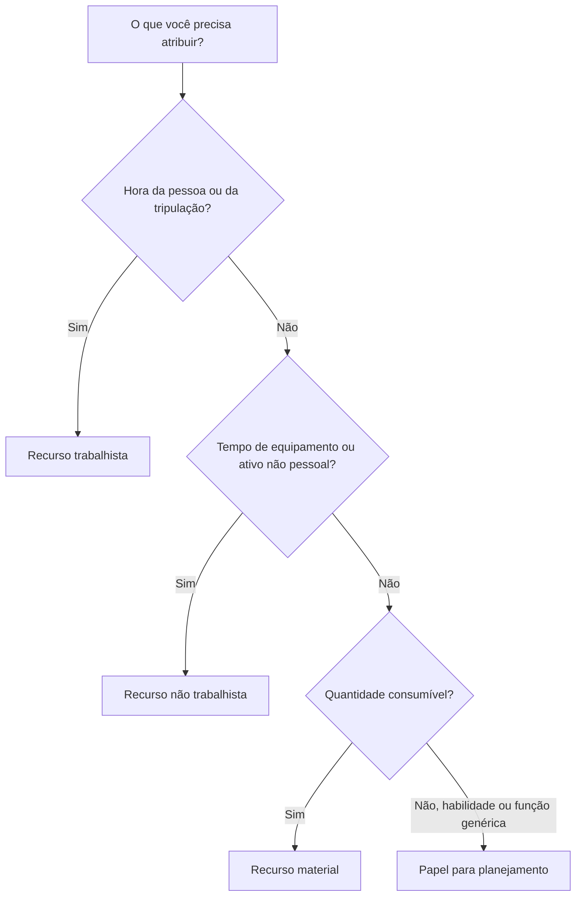

# Tipos de recursos em P6

Os recursos no Primavera P6 representam as pessoas, equipamentos e materiais necessários para executar o trabalho. Eles conectam o cronograma à capacidade, produtividade, custo e demanda de recursos ao longo do tempo.

Um cronograma pode existir sem recursos, mas um cronograma carregado de recursos proporciona à equipe do projeto uma visão mais profunda. Pode mostrar histogramas de mão de obra, demanda de equipamentos, uso de materiais, curvas de custos, restrições de recursos e possíveis sobrecargas. Para tornar essas informações úteis, o escalonador deve compreender os diferentes tipos de recursos disponíveis no P6 e quando usar cada um deles.

Os principais tipos de recursos no P6 são:

- Trabalho.
- Não trabalhista.
- Material.

P6 também utiliza funções, que não são exatamente iguais aos recursos, mas estão intimamente relacionadas e são muito úteis durante o planejamento.

## Por que o tipo de recurso é importante

O tipo de recurso afeta a forma como o P6 lida com unidades, taxas, custos, calendários e relatórios.

Um recurso de trabalho se comporta de maneira diferente de um recurso material. Um guindaste não deve ser tratado da mesma forma que um volume de concreto. Uma função genérica de engenheiro não é o mesmo que um recurso de engenheiro nomeado. Se os tipos de recursos forem misturados incorretamente, histogramas, relatórios de custos, análises de produtividade e resultados de valor agregado podem se tornar enganosos.

O tipo de recurso responde a uma questão prática: que tipo de coisa está sendo atribuída à atividade?

## Recursos trabalhistas

Os recursos de mão de obra representam pessoas ou equipes. Geralmente são medidos em horas, dias ou outras unidades baseadas no tempo. Os recursos de mão de obra podem ter taxas, calendários, limites de disponibilidade e valores de custos.

Os exemplos incluem:

- Planejador.
- Tripulação civil.
- Eletricista.
- Equipe de soldagem.
- Engenheiro.
- Inspetor.
- Técnico de comissionamento.

Utilize recursos de mão de obra quando o cronograma precisar mostrar esforço humano ou demanda da equipe. Os recursos de mão de obra são úteis para histogramas de mão de obra, planos de pessoal, análise de produtividade e previsão de custos de mão de obra.

Por exemplo, uma atividade chamada “Instalar bandeja de cabos” pode exigir 4 eletricistas durante 5 dias. A atribuição de recursos de mão de obra permite que o cronograma mostre a demanda de eletricistas nesse período.

Os recursos de mão de obra também são úteis quando o projeto precisa comparar as horas de mão de obra planejadas com as horas de mão de obra reais.

## Recursos não trabalhistas

Os recursos não trabalhistas representam equipamentos ou outros ativos não pessoais reutilizáveis. Geralmente são baseados no tempo, como a mão-de-obra, mas não são recursos humanos.

Os exemplos incluem:

- Guindaste.
- Escavadora.
- Máquina de solda.
- Equipamento de teste.
- Equipamento de equipe de andaimes.
- Conjunto de ferramentas especializadas.
- Gerador.

Use recursos não trabalhistas quando a disponibilidade do equipamento for importante ou quando o custo do equipamento precisar ser monitorado ao longo do tempo.

Por exemplo, se um levantamento pesado exigir um guindaste por dois dias, atribuir um recurso de guindaste não relacionado à mão de obra ajuda a equipe do projeto a ver a demanda do guindaste, evitar conflitos e prever o custo do equipamento.

Os recursos não trabalhistas são importantes quando o equipamento é escasso, caro, compartilhado entre áreas de trabalho ou um impulsionador da sequência de trabalho.

## Recursos Materiais

Os recursos materiais representam itens consumíveis. Eles geralmente são medidos em quantidades e não em tempo.

Os exemplos incluem:

- Metros cúbicos de concreto.
- Toneladas de aço.
- Medidores de cabo.
- Carretéis de tubos.
- Válvulas.
- Litros de revestimento.
- Painéis.

Use recursos materiais quando a programação precisar rastrear o consumo baseado em quantidade ou custos relacionados a materiais.

Os recursos materiais podem suportar curvas de materiais, rastreamento de quantidade e carregamento de custos. São especialmente úteis quando o cronograma está vinculado a quantidades instaladas ou valor agregado baseado em quantidades.

Por exemplo, uma atividade pode incluir 500 metros de instalação de cabos. Atribuir cabos como recurso material ajuda a equipe a monitorar a quantidade planejada e real instalada ao longo do tempo.

Os recursos materiais não devem ser usados ​​para representar horas de trabalho ou tempo de equipamento. Eles servem a um propósito diferente.

## Funções

As funções são funções genéricas ou categorias de habilidades. Eles não são iguais aos recursos, mas ajudam durante o planejamento antes que os recursos nomeados sejam conhecidos.

Os exemplos incluem:

- Engenheiro sênior.
- Supervisor elétrico.
- Inspetor Civil.
- Agendador.
- Líder de comissionamento.
- Operador de guindaste.

As funções são úteis no planejamento inicial porque o projeto pode saber que tipo de habilidade é necessária sem saber exatamente quem executará o trabalho.

Por exemplo, uma atividade de engenharia pode exigir 80 horas de esforço de “Engenheiro Elétrico Sênior”. Mais tarde, essa função pode ser substituída ou complementada por um recurso nomeado.

Use funções quando:

- O planejamento ainda está em alto nível.
- Os recursos nomeados não foram confirmados.
- A demanda de recursos é necessária por tipo de habilidade.
- A organização deseja previsões antecipadas de pessoal.

As funções devem ser revisadas à medida que o projeto amadurece. Se o cronograma exigir controle detalhado, as funções poderão precisar ser substituídas por recursos reais.

## Calendários de recursos

Os recursos podem ter calendários. Isto é importante porque a disponibilidade de recursos pode diferir da disponibilidade de atividades.

Por exemplo, uma atividade de construção pode usar um calendário de atividades de 6 dias, mas o especialista do fornecedor designado pode estar disponível apenas de segunda a sexta-feira. Se a atividade for Dependente de Recursos ou o nivelamento de recursos for usado, o calendário de recursos poderá afetar o cronograma.

Os recursos laborais e não laborais necessitam frequentemente de calendários porque as pessoas e os equipamentos estão disponíveis apenas em determinados momentos. Os recursos materiais geralmente se comportam de maneira diferente porque representam quantidades e não tempo de trabalho.

Quando as datas dos recursos parecerem estranhas, verifique o calendário de atividades e o calendário de recursos.

## Custos de recursos

Os recursos podem acarretar taxas de custo. Os recursos laborais e não laborais utilizam frequentemente taxas baseadas no tempo. Os recursos materiais geralmente usam taxas unitárias.

Por exemplo:

- Eletricista: custo por hora.
- Guindaste: custo por hora ou dia.
- Concreto: custo por metro cúbico.

Quando os recursos são atribuídos às atividades, o P6 pode calcular o custo orçado, real, restante e de conclusão.

Isso é útil para cronogramas carregados de custos, relatórios de valor agregado, previsões de recursos e análise de fluxo de caixa. Mas só funciona bem quando unidades, taxas, calendários e atualizações de progresso são mantidas.

## Escolhendo o tipo de recurso certo

Use Mão de obra quando o recurso for uma pessoa, equipe ou esforço humano.

Use Não-trabalho quando o recurso for um equipamento ou um ativo reutilizável cujo tempo é importante.

Use Material quando o recurso for uma quantidade consumível.

Use Funções ao planejar por habilidade ou função antes que os recursos nomeados sejam conhecidos.

A escolha deve refletir como o projeto deseja planejar, medir e relatar o trabalho.

## Erros Comuns

Um erro comum é usar recursos de mão de obra para tudo. Isso pode fácilitar o carregamento de custos no início, mas reduz a clareza quando as quantidades de equipamentos ou materiais são importantes.

Outro erro é utilizar recursos materiais para itens que são realmente despesas ou subcontratar valores fixos. Se o projeto não necessitar de acompanhamento de quantidade, uma despesa pode ser mais apropriada.

Um terceiro erro é atribuir recursos sem manter as unidades reais. Um cronograma carregado de recursos só será útil se as atualizações de progresso mantiverem os dados dos recursos atualizados.

Outro problema é confundir funções e recursos. As funções são boas para o planejamento, mas os recursos nomeados são melhores quando atribuições detalhadas, calendários e dados reais são importantes.

## Boas Práticas

Defina a estratégia de recursos antes de carregar o agendamento.

Decida qual trabalho utilizará recursos trabalhistas, qual trabalho utilizará recursos não trabalhistas, quais materiais precisarão de monitoramento de quantidade e onde as despesas deverão ser usadas.

Use convenções de nomenclatura e códigos de recursos consistentes. Mantenha o dicionário de recursos limpo. Evite recursos duplicados com nomes ligeiramente diferentes.

Revise as atribuições de recursos durante cada ciclo de atualização. Unidades, custos, calendários e valores reais devem permanecer alinhados com o processo de controle do projeto.

## Conclusão

Os tipos de recursos no P6 ajudam a definir o que é necessário para realizar o trabalho. Os recursos de mão de obra representam pessoas e equipes. Os recursos não trabalhistas representam equipamentos e ativos reutilizáveis. Os recursos materiais representam quantidades consumíveis. As funções apoiam o planejamento por habilidade ou função antes que os recursos nomeados sejam conhecidos.

A escolha do tipo de recurso certo fácilita a análise do cronograma. Ele melhora os histogramas de mão de obra, o planejamento de equipamentos, o rastreamento de materiais, o carregamento de custos, o valor agregado e os relatórios de previsão.

Um bom cronograma carregado de recursos não é apenas um cronograma com recursos anexados. É um cronograma onde cada tipo de recurso é usado intencionalmente e mantido durante a vida do projeto.
## Conteúdo relacionado
- [Atividades iniciadas com 0% de progresso no Primavera P6 - Visão geral](../../metrics/13_activity_started_progress_zero/02_guide_template.md)
- [Onde está o custo em P6](../11_WHERE%20THE%20COST%20LIVE%20IN%20P6/11_WHERE%20THE%20COST%20LIVE%20IN%20P6.md)
- [Limites de recursos em P6](../13_RESOURCES%20LIMITS%20IN%20P6/13_RESOURCES%20LIMITS%20IN%20P6.md)
