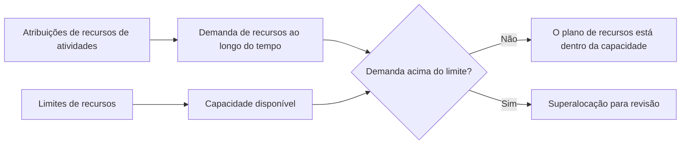

Os limites de recursos no Primavera P6 definem quanto de um recurso está disponível durante um período de tempo. Eles são usados ​​para comparar a demanda de recursos criada pelas atribuições de atividades com a capacidade que o projeto realmente possui.

Em termos simples, um limite de recursos responde à questão: quanto deste recurso o projeto pode utilizar?

Se um cronograma diz que uma equipe deve trabalhar em cinco atividades ao mesmo tempo, o P6 pode mostrar a demanda. Mas sem um limite de recursos, o calendário não pode mostrar claramente se essa procura é realista. O limite é o que permite ao planejador ver sobrecargas, problemas de capacidade e possíveis problemas de cronograma baseados em recursos.

## O que são limites de recursos

Um limite de recursos é a disponibilidade máxima de um recurso. Pode ser definido como unidades por período de tempo, como horas por dia, horas por semana ou número de unidades disponíveis durante um período de trabalho.

Por exemplo:

- Um planejador disponível 8 horas por dia.
- Três eletricistas disponíveis 24 horas por dia.
- Um guindaste disponível 8 horas de equipamento por dia.
- Dois inspetores disponíveis 16 horas de trabalho por dia.

Quando as atividades são carregadas com recursos, o P6 calcula a demanda de recursos criada por essas atribuições. O limite de recursos fornece a linha de capacidade com a qual a demanda é comparada.

## Por que os limites de recursos são importantes

Os limites de recursos são importantes porque os cronogramas são muitas vezes tecnicamente possíveis, mas praticamente impossíveis.

Uma rede lógica pode calcular que diversas atividades podem acontecer em paralelo. As datas podem parecer aceitáveis. O caminho crítico pode parecer razoável. Mas se todas essas atividades exigirem a mesma tripulação, especialistas ou equipamentos limitados, o plano poderá não ser executável.

Os limites de recursos ajudam a expor a diferença entre um cronograma calculado e um cronograma de entrega.

Eles são úteis para:

- Identificação de equipes de trabalho sobrecarregadas.
- Verificação da demanda de equipamentos.
- Histogramas de recursos de suporte.
- Revisão de planos de mão de obra.
- Preparando o nivelamento de recursos.
- Explicando por que alguns trabalhos não podem ser iniciados mesmo que a lógica permita.
- Testar se o plano corresponde à capacidade disponível.

Nos controles do projeto, isso é especialmente valioso quando o cronograma é usado para contratação de pessoal, apoio a aquisições, planejamento de construção ou relatório de valor agregado.

## Limites de recursos trabalhistas

Os limites de mão de obra definem quantas pessoas ou horas de trabalho estão disponíveis.

Por exemplo, se o projeto tiver 10 eletricistas trabalhando 8 horas por dia, o limite diário de mão de obra poderá ser de 80 horas por dia. Se a demanda do cronograma mostrar 120 horas de eletricista no mesmo dia, o cronograma está solicitando mais eletricistas do que o projeto possui.

Isso não significa automaticamente que o cronograma esteja errado. Isso significa que o planejador deve revisar o plano. A solução pode ser adicionar equipes, alterar a sequência, transferir trabalhos não críticos, usar horas extras ou aceitar um pico temporário se for realista e aprovado.

Os limites de recursos de mão-de-obra são úteis quando a disponibilidade de mão-de-obra é uma restrição real. Eles são menos úteis quando o cronograma não é mantido no nível de detalhe necessário para dar suporte ao controle de recursos.

## Limites de recursos não trabalhistas

Limites não trabalhistas se aplicam a equipamentos e outros ativos reutilizáveis.

Os exemplos incluem guindastes, escavadeiras, equipamentos de teste, ferramentas especializadas, geradores ou instalações temporárias. Se apenas um guindaste estiver disponível, as atividades que exigem o mesmo guindaste não poderão ser realizadas ao mesmo tempo, a menos que outro guindaste seja adicionado ou o trabalho seja sequenciado novamente.

É aqui que os limites de recursos podem ser muito práticos. O equipamento é muitas vezes um verdadeiro constrangimento, especialmente quando é caro, partilhado entre áreas, difícil de mobilizar ou necessário para trabalhos críticos.

Por exemplo, dois trabalhos pesados ​​podem estar ambos lógicamente prontos. Mas se ambos precisarem do mesmo guindaste, o limite de recursos pode mostrar que o plano excede a capacidade disponível.

## Recursos e Limites Materiais

Os recursos materiais comportam-se de forma diferente dos recursos laborais e não laborais. Geralmente representam quantidades e não disponibilidade diária de tempo de trabalho.

Uma atribuição de material pode mostrar o volume planejado de concreto, o comprimento do cabo, a tonelagem de aço ou a quantidade instalada. O projeto ainda pode ter restrições materiais, mas estas são muitas vezes geridas através de datas de aquisição, marcos de entrega, acompanhamento de inventário ou restrições no cronograma, em vez de através do mesmo tipo de limite diário de disponibilidade de recursos usado para pessoas ou equipamentos.

Isso não significa que os materiais não sejam importantes. Isso significa que o planejador deve ter cuidado com o que o limite deve representar.

Se a questão for a capacidade de produção, como o máximo de metros cúbicos de concreto que podem ser colocados por dia, um recurso ou modelo de produção pode ser útil. Se a questão for saber se o material chegou, os vínculos lógicos ou os marcos da aquisição podem ser mais claros.

## Como P6 usa limites

O P6 pode usar limites de recursos em perfis de recursos, planilhas, histogramas e análises de recursos. A demanda das atribuições de atividades pode ser mostrada em relação ao limite disponível.

Quando o nivelamento de recursos é utilizado, o P6 também pode utilizar a disponibilidade de recursos para atrasar atividades, de modo que a demanda permaneça dentro dos limites, dependendo das configurações de nivelamento.

Isso é poderoso, mas deve ser tratado com cuidado. O nivelamento de recursos pode alterar as datas previstas. Se os limites, calendários, prioridades e lógica de atividade não forem bem mantidos, o resultado nivelado poderá parecer matemático, mas não prático.

Os limites de recursos devem, portanto, fazer parte de um processo de programação controlado e não um botão pressionado no final de uma atualização.

## Quando usar limites de recursos

Use limites de recursos quando os recursos forem realmente limitados e o cronograma tiver recursos carregados com qualidade suficiente para apoiar a análise.

Bons casos de uso incluem:

- Um projeto com um número fixo de equipes.
- Guindastes compartilhados ou equipamentos especializados.
- Especialistas limitados em engenharia ou comissionamento.
- Desligamentos, paradas e interrupções.
- Planos de construção onde os picos de mão de obra devem ser controlados.
- Programas onde o mesmo pool de recursos dá suporte a vários projetos.

Os limites de recursos também são úteis durante a análise hipotética. O planejador pode testar se o plano atual funciona com a capacidade disponível ou se são necessárias equipes adicionais, horas extras ou novo sequenciamento.

## Quando ter cuidado

Tenha cuidado quando os dados do recurso estiverem incompletos ou simbólicos.

Se os recursos foram adicionados apenas para carregamento de custos, as unidades podem não representar disponibilidade real. Se todo o trabalho for atribuído a recursos genéricos, o histograma poderá ser demasiado amplo para apoiar decisões reais. Se as unidades reais não forem atualizadas, o plano de recursos pode rapidamente afastar-se da realidade.

Tenha cuidado também com limites artificiais. Um limite muito baixo pode criar atrasos desnecessários durante o nivelamento. Um limite demasiado elevado pode ocultar problemas reais de capacidade.

O limite deve corresponder à verdadeira questão do planejamento. Estamos testando a disponibilidade real da tripulação, o pessoal orçado, o acesso aos equipamentos ou uma meta de gerenciamento? Cada um pode exigir uma configuração diferente.

## Erros Comuns

Um erro comum é estabelecer limites de recursos sem chegar a acordo sobre o que eles representam. Um recurso pode mostrar 80 horas por dia, mas será a tripulação atual, a tripulação máxima, a tripulação orçada ou a tripulação prometida pelo contratante?

Outro erro é usar resultados de nivelamento sem revisá-los. P6 pode mover atividades com base em regras de recursos, mas o planejador ainda deve verificar se o resultado faz sentido na construção.

Outro problema é ignorar calendários. Um limite de recursos está vinculado à disponibilidade e a disponibilidade depende do tempo de trabalho. Se o calendário de recursos não corresponder ao padrão de trabalho real, o limite poderá produzir sobrecargas enganosas ou falsa disponibilidade.

Também é comum sobrecarregar recursos e aceitar o histograma como se fosse apenas um relatório. Uma sobrecarga é um sinal de planejamento. Deve desencadear uma revisão e não simplesmente ser ignorado.

## Boas Práticas

Comece com os recursos mais importantes. Nem todo recurso precisa de um limite detalhado. Concentre-se em equipes críticas, equipamentos escassos, especialistas importantes e recursos que afetam a conclusão do projeto ou marcos importantes.

Defina se o limite representa a capacidade normal, a capacidade máxima ou a capacidade de pico aprovada. Mantenha essa definição consistente.

Revise os perfis de recursos durante as atualizações do cronograma. Se a previsão mudar, a procura de recursos também muda. Os limites devem ser revisados ​​juntamente com a lógica, os calendários, as durações restantes e o progresso.

Use o nivelamento de recursos com cuidado e documente as configurações. Compare o resultado nivelado com o cronograma desnivelado para que a equipe entenda o que mudou e por quê.

Mais importante ainda, valide o resultado com as pessoas que executam o trabalho. Um histograma só é útil se refletir um plano de recursos real.

## Conclusão

Os limites de recursos em P6 definem a capacidade disponível. Eles permitem que a equipe do projeto compare o que o cronograma exige com o que o projeto pode fornecer de forma realista.

Bem utilizados, os limites de recursos ajudam a identificar sobrecargas, apoiar o planejamento de mão de obra, controlar a demanda de equipamentos e melhorar o realismo do cronograma. Se mal utilizados, podem criar histogramas enganosos ou resultados de nivelamento artificiais.

Os melhores limites de recursos são simples, intencionais e ligados a decisões reais de projetos. Eles ajudam a responder a uma questão prática: o projeto pode executar este plano com os recursos de que realmente dispõe?
## Conteúdo relacionado
- [Atividades iniciadas com 0% de progresso no Primavera P6 - Visão geral](../../metrics/13_activity_started_progress_zero/02_guide_template.md)
- [Tipos de recursos em P6](../12_RESOURCE%20TYPES%20IN%20P6/12_RESOURCE%20TYPES%20IN%20P6.md)
- [Balanceamento de recursos no P6](../14_RESOURCES%20BALANCING%20IN%20P6/14_RESOURCES%20BALANCING%20IN%20P6.md)
