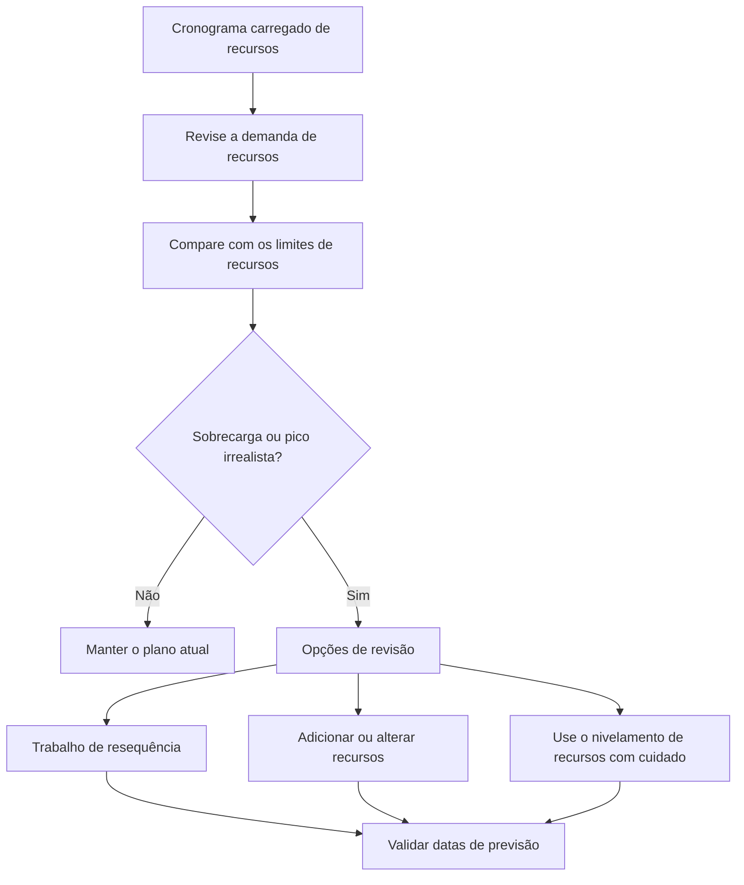

# Balanceamento de recursos no P6

O balanceamento de recursos no Primavera P6 é o processo de analisar a demanda de recursos em relação à capacidade disponível e ajustar o plano para que o trabalho possa ser executado com os recursos disponíveis. Ajuda a equipe do projeto a entender se o cronograma é apenas lógicamente correto ou também prático do ponto de vista dos recursos.

Na programação diária, as pessoas costumam usar as palavras equilíbrio de recursos e nivelamento de recursos como se significassem a mesma coisa. Eles estão relacionados, mas não são exatamente iguais.

O equilíbrio de recursos é a revisão mais ampla do planejamento. Inclui a análise de histogramas, perfis de recursos, disponibilidade da tripulação, demanda de equipamentos, picos de mão de obra e o realismo do plano.

O nivelamento de recursos é um recurso P6 que pode mover atividades com base na disponibilidade de recursos e nas configurações de nivelamento.

O recurso pode ser útil, mas deve ser usado com controle. P6 pode calcular um resultado nivelado, mas o planejador deve decidir se esse resultado faz sentido para o projeto.

## O que é balanceamento de recursos

O balanceamento de recursos levanta uma questão prática: o projeto pode executar esse cronograma com os recursos que realmente possui?

Um cronograma pode ter boa lógica, datas aceitáveis ​​e um caminho crítico razoável. Mas se for necessário que a mesma equipa ou equipamento limitado trabalhe em muitos locais ao mesmo tempo, o plano pode não ser realista.

Equilibrar os recursos significa rever essa procura e decidir como geri-la.

As ações possíveis incluem:

- Movendo trabalho não crítico.
- Adicionando recursos.
- Dividir o trabalho em diferentes equipes ou áreas.
- Alterando o sequenciamento de atividades.
- Usando horas extras ou trabalho por turnos.
- Ajustando calendários.
- Atualizando limites de recursos.
- Aceitar um pico temporário se for realista e aprovado.

O objetivo não é tornar o histograma perfeitamente plano. Projetos reais têm altos e baixos. O objetivo é garantir que a demanda de recursos seja compreendida, alcançável e alinhada com o plano de execução.

## Por que é importante

O equilíbrio de recursos é importante porque o cronograma deve apoiar a execução, não apenas o cálculo.

Se o plano exigir 50 soldadores na próxima semana, mas o empreiteiro só puder fornecer 30, o cronograma mostra uma demanda que não pode ser atendida. Se duas atividades críticas exigirem o mesmo guindaste ao mesmo tempo, pelo menos uma delas poderá ter que ser movida. Se todas as atividades de revisão de engenharia exigirem o mesmo especialista, o gargalo poderá aparecer antes mesmo do início da construção.

Sem equilíbrio de recursos, o projecto pode acreditar que tem mais capacidade do que realmente tem.

Isso pode afetar:

- Planejamento antecipado de curto prazo.
- Previsões de mão de obra.
- Planejamento de equipamentos.
- Credibilidade do caminho crítico.
- Previsões de valor ganho.
- Curvas de custo e fluxo de caixa.
- Compromissos de progresso.
- Planos de recuperação.

O balanceamento de recursos ajuda a conectar o cronograma de CPM com a capacidade real de campo e escritório.

## Balanceamento de recursos versus nivelamento de recursos

O equilíbrio de recursos é uma atividade de gerenciamento e planejamento.

O nivelamento de recursos é um cálculo de agendamento.

Essa distinção é importante. Um planejador pode equilibrar os recursos manualmente revisando histogramas e ajustando o cronograma com base no conhecimento do projeto. O nivelamento de recursos P6 também pode ajudar, atrasando automaticamente as atividades quando a demanda de recursos excede a disponibilidade.

Ambas as abordagens podem ser úteis.

O balanceamento manual é melhor quando o planejador precisa de julgamento, informações de campo, revisão de construtibilidade ou controle cuidadoso sobre quais atividades se movem.

O nivelamento de recursos P6 é útil quando os dados dos recursos são confiáveis, os limites de recursos estão definidos, os calendários estão corretos e o agendador deseja testar como o cronograma muda quando a disponibilidade dos recursos é imposta.

O nivelamento não deve substituir o julgamento do planeamento. Deveria apoiá-lo.

## O que o P6 precisa antes de nivelar

Antes de usar o recurso de nivelamento de recursos P6, o cronograma deve estar pronto para análise de recursos.

No mínimo, verifique:

- As atividades têm atribuições de recursos significativas.
- As unidades de recursos reflectem a procura real.
- Os limites de recursos refletem a disponibilidade real.
- Os calendários de recursos estão corretos.
- Os calendários de atividades estão corretos.
- A lógica é completa o suficiente para apoiar decisões de agendamento.
- As restrições são compreendidas.
- As prioridades são definidas ou revisadas.
- A programação atual foi salva para que o resultado nivelado possa ser comparado.

Se esses itens forem fracos, o nivelamento poderá produzir um resultado que parece preciso, mas não é útil.

Por exemplo, se todo o trabalho de construção for atribuído a um recurso genérico de “equipe de construção”, P6 poderá mostrar uma sobrecarga de recursos, mas o resultado poderá não informar ao projeto se o problema é civil, de tubulação, elétrico ou mecânico. A configuração do recurso deve corresponder à decisão de planejamento.

## Como o P6 usa o nivelamento de recursos

O nivelamento de recursos P6 analisa as atribuições e a disponibilidade de recursos. Dependendo das configurações, isso pode atrasar atividades para reduzir ou remover a superalocação de recursos.

O cálculo pode considerar limites de recursos, lógica de atividades, folga, calendários, prioridades e opções de nivelamento. O resultado exato depende de como o projeto está configurado.

Em termos práticos, o P6 procura situações em que a procura de recursos é superior à disponibilidade e depois tenta mover as atividades para datas em que os recursos estão disponíveis.

Isto pode criar um cronograma mais viável em termos de recursos, mas também pode alterar o caminho crítico, atrasar marcos ou mover o trabalho de maneiras que precisam de revisão.

Após o nivelamento, o agendador deve comparar o resultado com a previsão original:

- Quais atividades foram movidas?
- Quais marcos mudaram?
- O caminho crítico mudou?
- O nivelamento utilizou folga disponível ou atrasou o término do projeto?
- As novas datas são construtíveis?
- O resultado resolveu o problema de recursos ou criou outro?

O cronograma nivelado não deve ser aceito cegamente.

## Quando usar o balanceamento de recursos

Use o balanceamento de recursos sempre que a disponibilidade de recursos afetar a execução.

É especialmente útil em:

- Cronogramas de construção com limitações de tripulação.
- Desligamentos, paradas e interrupções.
- Planos de comissionamento com especialistas limitados.
- Cronogramas de engenharia com revisores compartilhados.
- Projetos com equipamentos caros ou compartilhados.
- Programas em que um pool de recursos oferece suporte a vários projetos.
- Planos de recuperação onde recursos adicionais estão sendo considerados.

O equilíbrio de recursos também é útil antes da aprovação da linha de base. Uma linha de base que pressupõe disponibilidade irreal de mão de obra ou equipamento pode tornar-se difícil de defender posteriormente.

Durante as atualizações, o balanceamento de recursos ajuda a confirmar se o trabalho restante ainda pode ser entregue com a equipe e os equipamentos atuais.

## Quando ter cuidado

Tenha cuidado quando os dados do recurso não forem mantidos.

Se as unidades reais não forem atualizadas, as curvas de recursos podem afastar-se da realidade. Se os recursos forem atribuídos apenas para carregamento de custos, as unidades podem não representar a capacidade real. Se os calendários estiverem errados, a disponibilidade de recursos também pode estar errada.

Tenha também cuidado ao usar o nivelamento de recursos em um cronograma contratual ou de linha de base. O nivelamento pode mover datas e afetar a folga. A equipe deve entender se o cronograma nivelado é o plano oficial, um cenário hipotético ou uma visão de planejamento interno.

O nivelamento também pode ocultar fraquezas lógicas. Se uma atividade for movida devido ao nivelamento, os revisores poderão não perceber que a lógica original estava incompleta ou incorreta. Sempre revise primeiro a lógica e depois os recursos.

## Como usá-lo na prática

Comece identificando os recursos mais importantes. Não tente equilibrar todos os recursos menores com o mesmo nível de detalhe. Concentre-se nas equipes principais, nos especialistas críticos, nos equipamentos compartilhados e nos recursos que podem afetar os marcos.

Em seguida, revise o perfil de recursos ou histograma em P6. Procure picos, sobrecargas, lacunas e mudanças repentinas na demanda.

Compare a demanda com os limites de recursos. Caso a demanda ultrapasse o limite, discuta o assunto com a equipe responsável. A resposta pode ser operacional e não apenas de agendamento.

A seguir, decida o método de correção:

- Se o limite de recursos estiver errado, atualize o limite de recursos.
- Se a demanda de recursos estiver errada, corrija a atribuição.
- Se a sequência não for realista, ajuste a lógica ou o tempo da atividade.
- Se a sobrecarga for real, decida se deseja adicionar recursos, fazer horas extras, transferir trabalho ou aceitar o pico.
- Se o nivelamento automatizado for apropriado, execute-o como um cenário controlado e compare o resultado.

Mantenha uma cópia do cronograma desnivelado antes de executar o nivelamento de recursos. Isso dá à equipe um ponto de referência e ajuda a explicar o que mudou.

## Boas Práticas

Use o balanceamento de recursos como parte da revisão do cronograma e não como um exercício de limpeza único.

Revise as curvas de recursos durante o desenvolvimento da linha de base, grandes reprevisões, planejamento de recuperação e ciclos regulares de atualização.

Não nivele um cronograma de baixa qualidade e espere que o resultado seja confiável. Primeiro corrija a lógica, os calendários, o status da atividade, as durações restantes e as atribuições de recursos.

Configurações de nivelamento de documento quando o recurso P6 é usado. O nivelamento de recursos pode produzir resultados diferentes dependendo das opções selecionadas, portanto as configurações fazem parte do registro do cronograma.

Mais importante ainda, valide o plano de recursos com as pessoas que possuem o trabalho. A equipa do projecto deve confirmar se os picos de recursos são alcançáveis, se a sequência é prática e se recursos adicionais estão realmente disponíveis.

## Conclusão

O balanceamento de recursos no P6 ajuda a equipe do projeto a testar se o cronograma pode ser executado com os recursos disponíveis. Ele conecta datas e lógica com mão de obra, equipamentos, disponibilidade de especialistas e capacidade real de produção.

O nivelamento de recursos P6 pode apoiar esta revisão, deslocando atividades com base na disponibilidade de recursos, mas deve ser utilizado com cuidado e revisto após o cálculo.

Um cronograma equilibrado não é necessariamente um cronograma perfeitamente tranquilo. É um cronograma onde a demanda de recursos é visível, realista e alinhada com a forma como o projeto será realmente entregue.
## Conteúdo relacionado
- [Atividades iniciadas com 0% de progresso no Primavera P6 - Visão geral](../../metrics/13_activity_started_progress_zero/02_guide_template.md)
- [Limites de recursos em P6](../13_RESOURCES%20LIMITS%20IN%20P6/13_RESOURCES%20LIMITS%20IN%20P6.md)
- [Relacoes SS e FF](../15_SS%20&%20FF%20RELATIONS/15_SS%20&%20FF%20RELATIONS.md)
