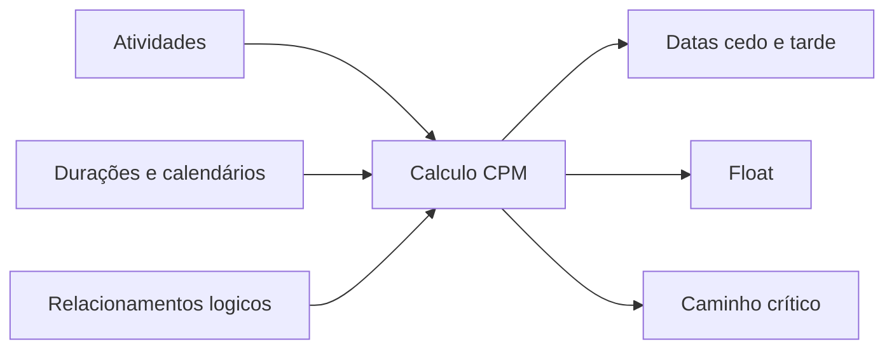

# CPM (Critical Path Method)

O Critical Path Method, ou CPM, é o método de cálculo por trás de um cronograma sério de projeto. Ele transforma uma lista de atividades em um modelo guiado por lógica que responde perguntas essenciais: quando o projeto pode terminar, quais atividades controlam essa data e onde existe flexibilidade no cronograma.

No Primavera P6, o CPM muitas vezes fica escondido atrás do botão de programação. O software calcula datas, folga e atividades críticas rapidamente. Mas o método continua importante. Se o planejador não entende CPM, o cronograma pode calcular, mas o resultado pode não significar o que a equipe pensa.

## O Que o CPM Faz

O CPM calcula a duração do projeto a partir de uma rede de atividades, durações, calendários e relacionamentos.

A ideia central é simples: a duração do projeto não é a soma de todas as atividades. É a duração do caminho conectado mais longo de trabalho dependente dentro da rede. Esse caminho é o caminho crítico.

Se uma atividade nesse caminho atrasa, a data final do projeto atrasa, a menos que a equipe recupere tempo no mesmo caminho.

## Entradas Necessarias

O CPM depende da qualidade da rede do cronograma.

Primeiro, o cronograma precisa de atividades que representem partes claras do trabalho. Cada atividade deve ter escopo definido, duração razoável e critério claro de conclusão.

Segundo, cada atividade precisa de uma duração. Na maioria dos cronogramas P6, esta é uma estimativa determinística baseada em produtividade, recursos, calendários e premissas de execução.

Terceiro, as atividades precisam de lógica. Os relacionamentos definem o que deve acontecer antes, o que pode ocorrer em paralelo e quais condições permitem que um sucessor comece ou termine.

O CPM não sabe se a lógica é boa. Ele calcula com a lógica que recebe. Se a rede tem lógica faltante, restrições fracas, lag excessivo ou relacoes SS/FF incompletas, o resultado pode ser matematicamente correto, mas pouco confiável na prática.

## Forward Pass e Backward Pass

O CPM calcula o cronograma em duas passagens principais.

O forward pass vai da Data Date até o fim do projeto. Ele calcula as datas mais cedo em que cada atividade pode iniciar e terminar, considerando lógica, durações, calendários e restrições.

Essas datas são início antecipado e término antecipado.

O backward pass vai do fim do projeto de volta ao início. Ele calcula as datas mais tarde em que cada atividade pode iniciar e terminar sem atrasar a conclusão do projeto ou o alvo selecionado.

Essas datas são início tardio e término tardio.

Com datas cedo e tarde, o P6 calcula a folga.

## Float

A folga é o tempo que uma atividade pode se mover antes de afetar um objetivo definido do cronograma.

A folga total costuma ser o valor principal revisado no P6. Ele mostra quanto uma atividade pode atrasar antes de afetar a conclusão do projeto ou o caminho controlador.

A folga livre é mais local. Mostra quanto uma atividade pode atrasar antes de afetar o início antecipado do sucessor imediato.

A folga não é tempo livre para consumir sem cuidado. É flexibilidade do cronograma. Quando a folga é consumida, o projeto tem menos protecao contra atrasos futuros.

## Critical Path

O caminho crítico é o caminho conectado mais longo de atividades dependentes que controla a conclusão do projeto. Em muitos cronogramas, atividades críticas são identificadas por folga total zero ou negativa, mas a melhor revisão é entender o caminho mais longo e confirmar se ele faz sentido.

Um bom caminho crítico deve contar uma história de execução crível. Deve passar por atividades que realmente controlam a conclusão: liberações de engenharia, suprimentos, sequências de construção, testes, comissionamento, entrega ou outros direcionadores reais.

Se o caminho crítico passa por marcos estranhos, restrições desnecessárias, lógica faltante ou atividades que não controlam a conclusão, o cronograma pode estar enviando um sinal falso.

## Trabalho Near-Critical

A equipe não deve olhar apenas para atividades com folga zero.

Atividades quase críticas possuem pouca folga e podem se tornar críticas com um atraso moderado. O limite depende do tamanho e sensibilidade do projeto. Em projetos grandes, atividades com menos de 10 ou 20 dias úteis de folga podem merecer acompanhamento próximo.

Caminhos quase críticos importam porque o risco raramente fica em uma única linha. Um cronograma pode ter vários caminhos perto de se tornarem críticos, especialmente em construção densa, comissionamento ou paradas.

## CPM e Análise de Risco

O CPM entrega uma resposta determinística: se cada atividade levar a duração planejada, esta é a data de término do projeto.

A análise de risco do cronograma vai além. Ela testa a incerteza aplicando faixas ou distribuições probabilísticas às durações e executando muitas simulações. Isso ajuda a estimar a probabilidade de terminar em uma data alvo.

Mas a análise de risco depende da rede CPM. Se a lógica é fraca, a saída de risco também será fraca. Monte Carlo não corrige lógica faltante, durações irreais ou estrutura ruim.

## CPM no Primavera P6

O P6 torna o cálculo CPM rápido, mas essa velocidade pode esconder as premissas.

Ao calcular o cronograma, o P6 usa Data Date, calendários, durações, relacionamentos, restrições, dados reais, durações restantes e opções de programação. Pequenas mudanças nessas configurações podem alterar a folga, o caminho crítico e datas previstas.

Por isso o planejador não deve apenas pressionar F9 e aceitar o resultado. Deve revisar o que foi calculado e questionar se combina com o plano real de execução.

## Boas Praticas

Construa a rede CPM a partir da lógica real de execução. Evite adicionar relacionamentos apenas para passar em uma verificação ou produzir uma data desejada.

Revise o caminho crítico após cada atualização. Confirme que ele começa e termina de forma coerente com o status atual do projeto.

Acompanhe o movimento da folga ao longo do tempo. Um projeto pode parecer dentro do plano enquanto consome folga silenciosamente.

Revise caminhos quase críticos. Eles frequentemente indicam onde surgirá o próximo problema de cronograma.

Mantenha o cronograma limpo o suficiente para suportar CPM. Inícios abertos, términos abertos, restrições rígidas, defasagem excessiva e relações incompletas reduzem o valor do cálculo.

## Conclusao

O CPM é o motor que transforma um cronograma Primavera P6 em uma ferramenta de controle de projeto. Ele calcula datas cedo, datas tardias, folga e caminho crítico a partir da rede de atividades.

Mas o CPM é tão confiável quanto o cronograma que calcula. Boas atividades, durações realistas, calendários corretos e lógica forte tornam o resultado significativo.

O valor do CPM não é apenas mostrar uma data final. Seu valor real é explicar por que essa data está controlada, onde existe flexibilidade e onde a atenção da gestão deve se concentrar.
## Conteúdo relacionado
- [Caminho crítico ou caminho de folga começando com uma restrição - Visão geral](../../metrics/09_cp_or_float_path_starting_with_constraint/02_guide_template.md)
- [Relações SS e FF](../15_SS%20&%20FF%20RELATIONS/15_SS%20&%20FF%20RELATIONS.md)
- [Desenvolver um Cronograma de Projeto](../17_DEVELOPE%20A%20PROJECT%20SCHEDULE/17_DEVELOPE%20A%20PROJECT%20SCHEDULE.md)
