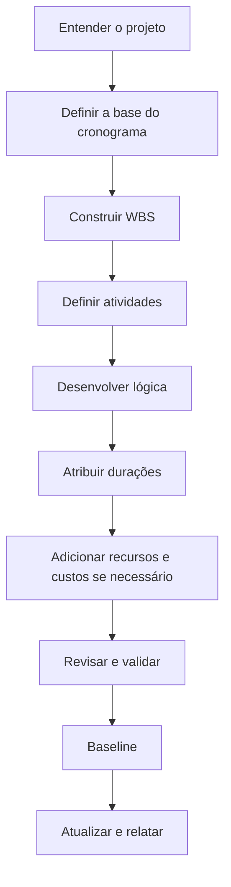

Desenvolver um cronograma de projeto do zero não é apenas inserir atividades no Primavera P6. É transformar escopo, estratégia de execução, restrições, recursos e compromissos do projeto em um modelo de tempo que possa ser revisado, aprovado, atualizado e usado para decisões.

Um bom cronograma é construído antes de ser calculado. A qualidade do arquivo P6 depende do pensamento feito antes da primeira atividade ser inserida.

## Fluxo de Desenvolvimento

## Entenda o Projeto Primeiro

Não comece no P6 antes de entender o projeto.

Revise contrato, escopo, especificações, marcos principais, estratégia de execução, restrições de suprimentos, licenças, acessos e requisitos de entrega. Depois converse com gerenciamento do projeto, engenharia, suprimentos, construção, comissionamento, subcontratados e fornecedores quando aplicável.

O cronograma é um modelo de como a equipe pretende entregar o projeto. Se o planejador não entende essa intenção, o cronograma será construído sobre premissas.

## Defina a Base do Cronograma

A base do cronograma explica como o cronograma será construído. Deve definir WBS, calendários, códigos, nível de detalhe, regras de relações, política de defasagem, configurações do P6, convenção de Data Date, requisitos de relatórios e abordagem de baseline.

Esse documento é importante porque explica por que o cronograma foi construído dessa forma. Também dá referência para revisões de qualidade e comparações futuras.

## Construa a WBS

A Work Breakdown Structure é a estrutura organizacional do cronograma. Ela deve refletir como o projeto será gerenciado e reportado.

A WBS pode ser organizada por fase, área, sistema, disciplina, entregável, pacote contratual ou combinação. Deve apoiar filtros, medição de progresso, responsabilidades e relatórios.

Se a WBS não combina com a forma de controlar o projeto, o cronograma será difícil de usar mesmo que as atividades estejam corretas.

## Defina as Atividades

As atividades devem representar partes claras e mensuráveis do trabalho. Cada atividade deve ter escopo definido, condição clara de início, condição clara de término e um responsável.

Atividades grandes demais são difíceis de atualizar. Atividades pequenas demais tornam o cronograma caro de manter. O nível correto depende da fase, contrato, relatórios e expectativas de controle.

Nomes de atividades importam. Um bom nome deve dizer que trabalho será feito, onde será feito e a qual objeto, sistema ou entregável ele se relaciona.

## Desenvolva a Logica

A lógica é o coração do cronograma CPM. Ela define o que deve acontecer antes, o que pode ocorrer em paralelo e que condição permite cada atividade iniciar ou terminar.

A lógica deve ser desenvolvida com quem entende o trabalho. No P6, evite construir a sequência apenas da mesa. Revise com líderes de disciplina, construção, comissionamento, suprimentos e subcontratados.

Use FS quando representar melhor o trabalho. Use SS e FF com cuidado quando a sobreposição for real. Evite defasagem negativa e evite SF salvo razão clara e aprovada. Cada atividade normalmente deve ter predecessor e sucessor, exceto marcos válidos de início e fim.

## Atribua Durações

Durações devem ser realistas, não aspiracionais. Devem ser baseadas em escopo, produtividade, recursos, calendários, contribuições de fornecedores, subcontratados e experiência comparável.

Uma duração não é apenas um número. Ela assume uma equipe, taxa de produção, calendário, condição de acesso e método de execução. Se essas premissas mudam, a duração pode precisar mudar.

Documente premissas importantes de duração. Isso ajuda em revisões, atualizações, gestão de mudanças e análise de atrasos.

## Adicione Recursos e Custos Quando Necessário

Se o cronograma será usado para planejamento de recursos, carregamento de custos, valor agregado ou fluxo de caixa, recursos e custos devem ser adicionados com cuidado.

O carregamento de recursos ajuda a ver demanda de mão de obra, equipamentos, materiais e possíveis sobrecargas. O carregamento de custos conecta o cronograma a orçamentos, previsões e curvas de pagamento ou progresso.

Nao adicione recursos apenas por aparência. Se o projeto depender desses dados, eles devem ser mantidos nas atualizações.

## Revise e Valide

Antes da aprovação da baseline, o cronograma deve ser revisado tecnicamente e operacionalmente.

Rode controles de qualidade para inícios abertos, términos abertos, tipos de relação, defasagens, restrições, durações longas, lógica faltante, distribuição da folga e razoabilidade do caminho crítico. Verificações do tipo DCMA ajudam, mas precisam de julgamento do projeto.

Percorra o cronograma com a equipe. Pergunte se lógica, durações, recursos e marcos refletem o plano real. Um cronograma que passa em métricas mas falha na revisão de campo não está pronto.

## Baseline do Cronograma

Depois de revisado e aprovado, o cronograma vira baseline. A linha de base é a referência para medir progresso, variação, atraso, recuperação e desempenho.

O estabelecimento da linha de base deve ser formal. Salve a versão aprovada, proteja contra mudanças não controladas e documente aprovações. Mudanças posteriores devem seguir controle de mudanças.

Uma baseline que muda sempre que o projeto atrasa não é baseline. É um alvo móvel.

## Estabeleça o Ciclo de Atualização

O cronograma só continua útil se for atualizado consistentemente.

Defina quem fornece progresso, quando os dados são coletados, que evidência é necessária, como datas reais são verificadas, como durações restantes são revisadas e quais relatórios serão emitidos. Construção e comissionamento ativos podem exigir atualizações semanais ou quinzenais. Fases iniciais podem ser mensais.

O ciclo de atualização transforma a baseline de documento estático em ferramenta viva de controle.

## Conclusão

Desenvolver um cronograma é um processo estruturado. Entenda o projeto, defina a base, construa a WBS, crie atividades, desenvolva lógica, atribua durações, carregue recursos quando necessário, valide, estabeleça a linha de base e mantenha com atualizações.

Os melhores cronogramas não nascem de abrir o P6 rapidamente. Eles nascem de entender o trabalho, desafiar premissas e criar um modelo em que a equipe possa confiar.
## Conteúdo relacionado
- [Atividades começando na data dos dados sem nenhuma lógica direcionadora: por que essa métrica de cronograma é importante - Visão geral](../../metrics/01_activities_starting_in_dd_with_no_logic_driving/02_guide_template.md)
- [CPM (Critical Path Method)](../16_CPM%20(CRITICAL%20PATH%20METHOD)/16_CPM%20(CRITICAL%20PATH%20METHOD).md)
- [códigos de atividade](../18_ACTIVITY%20CODES/18_ACTIVITY%20CODES.md)
