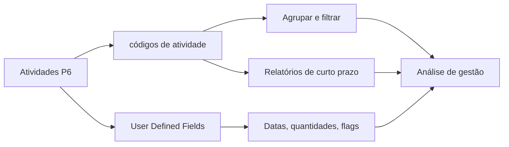

# Códigos de Atividade

Códigos de atividade no Primavera P6 são uma das principais ferramentas para transformar um cronograma de uma lista de atividades em uma base de dados útil para controles do projeto. Eles permitem agrupar, filtrar, ordenar, reportar e analisar o cronograma por diferentes perspectivas de gestão.

Um cronograma não é apenas um bar chart. No P6, cada atividade também é um registro que pode carregar informações sobre responsável, fase, área, sistema, disciplina, contrato, tipo de marco e outros atributos do projeto. Códigos de atividade ajudam a organizar essas informações de forma controlada.

## O Que São códigos de atividade

Códigos de atividade são campos estruturados de classificação atribuídos às atividades. Cada tipo de código representa uma dimensão de relatório, e cada valor de código representa uma opção dentro dessa dimensão.

Por exemplo:

- Tipo de código: Area.
- Valores de código: Unit 1, Unit 2, Tank Farm, Utilities.

Ou:

- Tipo de código: Discipline.
- Valores de código: Civil, Mechanical, Electrical, Instrumentation, Comissionamento.

A WBS mostra onde o trabalho fica na estrutura do projeto. Códigos de atividade mostram como o trabalho pode ser visto para relatórios e análise.

## O Que Não São

códigos de atividade não substituem a WBS. A WBS é a hierarquia de escopo. Códigos são vistas adicionais das mesmas atividades.

códigos de atividade não substituem a lógica. A lógica define a sequência do trabalho.

códigos de atividade não substituem recursos. Recursos definem mão de obra, equipamentos, materiais e carregamento de custos.

Quando esses conceitos se misturam, o cronograma fica mais difícil de manter. Um cronograma P6 limpo usa WBS, lógica, recursos, códigos de atividade e UDFs para propósitos diferentes.

## Códigos de atividade globais e de projeto

O P6 possui Códigos de atividade globais e Códigos de atividade de projeto.

Códigos de atividade globais são compartilhados entre projetos. São úteis quando a mesma classificação deve ser usada em um portfólio, como fases padrão, grupos corporativos de responsabilidade ou categorias de relatórios de programa.

Códigos de atividade de projeto pertencem a um projeto específico. São úteis para necessidades próprias do projeto, como áreas, sistemas, pacotes contratuais, frentes de trabalho, pacotes de entrega ou categorias locais de relatórios.

Use códigos globais com cuidado porque mudanças podem afetar outros projetos. Use códigos de projeto para atributos que só fazem sentido dentro de um projeto.

## Tipos Comuns de códigos de atividade

Tipo de códigos úteis dependem do projeto, mas exemplos comuns incluem:

- Responsável.
- Discipline.
- Fase do projeto.
- Área ou local.
- Sistema ou subsistema.
- Pacote contratual.
- Pacote de trabalho.
- Tipo de marco.
- Pacote de entrega.
- Nível de relatório.

Os melhores tipo de códigos nascem das necessidades de relatórios. Antes de criar códigos, pergunte: que perguntas o cronograma precisa responder?

Exemplos:

- Que trabalho está planejado na Area A no próximo mês?
- Quais atividades pertencem ao contratante elétrico?
- Quais sistemas estão direcionando o comissionamento?
- Qual pacote contratual está atrasando?
- Quais marcos devem ser reportados ao cliente?

## User Defined Fields

User Defined Fields, ou UDFs, são diferentes de códigos de atividade. Códigos classificam atividades em categorias. UDFs armazenam dados personalizados como datas, números, texto, custos, quantidades ou indicadores sim/não.

Use UDFs quando a informação não for simplesmente uma categoria.

Exemplos:

- Contractual finish date.
- Forecast finish date.
- Risk flag.
- Quantity planned.
- Quantity installed.
- Change order number.
- Drawing reference.
- Inspection status.

Códigos de atividade são melhores para agrupar e filtrar. UDFs são melhores para armazenar informação extra que o P6 não fornece por padrão.

## Por Que Importam Para Reporting

Uma boa codificação torna os relatórios mais rápidos e confiáveis.

Com códigos de atividade consistentes, o agendador pode produzir planejamentos de curto prazo por disciplina, relatórios por área, resumos por pacote contratual, relatórios por sistema de comissionamento, relatórios de marcos e painéis sem reconstruir filtros toda vez.

Sem códigos, a geração de relatórios costuma virar trabalho manual. A equipe exporta dados, edita planilhas, adiciona rótulos manualmente e repete o trabalho a cada atualização. Isso cria erros e consome tempo.

Códigos tornam o cronograma uma fonte de dados reutilizável.

## Governança

códigos de atividade precisam de governanca. Se todos criam valores livremente, o cronograma fica inconsistente rapidamente.

Por exemplo, uma pessoa usa "Electrical", outra "Elec" e outra "E&I". O relatório pode perder atividades porque a mesma categoria foi dividida em várias etiquetas.

Defina tipo de códigos e valores válidos antes da baseline quando possível. Documente o que cada código significa, quem o mantém e se é obrigatório.

A completude da codificação deve ser checada como qualquer outro item de qualidade do cronograma. Se muitas atividades não possuem códigos obrigatórios, relatórios baseados nesses códigos não são confiaveis.

## Evitar Excesso de Engenharia

Mais códigos não significam automaticamente melhor controle.

Cada código e UDF cria trabalho de manutenção. Se um código nunca é usado em relatório, filtro, painel ou análise, talvez não valha a pena mantê-lo.

Comece pelas perguntas de relatórios que importam. Construa estrutura suficiente para responde-las, mas evite criar campos apenas porque talvez sejam úteis um dia.

## Boas Práticas

Desenhe a estrutura de codificação durante o desenvolvimento do cronograma, não depois da baseline.

Alinhe códigos com o plano de relatórios do projeto. Se o projeto reporta por área, disciplina, contrato e sistema, essas dimensões devem existir na estrutura P6.

Mantenha valores de código consistentes e controlados. Evite duplicados e abreviações pouco claras.

Use UDFs para datas, quantidades, referências e indicadores personalizados. Não force informação numérica ou datas dentro de códigos de atividade.

Revise codificação em cada atualização. Novas atividades devem receber os códigos obrigatórios antes da emissão dos relatórios.

## Conclusão

códigos de atividade não são apenas etiquetas administrativas. Eles permitem que um cronograma Primavera P6 responda perguntas de gestão rapidamente e de forma consistente.

Bem usados, códigos tornam o cronograma mais fácil de filtrar, agrupar, reportar e analisar. UDFs ampliam essa capacidade armazenando informações específicas que os campos padrão do P6 não cobrem.

O gráfico de barras mostra tempo. A estrutura de códigos explica como o cronograma pode ser lido, dividido e usado.
## Conteúdo relacionado
- [Dependências ausentes no Primavera P6 - Visão geral](../../06_metrics_pt/21_missing_dependencies/01_overview_template.md)
- [Desenvolver um Cronograma de Projeto](../17_DEVELOPE%20A%20PROJECT%20SCHEDULE/17_DEVELOPE%20A%20PROJECT%20SCHEDULE.md)
- [base do cronograma](../19_SCHEDULE%20BASIS/19_SCHEDULE%20BASIS.md)
