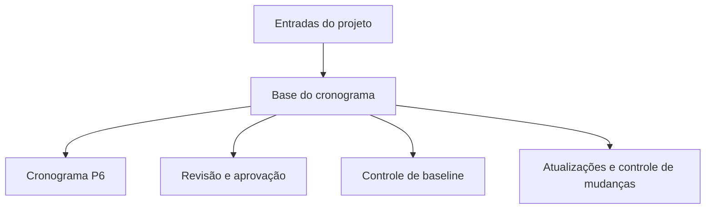

# base do cronograma

A base do cronograma é o documento que explica como o cronograma foi construído e quais premissas o suportam. É o complemento escrito do arquivo Primavera P6.

O cronograma mostra datas, lógica, folga, marcos, recursos e caminho crítico. A base do cronograma explica por que esses itens estão assim.

## Para Que Serve

A base do cronograma suporta revisão, aprovação, controle de baseline, atualizações, gestão de mudanças e análise de atrasos. Ajuda o revisor a entender regras, premissas, entradas e limitações por trás do cronograma.

Sem ela, o arquivo P6 pode calcular corretamente, mas a equipe pode não saber quais premissas foram usadas ou se o cronograma serve para decisões de gestão.

## Quem Escreve e Para Quem

O agendador ou engenheiro de planejamento normalmente prepara a base do cronograma, com contribuições do gerente do projeto, engenharia, suprimentos, construção, comissionamento, controles do projeto, contratos e custos.

Ela é dirigida à equipe do projeto, cliente, PMO, revisores, analistas de pleitos e qualquer pessoa que precise entender como o cronograma foi construído.

## Por Que Importa

Um cronograma contém muitas decisões. Calendários, durações, lógica, equipes, marcos, ciclos de aprovação, licenças e limites de recursos afetam datas e folga.

A base do cronograma torna essas decisões visíveis. Reduz ambiguidade, suporta auditoria e evita discussões futuras sobre o que o cronograma assumia na baseline.

## O Que Deve Incluir

Uma base do cronograma completa deve incluir:

- Escopo e exclusões.
- Propósito do cronograma e uso contratual.
- Metodologia de desenvolvimento.
- EAP e estrutura de códigos de atividade.
- Calendários, turnos, feriados, clima e períodos não trabalhados.
- Premissas e restrições principais.
- Marcos de início, término, acesso, aprovações e entrega de materiais.
- Ciclos de aprovação e licenças.
- Premissas de entrega e turnover.
- Regras de lógica, tipos de relação e política de defasagem.
- Base de durações, taxas de produtividade e normas.
- Equipes, disponibilidade de recursos, limites de mão de obra e limites de equipamento.
- Regras de custo, se aplicável.
- Explicação do caminho crítico e dos caminhos quase críticos.
- Premissas de risco e incertezas.
- Ciclo de atualização, regras de status e relatórios.

## Premissas

Premissas devem ser claras e verificáveis. Podem incluir datas de acesso, liberações de engenharia, entregas de fornecedores, durações de licenças, revisão do cliente, disponibilidade de equipes, clima e sequência de comissionamento.

Se uma premissa afeta datas, folga, recursos ou entrega, ela pertence à base do cronograma.

## Calendários e Períodos de Trabalho

O documento deve explicar os principais calendários usados no P6. Inclua dias de trabalho, turnos, feriados, paradas sazonais, calendários de clima, trabalho noturno, fins de semana e períodos não trabalhados.

Calendários afetam diretamente datas e folga. Se engenharia, suprimentos, construção, comissionamento ou recursos usam calendários diferentes, explique por que.

## Equipes, Recursos e Limites

Durações só fazem sentido quando os recursos assumidos são entendidos. A base do cronograma deve indicar equipes, disponibilidade, limites de mão de obra, limites de equipamento e horas extras ou estratégia de turnos.

Se houver carregamento de recursos, explique se ele é usado para planejamento de mão de obra, carregamento de custos, valor agregado ou nivelamento de recursos.

## Marcos, Aprovações, Licenças e Entrega

Os marcos principais devem ser listados e explicados: início do projeto, conclusão contratual, acesso concedido, aprovações do cliente, interfaces de terceiros, entrega de materiais, licenças, entregas de sistemas e entrega final.

Ciclos de aprovação e licenças devem mostrar durações assumidas e responsáveis. Se ação do cliente ou terceiro dirige o cronograma, isso deve estar visível.

## Metodologia, Produtividade e Custos

A base do cronograma deve explicar como o cronograma foi desenvolvido: fontes usadas, workshops, lógica de sequenciamento, método de estimativa de duração, taxas de produtividade, normas e validação.

Se houver carregamento de custos, declare as regras. Explique se os custos são atribuídos por recurso, despesa, atividade, EAP, pacote contratual ou método de valor agregado.

## Caminho Crítico e Risco

A base do cronograma deve resumir o caminho crítico e explicar por que ele é razoável. Também deve identificar caminhos quase críticos, riscos principais, sensibilidades e premissas que podem mudar durante a execução.

Isso ajuda a equipe a entender não apenas a data final, mas o que a controla.

## Boas Praticas

Escreva a base do cronograma antes da aprovação da baseline. Mantenha-a alinhada ao arquivo P6. Atualize quando mudanças aprovadas alterarem premissas, calendários, marcos, estratégia de recursos ou metodologia.

Não faça um texto genérico. Deve ser específica o bastante para que outro agendador entenda como o cronograma foi construído.

## Conclusao

A base do cronograma é a explicação por trás do cronograma. Ela diz o que o cronograma assume, como foi construído, o que inclui, o que exclui e quais condições precisam permanecer verdadeiras para as datas continuarem válidas.

Uma boa base do cronograma torna o arquivo P6 mais fácil de revisar, defender, atualizar e confiar.
## Conteúdo relacionado
- [Atividades começando na data dos dados sem nenhuma lógica direcionadora: por que essa métrica de cronograma é importante - Visão geral](../../metrics/01_activities_starting_in_dd_with_no_logic_driving/02_guide_template.md)
- [códigos de atividade](../18_ACTIVITY%20CODES/18_ACTIVITY%20CODES.md)
