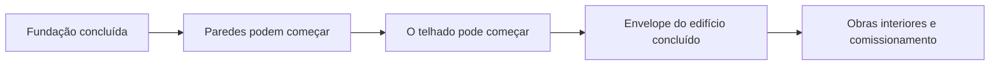
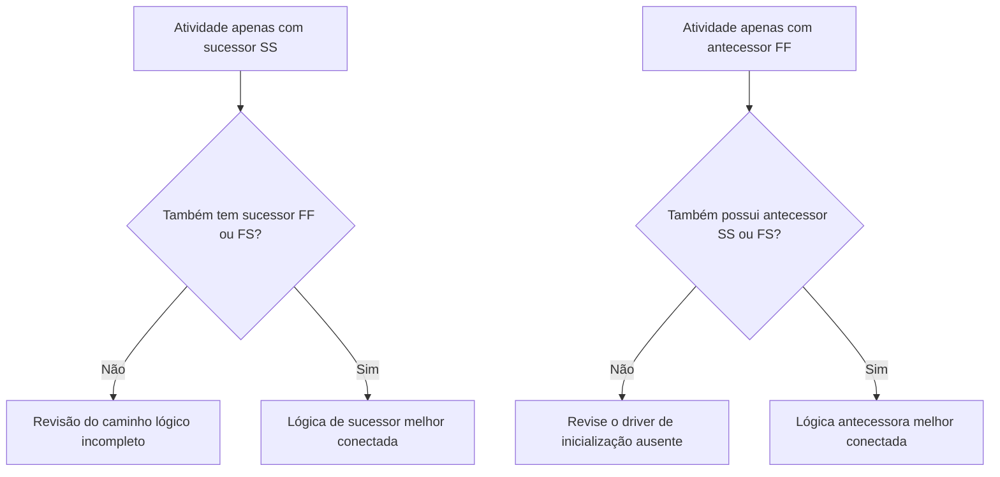

Lógica é a representação matemática do sequenciamento e das dependências dentro de um cronograma de projeto. Explica o que deve acontecer antes do quê, quais atividades podem acontecer ao mesmo tempo e como a equipe do projeto pretende passar da primeira atividade até a conclusão final.

Num bom cronograma do Primavera P6, lógica não é decoração. É o mecanismo que permite ao cronograma calcular datas, folga, caminho crítico e previsão de movimento. Conta a história da execução de uma forma que pode ser revisada, desafiada e melhorada.

Se o cronograma diz “estabeleça as fundações, depois construa as paredes e depois construa o telhado”, a lógica é o que transforma essa sequência em uma rede calculável. O planejador não está apenas desenhando um cronograma. O planejador está definindo o caminho de entrega.

## A lógica conta a história da obra

Cada equipe de projeto tem uma maneira pretendida de executar o projeto. A Engenharia poderá liberar projeto por área. A área de compras pode entregar equipamentos por pacote. A obra civil pode preparar o acesso antes do início das obras estruturais. A conclusão mecânica pode precisar acontecer antes do início do comissionamento.

Os links lógicos são a expressão matemática desse plano.

Este diagrama simples não é apenas uma sequência. É um modelo de decisão. Se as fundações atrasarem, as paredes poderão atrasar. Se as paredes estiverem atrasadas, o telhado pode estar atrasado. Se o telhado estiver atrasado, as obras internas poderão ser afetadas. O cronograma só pode mostrar esse impacto se a lógica estiver presente.

Uma lógica robusta significa que o cronograma pode explicar por que as atividades começam, por que terminam e o que acontece quando uma parte do plano muda.

## Por que a lógica robusta é importante na data dos dados

A métrica "Atividades iniciadas na data dos dados sem lógica de condução" é um forte teste de qualidade do cronograma.

A Data dos Dados é o limite entre o desempenho real e o trabalho previsto. Quando uma atividade começa exatamente na Data Data, o revisor deve fazer uma pergunta simples: o que está impulsionando esse início?

Se a atividade tiver lógica predecessora válida, o cronograma poderá explicar o início. Talvez uma área tenha sido liberada. Talvez uma entrega de material tenha sido concluída. Talvez a atividade antecessora tenha terminado e permitido que a próxima equipe começasse.

Se a atividade não tiver lógica de condução, a largada é mais fraca. A atividade pode estar na Data de Dados porque não tem antecessor, porque a lógica está incompleta, porque uma restrição a está forçando ou porque a atualização não foi totalmente atualizada.

É por isso que a lógica robusta é importante. Um cronograma não deve permitir que o trabalho pareça pronto apenas porque a data dos dados mudou. Deve mostrar a real condição que permite o início da obra.

## O equilíbrio: lógica suficiente, não lógica redundante

A boa lógica é equilibrada. O cronograma precisa de relacionamentos suficientes para conectar adequadamente as atividades aos predecessores e sucessores. Ao mesmo tempo, deve evitar lógica redundante que repita a mesma dependência de maneiras desnecessárias.

Pouca lógica cria inícios abertos, finais abertos, flutuação não confiável e resultados de caminho crítico fracos. Muita lógica pode dificultar a revisão da rede e ocultar o verdadeiro motivador de uma atividade.

O objetivo não é maximizar o número de relacionamentos. O objetivo é representar claramente as dependências obrigatórias e obrigatórias.

Para cada atividade, o agendador deve ser capaz de responder:

- O que permite que esta atividade comece?
- O que esta atividade permite a seguir?
- Qual relacionamento está realmente impulsionando a atividade?
- Algum relacionamento é duplicado ou desnecessário?
- Um revisor entenderia a sequência pretendida?

Esse equilíbrio é fundamental para as revisões do cronograma do PMO. Uma rede densa não é automaticamente uma rede forte. Uma rede leve não é automaticamente uma rede limpa. A rede certa explica o plano de execução sem confusão.

## Toda atividade precisa de um driver inicial

Lógica robusta significa que cada atividade tem um antecessor que permite ou aciona seu início, exceto para início de projeto válido ou exceções autorizadas externamente.

Para uma atividade de construção, o fator de início pode ser o acesso à área, a conclusão do antecessor, a disponibilidade de materiais, a liberação do projeto, a aprovação da licença ou a conclusão comercial prévia. Para uma atividade de aquisição, pode ser a aprovação do projeto ou a liberação do pedido de compra. Para o comissionamento, pode ser a conclusão mecânica, a prontidão do pacote de teste ou a rotatividade do sistema.

Quando falta esse driver de início, a atividade pode flutuar para uma posição artificial no cronograma. Durante as atualizações, pode aparecer na Data Data. Isso cria uma falsa sensação de prontidão.

Considere uma atividade chamada “Instalar Bombas”. Se começar na Data Data, mas não tiver antecessor para conclusão da fundação, entrega da bomba ou transferência de área, o cronograma não explica por que a instalação pode começar. A atividade pode ser planeada, mas a lógica não é robusta.

## SS e FF são meio relacionamentos

As relações início-a-início e fim-a-fim são úteis, mas devem ser usadas com cuidado. Em muitas revisões de cronograma, eles são melhor entendidos como relacionamentos "meio" porque não colocam totalmente a atividade em um caminho lógico completo por si só.

Um relacionamento SS pode explicar quando uma atividade pode começar, mas pode não explicar quando a atividade deve terminar ou o que ela entrega. Um relacionamento FF pode explicar o alinhamento final, mas pode não explicar quando a atividade pode começar.

Isso não torna SS ou FF errados. A sobreposição de trabalho é comum e muitas vezes realista. A questão é se a atividade está totalmente conectada.

Por exemplo:

- Uma atividade com um sucessor SS normalmente também deverá ter um sucessor FF ou FS.
- Uma atividade com um antecessor FF normalmente também deve ter um antecessor SS ou FS.

Isso ajuda a evitar que as atividades sejam conectadas apenas em um lado da sua duração. O cronograma deve explicar como o trabalho começa e como o trabalho é concluído.

## Lógica Robusta na Prática

Uma revisão lógica prática deve começar com atividades próximas à data dos dados, trabalho crítico e quase crítico e principais caminhos de transferência. Estas áreas têm o maior impacto na tomada de decisões atuais.

No P6, colunas de revisão úteis incluem ID da atividade, nome da atividade, EAP, início, término, status da atividade, flutuação total, predecessores, sucessores, tipo de relacionamento, atraso, restrições, calendário e indicadores de relacionamento de condução, se disponíveis.

Para cada atividade iniciada na Data Data, pergunte:

- A atividade está realmente pronta para começar?
- Qual antecessor permite o início?
- Esse antecessor está completo, em andamento ou previsto?
- O relacionamento está impulsionando?
- Uma restrição ou data esperada está substituindo a lógica?
- A atividade também possui lógica sucessora válida?

Se a resposta não for clara, a atividade deverá ser analisada com o proprietário responsável. A correção pode incluir a adição de um antecessor ausente, a alteração do tipo de relacionamento, a remoção de uma restrição, a atualização de valores reais ou a documentação de uma exceção válida.

## Evitando a lógica artificial

Um erro é adicionar relacionamentos apenas para passar uma métrica. Isso não cria uma lógica robusta. Isso cria lógica artificial.

Os relacionamentos devem representar dependências reais. Se um link não refletir a sequência de construção, liberação de engenharia, necessidade de aquisição, acesso, aprovação, teste, comissionamento ou entrega, ele poderá não pertencer à rede.

Outro erro é deixar a lógica redundante porque parece mais segura. Se a mesma dependência já estiver representada por um relacionamento mais claro, links extras poderão confundir o caminho crítico e dificultar a auditoria da rede.

A lógica robusta é clara, objetiva e defensável.

## Conclusão

Lógica é a história matemática de como o projeto será executado. Define o que deve acontecer primeiro, o que pode acontecer em conjunto e o que se segue.

Lógica robusta não significa adicionar tantos links quanto possível. Significa adicionar as ligações certas: o suficiente para ligar cada actividade a predecessores e sucessores reais, mas não tantos que a rede se torne redundante ou enganosa.

Quando as atividades começam na Data Data sem nenhuma lógica de condução, o cronograma expõe uma fraqueza nessa história. A atividade pode ser mostrada como pronta, mas a rede não explica o porquê.

Um cronograma confiável deve responder claramente a essa pergunta. O que permite que este trabalho comece? O que isso permite a seguir? Se o cronograma puder responder a ambos, a lógica estará se tornando robusta. Caso contrário, a equipe do projeto terá mais trabalho de sequenciamento a fazer antes que a previsão possa ser confiável.
