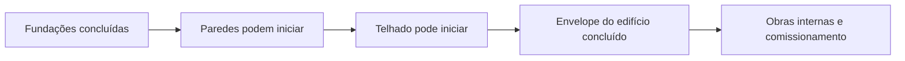
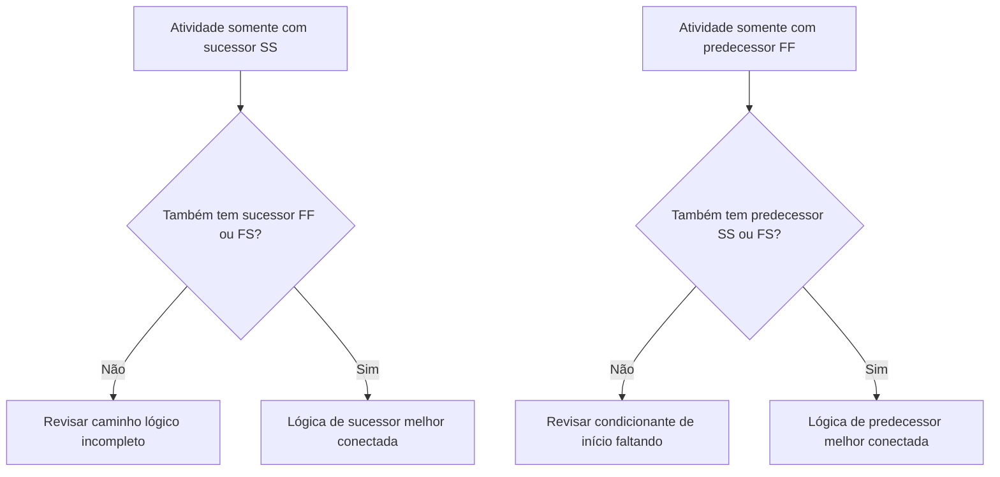

A lógica é a representação matemática do sequenciamento e das dependências dentro de um cronograma de projeto. Ela explica o que deve acontecer antes do quê, quais atividades podem acontecer ao mesmo tempo e como a equipe do projeto pretende avançar da primeira atividade até a conclusão final.

Em um bom cronograma no Primavera P6, a lógica não é decoração. É o mecanismo que permite ao cronograma calcular datas, folgas, caminho crítico e movimentação de previsão. Ela conta a história da execução de uma forma que pode ser revisada, questionada e aprimorada.

Se o cronograma diz "assentar fundações, depois construir paredes, depois construir o telhado," a lógica é o que transforma essa sequência em uma rede calculável. O planejador não está apenas desenhando uma linha do tempo. O planejador está definindo o caminho de entrega.

## A Lógica Conta a História do Trabalho

Cada equipe de projeto tem uma forma pretendida de executar o projeto. A engenharia pode liberar projetos por área. Suprimentos pode entregar equipamentos por pacote. A obra civil pode preparar o acesso antes do início da estrutura. A conclusão mecânica pode precisar acontecer antes que o comissionamento possa começar.

Os vínculos lógicos são a expressão matemática desse plano.

Este diagrama simples não é apenas uma sequência. É um modelo de decisão. Se as fundações atrasarem, as paredes podem atrasar. Se as paredes atrasarem, o telhado pode atrasar. Se o telhado atrasar, as obras internas podem ser afetadas. O cronograma só pode mostrar esse impacto se a lógica estiver presente.

Lógica robusta significa que o cronograma pode explicar por que as atividades começam, por que terminam e o que acontece quando uma parte do plano se move.

## Por Que a Lógica Robusta Importa na Data de Dados

A métrica "Atividades Iniciando na Data de Dados sem Lógica Condicionante" é um forte teste de qualidade do cronograma.

A Data de Dados é o limite entre o desempenho real e o trabalho previsto. Quando uma atividade inicia exatamente na Data de Dados, o revisor deve fazer uma pergunta simples: o que está condicionando esse início?

Se a atividade tem lógica predecessor válida, o cronograma pode explicar o início. Talvez uma área tenha sido liberada. Talvez uma entrega de material tenha sido concluída. Talvez a atividade predecessor tenha terminado e permitido que a próxima equipe começasse.

Se a atividade não tem lógica condicionante, o início é mais fraco. A atividade pode estar na Data de Dados porque não tem predecessor, porque a lógica está incompleta, porque uma restrição a está forçando ou porque a atualização não foi completamente registrada.

É por isso que a lógica robusta importa. Um cronograma não deve permitir que o trabalho apareça como pronto apenas porque a Data de Dados se moveu. Deve mostrar a condição real que permite o início do trabalho.

## O Equilíbrio: Lógica Suficiente, Não Redundante

Uma boa lógica é equilibrada. O cronograma precisa de relacionamentos suficientes para conectar atividades corretamente a predecessores e sucessores. Ao mesmo tempo, deve evitar lógica redundante que repete a mesma dependência de formas desnecessárias.

Pouca lógica cria inícios abertos, términos abertos, folgas não confiáveis e resultados fracos do caminho crítico. Muita lógica pode tornar a rede difícil de revisar e pode ocultar o verdadeiro condicionante de uma atividade.

O objetivo não é maximizar o número de relacionamentos. O objetivo é representar dependências obrigatórias e necessárias de forma clara.

Para cada atividade, o programador deve ser capaz de responder:

- O que permite que esta atividade comece?
- O que esta atividade habilita a seguir?
- Qual relacionamento está realmente condicionando a atividade?
- Algum relacionamento está duplicado ou é desnecessário?
- Um revisor entenderia a sequência pretendida?

Esse equilíbrio é central para as revisões de cronograma do PMO. Uma rede densa não é automaticamente uma rede forte. Uma rede leve não é automaticamente uma rede limpa. A rede certa explica o plano de execução sem sobrecarregamento.

## Cada Atividade Precisa de um Condicionante de Início

Lógica robusta significa que cada atividade tem um predecessor que permite ou desencadeia seu início, exceto para início de projeto válido ou exceções autorizadas externamente.

Para uma atividade de construção, o condicionante de início pode ser liberação de acesso à área, conclusão de predecessor, disponibilidade de material, liberação de projeto, aprovação de licença ou conclusão de trade anterior. Para uma atividade de suprimentos, pode ser aprovação de projeto ou liberação de ordem de compra. Para comissionamento, pode ser conclusão mecânica, prontidão do pacote de testes ou virada de sistema.

Quando esse condicionante de início está faltando, a atividade pode flutuar para uma posição artificial no cronograma. Durante as atualizações, pode aparecer na Data de Dados. Isso cria uma falsa sensação de prontidão.

Considere uma atividade chamada "Instalar Bombas." Se ela inicia na Data de Dados mas não tem predecessor para conclusão de fundações, entrega das bombas ou handover de área, o cronograma não está explicando por que a instalação pode começar. A atividade pode estar planejada, mas a lógica não é robusta.

## SS e FF São Relacionamentos Pela Metade

Relacionamentos Início-a-Início (SS — Start-to-Start) e Fim-a-Fim (FF — Finish-to-Finish) são úteis, mas devem ser usados com cuidado. Em muitas revisões de cronograma, são melhor entendidos como relacionamentos "pela metade" porque não colocam totalmente a atividade em um caminho lógico completo por si mesmos.

Um relacionamento SS pode explicar quando uma atividade pode começar, mas pode não explicar quando a atividade deve terminar ou o que ela entrega. Um relacionamento FF pode explicar o alinhamento de término, mas pode não explicar quando a atividade tem permissão para começar.

Isso não torna SS ou FF errados. O trabalho sobreposto é comum e frequentemente realista. O problema é se a atividade está totalmente conectada.

Por exemplo:

- Uma atividade com um sucessor SS geralmente também deve ter um sucessor FF ou FS (Fim-a-Início).
- Uma atividade com um predecessor FF geralmente também deve ter um predecessor SS ou FS.

Isso ajuda a evitar que as atividades sejam conectadas apenas em um lado da sua duração. O cronograma deve explicar tanto como o trabalho começa quanto como o trabalho termina.

## Lógica Robusta na Prática

Uma revisão de lógica prática deve começar com atividades próximas à Data de Dados, trabalho crítico e quase crítico, e os principais caminhos de handover. Essas áreas têm o maior impacto nas decisões atuais.

No P6, colunas úteis para revisão incluem ID da Atividade, Nome da Atividade, EAP, Início, Término, Status da Atividade, Folga Total, predecessores, sucessores, tipo de relacionamento, espera (lag), restrições, calendário e indicadores de relacionamento condicionante se disponíveis.

Para cada atividade iniciando na Data de Dados, pergunte:

- A atividade está realmente pronta para começar?
- Qual predecessor permite o início?
- Esse predecessor está concluído, em andamento ou previsto?
- O relacionamento está condicionando?
- Uma restrição ou data esperada está substituindo a lógica?
- A atividade também tem lógica sucessora válida?

Se a resposta não estiver clara, a atividade deve ser revisada com o responsável. A correção pode ser adicionar um predecessor faltando, alterar o tipo de relacionamento, remover uma restrição, atualizar os dados reais ou documentar uma exceção válida.

## Evitando Lógica Artificial

Um erro é adicionar relacionamentos apenas para passar em uma métrica. Isso não cria lógica robusta. Cria lógica artificial.

Os relacionamentos devem representar dependências reais. Se um vínculo não reflete sequência de construção, liberação de engenharia, necessidade de suprimentos, acesso, aprovação, teste, comissionamento ou handover, ele pode não pertencer à rede.

Outro erro é deixar lógica redundante porque parece mais seguro. Se a mesma dependência já está representada por um relacionamento mais claro, vínculos extras podem confundir o caminho crítico e tornar a rede mais difícil de auditar.

Lógica robusta é clara, proposital e defensável.

## Conclusão

A lógica é a história matemática de como o projeto será executado. Ela define o que deve acontecer primeiro, o que pode acontecer junto e o que vem a seguir.

Lógica robusta não significa adicionar o máximo de vínculos possível. Significa adicionar os vínculos certos: suficientes para conectar cada atividade a predecessores e sucessores reais, mas não tantos que a rede se torne redundante ou enganosa.

Quando atividades iniciam na Data de Dados sem lógica condicionante, o cronograma está expondo uma fraqueza nessa história. A atividade pode ser mostrada como pronta, mas a rede não explica por quê.

Um cronograma confiável deve responder a essa pergunta claramente. O que permite que este trabalho comece? O que ele habilita a seguir? Se o cronograma consegue responder a ambas, a lógica está se tornando robusta. Se não consegue, a equipe do projeto tem mais trabalho de sequenciamento a fazer antes que a previsão possa ser confiada.
