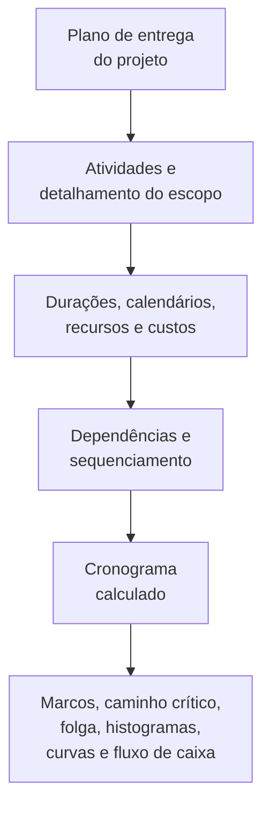

Um cronograma de projeto é muito mais do que uma lista de datas. É uma representação gráfica e lógica do plano de entrega do projeto. Ele explica como o projeto será executado do início ao fim, como os pacotes de trabalho se conectam, quando os principais marcos (milestones) devem ser alcançados e que informações a equipe do projeto deve usar para tomar decisões.

Em termos simples, o cronograma transforma o plano do projeto em um roteiro. Ele ajuda todos os envolvidos a entender o que precisa ser feito, quando precisa acontecer e quem é responsável por fazer isso acontecer. Para gerentes de projeto, planejadores, equipes de construção, engenheiros, líderes de suprimentos e revisores de PMO, o cronograma se torna uma das principais ferramentas de coordenação e controle.

O cronograma é uma linha do tempo, mas não é somente uma linha do tempo. Um cronograma fraco pode mostrar datas. Um cronograma robusto explica por que essas datas são críveis.

## O Cronograma como Roteiro de Entrega

Todo projeto começa com uma intenção. A equipe sabe o que deve ser entregue: um edifício, uma instalação, um sistema industrial, uma parada programada, um ativo de infraestrutura ou um pacote de trabalho. Mas a entrega exige mais do que conhecer o objetivo final. A equipe precisa entender a sequência.

O que vem primeiro? O que pode acontecer em paralelo? O que precisa aguardar aprovação de projeto, entrega de materiais, liberação de acesso, emissão de licenças, testes ou handover? Quais atividades controlam a data de conclusão? Quais marcos importam mais para o cliente?

Um cronograma responde a essas perguntas convertendo o plano em atividades, durações, dependências, calendários, recursos, custos e marcos.

A linha do tempo gráfica é útil porque as pessoas podem visualizar o trabalho. A rede lógica é útil porque o software pode calcular o trabalho. Juntos, permitem que o cronograma se torne tanto uma ferramenta de comunicação quanto uma ferramenta de controle.

## O Que Alimenta o Cronograma

Um cronograma é tão confiável quanto as informações usadas para construí-lo. No Primavera P6, o cronograma é alimentado por várias entradas principais.

A primeira entrada é a lista de atividades. As atividades dividem o projeto em partes gerenciáveis de trabalho. Cada atividade deve ser clara o suficiente para ser planejada, atualizada e medida.

A segunda entrada é a duração determinística. Este é o tempo produtivo planejado necessário para concluir cada atividade. A duração deve refletir o método de execução, premissas de produtividade, tamanho da equipe, acesso, restrições operacionais e condições do projeto.

A terceira entrada é a lógica de dependências. As dependências explicam como as atividades se relacionam entre si. Uma atividade pode precisar ser concluída antes que outra comece. Duas atividades podem iniciar juntas. Dois términos podem precisar estar alinhados. Esses relacionamentos criam a rede CPM (Critical Path Method — Método do Caminho Crítico).

A quarta entrada é o sequenciamento. O sequenciamento é a ordem prática de execução. Considera a construtibilidade, o fluxo de engenharia, o cronograma de suprimentos, o acesso, a lógica de comissionamento, a estratégia de handover e as prioridades do cliente.

A quinta entrada são os recursos e custos. O carregamento de recursos permite que o cronograma mostre a demanda de mão de obra, equipamentos e materiais ao longo do tempo. O carregamento de custos permite que o cronograma suporte o fluxo de caixa, o valor agregado e a previsão financeira.

Quando essas entradas estão completas e realistas, o cronograma pode produzir saídas úteis.

## O Que o Cronograma Nos Diz

Um cronograma bem construído informa a duração total do projeto. Ele mostra os marcos de conclusão planejados e as entregas intermediárias. Produz histogramas de recursos que mostram quando a demanda de mão de obra ou equipamentos aumenta e diminui. Suporta curvas de progresso, curvas de fluxo de caixa, relatórios de valor agregado e planejamento de curto prazo.

Mais importante, identifica o caminho crítico ou o caminho mais longo. Esta é a cadeia de trabalho que determina o término do projeto. Se atividades nesse caminho atrasarem, a data de conclusão do projeto também pode atrasar. É por isso que a lógica é tão importante. Sem boas dependências, o caminho crítico pode não mostrar os reais condicionantes do projeto.

A folga (float) é outra saída importante. A folga indica o quanto de flexibilidade uma atividade tem antes de afetar outra atividade ou o término do projeto. Mas a folga só é significativa quando a rede do cronograma está completa. Se atividades estão com lógica faltando, a folga pode parecer melhor ou pior do que a realidade.

## Por Que a Lógica Torna a Linha do Tempo Confiável

É aqui que a métrica "Atividades Iniciando na Data de Dados sem Lógica Condicionante" se torna importante.

A Data de Dados (Data Date) no P6 é o limite entre o desempenho real e a previsão. Tudo antes da Data de Dados deve representar o que já aconteceu. Tudo após a Data de Dados deve representar o plano daqui para frente.

Quando atividades iniciam exatamente na Data de Dados sem nenhuma lógica as condicionando, o cronograma está emitindo um sinal de alerta. Pode parecer que o trabalho está pronto para começar imediatamente, mas o cronograma pode não conseguir explicar por quê. Pode não haver nenhum predecessor mostrando que a área está disponível, nenhum vínculo à entrega de materiais, nenhuma ligação à aprovação de projeto, nenhuma conexão à liberação de inspeção e nenhuma lógica de trabalho anterior.

Isso importa porque um cronograma não deve simplesmente colocar trabalho em uma data. Ele deve explicar o caminho até aquela data.

Se uma atividade inicia na Data de Dados porque todo o trabalho predecessor necessário está concluído e a lógica suporta o início, a data é defensável. Se inicia ali porque a atividade está aberta, sem condicionante, restringida ou com atualização deficiente, a data é fraca. A equipe do projeto pode acreditar que o trabalho está pronto quando as condições reais de habilitação não foram modeladas.

## Um Exemplo Prático

Imagine um cronograma de projeto com Data de Dados em 01 de junho. Após a atualização, várias atividades iniciam em 01 de junho:

- Instalar eletrocalha na Área B.
- Iniciar teste de pressão em tubulações.
- Iniciar alinhamento de equipamentos.
- Mobilizar equipe de isolamento.

À primeira vista, o planejamento de curto prazo parece movimentado e pronto. Mas quando o programador revisa a lógica, o problema fica claro. A instalação de eletrocalha não está vinculada à entrega de materiais. O teste de pressão não está vinculado à conclusão de tubulações. O alinhamento de equipamentos está sem o predecessor de conclusão mecânica. A mobilização da equipe de isolamento não tem predecessor de liberação de acesso.

O cronograma está mostrando trabalho na Data de Dados, mas não está explicando por que o trabalho pode começar. Esse não é um roteiro confiável. É uma lista de intenções de curto prazo.

A correção é adicionar ou corrigir a lógica CPM real. Se a entrega de materiais condiciona a instalação de eletrocalha, crie o vínculo. Se a conclusão de tubulações condiciona o teste de pressão, crie o vínculo. Se a liberação de acesso condiciona o isolamento, modele essa condição. Após o recálculo, algumas atividades ainda podem iniciar próximas à Data de Dados, mas agora o cronograma pode explicar por quê.

## O Que um Bom Cronograma Deve Fazer

Um bom cronograma deve ajudar a equipe a ver o plano, testar o plano e gerenciar o plano.

Deve mostrar o que precisa ser feito. Deve explicar a ordem do trabalho. Deve identificar quem precisa agir e quando. Deve revelar o caminho crítico. Deve suportar o planejamento de recursos, a medição de progresso, a previsão de fluxo de caixa e os relatórios de PMO.

Também deve tornar os pontos fracos visíveis. Lógica faltando, restrições rígidas, datas desatualizadas, inícios e términos abertos, e atividades se agrupando na Data de Dados não são apenas problemas técnicos. Eles afetam como a equipe do projeto entende a prontidão, o risco e o controle.

## Conclusão

Um cronograma é o plano de entrega do projeto expresso em tempo, lógica e trabalho mensurável. É um roteiro, um modelo de cálculo e uma ferramenta de comunicação.

Quando bem construído, ele diz à equipe do projeto o que precisa acontecer, quando precisa acontecer e por que as datas são confiáveis. Quando atividades iniciam na Data de Dados sem lógica condicionante, essa credibilidade é enfraquecida. O cronograma para de explicar o plano e começa a adivinhar o próximo passo.

Por essa razão, as revisões de qualidade do cronograma devem sempre fazer uma pergunta simples: o cronograma explica por que o trabalho começa quando começa? Se a resposta for sim, o cronograma está cumprindo seu papel. Se a resposta for não, o roteiro precisa de mais lógica antes de poder ser confiado.
