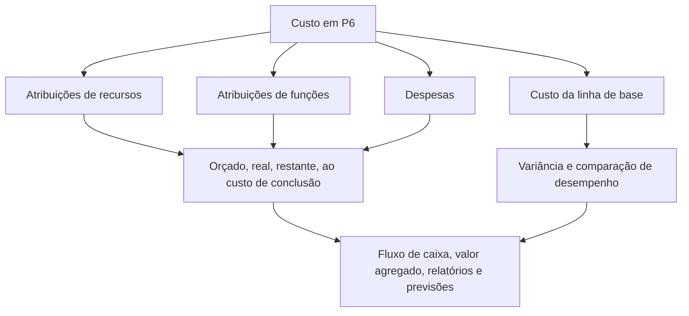

O custo no Primavera P6 pode residir em vários lugares. Isso é útil, mas também pode ser confuso. Um cronograma pode mostrar o custo orçado, o custo real, o custo restante, o custo de conclusão, o custo do recurso, o custo da função, o custo da despesa, os campos de valor agregado e o custo da linha de base. Esses valores estão relacionados, mas nem todos significam a mesma coisa.

Para as equipes de controle de projetos, a questão principal não é apenas “qual é o custo?” A melhor pergunta é: de onde vem esse custo, o que ele representa e como deve ser utilizado?

Este blog explica os principais tipos de custos disponíveis no P6, as diferenças entre eles e quando cada um é útil.

## Por que a localização do custo é importante

P6 é principalmente uma ferramenta de agendamento, mas também pode oferecer suporte a cronogramas carregados de custos, valor agregado, fluxo de caixa e relatórios de previsão. Para fazer isso corretamente, o custo deve ser colocado na parte correta do modelo de cronograma.

Se o custo da mão-de-obra for inserido como despesa, os histogramas de recursos poderão não contar a história correta. Se o custo real for inserido manualmente, mas o projeto espera que ele venha dos valores reais dos recursos, os relatórios poderão se tornar inconsistentes. Se o custo da linha de base estiver faltando, os relatórios de variação de cronograma e de variação de custo perderão o contexto.

A localização do custo é importante porque a origem do custo afeta a forma como ele é acumulado, atualizado, previsto e reportado.

## Custos de recursos

Os custos de recursos provêm de recursos atribuídos às atividades. Um recurso pode representar mão de obra, equipamento ou outra categoria de recurso. Cada recurso pode ter taxas, unidades e cálculos de custos.

Por exemplo, se uma actividade utiliza uma equipa de instaladores de tubagens durante 80 horas a uma taxa horária definida, o P6 pode calcular o custo da mão-de-obra a partir das unidades e taxas atribuídas.

Os custos de recursos são úteis quando o projeto deseja conectar as atividades do cronograma aos histogramas de mão de obra, equipamentos, produtividade e recursos.

Use custos de recursos quando:

- A demanda de mão de obra ou equipamento é importante.
- Histogramas de recursos são necessários.
- O custo está vinculado a horas ou unidades.
- O valor agregado ou progresso é baseado em recursos.
- O cronograma é usado para planejamento de recursos.

O principal risco é a manutenção. Cronogramas carregados de recursos exigem disciplina. Se unidades, taxas, calendários ou valores reais não forem mantidos, os relatórios de custos não serão confiáveis.

## Custos de função

As funções são funções genéricas de trabalho, como engenheiro, eletricista, planejador, inspetor ou operador de guindaste. No P6, as funções podem ser atribuídas às atividades antes que os recursos nomeados sejam conhecidos.

Os custos de função podem apoiar o planejamento antecipado quando a equipe conhece o tipo de recurso necessário, mas não a pessoa ou equipe específica.

Por exemplo, durante o planejamento inicial de engenharia, uma atividade pode precisar de 120 horas de “Engenheiro Sênior”. A pessoa nomeada pode ainda não ter sido designada, mas a função pode fornecer uma taxa de planejamento e uma estimativa de custo.

Use custos de função quando:

- O cronograma ainda está em planejamento.
- Os recursos nomeados ainda não foram confirmados.
- O projeto deseja uma estimativa de recursos ou custos de alto nível.
- As funções serão posteriormente substituídas por recursos reais.

Os custos de função são úteis para o planejamento em estágio inicial, mas devem ser revisados ​​à medida que o projeto amadurece. Se as funções permanecerem após os recursos reais serem conhecidos, o cronograma poderá se tornar genérico demais para um controle detalhado.

## Custos de despesas

Despesas são custos não relacionados a recursos atribuídos diretamente às atividades. Eles são úteis para custos que não são melhor representados por recursos de mão de obra ou equipamentos.

Os exemplos incluem:

- Autorizações.
- Viagem.
- Montantes fixos do fornecedor.
- Pacotes de subcontratados.
- Materiais adquiridos em valor fixo.
- Taxas de teste.
- Taxas de mobilização.

Os custos de despesas podem ser orçados, reais, restantes ou na conclusão, dependendo de como o projeto os acompanha.

Use despesas quando:

- O custo não é determinado pelas horas de recursos.
- O custo é um item fixo ou de montante fixo.
- A atividade precisa de um custo direto não relacionado a recursos.
- O projeto deseja fluxo de caixa para itens não trabalhistas.

O risco é que as despesas se tornem um depósito de lixo. Se todos os custos forem inseridos como despesas, o cronograma poderá perder a capacidade de explicar mão de obra, equipamento e produtividade separadamente.

## Custo Orçado

Custo Orçado é o custo planejado atribuído à atividade. Pode vir de atribuições de recursos, atribuições de funções, despesas ou uma combinação destes.

O Custo Orçado é importante porque representa o plano de custos antes da execução. Ele oferece suporte ao fluxo de caixa, custo da linha de base, configuração do valor agregado e relatórios de controle do projeto.

Utilize o Custo Orçado para responder: qual foi o custo planejado desta atividade?

Se o Custo Orçamentado estiver ausente ou inconsistente, o cronograma ainda poderá calcular datas, mas não poderá suportar relatórios significativos carregados de custos.

## Custo real

Custo Real representa o custo já incorrido. Dependendo da configuração do projeto, o custo real pode ser calculado a partir de unidades e taxas de recursos reais, inserido manualmente, importado de planilhas de horas ou carregado de um sistema de custos externo.

O custo real é importante para relatórios de progresso e valor agregado. Mostra o que foi gasto ou registrado até o momento.

Use o Custo Real para responder: que custo já foi incorrido ou registrado?

O risco é misturar fontes. Se alguns custos reais forem importados da contabilidade e outros forem introduzidos manualmente no P6, a equipa necessita de uma regra clara para evitar duplicações ou lacunas.

## Custo restante

Custo restante é o custo previsto ainda necessário para concluir a atividade. Está vinculado às unidades restantes, às taxas de recursos, às despesas restantes e às premissas de atualização.

O Custo Restante é um dos campos de previsão mais importantes. Ele informa à equipe do projeto quanto custo resta da data atual em diante.

Use o custo restante para responder: quanto custo ainda é esperado?

Se a Duração restante for atualizada, mas o Custo restante não, a previsão poderá se tornar inconsistente. O mesmo acontece quando as unidades de recursos ou os valores restantes de despesas não são mantidos.

## Ao custo de conclusão

No Custo de Conclusão é o custo total esperado da atividade após a combinação do custo real e restante.

Em termos simples:

Custo real + custo restante = custo de conclusão

No custo de conclusão ajuda a mostrar se uma atividade está prevista para terminar acima, abaixo ou dentro do orçamento.

Use At Completion Cost para responder: qual é o último custo total esperado?

## Custo da linha de base

O custo da linha de base vem de um cronograma de linha de base atribuído. É usado para comparar os valores de custo atuais com o plano aprovado.

O custo da linha de base é importante para relatórios de variação. Sem uma linha de base, o projeto pode saber o custo previsto atual, mas não saber se essa previsão é melhor ou pior do que o plano aprovado.

Use o Custo da Linha de Base para responder: como o custo atual se compara ao plano de custos aprovado?

O custo da linha de base é especialmente importante ao usar o P6 para valor agregado ou relatórios formais de PMO.

## Campos de custo de valor agregado

O P6 pode suportar campos de valor agregado, como Valor Planejado, Valor Agregado, Custo Real, Variação de Custo e Variação de Cronograma, dependendo da configuração do projeto.

O valor agregado usa informações de cronograma carregadas de custo para comparar o trabalho planejado, o trabalho obtido e o custo real.

Esses campos são úteis quando o projeto possui um processo formal de valor agregado. Eles exigem linhas de base consistentes, regras de progresso, métodos de porcentagem concluída e carregamento de custos.

Use campos de custo de valor agregado quando:

- O projeto requer relatórios de EV.
- As regras de progresso são definidas.
- O custo da linha de base é aprovado.
- A origem do custo real é controlada.
- O progresso da atividade é mantido de forma consistente.

Sem esses controles, os resultados do valor agregado podem parecer precisos e não confiáveis.

## Qual tipo de custo você deve usar?

Use custos de recursos para mão de obra e equipamentos que devem apoiar o planejamento de recursos, a produtividade e os histogramas.

Use custos de função para planejamento antecipado quando os recursos nomeados ainda não forem conhecidos.

Use custos de despesas para custos diretos não relacionados a recursos, montantes fixos, itens de fornecedores, licenças, viagens ou pacotes de subcontratação.

Use os campos de custo orçado, real, restante e de conclusão para entender o ciclo de vida dos custos divididos no tempo.

Use o custo da linha de base para comparação com o plano aprovado.

Use campos de valor agregado quando o projeto tiver a governança necessária para apoiar relatórios de VE.

## Problemas comuns

Um problema comum é a duplicação de custos. O mesmo custo do subcontratado pode ser inserido como custo de recurso e novamente como despesa.

Outro problema é a falta do custo real. O cronograma pode ter orçamento e custo restante, mas o custo real pode residir em um sistema de contabilidade separado e nunca atingir P6.

Um terceiro problema é usar despesas para tudo. Isto pode produzir custos totais, mas fraca visibilidade dos recursos.

Outra questão é o progresso inconsistente. Se a porcentagem concluída, a duração restante e o custo restante não estiverem alinhados, o custo de conclusão torna-se não confiável.

## Boas Práticas

Defina a estratégia de custos antes de carregar o cronograma. Decida onde ficarão a mão de obra, os equipamentos, os materiais, os subcontratados e os custos indiretos.

Use contas de custos, códigos de atividades, recursos, funções e categorias de despesas consistentes.

Documente se os custos reais serão inseridos no P6, importados ou relatados de outro sistema.

Revise os campos de custo durante cada ciclo de atualização. Orçado, real, restante e com custo de conclusão devem contar uma história coerente.

## Conclusão

O custo no P6 pode residir em recursos, funções, despesas, linhas de base e campos de valor agregado. Cada lugar tem um propósito diferente.

Os custos de recursos conectam o custo à mão de obra e ao equipamento. Os custos da função apoiam o planejamento antecipado. Os custos de despesas capturam itens diretos que não são recursos. Os custos orçados, reais, restantes e de conclusão mostram o ciclo de vida dos custos. Os campos de valor base e valor agregado suportam comparação e relatórios de desempenho.

Um cronograma forte e carregado de custos não é construído colocando números em qualquer lugar que caibam. Ele é construído decidindo aonde cada tipo de custo pertence e mantendo essa estrutura durante cada ciclo de atualização.
