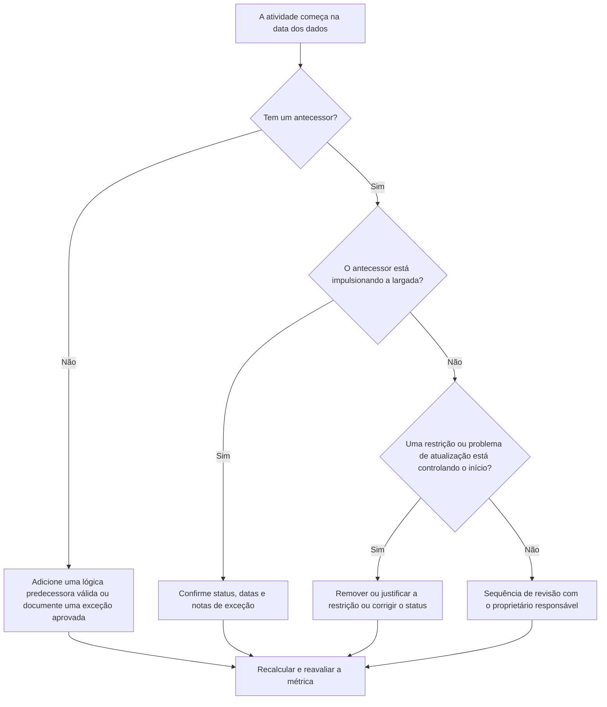

## Propósito

Este guia ajuda os programadores e as equipes de controle de projeto a reduzir ou eliminar atividades que estão programadas para começar no Data Date do Primavera P6 sem uma lógica predecessora válida conduzindo o início. Aplica-se a revisões de qualidade de cronograma, verificações de integridade do PMO e validação do ciclo de atualização.

O objetivo é confirmar que o trabalho de curto prazo é apoiado por uma lógica CPM clara e que as atividades não começam na Data Date apenas devido a relacionamentos ausentes, restrições, datas manuais ou atualizações de progresso incompletas.

## Antes de começar

Reúna as seguintes informações antes de agir:

- Resultado da avaliação atual para esta métrica.
- Dados do Projeto Data usada no último cálculo do cronograma.
- Lista de atividades abertas ou não iniciadas com data de início igual à Data Date.
- Detalhes do relacionamento antecessor e sucessor para cada atividade.
- Restrições, datas esperadas, datas reais e atribuições de calendário.
- Opções de programação do P6 usadas para a atualização, incluindo lógica retida ou configurações de substituição de progresso quando relevante.
- Quaisquer exceções aprovadas, como atividades de início de projeto, marcos de interface externa ou inícios direcionados ao proprietário.

## Entenda o seu resultado

Um resultado forte é zero atividades não resolvidas começando na Data Date sem acionar a lógica predecessora. Isso significa que o trabalho atual e de curto prazo está conectado à rede de agendamento e a Data de Dados não esconde o sequenciamento ausente.

Um resultado aceitável pode incluir um pequeno número de exceções documentadas. Estes devem ser revistos e aprovados, e não ignorados. Por exemplo, um marco de notificação para prosseguir ou uma atividade autorizada externamente pode não precisar de um antecessor normal, mas o motivo deve estar visível para os revisores.

Um resultado fraco significa que várias atividades estão começando na Data de Dados sem um direcionador lógico claro. Isso pode indicar inícios abertos, relacionamentos de antecessores ausentes, restrições excessivas, atualizações de progresso incompletas ou atividades que não foram sequenciadas adequadamente após a atualização mais recente.

## Meta de melhoria

A meta é 0 atividades não resolvidas começando na Data Date sem nenhuma lógica direcionadora válida.

O objetivo de melhoria não é apenas reduzir a contagem. O objetivo mais profundo é garantir que cada atividade próxima à data dos dados tenha uma razão defensável para o início da previsão. Após a correção, cada atividade afetada deve ter uma lógica predecessora apropriada, uma exceção documentada ou uma condição de status/data corrigida.

## Plano de Ação

### Etapa 1: Identifique o problema principal

Crie um layout ou relatório P6 que filtre atividades abertas ou não iniciadas com data de início igual à Data Date. Inclua colunas para ID da atividade, Nome da atividade, EAP, Início, Término, Status, Folga total, Calendário, Restrição primária, Predecessores, Sucessores e indicadores de relacionamento de condução, se disponíveis.

Revise cada atividade e pergunte:

- A atividade tem antecessores?
- Se existirem antecessores, estarão eles realmente a impulsionar o arranque?
- A atividade está sendo mantida ou movida por uma restrição?
- A atividade está faltando um início real ou uma atualização de progresso?
- A atividade é uma exceção válida, como um marco de início de projeto?
- A atividade pertence a uma área da EAP onde a lógica é geralmente fraca?

Agrupe as descobertas em causas práticas: antecessores ausentes, antecessores não direcionadores, restrições ou datas esperadas, erros de atualização/status ou exceções aprovadas.

### Etapa 2: aplique as correções recomendadas

Comece com lógica ausente ou fraca. Adicione relacionamentos predecessores válidos que representem a sequência real do trabalho, como relacionamentos de término para início, início para início ou término para término, quando apropriado. Evite adicionar relacionamentos apenas para satisfazer a métrica; cada relacionamento deve refletir uma dependência real de construção, engenharia, aquisição, acesso, aprovação ou transferência.

Revise as restrições a seguir. Se uma atividade estiver iniciando na Data Date devido a uma restrição de início, confirme se a restrição é contratual ou operacionalmente justificada. Remova restrições desnecessárias e permita que a atividade seja conduzida pela lógica. Se a restrição for válida, documente o motivo e confirme se ela não distorce o caminho crítico.

Verifique o status do progresso. Se o trabalho já tiver começado, atualize corretamente o início real e a duração restante. Se o trabalho não tiver sido iniciado, confirme se o início da previsão deve permanecer na Data Date. Uma atividade não deve parecer pronta para começar simplesmente porque o ciclo de atualização a puxou para a data atual.

Depois que as alterações forem feitas, recalcule o cronograma e revise novamente as atividades afetadas. Confirme se a data de início agora é orientada pela lógica, com status correto ou documentada como uma exceção aprovada.

### Etapa 3: remover bloqueadores comuns

Os bloqueadores comuns incluem feedback de campo pouco claro, informações de interface ausentes e pressão para fazer com que o trabalho de curto prazo pareça pronto. Resolva-os revisando as atividades afetadas com líderes disciplinares, gerentes de construção, proprietários de compras ou gerentes de pacotes.

Outro bloqueador comum é o uso indevido de restrições como substituto da lógica. Restrições podem ser necessárias em alguns casos, mas não devem substituir a rede de horários. Se uma restrição for mantida, documente por que ela existe e como afeta a folga e o caminho mais longo.

Verifique também se o problema é causado por configurações de cálculo de cronograma ou práticas de atualização. Se a substituição do progresso, a lógica retida, o progresso fora de sequência ou a atualização incompleta estiverem afetando o resultado, alinhe o método de atualização com o procedimento de controles do projeto antes de reavaliar a métrica.

### Etapa 4: validar as alterações

Valide o cronograma corrigido antes da próxima avaliação. Execute novamente o filtro para atividades abertas ou não iniciadas começando na Data Date sem lógica direcionadora. Confirme se cada item restante foi corrigido ou documentado como uma exceção aprovada.

Revise a folga total, o caminho mais longo e as atividades de previsão de curto prazo após o recálculo. Uma correção lógica pode alterar o caminho crítico ou revelar problemas adicionais de sequenciamento. Se o movimento do cronograma for significativo, comunique o impacto ao líder de controles do projeto ou ao revisor do PMO.

## Cronograma de Melhoria

### Dia 1: Revisão e Diagnóstico

Execute a métrica, confirme a data dos dados e produza a lista de atividades. Separe os resultados em lógica ausente, lógica não acionada, restrições, erros de status e exceções potenciais.

### Dias 2-3: Implementar Ações Prioritárias

Corrija primeiro as atividades de maior impacto, especialmente as atividades críticas ou quase críticas. Adicione lógica predecessora válida, remova restrições desnecessárias, atualize status incorreto e documente exceções.

### Dias 4-5: Monitore os primeiros resultados

Recalcule o cronograma e revise se as atividades afetadas agora são orientadas pela lógica. Verifique se há alterações inesperadas na folga total, no caminho mais longo e nas datas dos marcos.

### Dia 6: Ajustes Finais

Resolva os bloqueadores restantes com a disciplina responsável ou proprietário do pacote. Confirme se quaisquer exceções retidas são justificadas e claramente documentadas.

### Dia 7: Reavaliar e comparar

Execute a avaliação novamente e compare o novo resultado com o resultado anterior e o limite alvo. Confirme se a métrica está agora em zero atividades não resolvidas ou se são necessárias ações adicionais.

## Acompanhando o progresso

Use um rastreador simples para gerenciar correções e aprovações.

| Data | Ação tomada | Impacto esperado | Resultado/Observação | Próxima etapa |
| --- | --- | --- | --- | --- |
| [Data] | Atividades revisadas começando na Data Date sem lógica direcionadora | Identifique lógica ausente ou fraca | [Resultado observado] | Atribuir correções ao proprietário responsável |
| [Data] | Adicionados relacionamentos antecessores válidos | Melhore o sequenciamento de CPM | [Resultado observado] | Recalcular e revisar o impacto da folga |
| [Data] | Restrições removidas ou justificadas | Reduza partidas artificiais | [Resultado observado] | Confirme as exceções restantes |
| [Data] | Status de atividade incorreto atualizado | Melhore a precisão da atualização | [Resultado observado] | Reexecutar avaliação |

## Se os resultados não melhorarem

Se o resultado não melhorar, analise se as mesmas atividades ainda estão falhando ou se novas atividades estão aparecendo na Data Date. Falhas repetidas podem indicar um problema mais amplo de desenvolvimento do cronograma, como lógica incompleta em uma área da EAP, disciplina de atualização fraca ou uso inconsistente de restrições.

Escale problemas persistentes para o líder de controles do projeto, gerente de planejamento ou revisor do PMO. Para cronogramas importantes, considere um workshop de revisão lógica focado nos pacotes de trabalho afetados. Se o cronograma for usado para relatórios contratuais, análise de atrasos ou previsão de valor agregado, os itens não resolvidos deverão ser tratados como uma preocupação de qualidade.

## Manutenção

Revise essa métrica durante cada ciclo de atualização antes de emitir o cronograma. A verificação deve fazer parte da revisão de integridade do cronograma padrão, especialmente após atualizações de progresso, re-sequenciamento, alterações importantes no escopo ou planejamento de recuperação.

Bons hábitos de manutenção incluem manter as colunas predecessoras e sucessoras visíveis em layouts P6, revisar os inícios abertos antes de cada envio, documentar exceções aprovadas e verificar se a movimentação da Data Date não cria um novo grupo de atividades não orientadas.

## Lista de verificação resumida

- [ ] Resultado atual revisado
- [ ] Limite desejado confirmado
- [ ] Data Date confirmada
- [ ] Atividades iniciadas na data dos dados identificada
- [ ] Principal problema identificado
- [ ] Lógica ausente ou fraca corrigida
- [ ] Restrições revisadas e justificadas ou removidas
- [ ] Datas de status verificadas
- [ ] Exceções aprovadas documentadas
- [ ] Cronograma recalculado
- [ ] Resultados monitorados
- [ ] Avaliação repetida
- [ ] Próximas etapas documentadas
## Conteúdo relacionado
- [Modelo de blog](03_blog_template.md)
- [O que é um cronograma](../../06b_blogs_pt/01_WHAT%20A%20SCHEDULE%20IS/01_blog.md)
- [Lógica Robusta](../../06b_blogs_pt/02_ROBUST%20LOGIC/02_ROBUST%20LOGIC.md)
