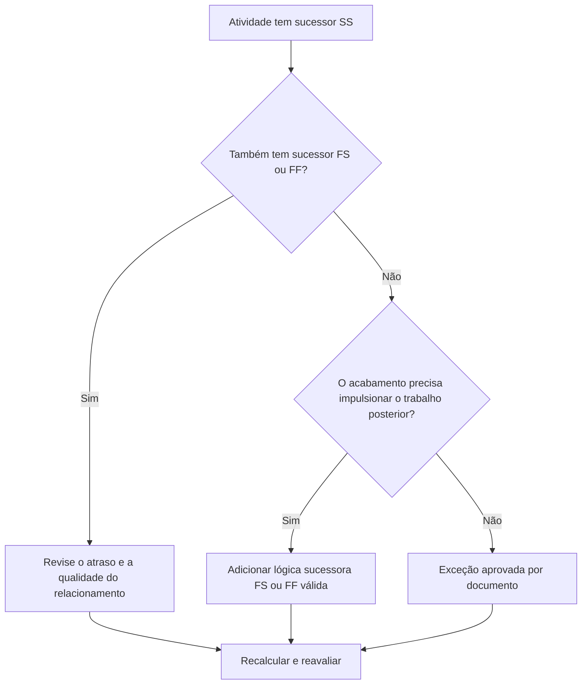

# Atividades com sucessores SS e sem sucessores FS ou FF - Guia de melhoria

## Propósito

Este guia ajuda os agendadores a revisar e corrigir atividades que possuem sucessores do início ao início, mas não sucessores do término ao início ou do término ao término. Ele oferece suporte a uma lógica CPM mais forte, confirmando que o término da atividade, e não apenas o início, está conectado à rede de agendamento downstream.

## Antes de começar

Reúna as seguintes informações antes de agir:

- Resultado da avaliação atual para esta métrica.
- Lista de atividades com sucessores SS e sem sucessores FS ou FF.
- Detalhes do relacionamento sucessor para cada atividade.
- Tipo de atividade, duração, status, calendário, folga total e EAP.
- Quaisquer atrasos, restrições ou datas esperadas que afetem a atividade ou seus sucessores.
- Informações relevantes sobre construção, engenharia, aquisição ou sequência de entrega.

## Entenda o seu resultado

Um resultado forte é zero atividades não resolvidas nesta condição. Isso significa que as atividades que iniciam o trabalho posterior também têm uma lógica baseada na conclusão, onde a conclusão do trabalho é importante.

Um resultado aceitável pode incluir exceções documentadas, como atividades de nível de esforço, atividades administrativas ou trabalho sobreposto intencionalmente onde a lógica final não é necessária. Estes devem ser revistos em vez de considerados válidos.

Um resultado fraco significa que várias atividades podem iniciar sucessores, mas não controlam nenhum término sucessor ou iniciar através de sua própria conclusão. Isso pode permitir que o trabalho inacabado pare de influenciar o cronograma.

## Meta de melhoria

A meta é 0 atividades não resolvidas com sucessores SS e nenhum sucessor FS ou FF.

O objetivo é confirmar que cada atividade tem um sucessor realista orientado para a conclusão, onde a conclusão afeta o trabalho posterior, ou que a falta de lógica de conclusão é justificada e documentada.

## Plano de Ação

### Etapa 1: Identifique o problema principal

Crie um layout ou exportação P6 que liste atividades com pelo menos um sucessor SS e nenhum sucessor FS ou FF. Inclui ID da atividade, nome da atividade, EAP, duração original, duração restante, folga total, sucessores, tipo de relacionamento, atraso, restrições e status da atividade.

Revise cada atividade e pergunte:

- Que trabalho começa porque esta atividade começa?
- Que trabalho, marco, entrega ou inspeção depende do término desta atividade?
- Está faltando um sucessor FS ou FF?
- O relacionamento SS está sendo usado para modelar corretamente o trabalho sobreposto?
- A atividade é uma exceção válida, como um nível de esforço ou uma atividade de suporte?

### Etapa 2: aplique as correções recomendadas

Adicione lógica baseada na conclusão onde a conclusão da atividade deve controlar o trabalho posterior. Use FS quando o sucessor não puder iniciar até que a atividade termine. Use FF quando o sucessor puder se sobrepor, mas não puder terminar até que o antecessor termine.

Revise os relacionamentos SS com lag. Se o atraso estiver sendo usado para aproximar a dependência final, substitua-o ou complemente-o com um relacionamento FS ou FF mais claro. Evite adicionar lógica apenas para satisfazer a métrica; cada relacionamento deve refletir a sequência real de trabalho.

Se a atividade for uma exceção válida, documente o motivo em um tópico de notebook, UDF, campo de comentários ou rastreador de qualidade do cronograma.

### Etapa 3: remover bloqueadores comuns

Os bloqueadores comuns incluem lógica copiada de cronogramas antigos, relacionamentos SS excessivos, pontos de transferência pouco claros e falta de informações de líderes de campo ou disciplina. Resolva-os revisando a sequência de trabalho real com o proprietário responsável.

Outro bloqueador é a crença de que o trabalho sobreposto sempre precisa apenas da lógica SS. A sobreposição pode ser válida, mas o acabamento do antecessor muitas vezes ainda precisa controlar um acabamento sucessor, inspeção, rotatividade ou atividade subsequente.

### Etapa 4: validar as alterações

Recalcular o cronograma após as correções. Execute novamente a métrica e confirme se cada atividade restante foi corrigida ou documentada como uma exceção aprovada.

Revise o impacto na folga total, no caminho crítico, no caminho mais longo e nos marcos de curto prazo. Se a adição da lógica de conclusão alterar as datas importantes, comunique o resultado ao líder de controles do projeto ou ao revisor do PMO.

## Cronograma de Melhoria

### Dia 1: Revisão e Diagnóstico

Execute a métrica, confirme a lista de atividades afetadas e separe as atividades em lógica de conclusão ausente, lógica SS fraca, problemas de atraso e possíveis exceções.

### Dias 2-3: Implementar Ações Prioritárias

Corrija primeiro as atividades críticas e quase críticas. Adicione sucessores FS ou FF válidos, ajuste a lógica SS inadequada e documente exceções justificadas.

### Dias 4-5: Monitore os primeiros resultados

Recalcule o cronograma e revise o movimento em datas e folga, caminho mais longo e marcos.

### Dia 6: Ajustes Finais

Resolva os itens incertos restantes com o responsável, proprietário do pacote ou líder de construção.

### Dia 7: Reavaliar e comparar

Execute a avaliação novamente e compare o resultado com o limite desejado.

## Acompanhando o progresso

Use um rastreador simples para gerenciar correções e aprovações.

| Data | Ação tomada | Impacto esperado | Resultado/Observação | Próxima etapa |
| --- | --- | --- | --- | --- |
| [Data] | Atividades sucessoras somente SS revisadas | Identifique a lógica de conclusão ausente | [Resultado observado] | Atribuir correções |
| [Data] | Adicionada lógica sucessora FS ou FF | Melhore a continuidade do CPM | [Resultado observado] | Recalcular cronograma |
| [Data] | Exceções válidas documentadas | Melhore a rastreabilidade das revisões | [Resultado observado] | Reavaliar métrica |

## Se os resultados não melhorarem

Se os resultados não melhorarem, verifique se o filtro está identificando exceções válidas, lógica duplicada ou atividades em uma área específica da EAP com fraco desenvolvimento de rede. Um problema repetido pode indicar que a equipe está confiando demais nos relacionamentos da SS durante o planejamento.

Encaminhe itens não resolvidos para o líder de planejamento ou revisor do PMO quando eles afetarem trabalho crítico, quase crítico, contratual ou relacionado à transferência.

## Manutenção

Revise essa métrica durante cada atualização do cronograma e antes da aprovação da linha de base. Preste atenção especial após resequenciamento, planejamento de recuperação, desenvolvimento de cronograma copiado ou grandes alterações de escopo.

## Lista de verificação resumida

- [ ] Resultado atual revisado
- [ ] Limite desejado confirmado
- [ ] Principal problema identificado
- [ ] Sucessores SS revisados
- [ ] Lógica FS ou FF ausente corrigida
- [ ] Atrasos e restrições verificados
- [ ] Exceções válidas documentadas
- [ ] Cronograma recalculado
- [ ] Resultados monitorados
- [ ] Avaliação repetida
- [ ] Próximas etapas documentadas
## Conteúdo relacionado
- [Atividades com sucessores SS e sem sucessores FS ou FF - Visão geral](01_overview_template.md)
- [Modelo de blog](03_blog_template.md)
- [O que é um cronograma](../../06b_blogs_pt/01_WHAT%20A%20SCHEDULE%20IS/01_blog.md)
- [Lógica Robusta](../../06b_blogs_pt/02_ROBUST%20LOGIC/02_ROBUST%20LOGIC.md)
