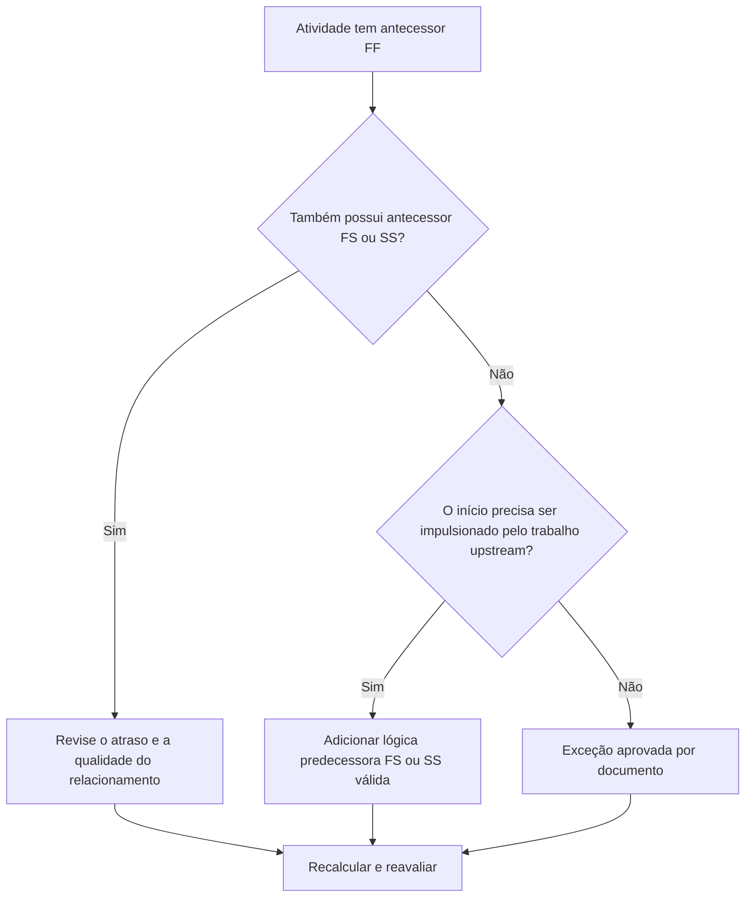

# Atividades com predecessores FF e sem predecessores FS ou SS - Guia de melhoria

## Propósito

Este guia ajuda os agendadores a revisar e corrigir atividades que possuem predecessores de Término a Término, mas não têm predecessores de Término a Início ou Início a Início. Ele oferece suporte a uma lógica CPM mais forte, confirmando que o início da atividade, e não apenas o término, está conectado à rede de agendamento upstream.

## Antes de começar

Reúna as seguintes informações antes de agir:

- Resultado da avaliação atual para esta métrica.
- Lista de atividades com antecessores de FF e sem antecessores de FS ou SS.
- Detalhes do relacionamento antecessor para cada atividade.
- Tipo de atividade, duração, status, calendário, folga total e EAP.
- Quaisquer atrasos, restrições ou datas esperadas que afetem a atividade ou seus antecessores.
- Informações relevantes sobre construção, engenharia, aquisição, acesso, aprovação ou sequência de transferência.

## Entenda o seu resultado

Um resultado forte é zero atividades não resolvidas nesta condição. Isso significa que as atividades cujos términos estão vinculados ao trabalho anterior também têm uma lógica de início e condução válida quando necessário.

Um resultado aceitável pode incluir exceções documentadas, como atividades de nível de esforço, atividades administrativas ou trabalho paralelo intencionalmente modelado onde a lógica inicial não é necessária. Estes devem ser revistos em vez de considerados válidos.

Um resultado fraco significa que várias atividades podem terminar em relação às antecessoras, mas o seu início não é controlado pelo trabalho a montante. Isto pode permitir que as atividades comecem mais cedo do que a sequência real suporta.

## Meta de melhoria

A meta é 0 atividades não resolvidas com antecessores de FF e nenhum antecessor de FS ou SS.

O objetivo é confirmar que cada atividade tem um antecessor realista de arranque, onde o arranque depende do trabalho a montante, ou que a falta de lógica de arranque é justificada e documentada.

## Plano de Ação

### Etapa 1: Identifique o problema principal

Crie um layout ou exportação P6 que liste atividades com pelo menos um antecessor FF e nenhum antecessor FS ou SS. Inclui ID da atividade, nome da atividade, EAP, duração original, duração restante, folga total, predecessores, tipo de relacionamento, atraso, restrições e status da atividade.

Revise cada atividade e pergunte:

- O que deve acontecer antes que esta atividade possa começar?
- O antecessor do FF controla apenas o alinhamento final?
- Está faltando um antecessor FS ou SS?
- O relacionamento FF está sendo usado para modelar corretamente o trabalho sobreposto?
- A atividade é uma exceção válida, como um nível de esforço ou uma atividade de suporte?

### Etapa 2: aplique as correções recomendadas

Adicione lógica start-drive onde o início da atividade deve depender do trabalho anterior. Use FS quando a atividade não puder ser iniciada até que a predecessora termine. Use SS quando a atividade puder ser iniciada após o início da predecessora ou atingir um ponto definido de progresso.

Revise as relações FF com lag. Se o atraso estiver sendo usado para aproximar a dependência inicial, substitua-o ou complemente-o com uma lógica FS ou SS mais clara. Evite adicionar relacionamentos apenas para satisfazer a métrica; cada relacionamento deve refletir a sequência real de trabalho.

Se a atividade for uma exceção válida, documente o motivo em um tópico de notebook, UDF, campo de comentários ou rastreador de qualidade do cronograma.

### Etapa 3: remover bloqueadores comuns

Bloqueadores comuns incluem lógica copiada de cronogramas antigos, uso excessivo de relacionamentos FF, acesso pouco claro ou pontos de liberação e falta de informações de líderes de campo ou disciplina. Resolva-os revisando a condição inicial real com o proprietário responsável.

Outro bloqueador é a crença de que a lógica FF é suficiente quando duas atividades devem terminar juntas. O alinhamento final pode ser válido, mas a atividade sucessora muitas vezes ainda precisa de uma condição inicial clara.

### Etapa 4: validar as alterações

Recalcular o cronograma após as correções. Execute novamente a métrica e confirme se cada atividade restante foi corrigida ou documentada como uma exceção aprovada.

Revise o impacto nas datas iniciais, folga total, caminho crítico, caminho mais longo e marcos de curto prazo. Se a adição da lógica de início alterar as datas importantes, comunique o resultado ao líder de controles do projeto ou ao revisor do PMO.

## Cronograma de Melhoria

### Dia 1: Revisão e Diagnóstico

Execute a métrica, confirme a lista de atividades afetadas e separe as atividades em lógica de início ausente, lógica FF fraca, problemas de atraso e possíveis exceções.

### Dias 2-3: Implementar Ações Prioritárias

Corrija primeiro as atividades críticas e quase críticas. Adicione predecessores FS ou SS válidos, ajuste a lógica FF inadequada e documente exceções justificadas.

### Dias 4-5: Monitore os primeiros resultados

Recalcule o cronograma e revise o movimento em datas iniciais, folga, caminho mais longo e datas de marcos.

### Dia 6: Ajustes Finais

Resolva os itens incertos restantes com o responsável, proprietário do pacote ou líder de construção.

### Dia 7: Reavaliar e comparar

Execute a avaliação novamente e compare o resultado com o limite desejado.

## Acompanhando o progresso

Use um rastreador simples para gerenciar correções e aprovações.

| Data | Ação tomada | Impacto esperado | Resultado/Observação | Próxima etapa |
| --- | --- | --- | --- | --- |
| [Data] | Atividades predecessoras somente FF revisadas | Identifique a lógica de início ausente | [Resultado observado] | Atribuir correções |
| [Data] | Adicionada lógica predecessora FS ou SS | Melhore a continuidade do CPM | [Resultado observado] | Recalcular cronograma |
| [Data] | Exceções válidas documentadas | Melhore a rastreabilidade das revisões | [Resultado observado] | Reavaliar métrica |

## Se os resultados não melhorarem

Se os resultados não melhorarem, verifique se o filtro está identificando exceções válidas, lógica duplicada ou atividades em uma área específica da EAP com fraco desenvolvimento de rede. Um problema repetido pode indicar que a equipa está a confiar demasiado nas relações de FF durante o planeamento.

Escale itens não resolvidos para o líder de planejamento ou revisor do PMO quando eles afetarem trabalho crítico, quase crítico, contratual, relacionado ao acesso ou à transferência.

## Manutenção

Revise essa métrica durante cada atualização do cronograma e antes da aprovação da linha de base. Preste atenção especial após resequenciamento, planejamento de recuperação, desenvolvimento de cronograma copiado ou grandes alterações de escopo.

## Lista de verificação resumida

- [ ] Resultado atual revisado
- [ ] Limite desejado confirmado
- [ ] Principal problema identificado
- [ ] Predecessores do FF revisados
- [ ] Lógica FS ou SS ausente corrigida
- [ ] Atrasos e restrições verificados
- [ ] Exceções válidas documentadas
- [ ] Cronograma recalculado
- [ ] Resultados monitorados
- [ ] Avaliação repetida
- [ ] Próximas etapas documentadas
## Conteúdo relacionado
- [Atividades com predecessores FF e sem predecessores FS ou SS - Visão geral](01_overview_template.md)
- [Modelo de blog](03_blog_template.md)
- [O que é um cronograma](../../06b_blogs_pt/01_WHAT%20A%20SCHEDULE%20IS/01_blog.md)
- [Lógica Robusta](../../06b_blogs_pt/02_ROBUST%20LOGIC/02_ROBUST%20LOGIC.md)
