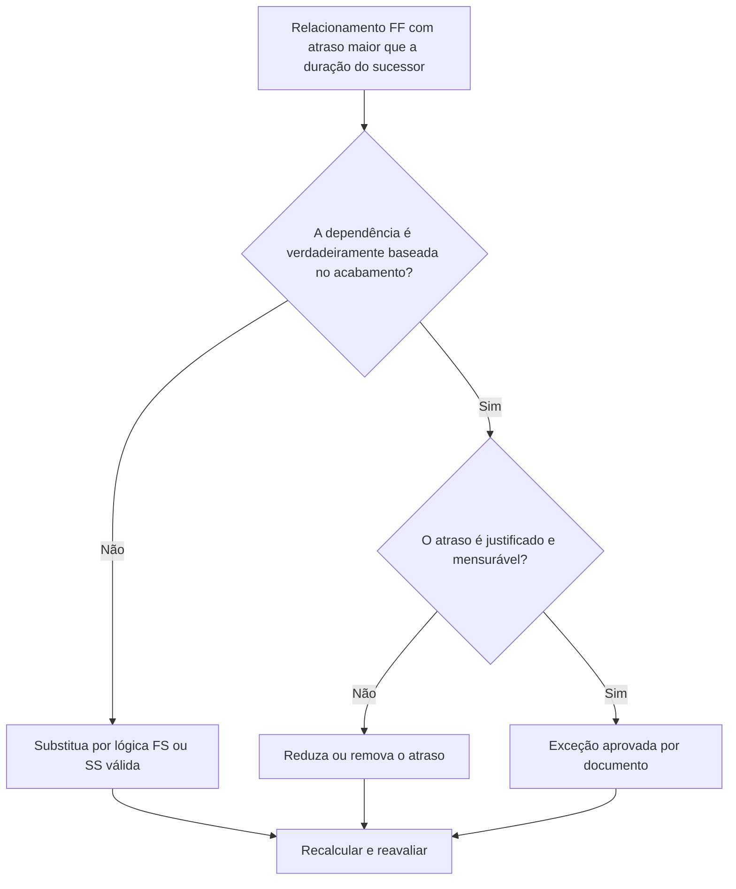

## Propósito

Este guia ajuda os agendadores a revisar e corrigir relacionamentos de Término a Término onde o atraso é maior que a duração da atividade sucessora. Ele oferece suporte a uma lógica de CPM mais clara, substituindo o atraso excessivo de FF por lógica de relacionamento ou atividades visíveis que representam melhor a sequência real de trabalho.

## Antes de começar

Reúna as seguintes informações antes de agir:

- Resultado da avaliação atual para esta métrica.
- Lista de relacionamentos FF onde o atraso é maior que a duração do sucessor.
- IDs de atividades predecessoras e sucessoras, nomes, EAP, durações, calendários e status.
- Atraso no relacionamento, tipo de relacionamento e quaisquer restrições relacionadas.
- Configurações de cálculo de cronograma e base de calendário usadas para atraso.
- Lógica de campo, engenharia, aquisição, aprovação ou transferência explicando a dependência pretendida.

## Entenda o seu resultado

Um resultado forte é zero relacionamentos FF não resolvidos onde o atraso excede a duração do sucessor.

Um resultado aceitável pode incluir exceções documentadas, mas estas devem ser raras. O atraso FF longo geralmente indica que o tipo de relacionamento não corresponde à dependência que está sendo modelada.

Um resultado fraco significa que o cronograma contém vários links de término a término, onde o término do sucessor é atrasado por mais tempo do que a duração da atividade sucessora. Isso pode ocultar a lógica orientada para o início, os períodos de espera ou a falta de atividades intermediárias.

## Meta de melhoria

O alvo é 0 relacionamentos FF não resolvidos com atraso maior que a duração do sucessor.

O objetivo é confirmar se cada relacionamento deve permanecer FF, ser convertido para lógica FS ou SS, ter o atraso reduzido ou ser documentado como uma exceção válida.

## Plano de Ação

### Etapa 1: Identifique o problema principal

Crie um layout P6 ou exporte que liste relacionamentos FF onde o atraso é maior que a duração do sucessor. Inclui ID da atividade predecessora e sucessora, nome da atividade, EAP, duração original, duração restante, tipo de relacionamento, atraso, calendário, folga total e status da atividade.

Revise cada relacionamento e pergunte:

- Por que o sucessor termina depois de tanto atraso?
- O sucessor depende realmente do término do antecessor ou de outra condição de início ou transferência?
- O atraso é maior que a duração original do sucessor, a duração restante ou ambas?
- O atraso está sendo usado para modelar o tempo de revisão, cura, entrega, aprovação, acesso ou outro período de espera real?
- Um relacionamento FS ou SS tornaria a dependência mais clara?

### Etapa 2: aplique as correções recomendadas

Se o sucessor começar após o antecessor terminar, substitua o relacionamento FF por um relacionamento FS. Se o sucessor puder iniciar após o antecessor iniciar ou atingir um ponto definido de progresso, use a lógica SS.

Se o relacionamento for realmente baseado no acabamento, revise o valor do atraso. Reduza o atraso excessivo onde foi usado como espaço reservado aproximado ou herdado da lógica copiada. Se o atraso representar um período de espera real, confirme se a unidade, o calendário e a explicação estão corretos.

Evite usar o longo atraso como substituto de atividades que deveriam estar visíveis na programação. Se o atraso representar tempo de revisão, resolução, entrega, mobilização, aprovação ou encerramento, considere modelar esse trabalho como uma atividade separada.

### Etapa 3: remover bloqueadores comuns

Os bloqueadores comuns incluem lógica copiada de programações anteriores, períodos de espera ocultos, confusão de calendário e pressão para manter a rede simples. Resolva-os confirmando a dependência pretendida com o proprietário responsável.

Outro bloqueador é tratar o lag como inofensivo. Latências longas podem ser difíceis de revisar, podem ocultar riscos e dificultar a análise de atrasos porque o período de espera não é visível como uma atividade.

### Etapa 4: validar as alterações

Recalcular o cronograma após as correções. Execute novamente a métrica e confirme se cada item restante foi corrigido ou documentado como uma exceção aprovada.

Revise a folga total, o caminho mais longo, o caminho crítico e os marcos de curto prazo. Se as mudanças no relacionamento mudarem as datas importantes, comunique o resultado ao líder de controles do projeto ou ao revisor do PMO.

## Cronograma de Melhoria

### Dia 1: Revisão e Diagnóstico

Execute a métrica, confirme a lista de relacionamentos afetados e separe os itens em tipo de relacionamento errado, atraso excessivo, atividade oculta, problema de calendário e possível exceção.

### Dias 2-3: Implementar Ações Prioritárias

Corrija primeiro os relacionamentos críticos e quase críticos. Converta a lógica FF em FS ou SS quando apropriado, reduza atrasos injustificados e documente exceções válidas.

### Dias 4-5: Monitore os primeiros resultados

Recalcule o cronograma e revise o movimento em datas e folga, caminho mais longo e marcos.

### Dia 6: Ajustes Finais

Resolva os itens incertos restantes com o responsável, proprietário do pacote ou líder de construção.

### Dia 7: Reavaliar e comparar

Execute a avaliação novamente e compare o resultado com o limite desejado.

## Acompanhando o progresso

Use um rastreador simples para gerenciar correções e aprovações.

| Data | Ação tomada | Impacto esperado | Resultado/Observação | Próxima etapa |
| --- | --- | --- | --- | --- |
| [Data] | Atraso de FF revisado maior que a duração do sucessor | Identifique lógica fraca ou pouco clara | [Resultado observado] | Atribuir correções |
| [Data] | Relacionamento convertido para FS ou SS | Melhore a clareza da lógica do CPM | [Resultado observado] | Recalcular cronograma |
| [Data] | Atraso reduzido ou documentado | Melhore a rastreabilidade das revisões | [Resultado observado] | Reavaliar métrica |

## Se os resultados não melhorarem

Se os resultados não melhorarem, verifique se os mesmos padrões de relacionamento se repetem em uma área específica da EAP, disciplina ou seção copiada do cronograma. Descobertas repetidas podem indicar que a equipe está usando o atraso do FF como um atalho padrão em vez de modelar dependências reais.

Escale itens não resolvidos quando eles afetarem trabalhos críticos, quase críticos, contratuais, de aquisição, de aprovação, de comissionamento ou de entrega.

## Manutenção

Revise essa métrica durante cada atualização do cronograma e antes da aprovação da linha de base. Preste atenção especial após o desenvolvimento do cronograma copiado, resequenciamento, planejamento de recuperação ou grandes alterações de escopo.

## Lista de verificação resumida

- [ ] Resultado atual revisado
- [ ] Limite desejado confirmado
- [ ] Principal problema identificado
- [ ] Relacionamentos FF revisados
- [ ] Atraso excessivo corrigido ou justificado
- [ ] Substituições FS ou SS aplicadas quando necessário
- [ ] Trabalho oculto modelado quando apropriado
- [ ] Cronograma recalculado
- [ ] Resultados monitorados
- [ ] Avaliação repetida
- [ ] Próximas etapas documentadas
## Conteúdo relacionado
- [Modelo de blog](03_blog_template.md)
- [O que é um cronograma](../../06b_blogs_pt/01_WHAT%20A%20SCHEDULE%20IS/01_blog.md)
- [Lógica Robusta](../../06b_blogs_pt/02_ROBUST%20LOGIC/02_ROBUST%20LOGIC.md)
