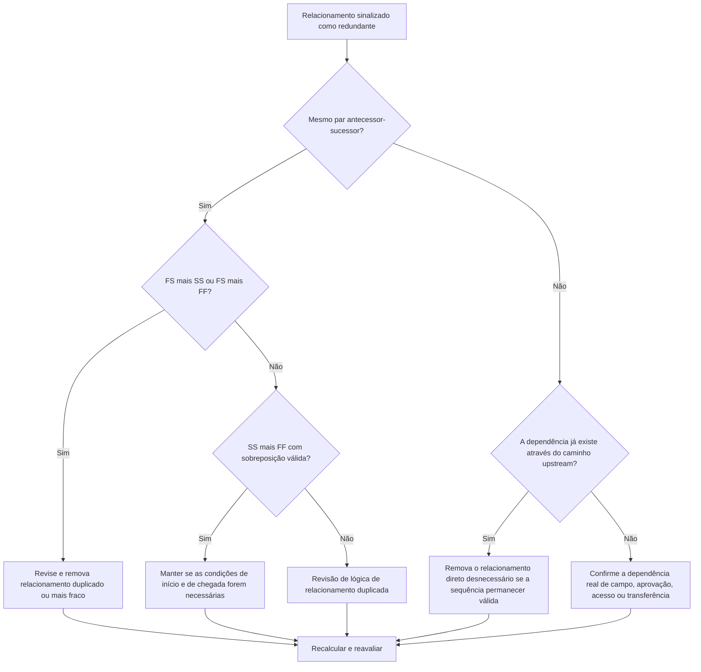

# Lógica redundante em programações do Primavera P6 - Guia de melhoria

## Propósito

Este guia ajuda os agendadores a identificar e remover lógica redundante de um cronograma do Primavera P6. Aplica-se a padrões de relacionamento duplicados, lógica predecessora repetida e dependências desnecessárias que não representam uma sequência de trabalho real.

## Antes de começar

Reúna as seguintes informações antes de agir:

- Resultado da avaliação atual para esta métrica.
- Lista de atividades e relacionamentos sinalizados como lógica redundante.
- Detalhes do antecessor e do sucessor para cada atividade sinalizada.
- Tipos de relacionamento, atrasos, calendários, folga total e indicadores de relacionamento direcionadores.
- EAP, códigos de atividades e propriedade de disciplina ou pacote de trabalho.
- Informações de campo, engenharia, aquisição, aprovação ou transferência que explicam a dependência real.

## Entenda o seu resultado

Um resultado forte é zero relacionamentos redundantes não resolvidos.

Um resultado aceitável pode incluir raras exceções documentadas em que a lógica de aparência duplicada é usada intencionalmente por um motivo defensável. Esses casos devem ser revisados ​​cuidadosamente porque a lógica redundante geralmente é um problema de qualidade do cronograma.

Um resultado fraco significa que o cronograma contém lógica de relacionamento repetida ou desnecessária. Isso pode acontecer quando as seções copiadas do cronograma não são limpas, os relacionamentos são adicionados sem verificar os caminhos existentes ou vários tipos de dependência são usados ​​entre as mesmas atividades.

## Meta de melhoria

O alvo é 0 relacionamentos redundantes não resolvidos.

O objetivo é manter apenas os relacionamentos que representam dependências reais e remover a lógica que duplica, mascara ou exagera a sequência de trabalho real.

## Plano de Ação

### Etapa 1: Identifique o problema principal

Crie um layout P6, um relatório ou uma revisão de relacionamento externo que identifique uma provável lógica redundante. Concentre-se nestes casos:

- O mesmo antecessor conectou-se ao mesmo sucessor mais de uma vez, especialmente FS mais SS ou FS mais FF.
- SS mais FF entre as mesmas duas atividades podem ser válidos quando a sobreposição é modelada corretamente e ambas as condições de início e término são importantes.
- Uma atividade com o mesmo antecessor e tipo de relacionamento que seu próprio antecessor, criando lógica herdada repetida através da cadeia.
- Cadeias predecessoras repetidas mais longas, nas quais a mesma dependência aparece vários passos atrás.
- Dependências que não alteram sequenciamento, datas, folga, transferência, acesso ou controle de risco.

Revise cada relacionamento sinalizado e pergunte:

- Esse relacionamento adiciona uma dependência real?
- A dependência já está representada por outro relacionamento entre as mesmas atividades?
- A dependência já está representada por um caminho upstream?
- A remoção do relacionamento mudaria a lógica de programação válida ou apenas simplificaria a rede?
- O relacionamento está direcionando as datas por um motivo legítimo ou apenas porque uma lógica redundante foi adicionada?

### Etapa 2: aplique as correções recomendadas

Comece com duplicatas exatas e pares repetidos de predecessor-sucessor. Se as mesmas duas atividades estiverem conectadas com FS mais SS ou FS mais FF, determine qual relacionamento representa a dependência real. Remova o relacionamento que duplica ou enfraquece a lógica.

Revise os pares SS mais FF separadamente. Esta combinação pode ser válida quando um relacionamento controla quando o trabalho sobreposto pode começar e o outro controla quando ele pode terminar. Guarde-o somente quando ambas as condições forem reais e documentadas pela sequência de trabalho.

A seguir, revise a lógica predecessora herdada. Se a Atividade C tiver a mesma relação predecessora que a Atividade B, e a Atividade B já for uma predecessora da Atividade C, a relação direta da atividade anterior poderá ser desnecessária. Remova-o se a sequência de CPM permanecer correta no caminho existente.

Por fim, remova dependências desnecessárias que não suportam sequência de trabalho, acesso, aprovação, transferência, controle de risco ou lógica contratual.

### Etapa 3: remover bloqueadores comuns

Os bloqueadores comuns incluem lógica copiada de cronogramas mais antigos, modelagem excessiva para fazer a rede parecer conectada e adição de relacionamentos durante atualizações sem verificar o caminho existente.

Outro bloqueador é o medo de que o rompimento dos relacionamentos enfraqueça o cronograma. O objetivo não é remover controles válidos; é remover relacionamentos que duplicam controles já presentes na rede.

### Etapa 4: validar as alterações

Recalcule o cronograma após remover ou ajustar a lógica redundante. Revise a folga total, os relacionamentos de condução, o caminho mais longo, o caminho crítico e as principais datas dos marcos.

Se a remoção de um relacionamento alterar as datas inesperadamente, investigue se o link removido estava realmente servindo a uma dependência válida ou se outro relacionamento ausente precisa ser adicionado com mais precisão.

## Cronograma de Melhoria

### Dia 1: Revisão e Diagnóstico

Execute a métrica, confirme a lista de relacionamentos afetados e separe as descobertas em pares duplicados, combinações FS mais SS/FF, lógica predecessora herdada e dependências desnecessárias.

### Dias 2-3: Implementar Ações Prioritárias

Corrija primeiro os relacionamentos críticos e quase críticos. Remova duplicatas exatas, limpe pares predecessores repetidos e documente combinações válidas de SS mais FF.

### Dias 4-5: Monitore os primeiros resultados

Recalcule o cronograma e revise o movimento em folga, caminho mais longo, relações de condução e datas de marcos.

### Dia 6: Ajustes Finais

Resolva itens incertos com o responsável, proprietário do pacote ou líder de construção.

### Dia 7: Reavaliar e comparar

Execute a avaliação novamente e compare o resultado com o limite desejado.

## Acompanhando o progresso

Use um rastreador simples para gerenciar correções e aprovações.

| Data | Ação tomada | Impacto esperado | Resultado/Observação | Próxima etapa |
| --- | --- | --- | --- | --- |
| [Data] | Lista de relacionamentos redundantes revisada | Identifique lógica duplicada ou desnecessária | [Resultado observado] | Atribuir correções |
| [Data] | Relacionamentos duplicados removidos | Simplifique a rede CPM | [Resultado observado] | Recalcular cronograma |
| [Data] | Exceções válidas documentadas | Melhore a rastreabilidade das revisões | [Resultado observado] | Reavaliar métrica |

## Se os resultados não melhorarem

Caso os resultados não melhorem, verifique se a lógica redundante está concentrada em uma área específica da EAP, seção copiada do projeto, disciplina ou período de atualização do cronograma. Descobertas repetidas podem indicar que a limpeza do relacionamento não faz parte do fluxo de trabalho normal do cronograma.

Escale a lógica redundante não resolvida quando ela afetar trabalhos críticos, quase críticos, contratuais, de acesso, aprovação ou relacionados à transferência.

## Manutenção

Revise essa métrica durante cada atualização do cronograma e antes da aprovação da linha de base. Preste atenção especial após o desenvolvimento do cronograma copiado, resequenciamento, planejamento de recuperação ou grandes revisões lógicas.

## Lista de verificação resumida

- [ ] Resultado atual revisado
- [ ] Limite desejado confirmado
- [ ] Principal problema identificado
- [ ] Pares duplicados de antecessor-sucessor revisados
- [ ] Combinações FS mais SS ou FS mais FF corrigidas
- [ ] Combinações válidas de SS mais FF documentadas
- [ ] Lógica predecessora herdada revisada
- [ ] Dependências desnecessárias removidas
- [ ] Cronograma recalculado
- [ ] Resultados monitorados
- [ ] Avaliação repetida
- [ ] Próximas etapas documentadas
## Conteúdo relacionado
- [Lógica redundante em programações do Primavera P6 - Visão geral](01_overview_template.md)
- [Modelo de blog](03_blog_template.md)
- [O que é um cronograma](../../06b_blogs_pt/01_WHAT%20A%20SCHEDULE%20IS/01_blog.md)
- [Lógica Robusta](../../06b_blogs_pt/02_ROBUST%20LOGIC/02_ROBUST%20LOGIC.md)
