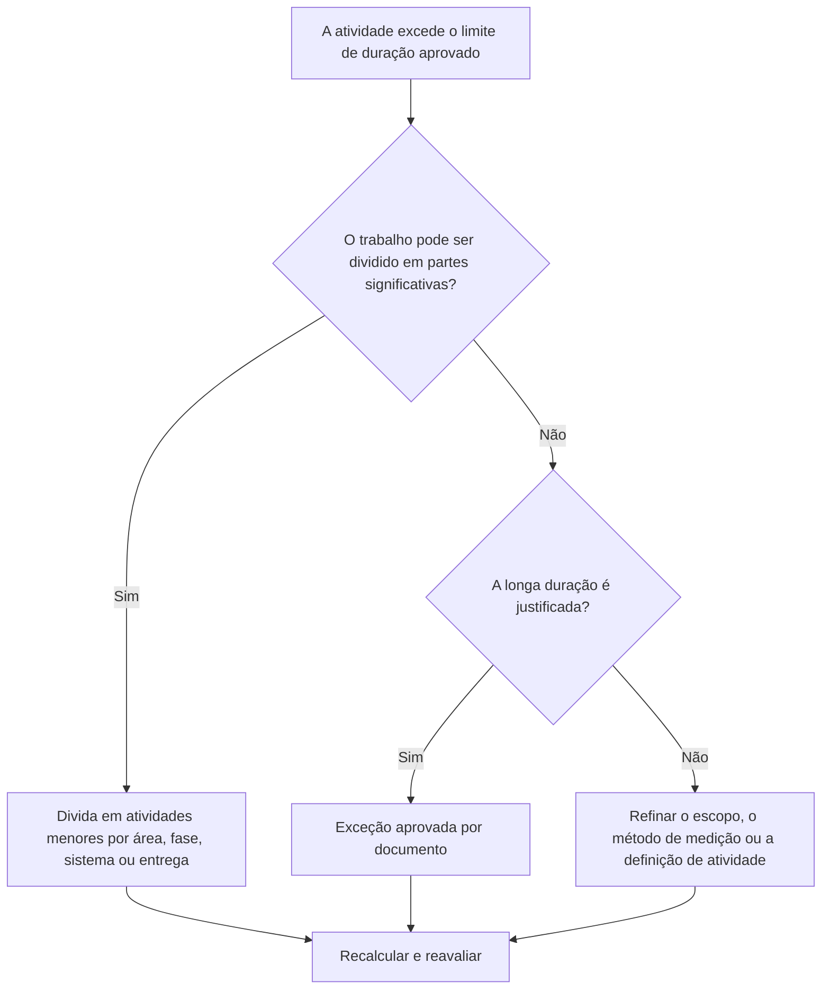

## Propósito

Este guia ajuda os programadores a revisar e melhorar atividades com durações superiores ao limite aprovado do projeto. A duração aceitável depende do tipo de projeto, do nível de detalhe, do ciclo de relatórios, dos requisitos do contrato e da sensibilidade do cliente a atividades longas.

## Antes de começar

Reúna as seguintes informações antes de agir:

- Resultado da avaliação atual para esta métrica.
- Duração máxima da atividade aprovada para o nível do projeto ou do cronograma.
- Lista de atividades acima do limite de duração.
- Duração original, duração restante, tipo de atividade, status, EAP, calendário e folga total.
- Requisitos de linha de base, expectativas de relatórios do cliente e regras de qualidade do cronograma do PMO.
- Período de planejamento antecipado, ciclo de atualização do progresso e disciplina ou propriedade do pacote.
- Quaisquer exceções justificadas, como atividades de aquisição, cura, entrega, revisão, testes ou nível de esforço.

## Entenda o seu resultado

Um resultado forte é zero atividades não resolvidas acima do limite aprovado de longa duração.

Um resultado aceitável pode incluir excepções documentadas, especialmente para atividades que não podem ser razoavelmente decompostas ou que são intencionalmente geridas como atividades de controlo do tipo sumário. Estas devem ser limitadas e claramente justificadas.

Um resultado fraco significa que o calendário contém muitas atividades que são demasiado amplas para um planeamento e controlo eficazes. Isso pode reduzir a visibilidade do progresso e dificultar a compreensão de qual trabalho está realmente direcionando o cronograma.

## Meta de melhoria

A meta é 0 atividades não resolvidas acima do limite de duração aprovado.

O objetivo é dividir atividades longas em atividades menores e significativas, onde é necessário um melhor controle, ao mesmo tempo em que documenta exceções válidas quando uma longa duração é apropriada.

## Plano de Ação

### Etapa 1: Identifique o problema principal

Crie um layout ou relatório P6 que liste as atividades que excedem o limite de duração definido pelo projeto. Inclui ID da atividade, nome da atividade, EAP, tipo de atividade, duração original, duração restante, início, término, calendário, folga total e status da atividade.

Revise cada atividade e pergunte:

- A duração da atividade é superior ao limite aprovado para este tipo de projeto e nível de cronograma?
- A atividade cobre múltiplas etapas de trabalho, locais, sistemas, áreas ou resultados?
- O progresso pode ser medido objetivamente durante cada ciclo de atualização?
- A atividade precisa de mais detalhes porque o cliente ou PMO é sensível a longas durações?
- A atividade é uma exceção válida que deve permanecer por muito tempo?

### Etapa 2: aplique as correções recomendadas

Divida atividades longas onde o trabalho possa ser planejado e medido em partes menores. Os métodos de detalhamento comuns incluem localização, área de EAP, disciplina, sistema, entrega, fase, sequência da equipe ou período do relatório.

Ao dividir uma atividade, preserve a sequência lógica real. Adicione predecessores e sucessores apropriados, atribua o calendário correto e confirme se as novas atividades refletem como o trabalho será realmente executado.

Não divida as atividades apenas para satisfazer a métrica. A repartição deve melhorar o controlo, a medição do progresso, o planeamento antecipado ou a clareza dos relatórios.

### Etapa 3: remover bloqueadores comuns

Os bloqueadores comuns incluem definição de escopo incompleta, estrutura de EAP fraca, entrada de campo limitada e pressão para manter baixa a contagem de atividades. Resolva-os revisando atividades longas com o responsável, proprietário do pacote ou líder de construção.

Outro bloqueador é usar uma atividade longa para representar o trabalho que deveria ser planejado como uma sequência. Se a atividade contiver diversas transferências, faces de trabalho, entregas ou pontos de controle, provavelmente precisará de mais detalhes.

### Etapa 4: validar as alterações

Recalcular o cronograma após dividir ou ajustar atividades longas. Confirme se cada nova atividade tem lógica, duração, calendário e medição de progresso apropriados.

Revise a folga total, o caminho crítico, o caminho mais longo e as datas dos marcos. Se o detalhamento alterar as datas-chave, comunique o motivo ao líder de controles do projeto ou ao revisor do PMO.

## Cronograma de Melhoria

### Dia 1: Revisão e Diagnóstico

Execute a métrica, confirme o limite de duração e separe as atividades em candidatos divididos, exceções válidas e itens que exigem entrada do proprietário.

### Dias 2-3: Implementar Ações Prioritárias

Corrija primeiro as atividades críticas, quase críticas e sensíveis ao cliente. Divida as atividades amplas e documente as exceções válidas.

### Dias 4-5: Monitore os primeiros resultados

Recalcule o cronograma e revise o movimento em termos de folga, caminho mais longo, datas de marcos e visibilidade antecipada.

### Dia 6: Ajustes Finais

Resolva os itens incertos restantes com a disciplina responsável, o proprietário do pacote ou o líder de controles do projeto.

### Dia 7: Reavaliar e comparar

Execute a avaliação novamente e compare o resultado com o limite desejado.

## Acompanhando o progresso

Use um rastreador simples para gerenciar correções e aprovações.

| Data | Ação tomada | Impacto esperado | Resultado/Observação | Próxima etapa |
| --- | --- | --- | --- | --- |
| [Data] | Atividades revisadas de longa duração | Identifique atividades que precisam ser divididas | [Resultado observado] | Atribuir proprietários |
| [Data] | Divida a atividade em etapas de trabalho menores | Melhore a visibilidade do progresso | [Resultado observado] | Recalcular cronograma |
| [Data] | Exceção válida documentada | Melhore a rastreabilidade das revisões | [Resultado observado] | Reavaliar métrica |

## Se os resultados não melhorarem

Se os resultados não melhorarem, verifique se o limite de duração não é claro, é aplicado de forma inconsistente ou não está alinhado com o nível do calendário. Revise também se as atividades longas estão concentradas em uma área, disciplina ou fase do projeto específica da EAP.

Escale atividades não resolvidas de longa duração quando elas afetarem trabalhos críticos, quase críticos, contratuais, de relatórios ou sensíveis ao cliente.

## Manutenção

Revise essa métrica durante cada atualização do cronograma, desenvolvimento da linha de base e exercício importante de ressequenciamento. Atualize o limite se o projeto passar para uma fase ou nível de detalhe diferente.

## Lista de verificação resumida

- [ ] Resultado atual revisado
- [ ] Limite desejado confirmado
- [ ] Principal problema identificado
- [ ] Atividades longas revisadas
- [ ] Candidatos divididos identificados
- [ ] Atividades divididas quando úteis
- [ ] Exceções válidas documentadas
- [ ] Cronograma recalculado
- [ ] Resultados monitorados
- [ ] Avaliação repetida
- [ ] Próximas etapas documentadas
## Conteúdo relacionado
- [Modelo de blog](03_blog_template.md)
- [O que é um cronograma](../../06b_blogs_pt/01_WHAT%20A%20SCHEDULE%20IS/01_blog.md)
- [Lógica Robusta](../../06b_blogs_pt/02_ROBUST%20LOGIC/02_ROBUST%20LOGIC.md)
