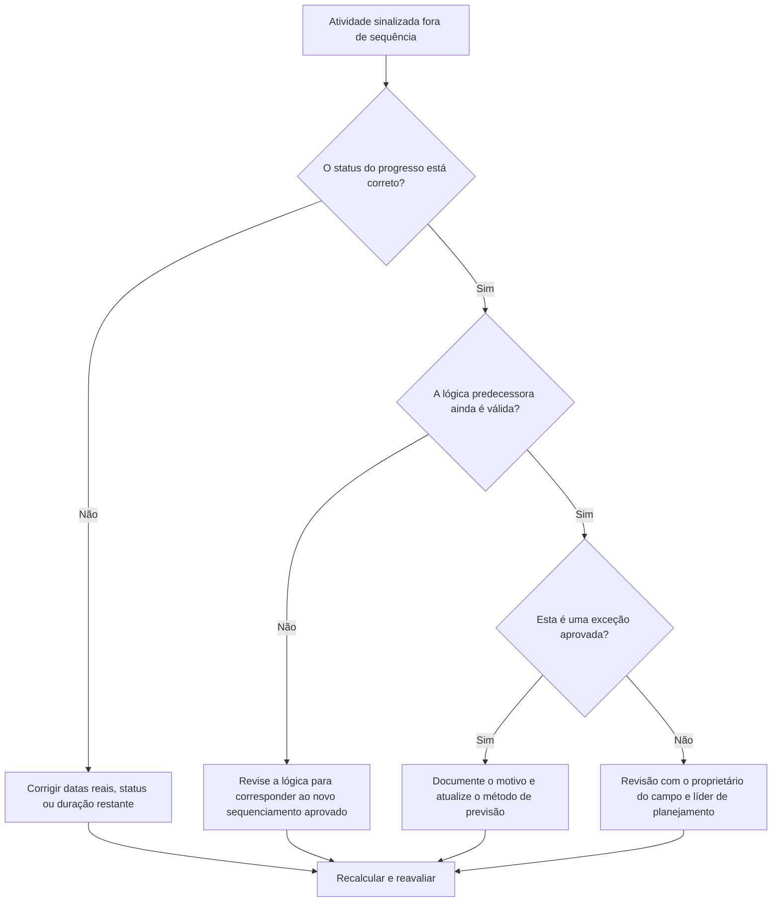

## Propósito

Este guia ajuda os programadores a revisar e corrigir atividades que estão fora de sequência no Primavera P6. Aplica-se quando uma atividade foi iniciada ou progrediu antes de sua lógica predecessora necessária ter sido satisfeita.

## Antes de começar

Reúna as seguintes informações antes de agir:

- Resultado da avaliação atual para esta métrica.
- Lista de atividades sinalizadas como fora de sequência.
- Data Date usada na atualização mais recente.
- Início Real, Término Real, Duração Restante e Status da Atividade.
- Detalhes do relacionamento antecessor e sucessor, incluindo tipo de relacionamento e atraso.
- Configurações de cálculo de cronograma, especialmente lógica retida e substituição de progresso.
- Explicação de campo sobre por que o trabalho progrediu antes da conclusão da lógica planejada.

## Entenda o seu resultado

Um resultado forte é zero atividades fora de sequência não resolvidas.

Um resultado aceitável pode incluir exceções documentadas em que o trabalho foi resequenciado intencionalmente e a lógica do cronograma foi atualizada para refletir o novo plano.

Um resultado fraco significa que a atualização do cronograma contém progresso que entra em conflito com a rede lógica existente. Isso pode indicar status incorreto, dados reais ausentes, lógica desatualizada ou resequenciamento de campo real que ainda não foi refletido na previsão.

## Meta de melhoria

A meta é 0 atividades fora de sequência não resolvidas.

O objetivo é determinar se cada item é um erro de status, um erro lógico ou um evento real de ressequenciamento e, em seguida, corrigir o cronograma para que represente o plano atual.

## Plano de Ação

### Etapa 1: Identifique o problema principal

Crie um layout P6 ou relatório listando atividades fora de sequência. Inclui ID da atividade, nome da atividade, EAP, status, início real, término real, duração restante, início, término, folga total, predecessores, sucessores, tipo de relacionamento, atraso e indicadores de relacionamento de condução.

Revise cada atividade e pergunte:

- A atividade realmente começou antes que o requisito anterior fosse atendido?
- O status do antecessor está correto?
- O status do sucessor está correto?
- O relacionamento ainda é válido após o novo sequenciamento de campo?
- A lógica do cronograma deve ser alterada ou a atualização do progresso deve ser corrigida?
- Qual opção de programação do P6 está sendo usada: lógica retida ou substituição de progresso?

### Etapa 2: aplique as correções recomendadas

Corrija os erros de status primeiro. Se o início real, o término real, a duração restante ou o status do antecessor estiverem errados, atualize os dados da atividade antes de alterar a lógica.

Se a sequência de campos tiver sido alterada, revise a lógica para representar o plano atual aprovado. Não remova simplesmente os relacionamentos predecessores para limpar a métrica. Substitua a lógica desatualizada por relacionamentos que correspondam à sequência real de execução.

Revise a lógica retida e as configurações de substituição de progresso. A lógica retida geralmente preserva a lógica predecessora original para o trabalho restante, enquanto a substituição do progresso pode permitir que o trabalho restante continue apesar da lógica predecessora incompleta. A configuração deve estar alinhada com o procedimento de controles do projeto e ser compreendida antes de relatar o resultado.

### Etapa 3: remover bloqueadores comuns

Os bloqueadores comuns incluem atualizações tardias de campo, datas reais incompletas, pressão para aceitar o progresso sem revisão lógica e confusão sobre as opções de cálculo do cronograma.

Outro bloqueador é tratar o progresso fora de sequência apenas como um problema de software. A verdadeira questão é se o projecto alterou a sequência de trabalho e se o calendário reflecte agora essa sequência aprovada.

### Etapa 4: validar as alterações

Recalcular o cronograma após as correções. Execute novamente a verificação fora de sequência e confirme se cada item restante foi corrigido, justificado ou atribuído para acompanhamento.

Revise a folga total, o caminho mais longo, o caminho crítico e os marcos de curto prazo. Correções fora de sequência podem alterar as datas previstas, portanto, comunique os impactos significativos ao líder de controles do projeto ou ao revisor do PMO.

## Cronograma de Melhoria

### Dia 1: Revisão e Diagnóstico

Execute a métrica, confirme a data dos dados e separe as descobertas em erros de status, erros lógicos, ressequenciamento real e possíveis exceções.

### Dias 2-3: Implementar Ações Prioritárias

Corrija primeiro as atividades críticas, quase críticas e antecipadas. Atualize o status, revise a lógica desatualizada e documente o novo sequenciamento aprovado.

### Dias 4-5: Monitore os primeiros resultados

Recalcule o cronograma e revise o movimento em datas e folga, caminho mais longo, caminho crítico e marcos.

### Dia 6: Ajustes Finais

Resolva os itens restantes com os líderes de campo, os proprietários da disciplina ou o gerente de planejamento.

### Dia 7: Reavaliar e comparar

Execute a avaliação novamente e compare o resultado com o limite desejado.

## Acompanhando o progresso

Use um rastreador simples para gerenciar correções e aprovações.

| Data | Ação tomada | Impacto esperado | Resultado/Observação | Próxima etapa |
| --- | --- | --- | --- | --- |
| [Data] | Atividades fora de sequência revisadas | Identificar status ou problema lógico | [Resultado observado] | Atribuir proprietário |
| [Data] | Status corrigido ou datas reais | Melhore a precisão da atualização | [Resultado observado] | Recalcular cronograma |
| [Data] | Lógica revisada para resequenciamento aprovado | Melhore a confiabilidade das previsões | [Resultado observado] | Reavaliar métrica |

## Se os resultados não melhorarem

Se os resultados não melhorarem, verifique se as mesmas áreas de trabalho estão progredindo repetidamente fora da sequência. Isto pode indicar uma disciplina de atualização fraca, lógica irrealista, coordenação de campo incompleta ou re-sequenciamento frequente não aprovado.

Escale itens não resolvidos quando eles afetarem trabalhos críticos, quase críticos, contratuais, de acesso, de transferência ou sensíveis ao cliente.

## Manutenção

Revise essa métrica durante cada ciclo de atualização antes de emitir o cronograma. Confirme se o progresso fora de sequência foi resolvido antes que os relatórios de cronograma sejam usados ​​para relatórios de PMO, análise de atraso ou planejamento de recuperação.

## Lista de verificação resumida

- [ ] Resultado atual revisado
- [ ] Limite desejado confirmado
- [ ] Data Date confirmada
- [ ] Principal problema identificado
- [ ] Erros de status corrigidos
- [ ] Erros lógicos corrigidos
- [ ] Resequenciamento aprovado documentado
- [ ] Configuração de cálculo de cronograma revisada
- [ ] Cronograma recalculado
- [ ] Resultados monitorados
- [ ] Avaliação repetida
- [ ] Próximas etapas documentadas
## Conteúdo relacionado
- [Modelo de blog](03_blog_template.md)
- [O que é um cronograma](../../06b_blogs_pt/01_WHAT%20A%20SCHEDULE%20IS/01_blog.md)
- [Lógica Robusta](../../06b_blogs_pt/02_ROBUST%20LOGIC/02_ROBUST%20LOGIC.md)
