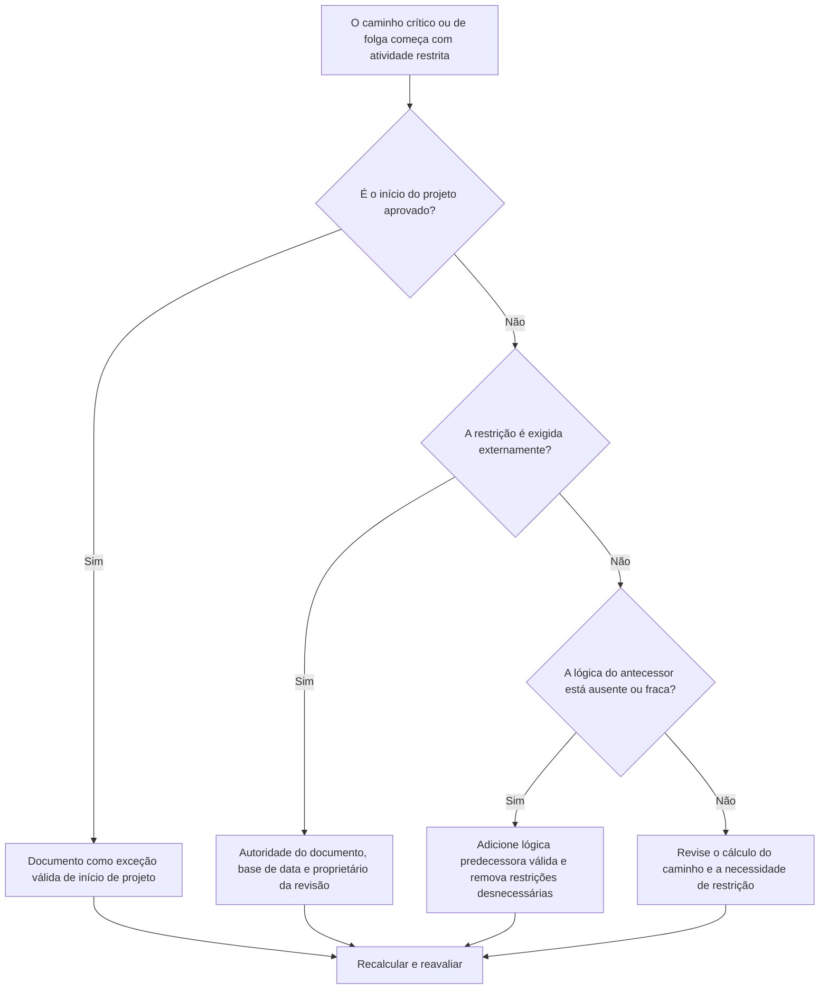

## Propósito

Este guia ajuda os agendadores a revisar cadeias de caminho crítico ou de caminho de folga que começam com uma atividade restrita. O início do projeto aprovado é normalmente uma exceção válida; a preocupação é quando um caminho downstream começa a partir de uma restrição em vez de uma sequência lógica.

## Antes de começar

Reúna as seguintes informações antes de agir:

- Resultado da avaliação atual para esta métrica.
- Relatório de caminho crítico ou caminho de folga do Primavera P6.
- Primeira atividade em cada caminho sinalizado.
- Tipo de restrição, data de restrição e quaisquer datas esperadas.
- Relacionamentos antecessor e sucessor para a atividade de início do caminho.
- Data Date, marco de início do projeto, requisitos básicos e regras de programação do PMO ou do cliente.
- Explicação para qualquer restrição externa aprovada.

## Entenda o seu resultado

Um resultado forte é zero caminhos críticos ou de folga não resolvidos começando com uma restrição, exceto o início do projeto aprovado.

Um resultado aceitável pode incluir restrições externas documentadas, como aviso para prosseguir, liberação de acesso do proprietário, liberação de licença ou pontos de retenção contratuais. Estas devem ser claramente justificadas.

Um resultado fraco significa que o caminho pode ser controlado por datas impostas em vez da lógica da rede. Isso pode tornar o caminho crítico ou o caminho de folga menos confiável para previsões, relatórios e análises de atrasos.

## Meta de melhoria

O alvo é 0 caminhos não resolvidos começando com uma restrição.

O objetivo é confirmar se o caminho deve começar a partir do início do projeto aprovado, de uma lógica predecessora válida ou de uma restrição externa documentada.

## Plano de Ação

### Etapa 1: Identifique o problema principal

Crie um layout ou relatório P6 que mostre o caminho crítico e os caminhos de folga selecionados. Para a primeira atividade em cada caminho, inclua ID da atividade, Nome da atividade, EAP, Início, Término, Folga total, Folga livre, Restrição primária, Data da restrição, Predecessores, Sucessores e Status da atividade.

Revise cada caminho sinalizado e pergunte:

- Este é o início do projeto aprovado ou a atividade de aviso para prosseguir?
- A restrição é exigida contratualmente ou externamente?
- A atividade tem lógica predecessora ausente?
- A restrição está mascarando uma rede de cronograma fraca ou incompleta?
- O caminho começaria de forma diferente se a restrição fosse removida?
- O início restrito está documentado para o PMO ou revisão do cliente?

### Etapa 2: aplique as correções recomendadas

Se a atividade restrita for o início do projeto aprovado, documente-a como uma exceção válida e confirme que é o ponto de início pretendido para o caminho.

Se a restrição for exigida externamente, mantenha-a somente quando o motivo for claro. Documente a fonte, como um marco do contrato, liberação de acesso, licença, instrução do proprietário ou requisito regulatório.

Se a restrição não for necessária, remova-a e adicione uma lógica predecessora válida onde a atividade depende de trabalho anterior, aprovações, transferências, compras ou acesso. Recalcule o cronograma e confirme se o caminho agora é orientado pela lógica.

### Etapa 3: remover bloqueadores comuns

Os bloqueadores comuns incluem restrições herdadas de linhas de base antigas, restrições usadas para forçar datas, lógica de interface ausente e propriedade pouco clara de datas externas.

Outro bloqueador é assumir que um caminho crítico é confiável simplesmente porque P6 o identifica. Se o caminho começar com uma restrição desnecessária, o caminho poderá refletir o controle de data em vez da verdadeira lógica do CPM.

### Etapa 4: validar as alterações

Recalcular o cronograma após alterar as restrições ou a lógica. Revise o caminho crítico, o caminho mais longo, os caminhos de folga selecionados, a folga total e as principais datas dos marcos.

Se o caminho mudar significativamente, documente o motivo e comunique o impacto ao líder de controles do projeto, ao revisor do PMO ou ao agendador do cliente.

## Cronograma de Melhoria

### Dia 1: Revisão e Diagnóstico

Execute a métrica, identifique atividades de início de caminho restritas e separe as descobertas em exceções de início de projeto, restrições externas válidas, lógica ausente e restrições desnecessárias.

### Dias 2-3: Implementar Ações Prioritárias

Corrija primeiro os caminhos críticos e sensíveis ao cliente. Remova restrições desnecessárias, adicione lógica ausente e documente exceções aprovadas.

### Dias 4-5: Monitore os primeiros resultados

Recalcule o cronograma e revise o movimento no caminho crítico, no caminho mais longo, nos caminhos de folga e nas datas dos marcos.

### Dia 6: Ajustes Finais

A resolução do caminho restrito restante começa com o proprietário responsável, o líder de controles do projeto ou o revisor do cliente.

### Dia 7: Reavaliar e comparar

Execute a avaliação novamente e compare o resultado com o limite desejado.

## Acompanhando o progresso

Use um rastreador simples para gerenciar correções e aprovações.

| Data | Ação tomada | Impacto esperado | Resultado/Observação | Próxima etapa |
| --- | --- | --- | --- | --- |
| [Data] | Atividades restritas de início do caminho revisadas | Identificar inícios de caminho orientados por data | [Resultado observado] | Atribuir proprietário |
| [Data] | Remoção de restrição desnecessária | Restaurar caminho orientado por lógica | [Resultado observado] | Recalcular cronograma |
| [Data] | Exceção aprovada documentada | Melhore a rastreabilidade das revisões | [Resultado observado] | Reavaliar métrica |

## Se os resultados não melhorarem

Se os resultados não melhorarem, verifique se as restrições estão concentradas em uma área específica da EAP, pacote de interface ou fase do projeto. Descobertas repetidas podem indicar que o cronograma está sendo controlado por datas impostas e não por uma lógica completa.

A escalada de caminhos restritos não resolvidos começa quando eles afetam trabalhos críticos, quase críticos, contratuais, sensíveis ao cliente, de acesso ou relacionados à transferência.

## Manutenção

Revise essa métrica durante cada atualização do cronograma, revisão da linha de base e exercício principal de ressequenciamento. Preste atenção especial após planejamento de recuperação, alterações de datas de clientes ou revisões de interface.

## Lista de verificação resumida

- [ ] Resultado atual revisado
- [ ] Limite desejado confirmado
- [ ] Relatório de caminho crítico ou de folga revisado
- [ ] Exceções de início de projeto identificadas
- [ ] Base de restrição verificada
- [ ] Lógica ausente corrigida
- [ ] Restrições desnecessárias removidas
- [ ] Exceções aprovadas documentadas
- [ ] Cronograma recalculado
- [ ] Resultados monitorados
- [ ] Avaliação repetida
- [ ] Próximas etapas documentadas
## Conteúdo relacionado
- [Modelo de blog](03_blog_template.md)
- [O que é um cronograma](../../06b_blogs_pt/01_WHAT%20A%20SCHEDULE%20IS/01_blog.md)
- [Lógica Robusta](../../06b_blogs_pt/02_ROBUST%20LOGIC/02_ROBUST%20LOGIC.md)
