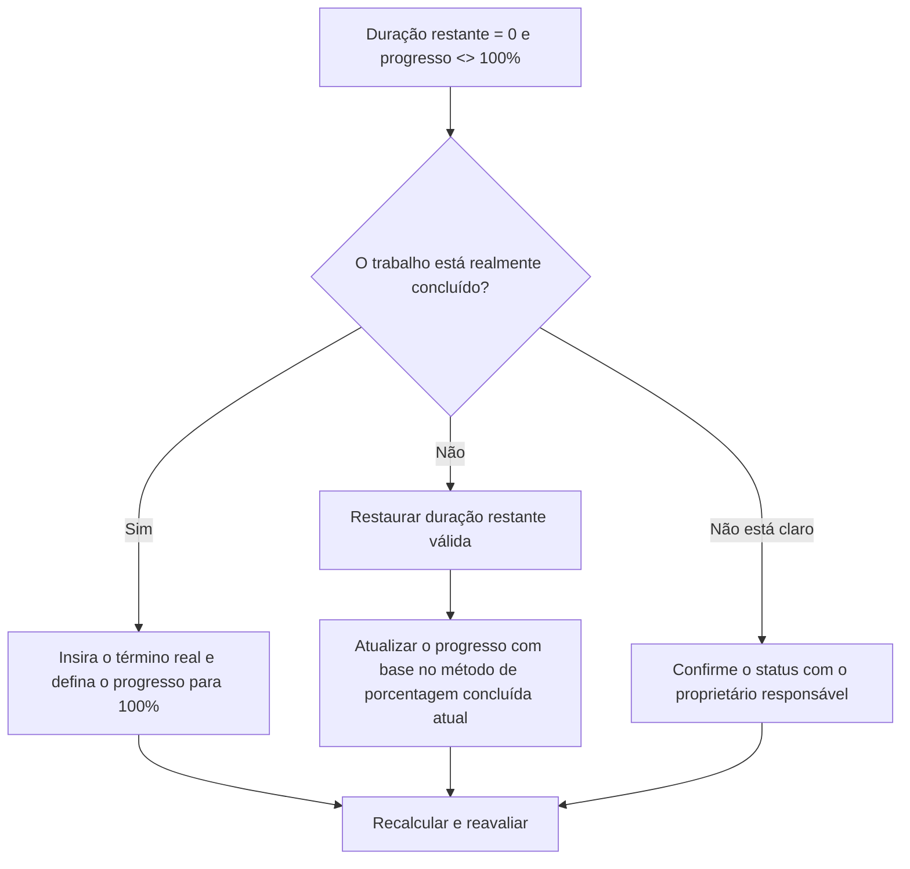

## Propósito

Este guia ajuda os agendadores a revisar e corrigir atividades onde a Duração Restante é igual a 0, mas o progresso não é 100%. Ele suporta atualizações de status mais limpas do Primavera P6, alinhando a duração restante, a porcentagem de progresso, o término real e o status da atividade.

## Antes de começar

Reúna as seguintes informações antes de agir:

- Resultado da avaliação atual para esta métrica.
- Lista de atividades com Duração Restante = 0 e progresso <> 100%.
- Status da atividade, início real, término real, duração original, duração restante e duração na conclusão.
- Porcentagem concluída Tipo e campos de progresso relacionados.
- Porcentagem física concluída, porcentagem de duração concluída, porcentagem de unidades concluídas e porcentagem de atividades concluídas.
- Data Date e últimas notas de atualização do progresso.
- Confirmação em campo se o trabalho está concluído ou ainda tem trabalho restante.

## Entenda o seu resultado

Um resultado forte é zero atividades com Duração Restante = 0 e progresso abaixo ou acima de 100%.

Um resultado aceitável pode incluir casos raros documentados em que uma percentagem específica de método completo cria uma diferença temporária no relatório, mas estes devem ser resolvidos antes do relatório formal.

Um resultado fraco significa que o cronograma contém atividades cujo trabalho restante e status de progresso não coincidem. Isso pode criar relatórios imprecisos, problemas de valor agregado ou status de conclusão enganoso.

## Meta de melhoria

A meta é 0 atividades não resolvidas com Duração Restante = 0 e progresso <> 100%.

O objetivo é confirmar se cada atividade está concluída, se o progresso foi atualizado incorretamente ou se está usando um método de porcentagem concluída que precisa de revisão.

## Plano de Ação

### Etapa 1: Identifique o problema principal

Crie um layout ou relatório P6 que filtre atividades em que a duração restante seja igual a 0 e o progresso não seja 100%. Inclui ID da atividade, nome da atividade, EAP, status da atividade, início real, término real, duração original, duração restante, tipo de porcentagem concluída, porcentagem física concluída, porcentagem de duração concluída, porcentagem de unidades concluída e porcentagem de atividade concluída.

Revise cada atividade e pergunte:

- O trabalho está realmente concluído?
- Se completo, o Actual Finish está faltando?
- Se não estiver completo, por que a Duração Restante é 0?
- Qual tipo de porcentagem completa está sendo usado?
- O valor do progresso vem do progresso físico, de duração ou de unidades?
- Isto é um erro de atualização de status ou um problema de cálculo de progresso?

### Etapa 2: aplique as correções recomendadas

Se o trabalho estiver concluído, atualize a atividade como concluída. Insira o término real, confirme que a duração restante é 0 e confirme que o progresso é 100% de acordo com o procedimento de atualização do projeto.

Se o trabalho não for concluído, restaure uma Duração Restante apropriada. Confirme o trabalho restante com o proprietário responsável e atualize o campo de progresso relevante com base no tipo de porcentagem concluída da atividade.

Se o problema for causado por um método de porcentagem concluída, revise se a atividade deve usar Porcentagem Física Concluída, Porcentagem Concluída de Duração ou Porcentagem Concluída de Unidades. Não altere o tipo de porcentagem concluída casualmente; alinhá-lo com o procedimento de controles do projeto.

### Etapa 3: remover bloqueadores comuns

Os bloqueadores comuns incluem atualizações de campos incompletas, datas de conclusão reais ausentes, confusão entre a porcentagem física e de duração concluída e progresso importado de sistemas externos sem validação.

Outro bloqueador é tratar a Duração Restante como um campo de progresso. A Duração Restante deve representar quanto tempo ainda é necessário para terminar a atividade, e não simplesmente a quantidade de trabalho relatado como concluído.

### Etapa 4: validar as alterações

Recalcular o cronograma após as correções. Execute novamente a métrica e confirme se cada item restante foi corrigido ou atribuído para acompanhamento.

Revise as atividades concluídas, as datas reais de término, os relatórios de progresso, os resultados de valor agregado e os relatórios antecipados para confirmar se a correção não criou novas inconsistências.

## Cronograma de Melhoria

### Dia 1: Revisão e Diagnóstico

Execute a métrica, confirme a data dos dados e separe as descobertas em status de trabalho ausente concluído, trabalho inacabado com duração restante zero e problemas de método de porcentagem concluída.

### Dias 2-3: Implementar Ações Prioritárias

Corrija primeiro as atividades usadas no relatório. Atualize o término real, restaure a duração restante ou corrija os valores de progresso conforme necessário.

### Dias 4-5: Monitore os primeiros resultados

Recalcular o cronograma e revisar relatórios de progresso, listas de atividades concluídas e resultados de valor agregado.

### Dia 6: Ajustes Finais

Resolva os itens incertos restantes com a disciplina responsável, o líder de campo ou o líder de controles do projeto.

### Dia 7: Reavaliar e comparar

Execute a avaliação novamente e compare o resultado com o limite desejado.

## Acompanhando o progresso

Use um rastreador simples para gerenciar correções e aprovações.

| Data | Ação tomada | Impacto esperado | Resultado/Observação | Próxima etapa |
| --- | --- | --- | --- | --- |
| [Data] | RD 0 revisado e progresso não 100 atividades | Identificar inconsistência de status | [Resultado observado] | Atribuir proprietário |
| [Data] | Inserido no término real e no progresso corrigido | Alinhar status concluído | [Resultado observado] | Recalcular cronograma |
| [Data] | Duração Restaurada Restaurada | Corrija o status da atividade inacabada | [Resultado observado] | Reavaliar métrica |

## Se os resultados não melhorarem

Se os resultados não melhorarem, verifique se as atualizações de progresso estão sendo importadas, copiadas ou calculadas de forma inconsistente. Revise se equipes diferentes usam métodos de porcentagem de conclusão diferentes ou se as datas de conclusão real estão faltando no fluxo de trabalho de atualização.

Escale itens não resolvidos quando eles afetarem valores críticos, quase críticos, valor agregado, relatórios de clientes, pagamentos ou trabalhos relacionados a transferências.

## Manutenção

Revise essa métrica durante cada ciclo de atualização antes de emitir relatórios. Deve fazer parte da validação de atualização padrão juntamente com datas reais, duração restante, porcentagem concluída e verificações de status da atividade.

## Lista de verificação resumida

- [ ] Resultado atual revisado
- [ ] Limite desejado confirmado
- [ ] Data Date confirmada
- [ ] Principal problema identificado
- [ ] Atividades concluídas atualizadas corretamente
- [ ] Datas reais de término inseridas quando necessário
- [ ] Duração restante restaurada onde o trabalho está incompleto
- [ ] Porcentagem completa de tipo revisado
- [ ] Cronograma recalculado
- [ ] Resultados monitorados
- [ ] Avaliação repetida
- [ ] Próximas etapas documentadas
## Conteúdo relacionado
- [Modelo de blog](03_blog_template.md)
- [O que é um cronograma](../../06b_blogs_pt/01_WHAT%20A%20SCHEDULE%20IS/01_blog.md)
- [Lógica Robusta](../../06b_blogs_pt/02_ROBUST%20LOGIC/02_ROBUST%20LOGIC.md)
