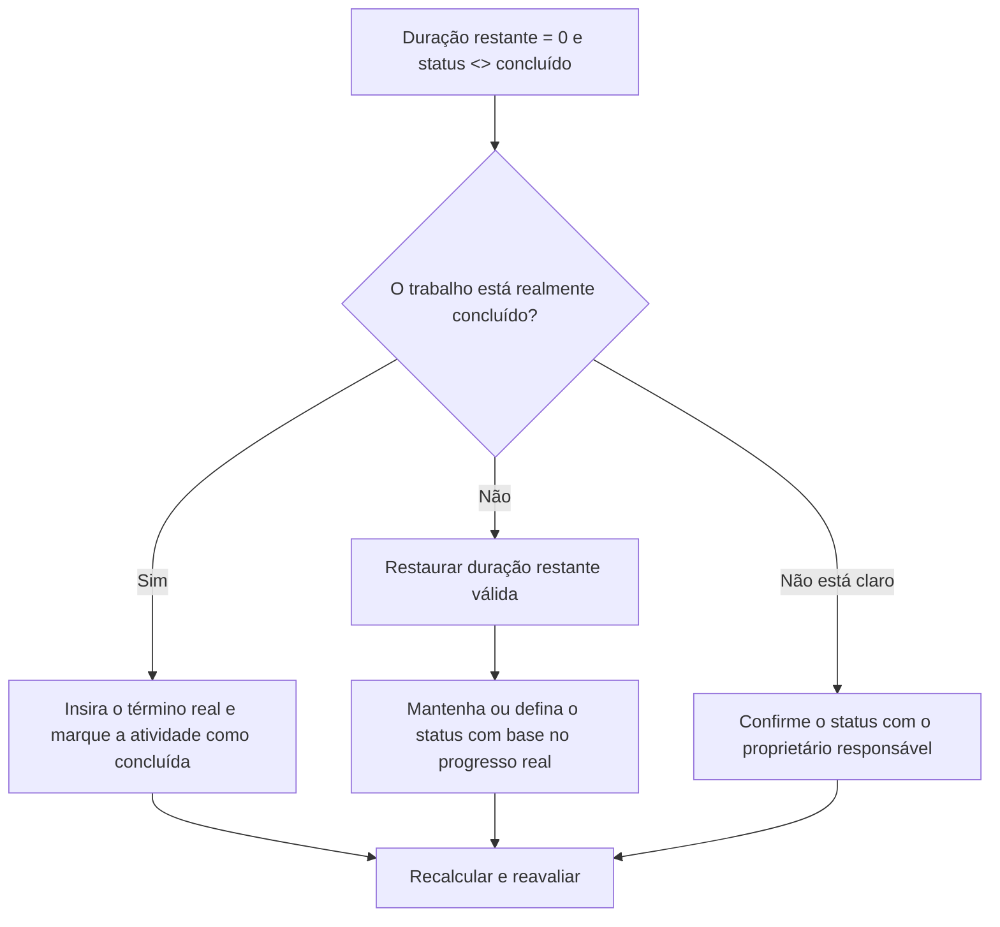

## Propósito

Este guia ajuda os agendadores a revisar e corrigir atividades onde a Duração Restante é igual a 0, mas o Status da Atividade não é Concluído. Ele suporta atualizações limpas do Primavera P6 alinhando a duração restante, o término real e o status da atividade.

## Antes de começar

Reúna as seguintes informações antes de agir:

- Resultado da avaliação atual para esta métrica.
- Lista de atividades com Duração Restante = 0 e Status da Atividade <> Concluída.
- Status da atividade, início real, término real, duração original, duração restante e duração na conclusão.
- Porcentagem concluída Tipo e principais campos de progresso.
- Data Date e notas de atualização mais recentes.
- Confirmação em campo se o trabalho está concluído ou ainda tem trabalho restante.

## Entenda o seu resultado

Um resultado forte é zero atividades com Duração Restante = 0 e status não Concluído.

Um resultado aceitável pode incluir casos raros de atualização temporária, mas estes devem ser resolvidos antes da notificação formal.

Um resultado fraco significa que o cronograma contém atividades cujo tempo restante e status de conclusão não coincidem. Isso pode criar relatórios de progresso enganosos, atualização incompleta e resultados antecipados ou de valor agregado não confiáveis.

## Meta de melhoria

A meta é 0 atividades não resolvidas com Duração Restante = 0 e Status da Atividade <> Concluída.

O objetivo é confirmar se cada atividade está concluída e deve ser encerrada, ou incompleta e deve ter a Duração Restante válida restaurada.

## Plano de Ação

### Etapa 1: Identifique o problema principal

Crie um layout ou relatório P6 que filtre atividades em que a Duração Restante seja igual a 0 e o Status da Atividade não seja Concluído. Inclui ID da atividade, nome da atividade, EAP, status da atividade, início real, término real, duração original, duração restante, tipo de porcentagem concluída, porcentagem de atividade concluída, início, término e folga total.

Revise cada atividade e pergunte:

- O trabalho está realmente concluído?
- Se concluído, por que o Status da Atividade não foi Concluído?
- O término real está faltando?
- Se o trabalho não for concluído, por que a Duração Restante é 0?
- O status foi importado ou atualizado manualmente?
- A atividade é um marco, um nível de esforço ou outro tipo de atividade especial?

### Etapa 2: aplique as correções recomendadas

Se o trabalho estiver concluído, atualize a atividade como Concluída. Insira o término real, confirme se a duração restante é 0 e confirme se os valores de progresso estão alinhados com o procedimento de atualização do projeto.

Se o trabalho não for concluído, restaure uma Duração Restante apropriada. Confirme o trabalho restante com o proprietário responsável e mantenha o status da atividade como Em andamento ou Não iniciado com base no progresso real.

Se o problema vier de dados de progresso importados, revise o mapeamento de importação e atualize o fluxo de trabalho. O processo de atualização não deve deixar as atividades com tempo restante zero, mas com status incompleto.

### Etapa 3: remover bloqueadores comuns

Os bloqueadores comuns incluem datas de término real ausentes, confirmação de campo incompleta, dados de atualização importados e confusão entre status de duração e status de atividade.

Outro bloqueador é encerrar a duração restante sem concluir formalmente a atividade. A duração restante e o status da atividade devem contar a mesma história sobre se o trabalho permanece.

### Etapa 4: validar as alterações

Recalcular o cronograma após as correções. Execute novamente a métrica e confirme se cada item restante foi corrigido ou atribuído para acompanhamento.

Revise as listas de atividades concluídas, as datas de término reais, os relatórios de progresso, os resultados de valor agregado e os relatórios antecipados para confirmar se a correção não criou novas inconsistências.

## Cronograma de Melhoria

### Dia 1: Revisão e Diagnóstico

Execute a métrica, confirme a data dos dados e separe as descobertas em trabalho completo sem status de concluído, trabalho incompleto com duração restante zero e problemas de importação ou de fluxo de trabalho.

### Dias 2-3: Implementar Ações Prioritárias

Corrija primeiro as atividades usadas no relatório. Insira o término real, marque as atividades como concluídas ou restaure a duração restante conforme necessário.

### Dias 4-5: Monitore os primeiros resultados

Recalcular o cronograma e revisar relatórios de atividades concluídas, relatórios de progresso e resultados de valor agregado.

### Dia 6: Ajustes Finais

Resolva os itens incertos restantes com a disciplina responsável, o líder de campo ou o líder de controles do projeto.

### Dia 7: Reavaliar e comparar

Execute a avaliação novamente e compare o resultado com o limite desejado.

## Acompanhando o progresso

Use um rastreador simples para gerenciar correções e aprovações.

| Data | Ação tomada | Impacto esperado | Resultado/Observação | Próxima etapa |
| --- | --- | --- | --- | --- |
| [Data] | RD 0 revisado e status de atividades não concluídas | Identificar inconsistência de status | [Resultado observado] | Atribuir proprietário |
| [Data] | Inserido no término real e marcado como concluído | Alinhar status concluído | [Resultado observado] | Recalcular cronograma |
| [Data] | Duração Restaurada Restaurada | Corrija o status da atividade inacabada | [Resultado observado] | Reavaliar métrica |

## Se os resultados não melhorarem

Se os resultados não melhorarem, verifique se as atualizações de progresso são importadas, copiadas ou editadas manualmente de forma inconsistente. Revise se as datas de conclusão real estão faltando no fluxo de trabalho de atualização ou se os usuários estão definindo a duração restante como 0 sem concluir as atividades.

Escale itens não resolvidos quando eles afetarem valores críticos, quase críticos, valor agregado, relatórios de clientes, pagamentos ou trabalhos relacionados a transferências.

## Manutenção

Revise essa métrica durante cada ciclo de atualização antes de emitir relatórios. Deve fazer parte da validação de atualização padrão juntamente com datas reais, duração restante, porcentagem concluída e verificações de status da atividade.

## Lista de verificação resumida

- [ ] Resultado atual revisado
- [ ] Limite desejado confirmado
- [ ] Data Date confirmada
- [ ] Principal problema identificado
- [ ] Atividades concluídas marcadas corretamente
- [ ] Datas reais de término inseridas quando necessário
- [ ] Duração restante restaurada onde o trabalho está incompleto
- [ ] Fluxo de trabalho de importação ou atualização verificado
- [ ] Cronograma recalculado
- [ ] Resultados monitorados
- [ ] Avaliação repetida
- [ ] Próximas etapas documentadas
## Conteúdo relacionado
- [Modelo de blog](03_blog_template.md)
- [O que é um cronograma](../../06b_blogs_pt/01_WHAT%20A%20SCHEDULE%20IS/01_blog.md)
- [Lógica Robusta](../../06b_blogs_pt/02_ROBUST%20LOGIC/02_ROBUST%20LOGIC.md)
