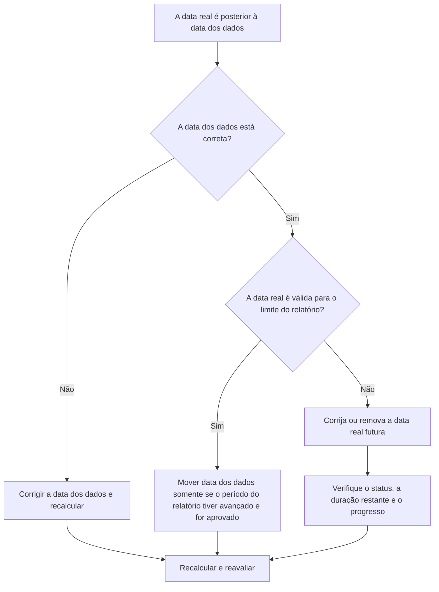

# Datas reais posteriores à data dos dados no Primavera P6 - Guia de melhoria

## Propósito

Este guia ajuda os programadores a revisar e corrigir atividades com datas reais posteriores à Data de Dados do Primavera P6. Ele oferece suporte à disciplina de atualização limpa, mantendo o desempenho real dentro ou antes do limite de atualização.

## Antes de começar

Reúna as seguintes informações antes de agir:

- Resultado da avaliação atual para esta métrica.
- Dados do Projeto Data usada na última atualização do cronograma.
- Lista de atividades com datas reais superiores à Data Date.
- Campos Início Real, Término Real, Status da Atividade, Duração Restante e Porcentagem Concluída.
- Fonte da atualização do progresso, como relatório de campo, arquivo de importação, quadro de horários ou atualização manual.
- Regras de corte para atualização do projeto e período de relatório.
- Quaisquer entradas de trabalho futuras conhecidas ou problemas de importação de dados.

## Entenda o seu resultado

Um resultado forte é zero atividades com datas reais posteriores à Data Date.

Um resultado aceitável ainda deve ser zero. As datas reais após a Data Date normalmente indicam um erro de atualização ou uma Data Date incorreta.

Um resultado fraco significa que o cronograma contém valores reais futuros. Isso pode fazer com que o relatório de agendamento funcione como concluído ou iniciado antes que o período de atualização tenha realmente atingido essa data.

## Meta de melhoria

A meta é 0 atividades não resolvidas com datas reais superiores à Data Date.

O objetivo é confirmar se a data real está errada, se a data dos dados está errada ou se o processo de importação de atualização está permitindo dados reais futuros.

## Plano de Ação

### Etapa 1: Identifique o problema principal

Crie um layout ou relatório P6 que filtre atividades com Início Real, Término Real ou outras datas reais superiores à Data Date. Inclui ID da atividade, nome da atividade, EAP, status da atividade, início real, término real, início, término, duração restante, porcentagem concluída, calendário e referência de data de dados.

Revise cada atividade e pergunte:

- A data dos dados do projeto está correta?
- A data real está correta?
- A atualização incluiu progresso além da data limite?
- Um arquivo de importação carregou datas reais futuras?
- A data real deve ser alterada ou a Data Date deve ser movida?
- O status da atividade corresponde à data real corrigida?

### Etapa 2: aplique as correções recomendadas

Se a Data Date estiver errada, corrija-a de acordo com o período de relatório aprovado e recalcule o cronograma.

Se a data real estiver incorreta, corrija o início real ou o término real para a data adequada. Se o trabalho não tiver sido realmente iniciado ou concluído até a Data Date, remova corretamente o status futuro real e de atualização, a Duração Restante e a Porcentagem Concluída.

Se o problema for proveniente de uma importação, revise o arquivo de importação e o mapeamento. Confirme se as datas reais futuras estão bloqueadas ou verificadas antes da emissão dos relatórios de cronograma.

### Etapa 3: remover bloqueadores comuns

Os bloqueadores comuns incluem arquivos de progresso que cobrem datas além do limite do relatório, atualizações manuais inseridas sem verificação da Data Date e confusão entre datas reais e datas previstas.

Outro bloqueador é mover a data dos dados apenas para aceitar dados reais futuros. A Data Date deve representar o limite de atualização aprovado e não ser alterada casualmente para ocultar um erro de status.

### Etapa 4: validar as alterações

Recalcular o cronograma após as correções. Execute novamente a métrica e confirme se nenhuma data real permanece após a Data Date.

Revise as listas de atividades concluídas, as listas de atividades em andamento, os resultados de valor agregado e os relatórios de comparação de cronograma para confirmar se a correção não criou outras inconsistências de status.

## Cronograma de Melhoria

### Dia 1: Revisão e Diagnóstico

Execute a métrica, confirme a data dos dados e separe as descobertas em datas reais incorretas, datas dos dados incorretas, problemas de importação e problemas de corte de atualização.

### Dias 2-3: Implementar Ações Prioritárias

Corrija primeiro as atividades usadas no relatório. Corrija datas reais, atualize status e resolva problemas de importação.

### Dias 4-5: Monitore os primeiros resultados

Recalcular o cronograma e revisar relatórios de progresso, listas de atividades concluídas, resultados de valor agregado e datas de marcos.

### Dia 6: Ajustes Finais

Resolva os itens incertos restantes com a disciplina responsável, o líder de campo ou o líder de controles do projeto.

### Dia 7: Reavaliar e comparar

Execute a avaliação novamente e compare o resultado com o limite desejado.

## Acompanhando o progresso

Use um rastreador simples para gerenciar correções e aprovações.

| Data | Ação tomada | Impacto esperado | Resultado/Observação | Próxima etapa |
| --- | --- | --- | --- | --- |
| [Data] | Datas reais revisadas após Data Date | Identifique dados reais futuros | [Resultado observado] | Atribuir proprietário |
| [Data] | Início real ou término real corrigido | Restaurar limite de status válido | [Resultado observado] | Recalcular cronograma |
| [Data] | Processo de importação revisado | Evite repetidos fatos reais futuros | [Resultado observado] | Reavaliar métrica |

## Se os resultados não melhorarem

Se os resultados não melhorarem, verifique se os valores reais futuros são introduzidos repetidamente por meio de importações, planilhas de horas ou fluxos de trabalho de atualização manual. Revise o procedimento de atualização e confirme se a Data Date é comunicada claramente a todos os colaboradores.

Escale itens não resolvidos quando eles afetarem valores críticos, quase críticos, valor agregado, relatórios de clientes, pagamentos ou trabalhos relacionados a transferências.

## Manutenção

Revise essa métrica durante cada ciclo de atualização antes de emitir relatórios. Deve fazer parte da validação de status padrão junto com datas reais, data de dados, duração restante, porcentagem concluída e verificações de status de atividade.

## Lista de verificação resumida

- [ ] Resultado atual revisado
- [ ] Limite desejado confirmado
- [ ] Data Date confirmada
- [ ] Principal problema identificado
- [ ] Datas reais futuras corrigidas
- [ ] Status da atividade verificado
- [ ] Duração restante e progresso verificados
- [ ] Importe ou atualize o fluxo de trabalho revisado
- [ ] Cronograma recalculado
- [ ] Resultados monitorados
- [ ] Avaliação repetida
- [ ] Próximas etapas documentadas
## Conteúdo relacionado
- [Datas reais posteriores à data dos dados no Primavera P6 - Visão geral](01_overview_template.md)
- [Modelo de blog](03_blog_template.md)
- [O que é um cronograma](../../06b_blogs_pt/01_WHAT%20A%20SCHEDULE%20IS/01_blog.md)
- [Lógica Robusta](../../06b_blogs_pt/02_ROBUST%20LOGIC/02_ROBUST%20LOGIC.md)
