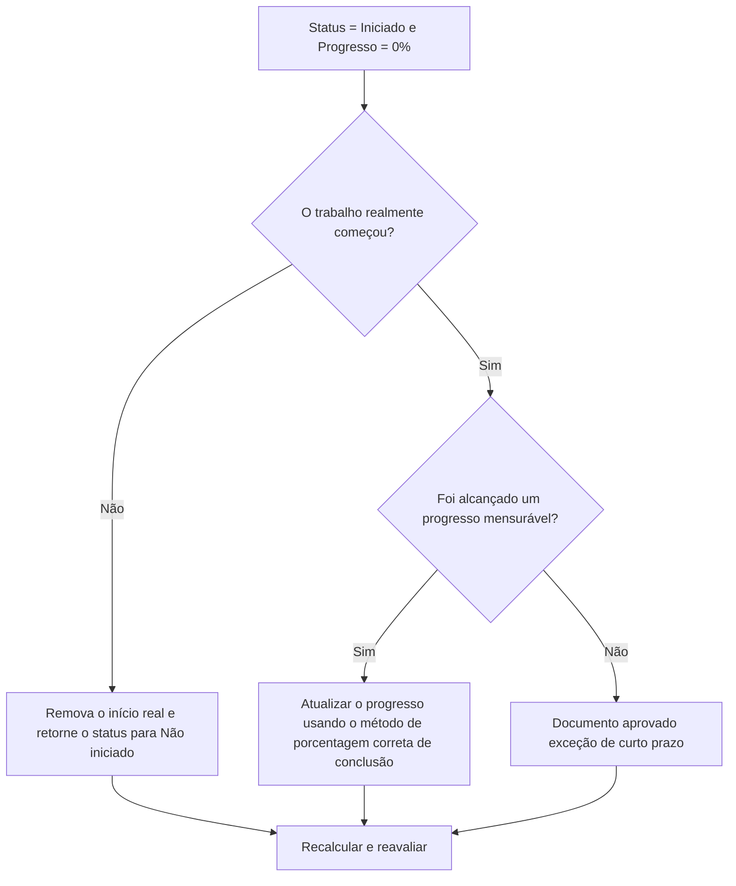

# Atividades iniciadas com 0% de progresso no Primavera P6 - Guia de melhoria

## Propósito

Este guia ajuda os agendadores a revisar e corrigir atividades onde o status da atividade é iniciado, mas o progresso é 0%. Ele suporta atualizações mais limpas do Primavera P6, alinhando o início real, o status da atividade, a porcentagem concluída e a duração restante.

## Antes de começar

Reúna as seguintes informações antes de agir:

- Resultado da avaliação atual para esta métrica.
- Lista de atividades com Status da Atividade = Iniciada e Progresso = 0%.
- Início Real, Término Real, Duração Restante, Duração Original e Status da Atividade.
- Porcentagem concluída Tipo e campos de progresso relacionados.
- Porcentagem física concluída, porcentagem de duração concluída, porcentagem de unidades concluídas e porcentagem de atividades concluídas.
- Data Date e notas de atualização mais recentes.
- Confirmação de campo sobre se o trabalho realmente começou e que progresso foi alcançado.

## Entenda o seu resultado

Um resultado forte é zero atividades com status Iniciado e 0% de progresso.

Um resultado aceitável pode incluir casos raros documentados em que uma actividade foi iniciada mesmo no final do período de actualização e ainda não foi obtido nenhum progresso mensurável. Esses casos devem ser limitados e claramente explicados.

Um resultado fraco significa que o cronograma contém atividades cujo status inicial e valor de progresso não coincidem. Isso pode criar relatórios de progresso enganosos, problemas de valor agregado e confusão antecipada.

## Meta de melhoria

A meta é 0 atividades não resolvidas com Status da atividade = Iniciada e progresso = 0%.

O objetivo é confirmar se cada atividade realmente foi iniciada, se o progresso foi perdido ou se a atividade deve retornar para Não iniciada.

## Plano de Ação

### Etapa 1: Identifique o problema principal

Crie um layout ou relatório P6 que filtre atividades com status Iniciado e 0% de progresso. Inclui ID da atividade, nome da atividade, EAP, status da atividade, início real, término real, duração original, duração restante, tipo de porcentagem concluída, porcentagem física concluída, porcentagem de duração concluída, porcentagem de unidades concluída, porcentagem de atividade concluída, início, término e folga total.

Revise cada atividade e pergunte:

- O trabalho realmente começou?
- Se o trabalho foi iniciado, que progresso mensurável foi alcançado?
- O início real está correto?
- Qual tipo de porcentagem completa está sendo usado?
- O progresso está faltando no campo correto?
- A atividade foi iniciada administrativamente sem início real de trabalho?

### Etapa 2: aplique as correções recomendadas

Se o trabalho realmente não foi iniciado, remova o Início Real incorreto e retorne a atividade para Não Iniciado. Confirme que a duração restante e as datas previstas ainda são válidas.

Se o trabalho foi iniciado e o progresso foi alcançado, atualize o campo de progresso correto com base no tipo Porcentagem concluída. Para Porcentagem física concluída, insira o progresso físico. Para a porcentagem de duração concluída, confirme se a duração restante reflete o trabalho executado. Para Porcentagem de unidades concluídas, confirme se o progresso das unidades está atualizado.

Se o trabalho começou, mas nenhum progresso mensurável foi obtido, documente o motivo. Isto deve ser raro e temporário, como um início de mobilização registado perto do ponto de corte da atualização, sem nenhum progresso obtido ainda.

### Etapa 3: remover bloqueadores comuns

Os bloqueadores comuns incluem quantidades de campos ausentes, inícios reais importados sem valores de progresso, confusão sobre o tipo de porcentagem concluída e pressão para mostrar o trabalho como iniciado antes que o progresso mensurável esteja disponível.

Outro bloqueador é tratar o Início Real como um sinal de planejamento em vez de um fato de status. O Início Real deve representar o início real do trabalho, e não a intenção de começar em breve.

### Etapa 4: validar as alterações

Recalcular o cronograma após as correções. Execute novamente a métrica e confirme se cada item restante foi corrigido, justificado ou atribuído para acompanhamento.

Revise os relatórios de progresso, os resultados de valor agregado, os relatórios antecipados e as listas de atividades em andamento para confirmar se a correção não criou novas inconsistências.

## Cronograma de Melhoria

### Dia 1: Revisão e Diagnóstico

Execute a métrica, confirme a data dos dados e separe as descobertas em inícios incorretos, progresso ausente, problemas de porcentagem de conclusão do método e possíveis exceções.

### Dias 2-3: Implementar Ações Prioritárias

Corrija primeiro as atividades usadas no relatório. Remova Inícios Reais incorretos, atualize valores de progresso ou documente exceções válidas.

### Dias 4-5: Monitore os primeiros resultados

Recalcular o cronograma e revisar relatórios de progresso, resultados de valor agregado, listas de atividades em andamento e relatórios antecipados.

### Dia 6: Ajustes Finais

Resolva os itens incertos restantes com a disciplina responsável, o líder de campo ou o líder de controles do projeto.

### Dia 7: Reavaliar e comparar

Execute a avaliação novamente e compare o resultado com o limite desejado.

## Acompanhando o progresso

Use um rastreador simples para gerenciar correções e aprovações.

| Data | Ação tomada | Impacto esperado | Resultado/Observação | Próxima etapa |
| --- | --- | --- | --- | --- |
| [Data] | Atividades iniciadas revisadas com 0% de progresso | Identificar inconsistência de status | [Resultado observado] | Atribuir proprietário |
| [Data] | Removido início real incorreto | Restaure o status preciso | [Resultado observado] | Recalcular cronograma |
| [Data] | Valor de progresso atualizado | Alinhe o status iniciado com o progresso | [Resultado observado] | Reavaliar métrica |

## Se os resultados não melhorarem

Se os resultados não melhorarem, verifique se os inícios reais são importados sem correspondência com os valores de progresso ou se as equipes estão usando regras diferentes para o que conta como iniciado. Revise o procedimento de corte de atualização e o método de porcentagem concluída.

Escale itens não resolvidos quando eles afetarem valores críticos, quase críticos, valor agregado, relatórios de clientes, pagamentos ou trabalhos relacionados a transferências.

## Manutenção

Revise essa métrica durante cada ciclo de atualização antes de emitir relatórios. Deve fazer parte da validação de atualização padrão juntamente com datas reais, duração restante, porcentagem concluída e verificações de status da atividade.

## Lista de verificação resumida

- [ ] Resultado atual revisado
- [ ] Limite desejado confirmado
- [ ] Data Date confirmada
- [ ] Principal problema identificado
- [ ] Partidas reais incorretas removidas
- [ ] Progresso ausente atualizado
- [ ] Porcentagem completa de tipo revisado
- [ ] Exceções válidas documentadas
- [ ] Cronograma recalculado
- [ ] Resultados monitorados
- [ ] Avaliação repetida
- [ ] Próximas etapas documentadas
## Conteúdo relacionado
- [Atividades iniciadas com 0% de progresso no Primavera P6 - Visão geral](01_overview_template.md)
- [Modelo de blog](03_blog_template.md)
- [O que é um cronograma](../../06b_blogs_pt/01_WHAT%20A%20SCHEDULE%20IS/01_blog.md)
- [Lógica Robusta](../../06b_blogs_pt/02_ROBUST%20LOGIC/02_ROBUST%20LOGIC.md)
