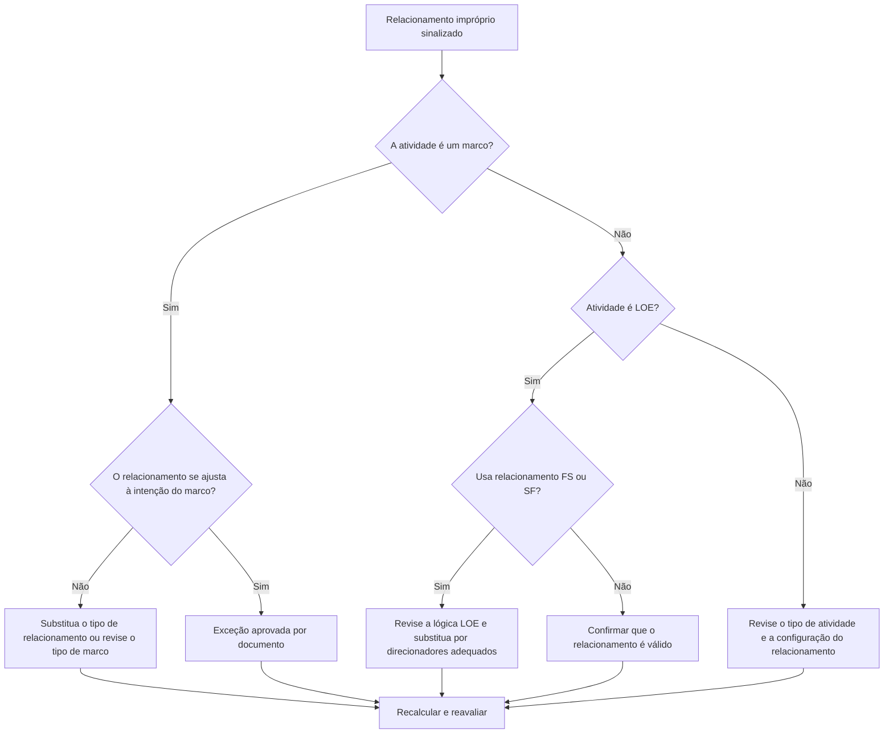

## Propósito

Este guia ajuda os programadores a revisar e corrigir relacionamentos impróprios envolvendo atividades de Marcos de Conclusão, Marcos de Início e Nível de Esforço (LOE) no Primavera P6.

## Antes de começar

Reúna as seguintes informações antes de agir:

- Resultado da avaliação atual para esta métrica.
- Lista de relacionamentos sinalizados por antecessor, sucessor, tipo de atividade e tipo de relacionamento.
- ID da atividade, nome da atividade, EAP, tipo de atividade, início, término, folga total e status do caminho crítico ou mais longo.
- Tipo de relacionamento, atraso, tipo de atividade predecessora e tipo de atividade sucessora.
- Finalidade do marco, finalidade da LOE e requisitos de relatórios relacionados.
- Data de dados e saída de cálculo de cronograma mais recente.

## Entenda o seu resultado

Um resultado forte é zero relacionamentos impróprios não resolvidos.

A métrica deve sinalizar estes casos:

- Conclua o Milestone com o sucessor SS ou SF.
- Conclua o Milestone com o antecessor SS.
- Inicie o Milestone com o antecessor FF ou SF.
- Inicie o Milestone com o sucessor FS ou FF.
- LOE com relacionamento FS.
- LOE com relacionamento SF.

Podem existir raras exceções, mas devem ser documentadas e fáceis de explicar durante uma revisão do cronograma.

## Meta de melhoria

O alvo é 0 relacionamentos impróprios não resolvidos.

O objetivo é fazer com que cada marco e relacionamento de LOE correspondam ao comportamento de agendamento pretendido, sem forçar datas ou ocultar uma lógica fraca.

## Plano de Ação

### Etapa 1: Identifique o problema principal

Crie um layout ou relatório P6 que mostre todas as atividades de marcos e LOE com detalhes de antecessores e sucessores. Inclui tipo de atividade, tipo de relacionamento, atraso, início, término, folga total e indicadores de caminho crítico ou mais longo.

Revise cada relacionamento sinalizado e pergunte:

- O tipo de atividade está correto?
- O tipo de relacionamento corresponde ao propósito do marco ou LOE?
- O relacionamento está tentando forçar uma data de início, término ou relatório?
- Um relacionamento FS, SS ou FF normal representaria melhor a lógica?
- O relacionamento é uma exceção aprovada?

### Etapa 2: aplique as correções recomendadas

Para Marcos de conclusão, confirme se a lógica está conduzindo ou respondendo à conclusão. Substitua os relacionamentos SS ou SF quando eles não representarem uma dependência real baseada em acabamento.

Para Marcos iniciais, confirme se a lógica dá suporte ao evento inicial. Substitua FF, SF, FS sucessor ou outros relacionamentos inadequados quando estiverem sendo usados ​​para forçar uma data de relatório.

Para atividades LOE, revise se os relacionamentos FS ou SF estão incorretamente fazendo com que a unidade LOE funcione discretamente. As atividades da LOE normalmente resumem ou abrangem outros trabalhos, portanto seus relacionamentos devem ser tratados com cuidado.

Se o relacionamento for válido por contrato, método do cliente ou projeto de cronograma especial, documente o motivo e a aprovação.

### Etapa 3: remover bloqueadores comuns

Os bloqueadores comuns incluem a lógica copiada de cronogramas mais antigos, a compreensão incorreta do comportamento dos marcos, o uso de relacionamentos SF como um atalho e o uso de atividades LOE para controlar o trabalho que deveria ser conduzido por atividades distintas.

Outro bloqueador é tratar a limpeza do relacionamento como cosmética. Esses links podem afetar a folga, os relatórios do caminho crítico, as datas dos marcos e a credibilidade do cronograma.

### Etapa 4: validar as alterações

Recalcular o cronograma após as correções. Execute novamente a métrica e confirme se cada item restante foi corrigido, justificado ou atribuído para acompanhamento.

Revise as datas dos marcos, as datas do LOE, a folga total, o caminho crítico ou mais longo e os principais resultados dos relatórios para confirmar que a correção não criou novos problemas.

## Cronograma de Melhoria

### Dia 1: Revisão e Diagnóstico

Execute a métrica e agrupe as descobertas por tipo de atividade e padrão de relacionamento.

### Dias 2-3: Implementar Ações Prioritárias

Primeiro, corrija os relacionamentos em marcos críticos, quase críticos, contratuais, de transferência e voltados para o cliente.

### Dias 4-5: Monitore os primeiros resultados

Recalcule o cronograma e revise a folga, o caminho crítico, o movimento do marco e o comportamento do LOE.

### Dia 6: Ajustes Finais

Resolva as exceções restantes com o agendador, o líder de controles do projeto ou o revisor do PMO.

### Dia 7: Reavaliar e comparar

Execute a avaliação novamente e compare o resultado com o limite desejado.

## Acompanhando o progresso

Use um rastreador simples para gerenciar correções e aprovações.

| Data | Ação tomada | Impacto esperado | Resultado/Observação | Próxima etapa |
| --- | --- | --- | --- | --- |
| [Data] | Revisou relacionamentos impróprios | Identifique problemas de tipo de relacionamento | [Resultado observado] | Atribuir proprietário |
| [Data] | Relacionamento de marco corrigido | Alinhe a lógica com o propósito do marco | [Resultado observado] | Recalcular cronograma |
| [Data] | Relacionamentos LOE revisados | Impedir que LOE conduza trabalho discreto incorretamente | [Resultado observado] | Reavaliar métrica |

## Se os resultados não melhorarem

Se os resultados não melhorarem, verifique se os mesmos relacionamentos estão sendo reintroduzidos por meio de importações, lógica copiada, mudanças globais ou integração externa de cronograma.

Escale itens não resolvidos quando eles afetarem marcos contratuais, relatórios de caminho crítico, envios de clientes, eventos de pagamento ou datas de entrega.

## Manutenção

Revise essa métrica durante cada ciclo de atualização e antes da aprovação da linha de base. É especialmente útil após importações programadas, fragmentos copiados, re-sequenciamento importante e revisões de marcos.

## Lista de verificação resumida

- [ ] Resultado atual revisado
- [ ] Limite desejado confirmado
- [ ] Tipos de atividades Milestone e LOE revisados
- [ ] Tipos de relacionamento sinalizados verificados
- [ ] Relacionamentos incorretos corrigidos
- [ ] Exceções válidas documentadas
- [ ] Cronograma recalculado
- [ ] Folga e caminho crítico revisados
- [ ] Resultados monitorados
- [ ] Avaliação repetida
- [ ] Próximas etapas documentadas
## Conteúdo relacionado
- [03_blog_template](../14_unusual_relations/03_blog_template.md)
- [O que é um cronograma](../../06b_blogs_pt/01_WHAT%20A%20SCHEDULE%20IS/01_blog.md)
- [Lógica Robusta](../../06b_blogs_pt/02_ROBUST%20LOGIC/02_ROBUST%20LOGIC.md)
