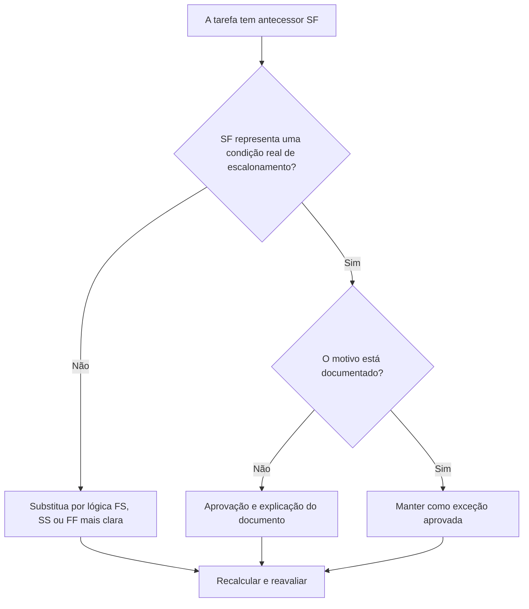

# Atividades de tarefas com predecessores SF no Primavera P6 - Guia de melhoria

## Propósito

Este guia ajuda os agendadores a revisar e corrigir atividades de tarefas que possuem relacionamentos predecessores do Início ao Término (SF) no Primavera P6.

## Antes de começar

Reúna as seguintes informações antes de agir:

- Resultado da avaliação atual para esta métrica.
- Lista de atividades de tarefa com pelo menos um predecessor de SF.
- ID da atividade, nome da atividade, EAP, tipo de atividade, início, término, folga total e status do caminho crítico ou mais longo.
- ID da atividade predecessora, tipo de atividade predecessora, tipo de relacionamento e atraso.
- Quaisquer restrições, calendários, condições de término esperadas e notas de atualização relacionadas.
- Data de dados e saída de cálculo de cronograma mais recente.

## Entenda o seu resultado

Um forte resultado é zero atividades de tarefas não resolvidas com relacionamentos predecessores de SF.

Um relacionamento SF significa que a atividade sucessora não pode terminar até que a atividade predecessora seja iniciada. Isso é incomum na lógica normal de construção, engenharia, aquisição ou comissionamento. A maioria dos relacionamentos de tarefas devem ser representados com lógica FS, SS ou FF quando refletem o sequenciamento real.

Um resultado fraco significa que o término da atividade da tarefa pode ser controlado por uma lógica difícil de justificar ou que foi copiada de outra parte do cronograma sem revisão.

## Meta de melhoria

A meta é 0 relacionamentos de predecessores SF não resolvidos em atividades de tarefa.

O objetivo é confirmar se cada relacionamento SF é um modelo de escalonamento válido ou deve ser substituído por uma lógica mais clara.

## Plano de Ação

### Etapa 1: Identifique o problema principal

Crie um layout ou relatório P6 que filtre as atividades da tarefa com um predecessor SF. Inclua IDs predecessores e sucessores, tipo de atividade, tipo de relacionamento, atraso, início, término, folga total, restrições e indicadores de caminho crítico ou mais longo.

Revise cada relacionamento e pergunte:

- Que condição real o relacionamento SF está tentando representar?
- O início do antecessor deveria realmente controlar o final do sucessor?
- A lógica FS, SS ou FF descreveria a sequência mais claramente?
- O atraso está sendo usado para forçar uma data?
- O relacionamento está no caminho crítico ou quase crítico?
- Existe um motivo documentado para usar SF?

### Etapa 2: aplique as correções recomendadas

Se o relacionamento SF não representar uma condição real, substitua-o pelo tipo de relacionamento que melhor descreve a sequência. Use FS quando o sucessor deve começar após a conclusão do antecessor, SS quando os inícios estão vinculados e FF quando o alinhamento final é a lógica pretendida.

Se o relacionamento SF tiver sido adicionado para controlar uma data de término, revise se o cronograma precisa de um predecessor, marco, revisão de restrição ou divisão de atividade adequados.

Se o relacionamento SF for válido, documente por que é necessário e quem o aprovou. Esta deve ser uma rara exceção e não um padrão de agendamento comum.

### Etapa 3: remover bloqueadores comuns

Os bloqueadores comuns incluem relacionamentos copiados, lógica externa importada, mal-entendido do comportamento do SF e uso do SF com atraso para forçar uma data de término.

Outro bloqueador é abandonar o relacionamento porque a data calculada parece aceitável. O relacionamento ainda precisa ser lógicamente defensável.

### Etapa 4: validar as alterações

Recalcular o cronograma após as correções. Execute novamente a métrica e confirme se cada antecessor do SF restante foi corrigido, justificado ou designado para acompanhamento.

Revise a folga total, o caminho crítico ou mais longo, os marcos afetados e as saídas antecipadas para confirmar se a mudança lógica não criou novos problemas.

## Cronograma de Melhoria

### Dia 1: Revisão e Diagnóstico

Execute a métrica, confirme a data dos dados e separe as descobertas em relacionamentos SF inválidos, possíveis exceções e itens que precisam de entrada do proprietário.

### Dias 2-3: Implementar Ações Prioritárias

Corrija primeiro os relacionamentos de SF em atividades críticas, quase críticas, contratuais e de curto prazo.

### Dias 4-5: Monitore os primeiros resultados

Recalcule o cronograma e revise a folga, o caminho crítico, as datas futuras e o movimento dos marcos.

### Dia 6: Ajustes Finais

Resolva as exceções restantes com o agendador, o líder de disciplina, o líder de controles do projeto ou o revisor do PMO.

### Dia 7: Reavaliar e comparar

Execute a avaliação novamente e compare o resultado com o limite desejado.

## Acompanhando o progresso

Use um rastreador simples para gerenciar correções e aprovações.

| Data | Ação tomada | Impacto esperado | Resultado/Observação | Próxima etapa |
| --- | --- | --- | --- | --- |
| [Data] | Atividades de tarefas revisadas com predecessores de SF | Identifique uma lógica de relacionamento incomum | [Resultado observado] | Atribuir proprietário |
| [Data] | Relacionamento SF inválido substituído | Melhore a clareza lógica | [Resultado observado] | Recalcular cronograma |
| [Data] | Exceção SF válida documentada | Preservar lógica especial aprovada | [Resultado observado] | Reavaliar métrica |

## Se os resultados não melhorarem

Se os resultados não melhorarem, verifique se os relacionamentos SF estão sendo reintroduzidos por meio de importações, fragnets copiados, mudanças globais ou integração de cronograma externo.

Escale itens não resolvidos quando eles afetarem o caminho crítico, marcos contratuais, envios de clientes, eventos de pagamento ou trabalho de execução de curto prazo.

## Manutenção

Revise essa métrica durante cada ciclo de atualização e antes da aprovação da linha de base. É especialmente útil após importações de cronograma, re-sequenciamento importante e exercícios de limpeza lógica.

## Lista de verificação resumida

- [ ] Resultado atual revisado
- [ ] Limite desejado confirmado
- [ ] Lista de predecessores SF gerada
- [ ] Itens críticos e quase críticos priorizados
- [ ] Relacionamentos SF inválidos corrigidos
- [ ] Exceções válidas documentadas
- [ ] Cronograma recalculado
- [ ] Folga e caminho crítico revisados
- [ ] Resultados monitorados
- [ ] Avaliação repetida
- [ ] Próximas etapas documentadas
## Conteúdo relacionado
- [Atividades de tarefas com predecessores SF no Primavera P6 - Visão geral](01_overview_template.md)
- [Atividades de tarefas com predecessores SF no Primavera P6](03_blog_template.md)
- [O que é um cronograma](../../06b_blogs_pt/01_WHAT%20A%20SCHEDULE%20IS/01_blog.md)
- [Lógica Robusta](../../06b_blogs_pt/02_ROBUST%20LOGIC/02_ROBUST%20LOGIC.md)
