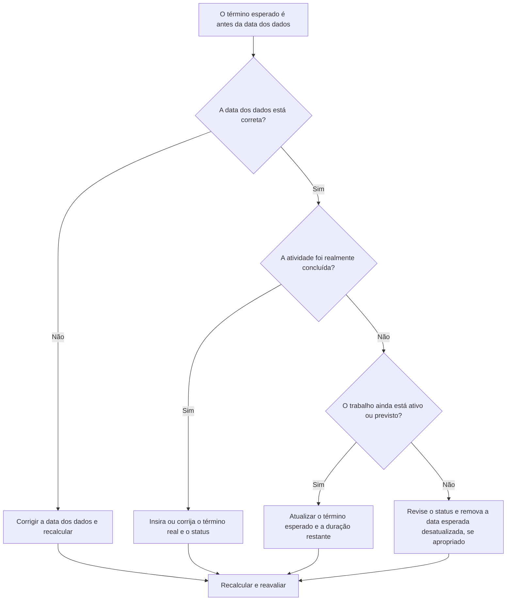

## Propósito

Este guia ajuda os programadores a revisar e corrigir atividades cuja data de conclusão esperada é anterior à data de dados do Primavera P6. Ele oferece suporte a uma disciplina de atualização mais limpa, mantendo as datas esperadas alinhadas com o limite de relatório atual.

## Antes de começar

Reúna as seguintes informações antes de agir:

- Resultado da avaliação atual para esta métrica.
- Dados do Projeto Data usada na última atualização do cronograma.
- Lista de atividades em que o término esperado é anterior à data dos dados.
- Status da atividade, início real, término real, duração restante, porcentagem concluída, início, término e folga total.
- Origem de conclusão esperada, como entrada manual, arquivo de importação, previsão de campo ou fluxo de trabalho de atualização P6.
- Regras de corte para atualização do projeto e notas de progresso mais recentes.

## Entenda o seu resultado

Um resultado forte é zero atividades com conclusão esperada antes da data dos dados.

Um término esperado antes da data dos dados geralmente significa que as informações de previsão ou conclusão esperada não foram atualizadas quando o cronograma avançou. Também pode indicar que a atividade deve ter um Término Real, uma Duração Restante revisada ou um status corrigido.

Um resultado fraco significa que o cronograma contém datas de conclusão esperadas que estão no passado em relação ao limite de atualização atual.

## Meta de melhoria

A meta é 0 atividades não resolvidas com término esperado antes da data dos dados.

O objetivo é confirmar se cada atividade foi concluída, ainda em andamento, não iniciada ou atualizada incorretamente.

## Plano de Ação

### Etapa 1: Identifique o problema principal

Crie um layout ou relatório P6 que filtre atividades em que o término esperado seja anterior à data dos dados. Inclui ID da atividade, nome da atividade, EAP, status da atividade, término esperado, início real, término real, duração restante, porcentagem de conclusão, início, término, folga total e calendário.

Revise cada atividade e pergunte:

- A data dos dados está correta?
- A atividade foi realmente concluída antes da data dos dados?
- Se tiver terminado, falta o Actual Finish?
- Se não foi concluído, o Final Esperado deve ser atualizado?
- A Duração Restante ainda representa o trabalho restante?
- Uma importação ou atualização manual deixou para trás um valor antigo de conclusão esperada?

### Etapa 2: aplique as correções recomendadas

Se a Data Date estiver errada, corrija-a de acordo com o período de relatório aprovado e recalcule o cronograma.

Se a atividade foi concluída antes da Data Date, insira ou corrija o Término Real e confirme se o Status da Atividade, a Porcentagem Concluída e a Duração Restante estão consistentes.

Se a atividade ainda estiver ativa ou não concluída, atualize o Término Esperado para uma data válida na Data Date ou após ela. Confirme a duração restante e as datas de previsão refletem as informações de campo mais recentes.

Se o término esperado foi introduzido por meio de uma importação, revise o arquivo de importação e o mapeamento para que as datas esperadas desatualizadas não sejam carregadas repetidamente.

### Etapa 3: remover bloqueadores comuns

Os bloqueadores comuns incluem previsões de campo desatualizadas, importações de progresso que atualizam a porcentagem concluída, mas não as datas esperadas, e confusão entre Término Esperado, Término Previsto e Término Real.

Outro bloqueador é ignorar o término esperado porque as datas programadas parecem aceitáveis. No P6, as datas esperadas podem influenciar o cálculo do cronograma dependendo das configurações e dos fluxos de trabalho, portanto, os valores obsoletos devem ser revisados.

### Etapa 4: validar as alterações

Recalcular o cronograma após as correções. Execute novamente a métrica e confirme se nenhuma data de término esperado não resolvida permanece antes da data dos dados.

Revise as atividades em andamento, a previsão de curto prazo, a folga total, as datas dos marcos e os relatórios de comparação de cronograma para confirmar se a correção não criou novas inconsistências.

## Cronograma de Melhoria

### Dia 1: Revisão e Diagnóstico

Execute a métrica, confirme a data dos dados e separe as descobertas em trabalho concluído, datas esperadas obsoletas, problemas de duração restantes e problemas de importação.

### Dias 2-3: Implementar Ações Prioritárias

Corrija primeiro as atividades usadas no relatório. Atualize o término real, o término esperado, a duração restante, a porcentagem concluída ou o status da atividade conforme necessário.

### Dias 4-5: Monitore os primeiros resultados

Recalcule o cronograma e revise relatórios antecipados, listas de atividades em andamento, movimentação de marcos e alterações de folga.

### Dia 6: Ajustes Finais

Resolva os itens incertos restantes com a disciplina responsável, o líder de campo ou o líder de controles do projeto.

### Dia 7: Reavaliar e comparar

Execute a avaliação novamente e compare o resultado com o limite desejado.

## Acompanhando o progresso

Use um rastreador simples para gerenciar correções e aprovações.

| Data | Ação tomada | Impacto esperado | Resultado/Observação | Próxima etapa |
| --- | --- | --- | --- | --- |
| [Data] | Conclusão esperada revisada antes da data dos dados | Identifique datas esperadas desatualizadas | [Resultado observado] | Atribuir proprietário |
| [Data] | Término esperado ou término real atualizado | Alinhe o status com o limite de atualização | [Resultado observado] | Recalcular cronograma |
| [Data] | Processo de importação revisado | Evite repetidas datas esperadas desatualizadas | [Resultado observado] | Reavaliar métrica |

## Se os resultados não melhorarem

Se os resultados não melhorarem, verifique se as datas esperadas estão sendo importadas de sistemas de campo, planilhas ou arquivos de atualização anteriores sem validação. Revise o fluxo de trabalho de atualização e confirme quem é o proprietário das atualizações de conclusão esperada.

Escale itens não resolvidos quando eles afetarem trabalhos críticos, quase críticos, relatórios de clientes, pagamentos, entregas ou execução de curto prazo.

## Manutenção

Revise essa métrica durante cada ciclo de atualização antes de emitir relatórios. Deve fazer parte da validação de status padrão junto com as verificações de Data Date, datas reais, Duração Restante, Porcentagem Concluída e Status da Atividade.

## Lista de verificação resumida

- [ ] Resultado atual revisado
- [ ] Limite desejado confirmado
- [ ] Data Date confirmada
- [ ] Lista de conclusão esperada gerada
- [ ] Trabalho concluído com término real
- [ ] Datas de conclusão esperada obsoletas atualizadas
- [ ] Duração restante marcada
- [ ] Status da atividade e porcentagem concluída verificados
- [ ] Importe ou atualize o fluxo de trabalho revisado
- [ ] Cronograma recalculado
- [ ] Avaliação repetida
- [ ] Próximas etapas documentadas
## Conteúdo relacionado
- [Conclusão Esperada Antes da Data Date no Primavera P6](03_blog_template.md)
- [O que é um cronograma](../../06b_blogs_pt/01_WHAT%20A%20SCHEDULE%20IS/01_blog.md)
- [Lógica Robusta](../../06b_blogs_pt/02_ROBUST%20LOGIC/02_ROBUST%20LOGIC.md)
