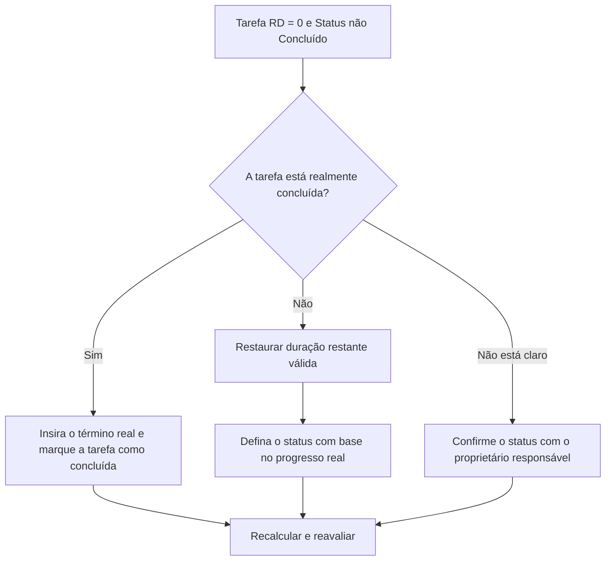

## Propósito

Este guia ajuda os agendadores a revisar e corrigir atividades de tarefas em que a Duração Restante é igual a 0, mas o status da tarefa não é Concluído. Ele suporta atualizações limpas do Primavera P6 alinhando o trabalho restante, o término real e o status da atividade.

## Antes de começar

Reúna as seguintes informações antes de agir:

- Resultado da avaliação atual para esta métrica.
- Lista de atividades de tarefa com Duração Restante = 0 e status não Concluído.
- ID da atividade, nome da atividade, EAP, tipo de atividade, status da atividade, início real, término real, duração original, duração restante e duração na conclusão.
- Porcentagem concluída Tipo e principais campos de progresso.
- Data Date e notas de atualização mais recentes.
- Confirmação de campo se a tarefa foi concluída ou ainda tem trabalho restante.

## Entenda o seu resultado

Um resultado forte é zero atividades de tarefa com Duração Restante = 0 e status não Concluído.

Esta métrica é limitada às atividades da tarefa, portanto a revisão se concentra nas atividades normais de trabalho, e não nos marcos ou registros da LOE. Uma tarefa com duração restante zero normalmente deve ter o status concluído e um término real.

Um resultado fraco significa que o cronograma contém tarefas cujo tempo restante e status de conclusão não coincidem.

## Meta de melhoria

A meta é 0 atividades de tarefas não resolvidas com Duração Restante = 0 e status não Concluído.

O objetivo é confirmar se cada tarefa está concluída e deve ser encerrada, ou incompleta e deve ter a Duração Restante válida restaurada.

## Plano de Ação

### Etapa 1: Identifique o problema principal

Crie um layout ou relatório P6 que filtre atividades de tarefa em que a Duração Restante seja igual a 0 e o Status da Atividade não seja Concluído. Inclui ID da atividade, nome da atividade, EAP, tipo de atividade, status da atividade, início real, término real, duração original, duração restante, tipo de porcentagem concluída, porcentagem de atividade concluída, início, término e folga total.

Revise cada tarefa e pergunte:

- A tarefa está realmente concluída?
- Se concluído, por que o status não é Concluído?
- O término real está faltando?
- Se o trabalho não for concluído, por que a Duração Restante é 0?
- O status foi importado ou atualizado manualmente?
- O método de porcentagem concluída corresponde à atualização feita?

### Etapa 2: aplique as correções recomendadas

Se a tarefa for concluída, atualize a atividade como Concluída. Insira o término real, confirme se a duração restante é 0 e confirme se os valores de progresso estão alinhados com o procedimento de atualização do projeto.

Se a tarefa não for concluída, restaure uma Duração Restante apropriada. Confirme o trabalho restante com o proprietário responsável e mantenha o status da tarefa como Em andamento ou Não iniciado com base no progresso real.

Se o problema vier de dados de progresso importados, revise o mapeamento de importação e atualize o fluxo de trabalho. O processo de atualização não deve deixar as atividades da tarefa com tempo restante zero, mas com status incompleto.

### Etapa 3: remover bloqueadores comuns

Os bloqueadores comuns incluem datas de término real ausentes, confirmação de campo incompleta, dados de atualização importados e confusão entre status de duração e status de atividade.

Outro bloqueador é reduzir a duração restante para 0 para mostrar o progresso sem concluir formalmente a tarefa. A duração restante e o status da atividade devem contar a mesma história sobre se o trabalho permanece.

### Etapa 4: validar as alterações

Recalcular o cronograma após as correções. Execute novamente a métrica e confirme se cada item restante foi corrigido ou atribuído para acompanhamento.

Revise listas de tarefas concluídas, datas de término reais, relatórios de progresso, resultados de valor agregado e relatórios antecipados para confirmar se a correção não criou novas inconsistências.

## Cronograma de Melhoria

### Dia 1: Revisão e Diagnóstico

Execute a métrica, confirme a data dos dados e separe as descobertas em tarefas completas sem status Concluído, tarefas incompletas com duração restante zero e problemas de importação ou de fluxo de trabalho.

### Dias 2-3: Implementar Ações Prioritárias

Corrija primeiro as tarefas usadas nos relatórios. Insira o término real, marque as tarefas como concluídas ou restaure a duração restante conforme necessário.

### Dias 4-5: Monitore os primeiros resultados

Recalcule o cronograma e revise relatórios de tarefas concluídas, relatórios de progresso, resultados de valor agregado e relatórios antecipados.

### Dia 6: Ajustes Finais

Resolva os itens incertos restantes com a disciplina responsável, o líder de campo ou o líder de controles do projeto.

### Dia 7: Reavaliar e comparar

Execute a avaliação novamente e compare o resultado com o limite desejado.

## Acompanhando o progresso

Use um rastreador simples para gerenciar correções e aprovações.

| Data | Ação tomada | Impacto esperado | Resultado/Observação | Próxima etapa |
| --- | --- | --- | --- | --- |
| [Data] | Tarefa revisada RD 0 e status não concluído | Identifique a inconsistência do status da tarefa | [Resultado observado] | Atribuir proprietário |
| [Data] | Inserido no término real e marcado como concluído | Alinhar status concluído | [Resultado observado] | Recalcular cronograma |
| [Data] | Duração Restaurada Restaurada | Corrija o status da tarefa inacabada | [Resultado observado] | Reavaliar métrica |

## Se os resultados não melhorarem

Se os resultados não melhorarem, verifique se as atualizações de progresso são importadas, copiadas ou editadas manualmente de forma inconsistente. Revise se as datas de conclusão real estão faltando no fluxo de trabalho de atualização ou se os usuários estão definindo a duração restante como 0 sem concluir as tarefas.

Escale itens não resolvidos quando eles afetarem valores críticos, quase críticos, valor agregado, relatórios de clientes, pagamentos ou trabalhos relacionados a transferências.

## Manutenção

Revise essa métrica durante cada ciclo de atualização antes de emitir relatórios. Deve fazer parte da validação padrão do status da tarefa junto com as datas reais, duração restante, porcentagem concluída e verificações do status da atividade.

## Lista de verificação resumida

- [ ] Resultado atual revisado
- [ ] Limite desejado confirmado
- [ ] Data Date confirmada
- [ ] Filtro somente tarefa confirmado
- [ ] Principal problema identificado
- [ ] Tarefas concluídas marcadas corretamente
- [ ] Datas reais de término inseridas quando necessário
- [ ] Duração restante restaurada onde o trabalho está incompleto
- [ ] Fluxo de trabalho de importação ou atualização verificado
- [ ] Cronograma recalculado
- [ ] Avaliação repetida
- [ ] Próximas etapas documentadas
## Conteúdo relacionado
- [A duração restante da tarefa é zero enquanto o status não está concluído](03_blog_template.md)
- [O que é um cronograma](../../06b_blogs_pt/01_WHAT%20A%20SCHEDULE%20IS/01_blog.md)
- [Lógica Robusta](../../06b_blogs_pt/02_ROBUST%20LOGIC/02_ROBUST%20LOGIC.md)
