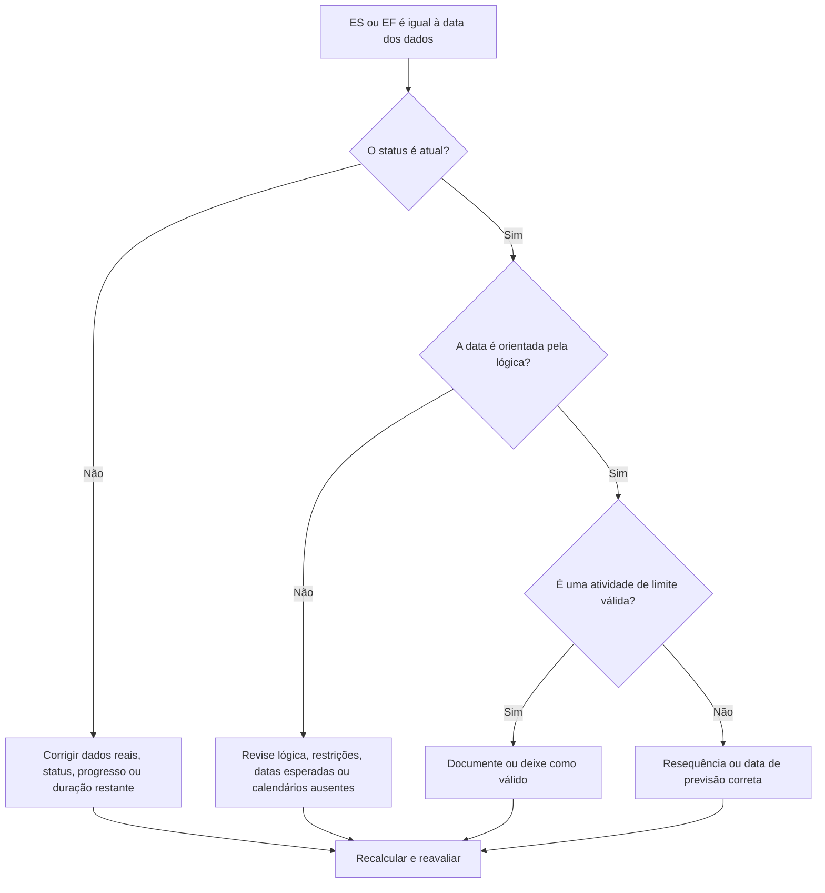

## Propósito

Este guia ajuda os programadores a revisar atividades cujo início antecipado ou término antecipado cai exatamente na data de dados do Primavera P6. Ele oferece suporte a verificações do ciclo de atualização, mostrando onde o trabalho está sendo coletado, na fronteira entre o desempenho real e o trabalho previsto.

## Antes de começar

Reúna as seguintes informações antes de agir:

- Resultado da avaliação atual para esta métrica.
- Dados do Projeto Data usada no último cálculo do cronograma.
- Lista de atividades em que Início Antecipado = Data Date.
- Lista de atividades em que Término Antecipado = Data Date.
- Status da atividade, início real, término real, duração restante, início, término, folga total e calendário.
- Detalhes do relacionamento do antecessor e do sucessor.
- Restrições, datas esperadas e notas de atualização.

## Entenda o seu resultado

Um resultado forte é zero atividades inexplicáveis ​​com início antecipado ou término antecipado na data dos dados.

Algumas atividades podem legitimamente permanecer na Data de Dados, especialmente trabalhos de curto prazo que estão prontos para prosseguir ou trabalhos que terminam no limite de atualização. A questão não é apenas a data; a questão é se a data é explicada por informações válidas de status, lógica e atualização.

Um resultado fraco significa que muitas atividades estão sendo coletadas na Data Date sem um motivo de cronograma claro.

## Meta de melhoria

A meta é 0 atividades inexplicáveis ​​com ES = Data Date ou EF = Data Date.

O objetivo é confirmar se cada atividade está com status correto, orientada lógicamente e prevista a partir do limite de atualização correto.

## Plano de Ação

### Etapa 1: Identifique o problema principal

Crie um layout ou relatório P6 que filtre atividades em que Início Antecipado seja igual à Data Date ou Término Antecipado seja igual à Data Date. Inclui ID da atividade, nome da atividade, EAP, status da atividade, início antecipado, término antecipado, início, término, início real, término real, duração restante, folga total, calendário, restrições, predecessores e sucessores.

Revise cada atividade e pergunte:

- A atividade está concluída, em andamento ou não foi iniciada?
- Está faltando um início real ou um término real?
- A atividade é direcionada lógicamente para a Data Date?
- Uma restrição, data esperada ou calendário está empurrando a atividade para a Data Date?
- A atividade é aberta ou fracamente vinculada?
- A data dos dados está correta para o período de atualização?

### Etapa 2: aplique as correções recomendadas

Se o status estiver incompleto, corrija Início Real, Término Real, Duração Restante, Porcentagem Concluída e Status da Atividade antes de alterar a lógica.

Se uma atividade estiver iniciando na Data Date porque a lógica predecessora está ausente ou não é direcionada, adicione ou corrija relacionamentos que representem a sequência de trabalho real.

Se uma atividade estiver sendo concluída na Data Date porque o progresso não foi atualizado, confirme se o trabalho foi concluído dentro do limite de atualização. Insira o término real, se concluído, ou atualize a duração restante e o término previsto, se o trabalho permanecer.

Se restrições ou datas esperadas estiverem empurrando atividades para a Data de Dados, remova-as, revise-as ou documente-as de acordo com o procedimento de controles do projeto.

### Etapa 3: remover bloqueadores comuns

Bloqueadores comuns incluem atualização incompleta, inícios abertos, términos abertos, restrições usadas como substitutos para lógica e movimentação de data de dados sem revisão de status suficiente.

Outro bloqueador é presumir que as atividades no Data Date são inofensivas. Um grande cluster no limite de atualização pode ocultar o sequenciamento ausente ou fazer com que a previsão de curto prazo pareça mais limpa do que realmente é.

### Etapa 4: validar as alterações

Recalcular o cronograma após as correções. Execute novamente a métrica e confirme se cada atividade restante na Data Date é explicada pelo status atual, pela lógica válida ou por uma exceção aprovada.

Revise a folga total, o caminho crítico ou mais longo, as datas dos marcos e os relatórios antecipados de curto prazo para confirmar se a correção não criou novas inconsistências.

## Cronograma de Melhoria

### Dia 1: Revisão e Diagnóstico

Execute a métrica, confirme a data dos dados e separe as descobertas em ES na data dos dados, EF na data dos dados, problemas de status, problemas de lógica, restrições e atividades de limite válidas.

### Dias 2-3: Implementar Ações Prioritárias

Corrija primeiro as atividades críticas, quase críticas e de curto prazo. Atualize o status, adicione ou corrija a lógica e revise as restrições.

### Dias 4-5: Monitore os primeiros resultados

Recalcular o cronograma e revisar resultados antecipados, alterações de folga, movimentação de marcos e atividades ainda pendentes na Data de Dados.

### Dia 6: Ajustes Finais

Resolva os itens incertos restantes com a disciplina responsável, o líder de campo ou o líder de controles do projeto.

### Dia 7: Reavaliar e comparar

Execute a avaliação novamente e compare o resultado com o limite desejado.

## Acompanhando o progresso

Use um rastreador simples para gerenciar correções e aprovações.

| Data | Ação tomada | Impacto esperado | Resultado/Observação | Próxima etapa |
| --- | --- | --- | --- | --- |
| [Data] | ES/EF revisado na data dos dados | Identificar agrupamento de limites | [Resultado observado] | Atribuir proprietário |
| [Data] | Status corrigido ou datas reais | Alinhe o status do trabalho com o limite de atualização | [Resultado observado] | Recalcular cronograma |
| [Data] | Lógica ou restrições corrigidas | Reduza o agrupamento de datas de dados inexplicáveis | [Resultado observado] | Reavaliar métrica |

## Se os resultados não melhorarem

Se os resultados não melhorarem, verifique se as atividades estão sendo repetidamente puxadas para a Data de Dados por falta de lógica, restrições, datas esperadas obsoletas ou procedimentos de atualização incompletos.

Escale itens não resolvidos quando eles afetarem relatórios de clientes críticos, quase críticos, entregas, pagamentos ou trabalhos de execução de curto prazo.

## Manutenção

Revise essa métrica durante cada ciclo de atualização antes de emitir relatórios. É especialmente útil após mover a data dos dados, importar o progresso, re-sequenciar o trabalho ou recalcular após grandes alterações de status.

## Lista de verificação resumida

- [ ] Resultado atual revisado
- [ ] Limite desejado confirmado
- [ ] Data Date confirmada
- [ ] ES = Dados Data atividades revisadas
- [ ] EF = Dados Data atividades revisadas
- [ ] Status e datas reais verificadas
- [ ] Duração restante marcada
- [ ] Lógica e restrições revisadas
- [ ] Atividades de limite válidas documentadas
- [ ] Cronograma recalculado
- [ ] Avaliação repetida
- [ ] Próximas etapas documentadas
## Conteúdo relacionado
- [Atividades na Data de Dados: Verificações de Início Antecipado e Finalização Antecipada no Primavera P6](03_blog_template.md)
- [O que é um cronograma](../../06b_blogs_pt/01_WHAT%20A%20SCHEDULE%20IS/01_blog.md)
- [Lógica Robusta](../../06b_blogs_pt/02_ROBUST%20LOGIC/02_ROBUST%20LOGIC.md)
