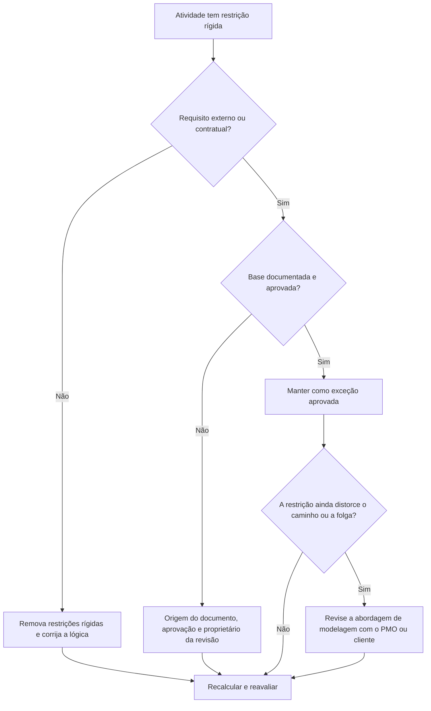

# Restrições rígidas no Primavera P6 - Guia de melhoria

## Propósito

Este guia ajuda os programadores a revisar e reduzir restrições rígidas no Primavera P6. Ele se concentra nas restrições que controlam fortemente as datas das atividades, especialmente o Início Obrigatório e o Término Obrigatório.

## Antes de começar

Reúna as seguintes informações antes de agir:

- Resultado da avaliação atual para esta métrica.
- Lista de atividades com restrições rígidas.
- Tipo de restrição e data de restrição para cada atividade.
- ID da atividade, nome da atividade, EAP, status da atividade, início, término, folga total e status do caminho crítico ou mais longo.
- Detalhes do relacionamento do antecessor e do sucessor.
- Base de contrato, cliente, licença, acesso, regulamentação ou transferência para qualquer restrição necessária.
- Comparação de linha de base ou atualização anterior mostrando quando a restrição foi adicionada.

## Entenda o seu resultado

Um resultado forte é zero restrições rígidas inexplicáveis.

Restrições rígidas podem substituir ou restringir fortemente o cálculo normal de CPM. Eles podem ser válidos para datas de contrato, janelas de acesso, liberações de licenças, pontos de espera regulatórios ou requisitos direcionados ao proprietário, mas não devem ser usados ​​como um substituto para a lógica ausente.

Um resultado fraco significa que o cronograma contém datas impostas que podem controlar a previsão em vez da lógica da rede.

## Meta de melhoria

A meta é 0 restrições rígidas inexplicáveis.

O objetivo é remover restrições rígidas desnecessárias e documentar quaisquer restrições que sejam realmente necessárias.

## Plano de Ação

### Etapa 1: Identifique o problema principal

Crie um layout ou relatório P6 que filtre atividades com tipos de restrição rígida. Inclui ID da atividade, nome da atividade, EAP, status da atividade, início, término, tipo de restrição, data da restrição, folga total, status do caminho crítico ou mais longo, predecessores e sucessores.

Revise cada atividade restrita e pergunte:

- Qual é a fonte da restrição severa?
- É exigido contratualmente ou externamente?
- Ele está substituindo a lógica predecessora ou sucessora ausente?
- Está forçando uma data prevista que deveria ser prevista no cronograma?
- Isso afeta a folga total, o caminho crítico ou os relatórios de marcos?
- O motivo está documentado e aprovado?

### Etapa 2: aplique as correções recomendadas

Se a restrição rígida não for exigida externamente, remova-a e adicione ou corrija a lógica CPM. Use relacionamentos, sequência de atividades, calendários e durações realistas para modelar o trabalho em vez de forçar datas.

Se a restrição rígida for necessária, documente a base. Capture a origem, a aprovação, a data, o proprietário responsável e o motivo pelo qual não pode ser modelado com lógica normal.

Se a restrição estiver sendo usada para preservar uma data prevista, analise se uma restrição mais flexível, um marco, um prazo ou uma nota de relatório seria mais apropriado.

### Etapa 3: remover bloqueadores comuns

Os bloqueadores comuns incluem restrições herdadas de linhas de base antigas, datas previstas do cliente inseridas como datas obrigatórias, planos de recuperação que deixam restrições temporárias para trás e lógica de interface ausente.

Outro bloqueador é assumir que uma restrição rígida é aceitável porque a data é importante. Datas importantes devem estar visíveis, mas o cronograma ainda deve explicar como o trabalho chega até elas.

### Etapa 4: validar as alterações

Recalcular o cronograma após as correções. Execute novamente a métrica e confirme se as restrições rígidas restantes foram aprovadas e documentadas.

Revise a folga total, o caminho crítico ou mais longo, as datas dos marcos e os resultados da comparação do cronograma para confirmar se a correção não criou movimentos inesperados.

## Cronograma de Melhoria

### Dia 1: Revisão e Diagnóstico

Execute as métricas e agrupe as descobertas por EAP, tipo de restrição, criticidade e base documentada.

### Dias 2-3: Implementar Ações Prioritárias

Remova primeiro as restrições rígidas desnecessárias das atividades críticas, quase críticas, contratuais e de curto prazo. Adicione lógica ausente quando necessário.

### Dias 4-5: Monitore os primeiros resultados

Recalcule o cronograma e revise o movimento da folga, as alterações do caminho crítico e os impactos dos marcos.

### Dia 6: Ajustes Finais

Resolva as exceções restantes com o agendador, o líder de controles do projeto, o revisor do PMO ou o representante do cliente.

### Dia 7: Reavaliar e comparar

Execute a avaliação novamente e compare o resultado com o limite desejado.

## Acompanhando o progresso

Use um rastreador simples para gerenciar correções e aprovações.

| Data | Ação tomada | Impacto esperado | Resultado/Observação | Próxima etapa |
| --- | --- | --- | --- | --- |
| [Data] | Restrições rígidas revisadas | Identifique os controles de data impostos | [Resultado observado] | Atribuir proprietário |
| [Data] | Removida restrição rígida desnecessária | Restaurar cálculo baseado em lógica | [Resultado observado] | Recalcular cronograma |
| [Data] | Restrição rígida aprovada e documentada | Preservar exceção justificada | [Resultado observado] | Reavaliar métrica |

## Se os resultados não melhorarem

Se os resultados não melhorarem, verifique se restrições rígidas estão sendo reintroduzidas por meio de importações, fragmentos copiados, atualizações de linha de base ou alterações no cronograma de recuperação.

Escale itens não resolvidos quando eles afetarem o caminho crítico, marcos contratuais, relatórios de clientes, análise de atrasos, eventos de pagamento ou datas de entrega.

## Manutenção

Revise essa métrica durante cada ciclo de atualização e antes da aprovação da linha de base. As restrições rígidas devem fazer parte das verificações de integridade do cronograma padrão, especialmente após um grande ressequenciamento, planejamento de recuperação e preparação de envio do cliente.

## Lista de verificação resumida

- [ ] Resultado atual revisado
- [ ] Limite desejado confirmado
- [ ] Lista de restrições rígidas gerada
- [ ] Tipo de restrição e data verificada
- [ ] Base externa confirmada
- [ ] Restrições rígidas desnecessárias removidas
- [ ] Lógica ausente corrigida
- [ ] Exceções aprovadas documentadas
- [ ] Cronograma recalculado
- [ ] Folga e caminho crítico revisados
- [ ] Avaliação repetida
- [ ] Próximas etapas documentadas
## Conteúdo relacionado
- [Restrições rígidas no Primavera P6 - Visão geral](01_overview_template.md)
- [Restrições rígidas no Primavera P6](03_blog_template.md)
- [O que é um cronograma](../../06b_blogs_pt/01_WHAT%20A%20SCHEDULE%20IS/01_blog.md)
- [Lógica Robusta](../../06b_blogs_pt/02_ROBUST%20LOGIC/02_ROBUST%20LOGIC.md)
