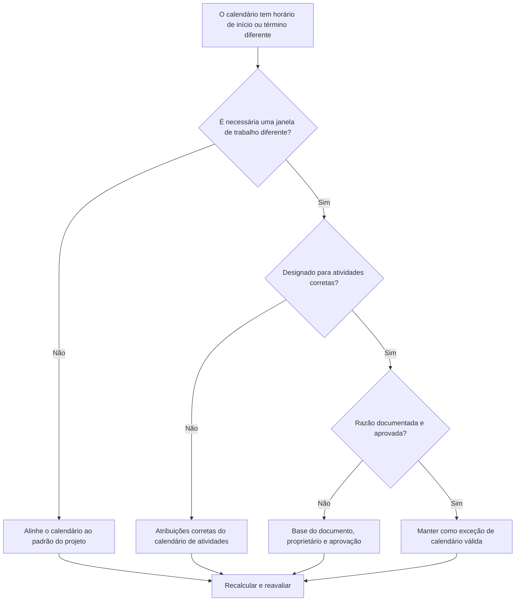

# Calendários com diferentes horários de início e término no Primavera P6 - Guia de melhoria

## Propósito

Este guia ajuda os programadores a revisar os calendários do Primavera P6 que usam diferentes horários de início ou término dos dias úteis. Ele oferece suporte às verificações de qualidade do cronograma, confirmando que as diferenças de horário do calendário são intencionais, aprovadas e compreendidas.

## Antes de começar

Reúna as seguintes informações antes de agir:

- Resultado da avaliação atual para esta métrica.
- Padrão de calendário de projeto aprovado e janela normal de trabalho diário.
- Lista de calendários com diferentes horários de início, término, janelas de turno ou padrões de dia parcial.
- Atividades atribuídas a cada calendário afetado.
- Tipo de calendário, como calendário global, de projeto ou de recurso.
- Atividades críticas ou quase críticas usando calendários afetados.
- Motivo de cada calendário fora do padrão, como turno noturno, indisponibilidade de trabalho, acesso restrito ou programação especial da equipe.

## Entenda o seu resultado

Um resultado forte é zero calendários inexplicáveis ​​com horários de início ou término diferentes.

As diferenças de calendário podem ser válidas quando o trabalho realmente segue turnos, janelas de acesso ou disponibilidade de recursos diferentes. A preocupação é quando os calendários diferem de acordo com a hora do dia sem um motivo claro.

Um resultado fraco significa que o cronograma pode conter suposições de calendário ocultas que afetam as datas, a folga e o comportamento lógico.

## Meta de melhoria

A meta é 0 calendários inexplicáveis ​​com horários de início ou término diferentes.

O objetivo é confirmar se cada janela de trabalho diferente é necessária, documentada e atribuída apenas às atividades corretas.

## Plano de Ação

### Etapa 1: Identifique o problema principal

Crie uma exportação de revisão de calendário do P6 ou uma ferramenta de avaliação de cronograma que liste cada calendário, seu horário normal de início do dia útil, horário de término, horas diárias, exceções e atividades atribuídas.

Revise cada calendário fora do padrão e pergunte:

- Qual é o dia de trabalho padrão aprovado para o projeto?
- Quais calendários usam horários de início ou término diferentes?
- As diferenças são intencionais ou acidentais?
- Quais atividades usam cada calendário?
- As atividades críticas ou quase críticas são afetadas?
- A diferença de calendário está documentada e aprovada?

### Etapa 2: aplique as correções recomendadas

Se a diferença de calendário for acidental, alinhe o horário de início, o horário de término e os períodos de trabalho diário com o padrão do projeto aprovado.

Se a diferença de calendário for válida, documente o motivo. Os casos válidos comuns incluem turno noturno, trabalho de fim de semana, janelas de desligamento, restrições de acesso do proprietário, restrições ambientais ou períodos de trabalho específicos de recursos.

Se as atividades forem atribuídas ao calendário errado, corrija a atribuição do calendário de atividades antes de alterar o próprio calendário. Um calendário especial válido ainda pode criar problemas se for atribuído de forma muito ampla.

### Etapa 3: remover bloqueadores comuns

Os bloqueadores comuns incluem calendários copiados de programações antigas, calendários importados com configurações de horário ocultas, calendários de recursos usados ​​como calendários de atividades e pequenas diferenças de horário que não são visíveis em layouts de data padrão.

Outro bloqueador é revisar apenas a data sem a hora. No P6, a hora do dia pode afetar o posicionamento da atividade, a folga, o comportamento do relacionamento e o movimento aparente da data de um dia.

### Etapa 4: validar as alterações

Recalcular o cronograma após as correções do calendário. Execute novamente a métrica e confirme se as diferenças restantes do calendário são válidas e documentadas.

Revise as datas das atividades afetadas, a folga total, o caminho crítico ou mais longo, os laços de relacionamento e os relatórios de previsão de curto prazo para confirmar que a correção não criou movimentos inesperados.

## Cronograma de Melhoria

### Dia 1: Revisão e Diagnóstico

Execute as métricas e agrupe as descobertas por calendário, janela de trabalho, tipo de calendário, atividades atribuídas e criticidade.

### Dias 2-3: Implementar Ações Prioritárias

Corrija primeiro as diferenças acidentais de horário do calendário e as atribuições erradas do calendário de atividades em atividades críticas, quase críticas e de curto prazo.

### Dias 4-5: Monitore os primeiros resultados

Recalcule o cronograma e revise o movimento da folga, as mudanças de data, os impactos dos marcos e as alterações antecipadas.

### Dia 6: Ajustes Finais

Resolva as exceções de calendário restantes com o agendador, o proprietário da disciplina, o líder de controles do projeto ou o revisor do PMO.

### Dia 7: Reavaliar e comparar

Execute a avaliação novamente e compare o resultado com o limite desejado.

## Acompanhando o progresso

Use um rastreador simples para gerenciar correções e aprovações.

| Data | Ação tomada | Impacto esperado | Resultado/Observação | Próxima etapa |
| --- | --- | --- | --- | --- |
| [Data] | Horários de início e término do calendário revisados | Identifique janelas de trabalho fora do padrão | [Resultado observado] | Atribuir proprietário |
| [Data] | Calendário alinhado ao padrão do projeto | Remover diferença horária acidental | [Resultado observado] | Recalcular cronograma |
| [Data] | Exceção de calendário válida documentada | Preservar janela de trabalho justificada | [Resultado observado] | Reavaliar métrica |

## Se os resultados não melhorarem

Se os resultados não melhorarem, verifique se calendários não padronizados estão a ser reintroduzidos através de importações, calendários copiados, atribuições de recursos ou atualizações de base.

Aumente as diferenças de calendário não resolvidas quando elas afetarem o caminho crítico, relatórios de clientes, marcos de pagamento, interrupções de trabalho, datas de entrega ou execução de curto prazo.

## Manutenção

Revise essa métrica durante o desenvolvimento da linha de base, agende importações e todos os ciclos de atualização importantes. As configurações de horário do calendário devem fazer parte das verificações de integridade do cronograma padrão antes da emissão dos relatórios.

## Lista de verificação resumida

- [ ] Resultado atual revisado
- [ ] Limite desejado confirmado
- [ ] Padrão de calendário do projeto confirmado
- [ ] Horários de calendário fora do padrão identificados
- [ ] Atividades atribuídas revisadas
- [ ] Impactos críticos e quase críticos verificados
- [ ] Diferenças acidentais de calendário corrigidas
- [ ] Exceções de calendário válidas documentadas
- [ ] Cronograma recalculado
- [ ] Alterações de data e folga revisadas
- [ ] Avaliação repetida
- [ ] Próximas etapas documentadas
## Conteúdo relacionado
- [Calendários com diferentes horários de início e término no Primavera P6 - Visão geral](01_overview_template.md)
- [Calendários com diferentes horários de início e término no Primavera P6](03_blog_template.md)
- [O que é um cronograma](../../06b_blogs_pt/01_WHAT%20A%20SCHEDULE%20IS/01_blog.md)
- [Lógica Robusta](../../06b_blogs_pt/02_ROBUST%20LOGIC/02_ROBUST%20LOGIC.md)
