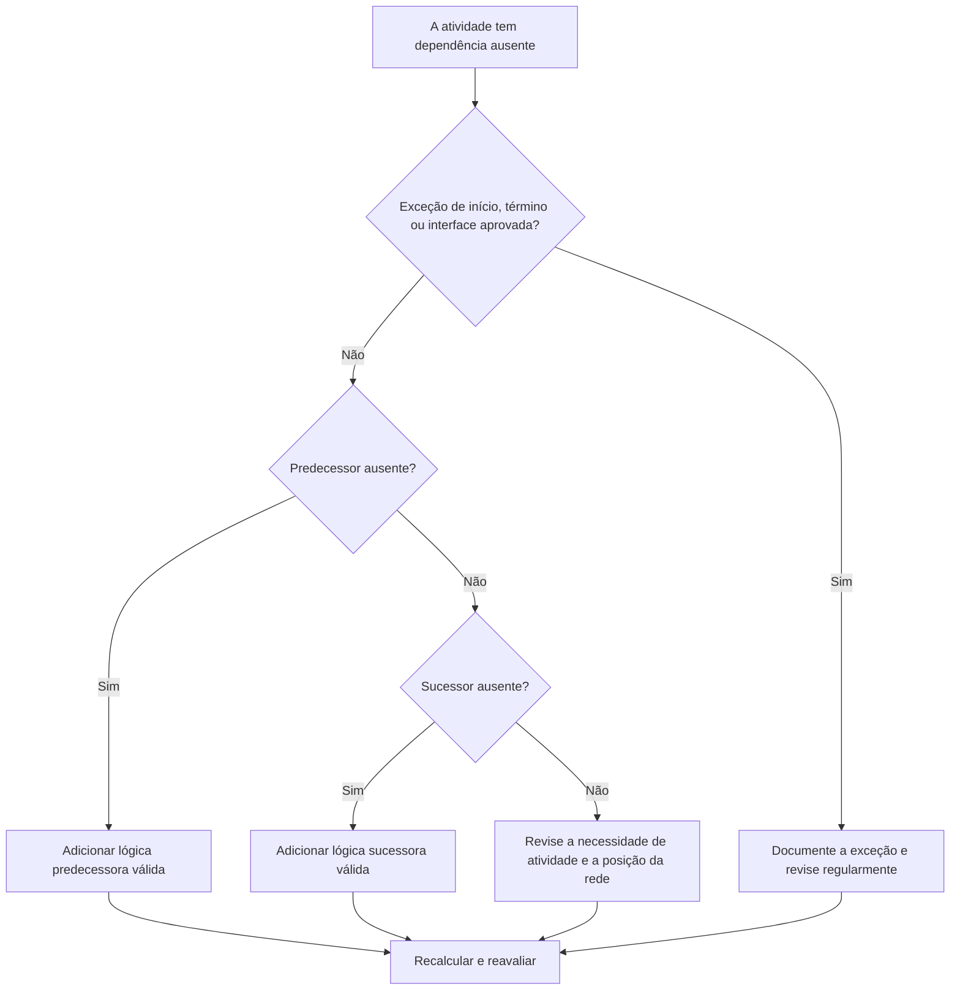

# Dependências ausentes no Primavera P6 - Guia de melhoria

## Propósito

Este guia ajuda os agendadores a identificar e corrigir a lógica predecessora ou sucessora ausente no Primavera P6. Ele oferece suporte à qualidade do cronograma, melhorando a integridade da rede CPM.

## Antes de começar

Reúna as seguintes informações antes de agir:

- Resultado da avaliação atual para esta métrica.
- Lista de atividades sem antecessores.
- Lista de atividades sem sucessores.
- Lista de atividades sem lógica predecessora nem sucessora.
- ID da atividade, nome da atividade, EAP, tipo de atividade, status da atividade, início, término, folga total e calendário.
- Início e término do projeto aprovados, interface externa e lista de exceções contratuais.
- Notas de atualização mais recentes e disciplina responsável ou proprietário do pacote.

## Entenda o seu resultado

Um resultado forte é zero atividades não resolvidas com lógica de dependência ausente.

Algumas atividades podem legitimamente não ter antecessor ou sucessor, como o marco de início do projeto aprovado, o marco de conclusão final ou os marcos de interface externa aprovados. Estes devem ser limitados e documentados.

Um resultado fraco significa que o cronograma contém atividades que não estão devidamente conectadas à rede CPM.

## Meta de melhoria

A meta é 0 atividades não resolvidas com dependências ausentes.

O objetivo é conectar cada atividade à lógica predecessora e sucessora válida ou documentar o motivo aprovado pelo qual é uma exceção.

## Plano de Ação

### Etapa 1: Identifique o problema principal

Crie um layout ou relatório P6 que filtre atividades sem predecessores, sem sucessores ou nenhum dos dois. Inclui ID da atividade, nome da atividade, EAP, tipo de atividade, status da atividade, início, término, folga total, calendário, restrições, predecessores e sucessores.

Revise cada atividade e pergunte:

- Esta atividade é um item aprovado para início ou término do projeto?
- É uma interface externa, uma data controlada pelo proprietário ou uma exceção contratual?
- Que trabalho deve acontecer antes que esta atividade possa começar?
- Que trabalho depende do término ou início desta atividade?
- A atividade está obsoleta, duplicada ou com status incorreto?
- Qual proprietário pode confirmar a real dependência?

### Etapa 2: aplique as correções recomendadas

Para inícios abertos, adicione lógica predecessora que represente a condição real necessária antes que a atividade possa começar. Isso pode incluir trabalho prévio, aprovações, acesso, aquisição, liberação de projeto, inspeção ou entrega.

Para acabamentos abertos, adicione lógica sucessora que represente o que depende da atividade. Isso pode incluir trabalho de acompanhamento, testes, comissionamento, rotatividade, encerramento ou um marco de conclusão.

Para atividades isoladas sem antecessores e sem sucessores, confirme se a atividade ainda é necessária. Se for um trabalho válido, conecte-o à rede. Se estiver obsoleto, remova-o ou feche-o de acordo com o procedimento de controles do projeto.

### Etapa 3: remover bloqueadores comuns

Bloqueadores comuns incluem atividades copiadas, fragmentos incompletos, transferências pouco claras entre disciplinas, informações de interface ausentes e pressão para carregar atividades antes que o sequenciamento seja conhecido.

Outro bloqueador é adicionar relacionamentos de espaço reservado apenas para passar a métrica. Os relacionamentos devem representar dependências reais e não vínculos artificiais.

### Etapa 4: validar as alterações

Recalcular o cronograma após as correções. Execute novamente a métrica e confirme se cada atividade restante está conectada ou documentada como uma exceção aprovada.

Revise a folga total, o caminho crítico ou mais longo, as datas dos marcos e os relatórios antecipados de curto prazo para confirmar se a lógica adicionada não criou movimentos inesperados.

## Cronograma de Melhoria

### Dia 1: Revisão e Diagnóstico

Execute a métrica e agrupe as descobertas em predecessores ausentes, sucessores ausentes, atividades isoladas, exceções válidas e atividades obsoletas.

### Dias 2-3: Implementar Ações Prioritárias

Corrija primeiro as atividades críticas, quase críticas, contratuais e de curto prazo. Adicione lógica válida e remova atividades obsoletas quando apropriado.

### Dias 4-5: Monitore os primeiros resultados

Recalcule o cronograma e revise a folga, o caminho crítico, as datas futuras e os impactos dos marcos.

### Dia 6: Ajustes Finais

Resolva questões de dependência restantes com líderes disciplinares, proprietários de pacotes, gerentes de construção ou liderança de controles de projeto.

### Dia 7: Reavaliar e comparar

Execute a avaliação novamente e compare o resultado com o limite desejado.

## Acompanhando o progresso

Use um rastreador simples para gerenciar correções e aprovações.

| Data | Ação tomada | Impacto esperado | Resultado/Observação | Próxima etapa |
| --- | --- | --- | --- | --- |
| [Data] | Dependências ausentes revisadas | Identifique inícios e términos abertos | [Resultado observado] | Atribuir proprietário |
| [Data] | Adicionada lógica predecessora | Melhorar a lógica de início de atividade | [Resultado observado] | Recalcular cronograma |
| [Data] | Adicionada lógica sucessora | Melhorar a continuidade do término da atividade | [Resultado observado] | Reavaliar métrica |

## Se os resultados não melhorarem

Se os resultados não melhorarem, verifique se novas atividades estão sendo adicionadas sem lógica, se os fragnets importados estão incompletos ou se as regras de exceção estão muito flexíveis.

Escale itens não resolvidos quando eles afetarem o caminho crítico, relatórios de clientes, marcos de pagamento, entrega, aquisição ou execução de curto prazo.

## Manutenção

Revise essa métrica durante cada ciclo de atualização, após as importações do cronograma e antes da aprovação da linha de base. As dependências ausentes devem fazer parte das verificações de integridade do cronograma padrão.

## Lista de verificação resumida

- [ ] Resultado atual revisado
- [ ] Limite desejado confirmado
- [ ] Open começa revisado
- [ ] Términos abertos revisados
- [ ] Atividades isoladas revisadas
- [ ] Exceções válidas documentadas
- [ ] Lógica predecessora ausente adicionada
- [ ] Lógica de sucessor ausente adicionada
- [ ] Atividades obsoletas resolvidas
- [ ] Cronograma recalculado
- [ ] Avaliação repetida
- [ ] Próximas etapas documentadas
## Conteúdo relacionado
- [Dependências ausentes no Primavera P6 - Visão geral](01_overview_template.md)
- [Dependências ausentes no Primavera P6](03_blog_template.md)
- [O que é um cronograma](../../06b_blogs_pt/01_WHAT%20A%20SCHEDULE%20IS/01_blog.md)
- [Lógica Robusta](../../06b_blogs_pt/02_ROBUST%20LOGIC/02_ROBUST%20LOGIC.md)
