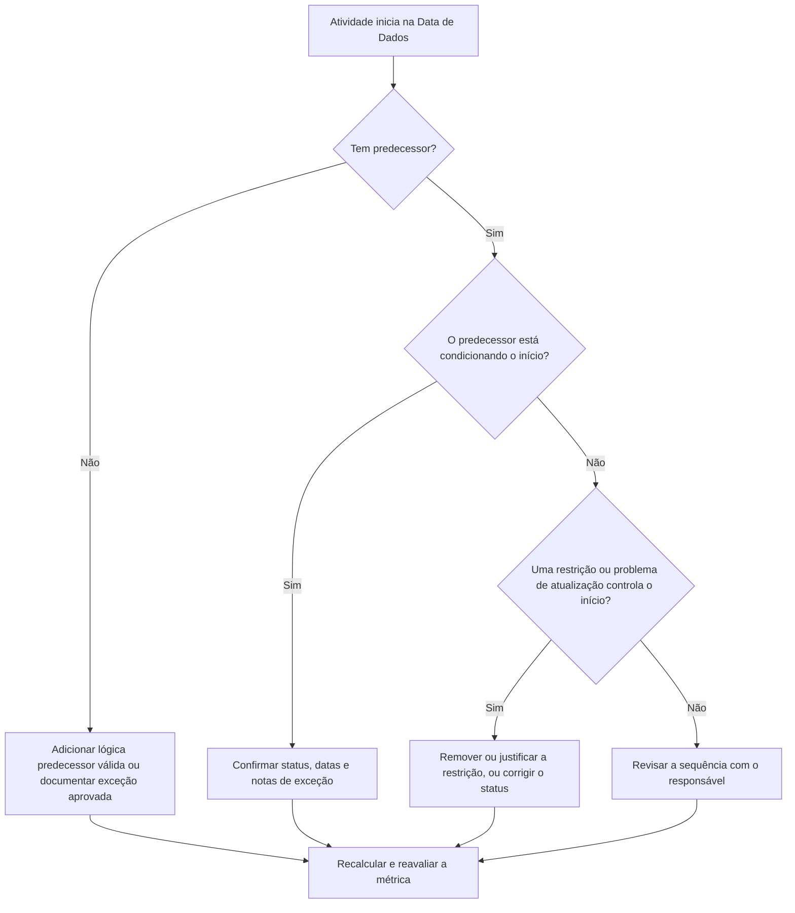

## Objetivo

Este guia ajuda programadores e equipes de controle de projetos a reduzir ou eliminar atividades programadas para iniciar na Data de Dados do Primavera P6 sem lógica predecessor válida condicionando o início. Aplica-se a revisões de qualidade de cronograma, verificações de saúde do PMO e validação do ciclo de atualização.

O objetivo é confirmar que o trabalho de curto prazo está suportado por lógica CPM clara e que as atividades não estão iniciando na Data de Dados apenas por causa de relacionamentos faltando, restrições, datas manuais ou atualizações de progresso incompletas.

## Antes de Começar

Reúna as seguintes informações antes de agir:

- Resultado atual da avaliação desta métrica.
- Data de Dados do projeto usada no cálculo mais recente do cronograma.
- Lista de atividades abertas ou não iniciadas com data de início igual à Data de Dados.
- Detalhes de relacionamento predecessor e sucessor para cada atividade.
- Restrições, datas esperadas, datas reais e atribuições de calendário.
- Opções de programação do P6 usadas para a atualização, incluindo configurações de lógica retida ou substituição de progresso onde relevante.
- Quaisquer exceções aprovadas, como atividades de início do projeto, marcos de interface externa ou inícios direcionados pelo proprietário.

## Entenda Seu Resultado

Um resultado forte é zero atividades não resolvidas iniciando na Data de Dados sem lógica predecessor condicionante. Isso significa que o trabalho atual e de curto prazo está conectado à rede do cronograma e a Data de Dados não está ocultando sequenciamento faltando.

Um resultado aceitável pode incluir um pequeno número de exceções documentadas. Estas devem ser revisadas e aprovadas, não ignoradas. Por exemplo, um marco de ordem de serviço ou uma atividade autorizada externamente pode não precisar de um predecessor normal, mas o motivo deve ser visível para os revisores.

Um resultado fraco significa que múltiplas atividades estão iniciando na Data de Dados sem um condicionante lógico claro. Isso pode indicar inícios abertos, relacionamentos predecessores faltando, restrições excessivas, atualizações de progresso incompletas ou atividades que não foram resequenciadas adequadamente após a última atualização.

## Meta de Melhoria

A meta é 0 atividades não resolvidas iniciando na Data de Dados sem lógica condicionante válida.

O objetivo da melhoria não é apenas reduzir a contagem. O objetivo mais profundo é garantir que cada atividade próxima à Data de Dados tenha uma razão defensável para seu início previsto. Após a correção, cada atividade afetada deve ter lógica predecessor apropriada, uma exceção documentada ou uma condição de status/data corrigida.

## Plano de Ação

### Etapa 1: Identificar o Problema Principal

Crie um layout ou relatório no P6 que filtre atividades abertas ou não iniciadas com data de início igual à Data de Dados. Inclua colunas para ID da Atividade, Nome da Atividade, EAP, Início, Término, Status, Folga Total, Calendário, Restrição Principal, Predecessores, Sucessores e indicadores de Relacionamento Condicionante se disponíveis.

Revise cada atividade e pergunte:

- A atividade tem algum predecessor?
- Se os predecessores existem, eles realmente estão condicionando o início?
- A atividade está sendo retida ou movida por uma restrição?
- A atividade está sem um início real ou atualização de progresso?
- A atividade é uma exceção válida, como um marco de início do projeto?
- A atividade pertence a uma área da EAP onde a lógica é geralmente fraca?

Agrupe os resultados em causas práticas: predecessores faltando, predecessores não condicionantes, restrições ou datas esperadas, erros de atualização/status ou exceções aprovadas.

### Etapa 2: Aplicar as Correções Recomendadas

Comece com lógica faltando ou fraca. Adicione relacionamentos predecessores válidos que representem a sequência real de trabalho, como relacionamentos fim-a-início, início-a-início ou fim-a-fim onde apropriado. Evite adicionar relacionamentos apenas para satisfazer a métrica; cada relacionamento deve refletir uma dependência real de construção, engenharia, suprimentos, acesso, aprovação ou handover.

Revise as restrições a seguir. Se uma atividade está iniciando na Data de Dados por causa de uma restrição de início, confirme se a restrição é justificada contratual ou operacionalmente. Remova restrições desnecessárias e permita que a atividade seja condicionada pela lógica. Se a restrição for válida, documente o motivo e confirme que ela não distorce o caminho crítico.

Verifique o status do progresso. Se o trabalho já começou, atualize o início real e a duração restante corretamente. Se o trabalho não começou, confirme que o início previsto deve permanecer na Data de Dados. Uma atividade não deve aparecer pronta para iniciar simplesmente porque o ciclo de atualização a puxou para a data atual.

Após as alterações serem feitas, recalcule o cronograma e revise as atividades afetadas novamente. Confirme que a data de início agora está condicionada pela lógica, com status correto ou documentada como exceção aprovada.

### Etapa 3: Remover Bloqueadores Comuns

Bloqueadores comuns incluem feedback de campo pouco claro, informações de interface faltando e pressão para fazer o trabalho de curto prazo parecer pronto. Resolva-os revisando as atividades afetadas com líderes de disciplina, gerentes de construção, responsáveis por suprimentos ou gerentes de pacote.

Outro bloqueador comum é o uso indevido de restrições como substituto para lógica. Restrições podem ser necessárias em alguns casos, mas não devem substituir a rede do cronograma. Se uma restrição for mantida, documente por que ela existe e como afeta a folga e o caminho mais longo.

Verifique também se o problema é causado por configurações de cálculo do cronograma ou práticas de atualização. Se substituição de progresso, lógica retida, progresso fora de sequência ou atualização incompleta estiver afetando o resultado, alinhe o método de atualização com o procedimento de controles do projeto antes de reavaliar a métrica.

### Etapa 4: Validar as Alterações

Valide o cronograma corrigido antes da próxima avaliação. Execute novamente o filtro para atividades abertas ou não iniciadas iniciando na Data de Dados sem lógica condicionante. Confirme que cada item restante está corrigido ou documentado como exceção aprovada.

Revise a folga total, o caminho mais longo e as atividades de planejamento de curto prazo após o recálculo. Uma correção de lógica pode alterar o caminho crítico ou revelar problemas adicionais de sequenciamento. Se o movimento do cronograma for significativo, comunique o impacto ao líder de controles do projeto ou ao revisor do PMO.

## Cronograma de Melhoria

### Dia 1: Revisar e Diagnosticar

Execute a métrica, confirme a Data de Dados e produza a lista de atividades. Separe os resultados em lógica faltando, lógica não condicionante, restrições, erros de status e possíveis exceções.

### Dias 2-3: Implementar Ações Prioritárias

Corrija primeiro as atividades de maior impacto, especialmente atividades críticas ou quase críticas. Adicione lógica predecessor válida, remova restrições desnecessárias, atualize o status incorreto e documente exceções.

### Dias 4-5: Monitorar os Primeiros Resultados

Recalcule o cronograma e verifique se as atividades afetadas agora estão condicionadas pela lógica. Verifique se há alterações inesperadas na folga total, no caminho mais longo e nas datas dos marcos.

### Dia 6: Ajustes Finais

Resolva bloqueadores remanescentes com a disciplina responsável ou o responsável pelo pacote. Confirme que quaisquer exceções mantidas são justificadas e claramente documentadas.

### Dia 7: Reavaliar e Comparar

Execute a avaliação novamente e compare o novo resultado com o resultado anterior e o limite-alvo. Confirme se a métrica está agora em zero atividades não resolvidas ou se são necessárias mais ações.

## Acompanhamento do Progresso

Use um rastreador simples para gerenciar correções e aprovações.

| Data | Ação Executada | Impacto Esperado | Resultado / Observação | Próximo Passo |
| --- | --- | --- | --- | --- |
| [Data] | Revisadas atividades iniciando na Data de Dados sem lógica condicionante | Identificar lógica faltando ou fraca | [Resultado observado] | Atribuir correções ao responsável |
| [Data] | Adicionados relacionamentos predecessores válidos | Melhorar o sequenciamento CPM | [Resultado observado] | Recalcular e revisar impacto na folga |
| [Data] | Removidas ou justificadas restrições | Reduzir inícios artificiais | [Resultado observado] | Confirmar exceções restantes |
| [Data] | Atualizado status incorreto de atividades | Melhorar precisão da atualização | [Resultado observado] | Executar avaliação novamente |

## Se os Resultados Não Melhorarem

Se o resultado não melhorar, verifique se as mesmas atividades ainda estão falhando ou se novas atividades estão aparecendo na Data de Dados. Falhas repetidas podem indicar um problema mais amplo de desenvolvimento do cronograma, como lógica incompleta em uma área da EAP, disciplina de atualização fraca ou uso inconsistente de restrições.

Escale problemas persistentes ao líder de controles do projeto, ao gerente de planejamento ou ao revisor do PMO. Para cronogramas de grande porte, considere um workshop de revisão de lógica focado nos pacotes de trabalho afetados. Se o cronograma é usado para relatórios contratuais, análise de atraso ou previsão de valor agregado, os itens não resolvidos devem ser tratados como uma preocupação de qualidade.

## Manutenção

Revise esta métrica durante cada ciclo de atualização antes de emitir o cronograma. A verificação deve ser parte da revisão padrão de saúde do cronograma, especialmente após atualizações de progresso, resequenciamento, mudanças de escopo significativas ou planejamento de recuperação.

Bons hábitos de manutenção incluem manter as colunas de predecessor e sucessor visíveis nos layouts do P6, revisar inícios abertos antes de cada submissão, documentar exceções aprovadas e verificar se o movimento da Data de Dados não cria um novo grupo de atividades não condicionadas.

## Lista de Verificação de Resumo

- [ ] Resultado atual revisado
- [ ] Limite-alvo confirmado
- [ ] Data de Dados confirmada
- [ ] Atividades iniciando na Data de Dados identificadas
- [ ] Problema principal identificado
- [ ] Lógica faltando ou fraca corrigida
- [ ] Restrições revisadas e justificadas ou removidas
- [ ] Datas de status verificadas
- [ ] Exceções aprovadas documentadas
- [ ] Cronograma recalculado
- [ ] Resultados monitorados
- [ ] Avaliação repetida
- [ ] Próximos passos documentados
