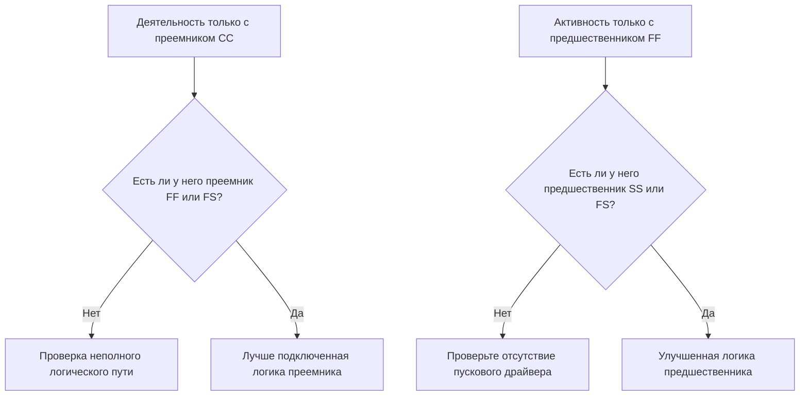

# Надежная логика

Логика — это математическое представление последовательности и зависимостей внутри графика проекта. В нем объясняется, что должно произойти перед чем, какие действия могут выполняться одновременно и как команда проекта намерена перейти от первого действия к окончательному завершению.

В хорошей графике Primavera P6 логика не является украшением. Это механизм, который позволяет графику рассчитывать даты, резерв, критический путь и прогнозировать движение. В нем рассказывается история исполнения таким образом, чтобы ее можно было пересматривать, оспаривать и улучшать.

Если в графике указано: «Заложите фундамент, затем постройте стены, затем постройте крышу», именно логика превращает эту последовательность в вычисляемую сеть. Планировщик не только рисует временную шкалу. Планировщик определяет путь доставки.

## Логика рассказывает историю работы

У каждой проектной команды есть намеченный способ выполнения проекта. Инженерное дело может выпускать проекты по областям. Закупочная компания может доставить оборудование упаковками. Строительные работы могут подготовить доступ до начала строительных работ. Прежде чем можно будет начать ввод в эксплуатацию, возможно, потребуется завершить механическое завершение.

Логические связи являются математическим выражением этого плана.

Эта простая диаграмма — не просто последовательность. Это модель принятия решений. Если фундамент опоздал, стены могут опоздать. Если стены опоздали, крыша может опоздать. Если крыша запоздает, это может помешать внутренним работам. График может показать это влияние только в том случае, если присутствует логика.

Надежная логика означает, что график может объяснить, почему действия начинаются, почему они заканчиваются и что происходит, когда одна часть плана перемещается.

## Почему надежная логика важна для даты данных

Метрика «Действия, начинающиеся в дату данных без управляющей логики» является надежным тестом качества графика.

Дата данных — это граница между фактической производительностью и прогнозируемой работой. Когда деятельность начинается точно в дату данных, проверяющий должен задать простой вопрос: что движет этим началом?

Если действие имеет действительную логику предшественника, график может объяснить начало. Возможно, территорию освободили. Возможно, поставка материала была завершена. Возможно, предыдущая деятельность завершилась и позволила приступить к работе следующей команде.

Если в деятельности нет движущей логики, старт получается слабее. Действие может находиться в дате данных, потому что у него нет предшественника, потому что логика неполна, потому что к этому принуждает ограничение или потому что обновление не было полностью статусировано.

Вот почему надежная логика имеет значение. График не должен допускать, чтобы работа выглядела готовой только потому, что дата данных изменилась. Он должен показать реальное состояние, позволяющее начать работу.

## Баланс: достаточно логики, а не избыточной логики

Хорошая логика сбалансирована. Графику необходимо достаточное количество связей, чтобы правильно связать действия с предшественниками и преемниками. В то же время следует избегать избыточной логики, которая повторяет одну и ту же зависимость ненужным образом.

Слишком мало логики приводит к открытым стартам и финишам, ненадежному плаванию и слабым результатам критического пути. Слишком много логики может затруднить обзор сети и скрыть истинную причину активности.

Цель не в том, чтобы максимизировать количество связей. Цель состоит в том, чтобы четко представить обязательные и требуемые зависимости.

По каждому действию планировщик должен иметь возможность ответить:

- Что позволяет начать эту деятельность?
- Что это занятие дает в дальнейшем?
- Какие отношения действительно движут активностью?
- Есть ли какие-либо отношения дублированные или ненужные?
- Поймет ли рецензент предполагаемую последовательность?

Этот баланс имеет решающее значение для пересмотра графика PMO. Плотная сеть не является автоматически сильной сетью. Легкая сеть не является автоматически чистой сетью. Правильная сеть объясняет план выполнения без помех.

## Каждому виду деятельности нужен стартовый драйвер

Надежная логика означает, что у каждого действия есть предшественник, который разрешает или запускает его запуск, за исключением допустимых исключений при запуске проекта или разрешенных извне исключений.

Для строительной деятельности движущей силой запуска может быть доступ к территории, завершение предшествующего строительства, наличие материалов, выпуск проекта, утверждение разрешения или предварительное завершение сделки. Для закупочной деятельности это может быть утверждение проекта или выпуск заказа на поставку. Для ввода в эксплуатацию это может быть механическое завершение, готовность испытательного комплекса или обкатка системы.

Если этот драйвер запуска отсутствует, действие может переместиться в искусственное положение в графике. Во время обновлений она может отображаться в поле «Дата данных». Это создает ложное чувство готовности.

Рассмотрим задание под названием «Установка насосов». Если он начинается в дату данных, но не имеет предшественника для завершения строительства фундамента, доставки насосов или передачи участка, в графике не объясняется, почему можно начать установку. Деятельность можно планировать, но логика не является надежной.

## SS и FF — это половинчатые отношения

Отношения «Начало-Начало» и «Окончание-Окончание» полезны, но их следует использовать осторожно. Во многих проверках графика их лучше всего понимать как «половинные» отношения, поскольку они сами по себе не полностью помещают операцию в законченный логический путь.

Отношения SS могут объяснить, когда может начаться действие, но не могут объяснить, когда действие должно завершиться или что оно передает. Отношения FF могут объяснить выравнивание завершения, но не могут объяснить, когда разрешено начинать действие.

Это не делает SS или FF неправильными. Перекрытие работ является обычным и часто реалистичным. Вопрос в том, является ли деятельность полностью связанной.

Например:

- Действие с преемником SS обычно должно также иметь преемника FF или FS.
- Деятельность с предшественником FF обычно также должна иметь предшественника SS или FS.

Это помогает предотвратить соединение действий только на одной стороне их продолжительности. В графике должно быть указано, как начинается работа и как она завершается.

## Надежная логика на практике

Практическая логическая проверка должна начинаться с действий, близких к дате данных, критических и околокритических работ, а также основных путей передачи. Эти области оказывают наибольшее влияние на принятие текущих решений.

В P6 полезные столбцы обзора включают идентификатор действия, имя действия, ИСР, начало, окончание, статус действия, общий резерв, предшественники, преемники, тип отношений, задержку, ограничения, календарь и индикаторы движущих отношений, если они доступны.

По каждому виду деятельности, начинающемуся с Даты данных, спросите:

- Действительно ли мероприятие готово к началу?
- Какой предшественник разрешает запуск?
- Является ли этот предшественник завершенным, в стадии разработки или прогнозируемым?
- Отношения управляют?
- Заменяет ли логику ограничение или ожидаемая дата?
- Имеет ли действие также действительную логику преемника?

Если ответ неясен, деятельность следует обсудить с ответственным владельцем. Исправлением может быть добавление отсутствующего предшественника, изменение типа связи, удаление ограничения, обновление фактических данных или документирование допустимого исключения.

## Избегайте искусственной логики

Одна из ошибок — добавление связей только для передачи метрики. Это не создает устойчивой логики. Это создает искусственную логику.

Отношения должны представлять собой реальные зависимости. Если ссылка не отражает последовательность строительства, проектную версию, потребность в закупках, доступ, утверждение, тестирование, ввод в эксплуатацию или передачу, она может не принадлежать сети.

Другая ошибка — оставлять избыточную логику, потому что это выглядит безопаснее. Если та же зависимость уже представлена ​​более четкой взаимосвязью, дополнительные ссылки могут запутать критический путь и затруднить аудит сети.

Надежная логика ясна, целенаправленна и защитима.

## Заключение

Логика — это математическая история того, как проект будет выполнен. Он определяет, что должно произойти в первую очередь, что может произойти вместе и что следует дальше.

Надежная логика не означает добавление как можно большего количества ссылок. Это означает добавление правильных связей: достаточных, чтобы связать каждое действие с реальными предшественниками и преемниками, но не настолько многих, чтобы сеть стала избыточной или вводящей в заблуждение.

Когда действия начинаются в дату данных без движущейся логики, график выявляет слабость в этой истории. Активность может отображаться как готовая, но в сети не поясняют, почему.

Надежный график должен четко ответить на этот вопрос. Что позволяет начать эту работу? Что это дает дальше? Если график может ответить на оба вопроса, логика становится надежной. Если это невозможно, команде проекта придется проделать дополнительную работу по определению последовательности, прежде чем прогнозу можно будет доверять.
## Связанные материалы
- [Отсутствующие зависимости в Primavera P6 - Обзор](../../metrics/21_missing_dependencies/02_guide_template.md)
- [Резервированная логика в графиках Primavera P6 - Обзор](../../metrics/06_redundant_logic/02_guide_template.md)
- [Что такое график](../01_WHAT%20A%20SCHEDULE%20IS/01_blog.md)
- [Критический путь](../03_CRITICAL%20PATH/03_CRITICAL%20PATH.md)
