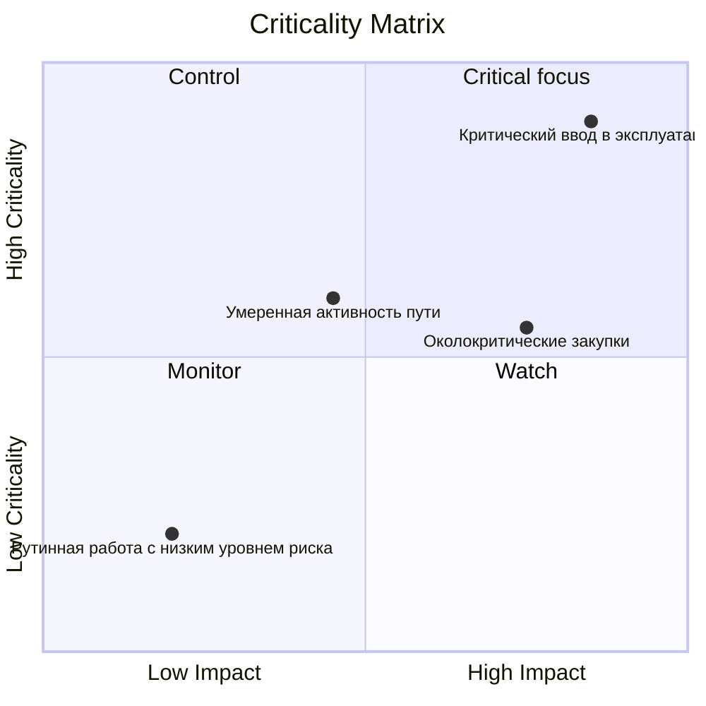

# Матрица критичности

Матрица критичности — это визуальный или аналитический метод, используемый для классификации и определения приоритетности действий проекта в зависимости от того, насколько они важны для завершения проекта. В контексте Primavera P6 это помогает менеджерам проектов, планировщикам и проверяющим PMO определить, какие действия создают наибольший риск графика.

Критический путь рассказывает текущую детерминированную историю графика. Матрица критичности идет еще дальше. Это помогает команде понять, какие действия уже являются критически важными, какие близки к тому, чтобы стать критическими, а какие окажут серьезное воздействие, если они не будут реализованы.

Это важно, поскольку деятельность, имеющая решающее значение сегодня, не всегда является единственной деятельностью, заслуживающей внимания. Деятельность, близкая к критической, с высоким влиянием задержек может стать проблемой завтрашнего дня. Долгосрочная закупочная деятельность, возможно, не находится на текущем критическом пути, но она может нести достаточный риск, чтобы оправдать строгий контроль.

## Что означает критичность в P6

В Primavera P6 критичность обычно означает, может ли действие повлиять на дату завершения проекта, если оно задерживается. Традиционно P6 определяет критические действия, используя настройки общего резерва или самого длинного пути.

Общее детерминистское определение простое:

- Критически важные действия — это действия с нулевым или отрицательным резервом.
- Эти действия находятся на критическом пути или тесно связаны с ним.
- Если они задерживаются, дата завершения проекта, скорее всего, будет отложена.

Это определение полезно, но оно не является полным. Он основан на одном расчетном условии графика. Он не полностью объясняет неопределенность, вероятность или размер воздействия в случае срыва деятельности.

Матрица критичности расширяет дискуссию от вопроса «критично ли это мероприятие сегодня?» на «насколько вероятно, что эта деятельность станет критической и какой ущерб она может нанести?»

## Что объединяет матрица критичности

Матрица критичности обычно объединяет два измерения.

Первое измерение — это чувствительность или вероятность графика. Это можно измерить по тому, как часто деятельность становится критической во время моделирования Монте-Карло или по тому, насколько она близка к критической на основе общего плавающего или близкого к критическому порогового значения.

Второе измерение – это влияние. Это означает серьезность задержки в случае пробуксовки активности. Влияние может быть основано на продолжительности деятельности, влиянии задержки на завершение проекта, индексе чувствительности, подверженности затратам, влиянии договорных этапов или суждении руководства.

Вместе эти измерения помогают команде расставить приоритеты в деятельности.

Этот тип представления полезен, поскольку он отделяет действия, которые просто появляются в критическом фильтре, от действий, которые заслуживают активного внимания руководства.

## Простая матричная структура

Базовую матрицу критичности можно представить в виде сетки:

| Критичность/Воздействие | Низкое воздействие | Среднее воздействие | Высокое воздействие |
| --- | --- | --- | --- |
| Низкая критичность | Монитор | Монитор | Смотреть |
| Средняя критичность | Обзор | Контроль | Высокий приоритет |
| Высокая критичность | Контроль | Высокий приоритет | Критический фокус |

Точные ярлыки могут меняться в зависимости от организации, но идея остается той же. Можно отслеживать действия с низкой критичностью и низким воздействием. Действия с высокой критичностью и сильным воздействием требуют целенаправленного контроля.

## Данные P6, используемые в матрице

Primavera P6 обычно не обеспечивает встроенное представление матрицы критичности по умолчанию. Матрица обычно строится с использованием данных о деятельности P6 в сочетании с внешним анализом.

Полезные поля P6 включают в себя:

- Общий путь резерва времени объем.
- Свободное резерв времени.
- Продолжительность активности.
- Оставшаяся продолжительность.
- Статус активности.
- Даты начала и окончания.
- Ограничения.
- Логика отношений.
- Календарь.
- ИСР или коды деятельности.
- Индикаторы критического или самого длинного пути.

Эти данные дают детерминированное представление графика. Он показывает текущий рассчитанный путь, работу, близкую к критической, ограниченные действия и действия с длительным оставшимся воздействием.

## Входные данные для анализа рисков

Чтобы сделать матрицу более мощной, команда может добавить вероятностные данные о рисках графика из анализа Монте-Карло. Это может быть сделано с помощью таких инструментов, как Primavera Risk Analysis или других платформ моделирования рисков.

Важные показатели риска включают индекс критичности, общий резерв, индекс чувствительности графика, а также продолжительность или значение воздействия.

Индекс критичности, часто называемый CI, показывает процент симуляций, в которых действие появляется на критическом пути. Например, если операция имеет CI = 80 %, она была критичной в 80 % смоделированных сценариев.

полный резерв времени показывает, насколько деятельность близка к завершению проекта в детерминированном графике. Резерв времени, близкое к нулю, является предупреждающим знаком.

Индекс чувствительности графика сочетает в себе критичность и влияние. Это помогает показать не только, становится ли деятельность критической, но и оказывает ли она существенное влияние на результат.

Продолжительность или значение воздействия помогают оценить серьезность. Более продолжительное мероприятие, пакет закупок с высоким уровнем риска или задача, связанная с контрольным этапом контракта, могут иметь больший эффект в случае задержки.

## Пример

Рассмотрим следующий упрощенный набор действий:

| Активность | Плавать | Индекс критичности | Продолжительность | Результат матрицы |
| --- | ---: | ---: | ---: | --- |
| А | 0 дней | 95% | 20 дней | Критический фокус |
| Б | 5 дней | 60% | 15 дней | Высокий приоритет |
| С | 20 дней | 15% | 10 дней | Монитор |

Деятельность А относится к области высокой критичности и высокого воздействия. Он не имеет плавающего значения, в большинстве симуляций выглядит критическим и имеет большую продолжительность. Оно заслуживает целенаправленного контроля.

Мероприятие Б, возможно, не такое срочное, как Действие А, но оно все равно заслуживает внимания. Он имеет ограниченный резерв и значительную вероятность стать критическим.

Действие C имеет больше резервов и меньшую критичность. Его не следует игнорировать, но он не требует такого же уровня внимания руководства.

## Почему это полезно

Матрица критичности помогает команде проекта не полагаться только на один детерминированный критический путь. Детерминированный путь важен, но это лишь один из вариантов графика.

Матрица помогает командам:

- Расставьте приоритеты за тем, за чем следует внимательно следить.
- Сосредоточьте меры по смягчению последствий на ключевых видах деятельности, связанных с рисками.
- Определите почти критические действия до того, как они станут критическими.
- Понимание вероятностного графика риска.
- Сравните вероятность и влияние в одном представлении.
- Более четко сообщайте руководству о плановых рисках.

Для отчетности PMO это особенно полезно, поскольку преобразует сложность графика в структуру принятия решений. Вместо представления сотен действий команда может показать, какие действия находятся в зонах «критического фокуса», «высокого приоритета», «контроля» или «мониторинга».

## Простой способ создать его

Начните с экспорта данных о деятельности из P6. Включите идентификатор действия, имя действия, ИСР, общий резерв, оставшуюся продолжительность, начало, окончание, календарь, ограничения и индикаторы критического или самого длинного пути.

Затем добавьте дополнительные поля анализа рисков, такие как индекс критичности и индекс чувствительности графика. Если данные моделирования недоступны, используйте практические пороговые значения, основанные на резерве и продолжительности. Например, высокая критичность может означать, что общий резерв не превышает 0 дней или CI превышает 70%. Средняя критичность может означать почти критический резерв или CI между 40 % и 70 %.

Определите пороги воздействия. Высокоэффективная деятельность может иметь длительную продолжительность, быть привязанной к договорной контрольной точке, быть частью пакета с высоким уровнем риска или оказывать влияние на завершение проекта, как это показано при моделировании.

Наконец, составьте график действий в Excel, Power BI или другом инструменте отчетности. Результат не должен быть сложным. Ценность заключается в том, чтобы сделать приоритет видимым.

## Используйте суждение

Матрица критичности — это инструмент поддержки принятия решений, а не автоматический ответ. Пороговые значения должны быть проверены командой управления проектом и скорректированы с учетом типа проекта, чувствительности контракта и срока выполнения графика.

Также помните, что матрица зависит от качества графика. Если в графике P6 отсутствует логика, нереалистичная продолжительность, жесткие ограничения, плохие календари или слабые обновления статуса, матрица унаследует эти недостатки.

Лучшее использование матрицы — объединить аналитические результаты с профессиональными решениями по планированию.

## Заключение

Матрица критичности ранжирует проектные мероприятия по вероятности того, что они станут критическими и какое влияние они окажут в случае задержки. Он использует данные P6, такие как общий резерв, продолжительность, ограничения и логика, и его можно усилить с помощью результатов Монте-Карло, таких как индекс критичности и индекс чувствительности графика.

Для менеджеров проектов и рецензентов PMO матрица превращает риски графика в более четкий разговор руководства. Это помогает команде сосредоточиться на наиболее важных действиях, а не только на тех, которые фигурируют в сегодняшнем критическом фильтре.

При правильном использовании матрица критичности помогает проектной команде перейти от реактивной отчетности к упреждающему контролю графика.
## Связанные материалы
- [Критический путь или путь резерва времени, начинающийся с ограничения - Обзор](../../metrics/09_cp_or_float_path_starting_with_constraint/02_guide_template.md)
- [Критический путь](../03_CRITICAL%20PATH/03_CRITICAL%20PATH.md)
- [Виды деятельности в P6](../05_ACTIVITY%20TYPES%20IN%20P6/05_ACTIVITY%20TYPES%20IN%20P6.md)
