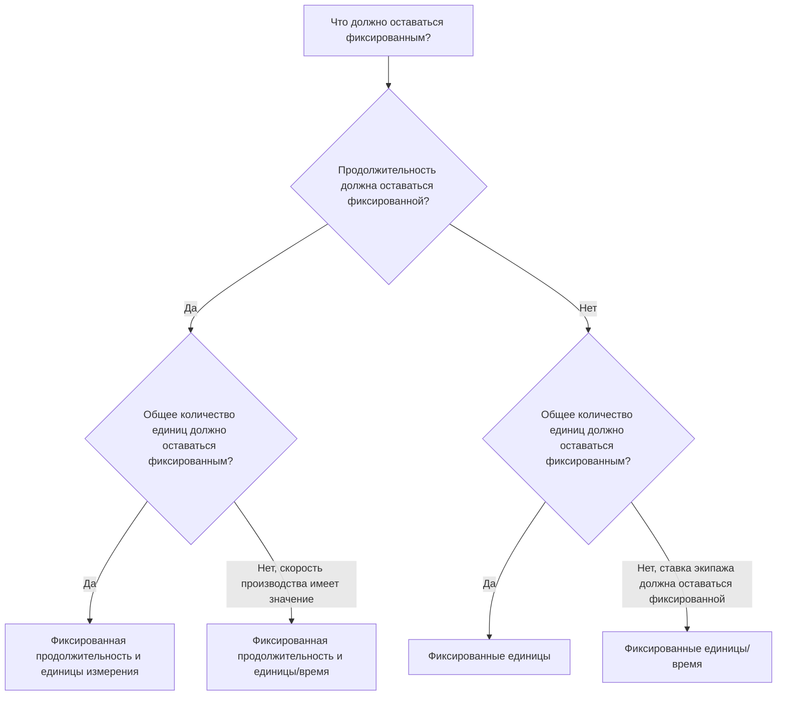

# Типы длительности в P6

Тип продолжительности — это одно из полей в Primavera P6, которое управляет поведением действия при изменении продолжительности, единиц измерения и производительности ресурсов. Это легко не заметить, но это может повлиять на даты графика, загрузку ресурсов, прогнозы затрат, освоенный объем и поведение обновлений.

Многие планировщики думают о продолжительности только как о количестве дней. В P6 продолжительность — это больше, чем число. Действие также может иметь трудовые единицы, нетрудовые единицы, единицы времени, календари ресурсов, календари действий и оставшуюся работу. Тип продолжительности сообщает P6, что должно оставаться фиксированным при перерасчете графика или когда планировщик меняет ресурсы и продолжительность.

В этом блоге объясняются основные типы длительности, доступные для действий в P6, чем они отличаются, для чего каждый из них используется и когда использовать один вместо другого.

## Тип продолжительности не совпадает с полем продолжительности

Прежде чем рассматривать типы, полезно разделить две идеи.

Поля «Продолжительность» представляют собой такие значения, как «Исходная продолжительность», «Оставшаяся продолжительность», «Фактическая продолжительность» и «Продолжительность при завершении». Они описывают время.

Тип продолжительности — это настройка расчета. Он сообщает P6, как сбалансировать продолжительность, общее количество единиц и количество единиц за раз, когда что-то меняется.

Например, если вы добавите к действию больше ресурсов, должно ли оно завершиться раньше? Или продолжительность должна остаться прежней, а общее усилие увеличиться? Ответ зависит от типа продолжительности.

## Основные типы длительности

Распространенными типами продолжительности P6 являются:

- Фиксированная продолжительность и единицы измерения.
- Фиксированная продолжительность и единицы/время.
- Фиксированные единицы.
- Фиксированные единицы/время.

На первый взгляд названия могут показаться техническими, но каждое из них отвечает на практический вопрос: какую часть деятельности P6 должен защищать, когда что-то меняется?

## Фиксированная продолжительность и единицы измерения

Фиксированная продолжительность и единицы сохраняют фиксированную продолжительность активности и общее количество единиц. Если количество единиц измерения времени меняется, P6 корректирует скорость, а не продолжительность или общее усилие.

Этот тип полезен, когда и запланированный временной интервал, и общие усилия должны оставаться стабильными.

Пример:

Мероприятие рассчитано на 10 дней и рассчитано на 400 рабочих часов. Группа планирования хочет, чтобы продолжительность оставалась 10 дней, а общий объем бюджетных усилий - 400 часов. Если детали назначения ресурсов изменяются, запланированная продолжительность и общее количество единиц не должны автоматически перемещаться.

Используйте фиксированную продолжительность и единицы измерения, когда:

- У активности есть фиксированное рабочее окно.
- Общий объем работ уже согласован.
- Изменения скорости использования ресурсов не должны автоматически изменять продолжительность активности.
- График используется для стабильного контроля себестоимости или освоенного объема.

Это часто полезно для управляемых пакетов работ, где контролируются как продолжительность графика, так и бюджетные усилия.

## Фиксированная продолжительность и единицы/время

Фиксированная продолжительность и единицы/время сохраняют фиксированную продолжительность и скорость использования ресурсов. Если ресурсы добавляются или удаляются, P6 может корректировать общее количество единиц.

Этот тип полезен, когда действие должно происходить в течение фиксированного временного окна, а скорость загрузки ресурсов должна оставаться постоянной.

Пример:

Деятельность по поддержке управления проектом длится 20 дней. Команда назначает одного инженера проекта на 8 часов в день. Продолжительность должна оставаться 20 дней, а суточная норма должна оставаться 8 часов в день. Общее количество единиц зависит от временного окна и ставки.

Используйте фиксированную продолжительность и единицы/время, когда:

- Продолжительность активности фиксирована.
- Важна дневная или почасовая ставка ресурса.
- Общее количество единиц должно рассчитываться на основе продолжительности и скорости.
- Деятельность представляет собой постоянную поддержку или фиксированный период работы.

Это может быть полезно для надзора, управления, инспекционной поддержки или временной поддержки.

## Фиксированные единицы

Фиксированные единицы сохраняют фиксированное общее количество единиц. Если скорость ресурса изменится, P6 может отрегулировать продолжительность.

Этот тип полезен, когда объем работы фиксирован, но продолжительность зависит от производительности или доступности ресурсов.

Пример:

На одну деятельность требуется 800 рабочих часов. Если команда выделит больше экипажа, работа может завершиться раньше. Если вместимость экипажа меньше, работа может занять больше времени. Общий объем работы составляет 800 часов.

Используйте фиксированные единицы, когда:

- Количество работы или общее усилие фиксировано.
- Продолжительность должна зависеть от доступности ресурсов или производительности.
- Размер команды может изменить время, необходимое для выполнения задания.
- Планирование ресурсов активно и поддерживается.

Это может быть полезно для производственной работы, где известны общие усилия и ожидается, что продолжительность будет зависеть от загрузки бригады.

## Фиксированные единицы/время

Фиксированные единицы/время сохраняют фиксированную норму ресурсов. Если продолжительность изменяется, общее количество единиц меняется вместе с ней.

Этот тип полезен, когда бригада или ресурс работают с фиксированной скоростью в течение всего времени действия.

Пример:

В деятельности по надзору за объектом используется один супервайзер по 8 часов в день. Если продолжительность деятельности увеличивается с 10 до 15 дней, общее количество единиц должно увеличиться, поскольку супервайзеру потребуется больше дней. Дневная ставка остается фиксированной.

Используйте фиксированные единицы/время, когда:

- Количество экипажа или ресурсов фиксировано.
- Общее количество единиц должно увеличиваться или уменьшаться при изменении продолжительности.
- Деятельность представляет собой усилие, основанное на времени.
- Ресурс назначается на весь срок действия.

Это часто полезно для поддержки, надзора, проверки и управления, где время определяет общие усилия.

## Как выбрать правильный тип продолжительности

Лучший тип продолжительности зависит от того, что представляет собой действие, и от того, как группа управления проектом ожидает, что P6 будет рассчитывать изменения.

Простой способ выбора — спросить:

- Установлена ​​ли продолжительность в плане, контракте, окне или доступе?
- Фиксируются ли общие усилия количеством, бюджетом или оценкой?
- Установлена ​​ли норма ресурсов в плане экипажа или штатном графике?
- Должно ли добавление ресурсов сократить деятельность?
- Должно ли расширение деятельности увеличить общее количество единиц?

Если продолжительность и общее количество единиц должны оставаться фиксированными, используйте «Фиксированная продолжительность и единицы».

Если продолжительность и производительность должны оставаться фиксированными, используйте фиксированную продолжительность и единицы/время.

Если общая работа должна оставаться фиксированной, а продолжительность должна реагировать на загрузку ресурсов, используйте фиксированные единицы.

Если скорость ресурса должна оставаться фиксированной, а единицы измерения должны меняться в зависимости от продолжительности, используйте фиксированные единицы/время.

## Практические примеры

Для заливки бетона, запланированной как фиксированная однодневная операция с определенной командой и бюджетом затрат, может подойти фиксированная продолжительность и единицы измерения.

Для поддержки управления проектом, назначенной по постоянной ежедневной ставке в течение фиксированного отчетного периода, может подойти «Фиксированная продолжительность и единицы/время» или «Фиксированные единицы/время» в зависимости от того, будут ли изменения общего количества единиц или продолжительности определять прогноз.

Для монтажных работ с известным общим объемом работ, когда размер бригады влияет на время завершения, могут подойти фиксированные единицы.

Для надзора за объектом, который продолжается до тех пор, пока продолжается период строительства, может быть целесообразным использовать фиксированные единицы/время.

Важным моментом является то, что выбор должен отражать метод управления проектом, а не привычку.

## Распространенные ошибки

Одной из распространенных ошибок является оставление типа продолжительности по умолчанию для каждого действия без проверки того, соответствует ли он цели действия.

Другая ошибка — использование поведения продолжительности, основанного на ресурсах, когда проект не обеспечивает тщательного распределения ресурсов. Если данные о ресурсах недостаточны, расчеты на основе ресурсов могут привести к ненадежным результатам.

Третья ошибка — изменение длительности во время обновлений без понимания того, как P6 будет пересчитывать единицы или ставки. Это может повлиять на загрузку затрат, освоенный объем и гистограммы ресурсов.

Наконец, не рассматривайте тип продолжительности как чисто техническую настройку. Это влияет на поведение графика при изменении плана.

## Тип продолжительности и качество графика

Тип продолжительности является частью качества графика, поскольку он влияет на достоверность прогноза. Если продолжительность, единицы измерения и интенсивность использования ресурсов не соответствуют ожиданиям, в графике могут отображаться неправильные даты или потребность в ресурсах.

Для проверок PMO полезно проверить, являются ли типы продолжительности одинаковыми для аналогичных групп действий. Инженерная деятельность, закупочная деятельность, строительная деятельность, деятельность LOE и вспомогательная деятельность могут требовать разных правил, но выбор должен быть осознанным.

Если график перегружено ресурсами, тип продолжительности становится еще более важным. Это помогает определить, влияют ли изменения ресурсов на продолжительность, общее количество единиц или количество единиц за раз.

## Заключение

Типы длительности в P6 определяют, как действия реагируют на изменение продолжительности, общего количества единиц и ставок ресурсов. Это не просто фоновые настройки.

Фиксированная продолжительность и единицы измерения защищают как время, так и общие усилия. Фиксированная продолжительность и единицы/время защищают время и скорость. Фиксированные единицы защищают общие усилия. Фиксированные единицы/время защищают скорость использования ресурсов.

Выбор правильного типа продолжительности помогает рассчитывать график таким образом, чтобы оно соответствовало плану проекта. Это также упрощает понимание и защиту загрузки ресурсов, обновлений о ходе работы, прогнозов затрат и отчетов по графику.
## Связанные материалы
- [Действия, начинающиеся с даты данных, без управляющей логики: почему этот показатель графика имеет значение - Обзор](../../metrics/01_activities_starting_in_dd_with_no_logic_driving/02_guide_template.md)
- [Виды деятельности в P6](../05_ACTIVITY%20TYPES%20IN%20P6/05_ACTIVITY%20TYPES%20IN%20P6.md)
- [Даты в P6](../07_DATES%20IN%20P6/07_DATES%20IN%20P6.md)
