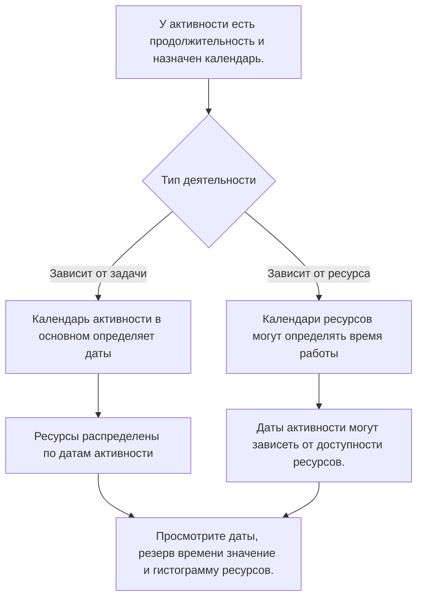

Календари — одна из основных основ графика Primavera P6. Они определяют, когда можно выполнять работу. Они сообщают P6, какие дни являются рабочими, какие дни нерабочими, сколько часов доступно в дне и в какое время суток начинается и заканчивается работа.

Поскольку календари работают скрытно, их легко недооценить. График может иметь четкую логику и разумную продолжительность, но если календари неверны или непоследовательны, даты все равно могут вводить в заблуждение.

Понимание календарей необходимо для обеспечения качества графика, планирования ресурсов, анализа критического пути и дисциплины обновлений.

## Что делает календарь в P6

В P6 календарь преобразует продолжительность в даты. Если продолжительность деятельности составляет 10 рабочих дней, P6 необходимо знать, что означает рабочий день. С понедельника по пятницу? Суббота включена? Рабочий день длится 8, 10 или 12 часов? Работа начинается в 7:00 или 8:00? Исключаются ли праздники?

Календарь отвечает на эти вопросы.

Календари влияют:

- Даты начала и окончания деятельности.
- Ранние и поздние даты.
- Общий путь резерва времени объем.
- Критический путь и самый длинный путь.
- Время использования ресурсов.
- Интерпретация лага в отношениях.
- Даты сдвигаются во время обновлений.
- Прогнозирование и точность отчетов.

Календарь — это не просто элемент административной настройки. Это часть расчета графика.

## Почему может потребоваться более одного календаря

Многим проектам требуется более одного календаря, поскольку не вся работа выполняется по одному и тому же шаблону.

Примеры включают в себя:

- Инженерно-технические работы офиса по 5-дневному календарю.
- Работы по строительству объекта по 6-дневному календарю.
- Выключение или простои работают по 24-часовому календарю.
- Пусконаладочные работы в ночную смену.
- Окна доступа владельца.
- Экологические ограничения.
- Закупочная деятельность в зависимости от рабочих дней поставщика.
- Календари для конкретных ресурсов для инспекторов, поставщиков или специализированных бригад.

Использование одного календаря для всего может показаться простым, но это может привести к нереалистичным датам. Если ввод в эксплуатацию возможен только ночью, обычный дневной календарь может оказаться неправильным. Если поставщик работает только в будние дни, 7-дневный календарь строительства может завысить доступность.

Целью не является создание большого количества календарей. Цель состоит в том, чтобы создать достаточное количество календарей для моделирования реальных условий работы, не усложняя график.

## Календари активности

Календарь действий привязан непосредственно к действию. Он определяет рабочее время, используемое для расчета продолжительности и дат этого действия, особенно для действий, зависящих от задачи.

Например, если «Установка кабельного лотка» имеет 6-дневный календарь строительства, P6 рассчитает свои работы на основе этого календаря. Если суббота — рабочий день, действие может завершиться раньше, чем в 5-дневном календаре.

Календари действий обычно являются основным элементом управления календарем для обычных запланированных действий.

Используйте календари активности, когда сама работа соответствует определенному графику работы, например, дневная смена, ночная смена, работа в период простоя или работа в офисе.

## Календари ресурсов

Календари ресурсов определяют, когда ресурс доступен. Ресурсом может быть человек, команда, предмет оборудования, специалист поставщика или другой назначенный ресурс.

Календари ресурсов становятся особенно важными, когда действия зависят от ресурсов или когда в проекте используется выравнивание ресурсов или детальное планирование ресурсов.

Например, мероприятие может быть назначено шестидневному строительному календарю, но назначенный ему специалист-инспектор может быть доступен только с понедельника по среду. Если действие основано на ресурсах, P6 может рассчитывать даты на основе календаря ресурса, а не только календаря действий.

Календари ресурсов полезны, когда доступность ресурсов является реальным ограничением планирования. Они также могут создать путаницу, если они назначены, но не поддерживаются.

## Как взаимодействуют календари действий и ресурсов

Взаимосвязь между календарями действий и календарями ресурсов зависит от типа действий, настроек ресурсов и поведения расчета графика.

Для действий, зависящих от задачи, календарь действий обычно является основной основой для продолжительности действия. Календари ресурсов по-прежнему могут влиять на распределение и использование ресурсов.

Для ресурсозависимых действий календари ресурсов могут влиять на время выполнения работы. Это означает, что календарь ресурсов может более непосредственно влиять на даты активности.

Ключевым моментом является то, что календари необходимо пересматривать вместе. В календаре активности может быть указано, что работа возможна, а в календаре ресурсов указано, что назначенный ресурс недоступен. Это несоответствие может привести к десинхронизации.

## Что означает десинхронизация календаря

Десинхронизация календаря происходит, когда разные календари в графике не соответствуют реальному принципу работы проекта.

Общие примеры включают в себя:

- Для активности используется 6-дневный календарь, а для назначенных ресурсов — 5-дневный календарь.
- Для активности используется календарь дневных смен, а для ресурсов — ночная смена.
- Два связанных действия используют разное время начала и окончания в течение дня.
- Лаг интерпретируется через календарь, не соответствующий работе.
- Скопированное действие сохраняет старый календарь из другого проекта.
- В календаре ресурсов есть праздники, которых нет в календаре действий.

Результат может сбить с толку. Даты могут неожиданно сдвинуться. Действия могут завершиться на день позже. Число с резерва времени может измениться без очевидной логической причины. Гистограммы ресурсов могут не соответствовать плану выполнения. Критический путь может измениться из-за календарного поведения, а не из-за реальной последовательности.

## Проблемы, вызванные несоответствием календаря

Несоответствие календаря может привести к ряду проблем с качеством графика.

Во-первых, это может привести к вводящим в заблуждение датам. Может показаться, что задача требует больше времени, поскольку в календаре меньше рабочих периодов.

Во-вторых, это может исказить поплавок. Действия в разных календарях могут рассчитывать ранние и поздние даты способами, которые трудно объяснить.

В-третьих, это может повлиять на критический путь. Путь может стать критическим, потому что календарь ограничивает работу, а не потому, что логическая последовательность действительно контролирует.

В-четвертых, это может повредить отчетность о ресурсах. Гистограмма ресурсов может отображать спрос на ресурсы в те даты, когда ресурс фактически недоступен, или может отсутствовать спрос, который должен появиться.

Наконец, это может создать путаницу при обновлении. Когда дата данных перемещается, действия в разных календарях могут реагировать по-разному, что затрудняет статус и проверку графика.

## Как решить проблему десинхронизации

Начните с определения стандарта календаря проекта. Определите обычную рабочую неделю, время начала и окончания рабочего дня, праздники, периоды простоя и специальные рабочие окна.

Затем просмотрите все календари в графике. Проверять:

- Название и цель календаря.
- Рабочие дни.
- Ежедневное рабочее время.
- Время начала и окончания.
- Праздники и исключения.
- Тип календаря.
- Действия, назначенные в календарь.
- Ресурсы, назначенные календарю.

Затем просмотрите действия, даты которых выглядят странно. Добавьте столбцы «Календарь действий», «Тип действия», «Начало», «Окончание», «Ранний старт», «Раннее окончание», «Общий резерв», «Ресурсы» и календари ресурсов, если они доступны.

Если календарь неправильный, исправьте его. Если действие назначено не тому календарю, измените назначение. Если календарь ресурсов действителен, но приводит к неожиданным результатам, подтвердите, должно ли действие быть зависимым от ресурса или Зависимым от задачи.

После внесения исправлений пересчитайте график и просмотрите затронутые даты, резерв, критический путь и гистограмму ресурсов.

## Хорошее управление календарем

Календарь должен управляться так же, как логика и ограничения. Они не должны размножаться бесконтрольно.

Хорошая практика включает в себя:

- Используйте четкое соглашение об именах.
- Сохраняйте ограниченный набор утвержденных календарей проектов.
- Документируйте, почему существуют специальные календари.
- Не копируйте неиспользуемые календари из старых графиков.
- Перед утверждением базового плана просмотрите назначения календаря мероприятий.
- Просмотрите календари ресурсов, если используется загрузка ресурсов.
- Проверьте время начала и окончания календаря, а не только рабочие дни.

Управление календарем особенно важно в больших графиках, где многие пользователи могут добавлять или копировать действия.

## Практический пример

В строительном проекте используется 6-дневный календарь работ на строительной площадке. Большинство строительных работ проводится с понедельника по субботу с 7:00 до 17:00. Команда по вводу в эксплуатацию работает в ночную смену с 22:00 до 6:00, поскольку тестирование может проводиться только в автономном режиме.

Оба календаря действительны.

Проблема возникает, когда скопированные строительные работы случайно наследуют календарь ночных смен. Их свидания начинают странно двигаться. Некоторые отношения, похоже, подталкивают преемников к следующему дню. Плавающие изменения происходят таким образом, что команда не может объяснить.

Исправление состоит в том, чтобы не удалять календарь ночных смен. Исправление состоит в том, чтобы исправить назначение календаря действий, подтвердить, какие действия действительно нуждаются в календаре ночной смены, и пересчитать график.

## Заключение

Календари в P6 определяют, когда можно выполнять работу. Они влияют на даты активности, резерв, критический путь, загрузку ресурсов, задержки и поведение обновлений.

Часто требуется более одного календаря, поскольку проекты включают в себя разные схемы работы: работа на объекте, работа в офисе, ночные смены, остановки, работа с поставщиками и доступность ресурсов. Но наличие нескольких календарей требует тщательного контроля.

Основной риск – десинхронизация. Если календари действий и календари ресурсов не соответствуют реальному плану выполнения, в графике могут отображаться запутанные даты, вводящий в заблуждение резерв и ненадежная информация о ресурсах.

Строгий график намеренно использует календари. У каждого календаря есть цель, каждый специальный календарь документируется, а назначения календаря действий и ресурсов проверяются, прежде чем график станет надежным.
## Связанные материалы
- [Календари с разным временем начала и окончания в Primavera P6 - Обзор](../../metrics/20_calendars_with_different_start_finish_time_in_day/02_guide_template.md)
- [Даты в P6](../07_DATES%20IN%20P6/07_DATES%20IN%20P6.md)
- [Продолжительность в P6](../09_DURATION%20IN%20P6/09_DURATION%20IN%20P6.md)
