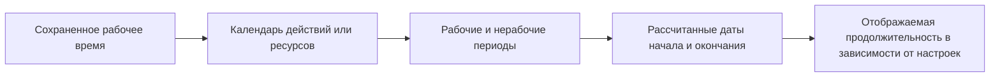

# Продолжительность в P6

Продолжительность в Primavera P6 на первый взгляд выглядит просто: действие занимает определенное количество дней. На практике продолжительность — одна из самых важных и наиболее неправильно понимаемых частей графика.

Продолжительность связана с календарями, типом активности, назначениями ресурсов, обновлениями прогресса и настройками отображения пользователя. Продолжительность, отображаемая как «5 дней», может не означать одно и то же в каждом графике, каждом календаре или макете каждого пользователя. Вот почему планировщикам необходимо понимать не только, что такое продолжительность, но и то, как P6 ее хранит, рассчитывает и отображает.

## Что означает продолжительность

Продолжительность – это количество рабочего времени, необходимое для выполнения какой-либо деятельности. Это не просто количество календарных дней между датой начала и датой окончания.

Например, мероприятие продолжительностью 5 дней может охватывать:

- 5 календарных дней по календарю с понедельника по пятницу без перерыва.
- 7 календарных дней, если в рабочий период попадают выходные дни.
- Менее 5 календарных дней при круглосуточном или удлиненном календаре.
- Более 5 календарных дней в случае прерывания работы в праздничные или нерабочие дни.

Это первый ключевой урок: продолжительность — это рабочее время, а даты начала и окончания — это календарные позиции.

## Как P6 сохраняет продолжительность

P6 хранит продолжительность как время, обычно на уровне часов в базовых данных графика. То, что пользователь видит в макете, может отображаться в виде дней, недель, месяцев или лет в зависимости от предпочтений.

Это означает, что отображаемая продолжительность часто является конверсией. Если P6 сохраняет активность как 40 рабочих часов, один пользователь может видеть ее как 5 дней, если при преобразовании отображения используется 8 часов в день. Другая настройка может показать это по-другому, если преобразование периода времени или основа календаря отличаются.

Вот почему два человека могут посмотреть на одно и то же график и запутаться, если их пользовательские предпочтения или административные настройки периода времени не совпадают.

## Продолжительность и календари

Календари сообщают P6, когда можно приступить к работе. Продолжительность сообщает P6, сколько рабочего времени требуется. Затем календарь помещает это рабочее время в реальные даты.

Если оставшаяся продолжительность действия составляет 40 часов, календарь определяет, как распределяются эти 40 часов.

В календаре с 8-часовым рабочим днем ​​40 часов могут выглядеть как 5 рабочих дней. В календаре с 10-часовым рабочим днем ​​те же 40 часов могут выглядеть как 4 рабочих дня. В 24-часовом календаре это может занимать гораздо меньше календарного времени.

Вот почему календарные задания имеют значение. Изменение календаря может изменить дату окончания, даже если сохраненная продолжительность работы останется прежней.

## Исходная продолжительность

Исходная продолжительность — это запланированная продолжительность действия до применения прогресса. Он представляет собой первоначальную оценку рабочего времени, необходимого для завершения действия.

Исходная продолжительность важна во время планирования и разработки базовых показателей. Это помогает определить ожидаемые усилия или временной интервал для выполнения задачи. Он также используется при обсуждении хода выполнения и производительности, поскольку дает ориентир для определения ожидаемой продолжительности выполнения действия.

Используйте исходную продолжительность, чтобы ответить: сколько времени планировалось занять для этого действия до обновления статуса?

## Оставшаяся продолжительность

Оставшаяся продолжительность — это количество рабочего времени, которое еще необходимо для завершения действия с текущей даты данных.

Для неначатого действия оставшаяся продолжительность обычно соответствует исходной продолжительности, если она не была пересмотрена. Для незавершенного действия оставшаяся продолжительность должна отражать реалистичную работу, которую еще предстоит выполнить. Для завершенного действия оставшаяся продолжительность должна быть равна 0.

Оставшаяся продолжительность — одно из наиболее важных полей обновления в P6. Если он неверен, прогноз будет неверным.

Используйте «Оставшуюся продолжительность», чтобы ответить: сколько рабочего времени еще требуется?

## Фактическая продолжительность

Фактическая продолжительность представляет собой количество времени, уже потраченное на действие, исходя из фактического прогресса. Он привязан к фактическому началу, фактическому окончанию, дате данных, календарям и методу обновления.

Фактическая продолжительность должна поддерживать историю статуса. Если действие началось, фактическая продолжительность должна иметь смысл относительно фактического начала и даты данных. Если операция завершена, фактическая продолжительность должна совпадать с фактическим периодом работы.

Используйте фактическую продолжительность, чтобы ответить: сколько рабочего времени уже израсходовано?

## По завершении Продолжительность

Продолжительность при завершении представляет собой общую ожидаемую продолжительность действия после объединения фактической и оставшейся работы.

Проще говоря:

Фактическая продолжительность + оставшаяся продолжительность = продолжительность по завершении

Это полезно, поскольку показывает, займет ли действие больше или меньше времени, чем первоначально планировалось. Если исходная продолжительность составляла 10 дней, а продолжительность по завершении теперь составляет 15 дней, прогнозируется, что действие займет больше времени, чем планировалось.

Используйте «Продолжительность по завершении», чтобы ответить: сколько времени в целом займет это действие?

## Продолжительность и предпочтения пользователя

Пользовательские настройки управляют отображением единиц времени для отдельного пользователя. Пользователь может выбрать, будет ли продолжительность отображаться в часах, днях, неделях, месяцах или годах.

Это влияет на то, что видит пользователь, а не обязательно на базовый расчет графика. Например, одна и та же сохраненная продолжительность может отображаться в виде часов в одном макете и дней в другом.

Это полезно, но может также создать путаницу. Планировщик, рассматривающий детальную работу, может предпочесть часы. Менеджер проекта может предпочесть несколько дней. Отчет о портфолио может показывать месяцы. Если не понимать основу преобразования, цифры могут выглядеть противоречивыми.

При просмотре длительности подтвердите единицы отображения. Спросите, выражена ли указанная продолжительность в часах, днях, неделях или других единицах измерения.

## Настройки администратора и периоды времени

Настройки администратора включают настройки периода времени, которые определяют, как P6 преобразует часы в более крупные единицы, такие как дни, недели, месяцы и годы. Эти настройки важны, поскольку они влияют на то, как отображаются и преобразуются значения длительности.

Например, если система использует 8 часов в день, 40 часов отображаются как 5 дней. Если система использует 10 часов в день, 40 часов отображаются как 4 дня.

Это не обязательно означает, что работа изменилась. Это может означать только то, что конверсия изменилась.

В некоторых конфигурациях P6 отображение продолжительности может также зависеть от того, использует ли система или пользователь назначенные календарные часы для преобразования периода времени. Вот почему проектным командам следует согласовать стандарты календаря, предпочтения пользователей и настройки периода времени администратора перед формальным отчетом.

## Почему продолжительность может выглядеть по-разному

Продолжительность может выглядеть по-разному по нескольким причинам:

- Разные пользователи отображают время в разных единицах.
- Настройки периода времени администратора преобразуют часы по-разному.
- В календарях занятий указаны разные часы в день.
- Календари ресурсов отличаются от календарей действий.
- Действия используют разные типы действий.
- Оставшаяся продолжительность была обновлена ​​вручную.
- Прогресс применился неправильно.
- Время суток скрыто в макете.

Вот почему проблема продолжительности не всегда является проблемой продолжительности. Иногда это проблема календаря. Иногда это проблема настройки дисплея. Иногда это проблема обновления прогресса.

## Связь с типами действий и типами продолжительности

Тип активности влияет на то, какой календарный базис является наиболее важным. Зависимые от задачи действия обычно полагаются в первую очередь на календарь действий. Ресурсозависимые виды деятельности могут подвергаться большему влиянию календарей ресурсов.

Тип продолжительности влияет на то, как P6 балансирует продолжительность, единицы ресурсов и единицы за раз. Например, добавление ресурсов может сократить или не сократить действие в зависимости от типа продолжительности.

Поэтому, когда продолжительность ведет себя неожиданно, проверьте три вещи вместе:

- Календарь активности и календарь ресурсов.
- Тип деятельности.
- Тип продолжительности.

Эти поля работают вместе. Рассмотрение только одного из них может привести к неправильному выводу.

## Распространенные проблемы

Одной из распространенных проблем является ввод продолжительности в днях без осознания того, что календарь активности использует другое количество часов в день, чем ожидалось.

Другая проблема — сравнение продолжительности действий, использующих разные календари. Пять дней в одном календаре могут не соответствовать количеству рабочего времени, равному пяти дням в другом.

Третья проблема — противоречивые предпочтения пользователей. Один рецензент может видеть часы, а другой — дни, и оба могут подумать, что график изменилось.

Другая распространенная проблема — изменение настроек администратора после того, как графика уже существуют. Это может привести к тому, что отображаемая продолжительность будет выглядеть по-другому, даже если базовые сохраненные часы не изменились.

## Как правильно просматривать продолжительность

При просмотре продолжительности в P6 не смотрите только на число, указанное в столбце «Продолжительность».

Проверять:

- Исходная продолжительность.
- Оставшаяся продолжительность.
- Фактическая продолжительность.
- По завершении.
- Календарь активности.
- Календарь ресурсов, если ресурсы используются.
- Тип деятельности.
- Тип продолжительности.
- Отображение единиц времени в настройках пользователя.
- Преобразование периода времени в настройках администратора.

Если даты или продолжительность выглядят странно, добавьте в макет поля календаря и времени. Не скрывайте время суток во время устранения неполадок.

## Заключение

Продолжительность в P6 — это рабочее время, а не просто прошедшее календарное время. P6 сохраняет продолжительность как время, применяет календари для размещения этого времени в графике и отображает его в соответствии с предпочтениями пользователя и административными настройками периода времени.

Это означает, что продолжительность необходимо рассматривать с учетом контекста. Значение, отображаемое как «5 дней», зависит от календарных часов, единиц отображения, настроек преобразования, типа активности, типа продолжительности и статуса обновления.

Хороший планировщик понимает, что продолжительность — это не только входные данные. Это часть вычислительной машины. Когда продолжительность, календари и предпочтения совпадают, график становится легче объяснить и сделать его более надежным для управления проектом.
## Связанные материалы
- [Действия, начинающиеся с даты данных, без управляющей логики: почему этот показатель графика имеет значение - Обзор](../../07_metrics_ru/01_activities_starting_in_dd_with_no_logic_driving/01_overview_template.md)
- [Календари в P6](../08_CALENDARS%20IN%20P6/08_CALENDARS%20IN%20P6.md)
- [Процент завершенных типов в P6](../10_PERCENT%20COMPLETION%20TYPES%20IN%20P6/10_PERCENT%20COMPLETION%20TYPES%20IN%20P6.md)
