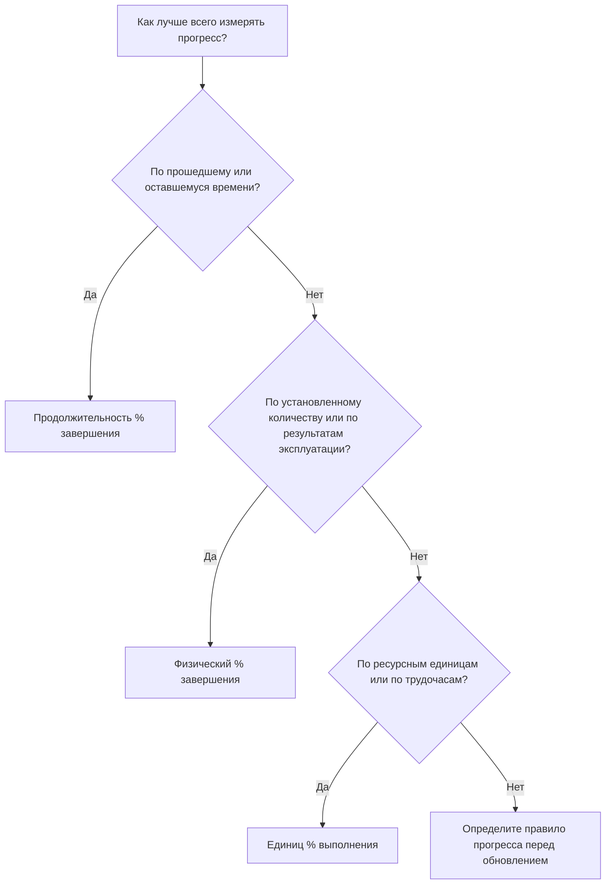

# Процент завершенных типов в P6

Процент выполнения — одно из наиболее заметных полей прогресса в Primavera P6, но оно также и одно из наиболее неправильно понимаемых. Значение завершения на 50 % может означать разные вещи в зависимости от того, как настроено действие и как в проекте измеряется прогресс.

В P6 тип «Процент выполнения» определяет, как рассчитывается или обновляется «Процент выполнения действия». Он сообщает P6, должен ли прогресс основываться на времени, физических достижениях или единицах ресурсов.

Основными типами процентов выполнения действий являются:

- Продолжительность % завершения.
- Физический % завершения.
- Единицы % выполнения.

Выбор правильного имеет значение, поскольку прогресс – это не только отчетные цифры. Это влияет на оставшуюся продолжительность, освоенный объем, отчетность о ресурсах, достоверность графика и качество каждого цикла обновления.

## Почему важен процент завершения типа

Разные виды деятельности требуют разных способов измерения прогресса.

Для некоторых видов деятельности время является разумным показателем. Если задача длилась 10 дней и была завершена в течение 5 рабочих дней, разумно сказать, что операция завершена примерно на 50%.

На другие занятия времени не хватает. Экипаж может потратить 5 дней на 10-дневную задачу и выполнить только 20% физической работы. Другой экипаж может выполнить 80% количества за первую половину времени. В таких случаях прогресс, основанный на продолжительности, может ввести команду проекта в заблуждение.

Для графиков, нагруженных ресурсами, единицы могут быть лучшей основой для прогресса. Если деятельность запланирована на 1000 человеко-часов, а заработано или израсходовано 600 человеко-часов, показатель «Процент выполнения единиц» может лучше отражать прогресс.

Правильный тип процента выполнения зависит от того, что представляет собой действие и как на самом деле измеряется прогресс.

## % выполнения действий

% завершения действия — это общее значение прогресса, отображаемое для действия. Его источник зависит от выбранного типа процента завершения.

Если для действия используется «Продолжительность % завершения», % завершения действия определяется соотношением между исходной, фактической и оставшейся длительностью.

Если для действия используется «Физический % завершения», «% завершения действия» соответствует значению «Физический % завершения», введенному пользователем.

Если для действия используются единицы % завершения, % завершения действия основан на прогрессе единиц ресурсов.

Вот почему два действия могут показывать выполнение на 50 %, но означать совершенно разные вещи.

## Продолжительность % завершения

Продолжительность % завершения измеряет прогресс в зависимости от времени. Он сравнивает количество израсходованной продолжительности с общей ожидаемой продолжительностью.

Проще говоря, если запланированная или завершающая продолжительность действия составляет 10 дней, а израсходовано 5 дней, то действие может показывать около 50 % продолжительности % завершения.

Продолжительность % завершения полезна, когда прогресс достаточно пропорционален времени.

Примеры включают в себя:

- Периоды административного рассмотрения.
- Периоды ожидания или лечения.
- Задачи поддержки, основанные на времени.
- Некоторые простые виды деятельности, при которых производительность труда стабильна.

Используйте Продолжительность % завершения, когда время является справедливым показателем прогресса и оставшаяся продолжительность тщательно поддерживается.

Риск заключается в том, что затраченное время не всегда соответствует достигнутой работе. Задача может занимать половину запланированной продолжительности и при этом физически сильно отставать. Если планировщик полагается только на продолжительность, отчеты о ходе выполнения могут выглядеть лучше, чем реальность.

## Физический % завершения

Физический процент выполнения вводится вручную или обновляется на основе фактического физического прогресса. Он представляет собой то, что действительно было достигнуто в работе, независимо от продолжительности или ресурсных единиц.

Часто это лучший вариант для строительства, инженерных работ, монтажных работ, пуско-наладочных работ или любой деятельности, где прогресс должен основываться на измеримых достижениях.

Примеры включают в себя:

- Выдано 40% чертежей.
- Установлено 60% кабельного лотка.
- 75% труб сварено.
- Выполнено 30 % тестового пакета.
- Выполнена 100% центровка оборудования.

Используйте физический процент выполнения, когда прогресс должен измеряться количеством, статусом поставки, проверкой на месте или мнением ответственного владельца.

Преимущество в том, что он может отражать реальность лучше, чем прошедшее время. Риск в том, что это требует дисциплины. Команда проекта должна определить, как измеряется физический прогресс, кто его утверждает и как собираются доказательства.

## Единиц % выполнения

Единицы % завершения измеряет прогресс на основе единиц ресурсов. Он сравнивает фактические единицы с единицами на момент завершения.

Это полезно, когда график загружено ресурсами, а прогресс отслеживается по рабочим часам, часам оборудования или другим измеримым единицам ресурсов.

Примеры включают в себя:

- Фактические трудозатраты, заработанные против запланированных трудозатрат.
- Часы использования оборудования по сравнению с запланированными часами использования оборудования.
- Установленные работы привязаны к прогрессу ресурса.
- Рабочие процессы освоенного объема на основе единиц измерения.

Используйте единицы % завершения, если единицы ресурсов надежны, обслуживаются и являются частью метода выполнения проекта.

Риск заключается в том, что потребление ресурсов не всегда равно физическому прогрессу. Команда может провести много часов, не выполнив ожидаемую работу. По этой причине показатель «% завершения» работает лучше всего, когда отчеты о ресурсах и измерение прогресса хорошо контролируются.

## Как выбрать правильный тип

Практический способ выбрать тип «Процент выполнения» — спросить, что означает прогресс для действия.

Если прогресс означает, что время прошло, используйте Продолжительность % завершения.

Если прогресс означает, что физическая работа выполнена, используйте «Физический % выполнения».

Если прогресс означает, что единицы ресурсов были заработаны или израсходованы, используйте % завершения единиц.

Выбор должен быть последовательным для схожих групп занятий. В инженерно-технических результатах может использоваться физический % завершения. Строительная установка может использовать физический % завершения в зависимости от количества. Поддержка управления на основе времени может использовать Продолжительность % завершения. Ресурсоемкие рабочие пакеты могут использовать единицы % завершения, если данные о ресурсах надежны.

## Связь с оставшейся продолжительностью

Процент выполнения и оставшаяся продолжительность должны рассказывать последовательную историю.

Деятельность может быть физически завершена на 80 %, но оставшаяся продолжительность все равно может составлять 10 дней, если оставшаяся работа сложна, задерживается или зависит от других условий. Это может быть правдой.

Продолжительность действия может составлять 50% % завершения, поскольку половина запланированного времени прошла, но если физически выполнено только 20% работы, оставшуюся продолжительность, вероятно, следует пересмотреть.

Вот почему хорошие обновления требуют как прогресса, так и анализа прогнозов. Процент выполнения показывает, как много было достигнуто. Оставшаяся продолжительность показывает, сколько времени еще необходимо.

## Распространенные ошибки

Одной из распространенных ошибок является использование продолжительности % выполнения для действий, в которых физический прогресс не пропорционален времени. Из-за этого прогресс может выглядеть лучше или хуже, чем реальная работа.

Другая ошибка — использование физического процента выполнения без правила измерения. Если одна дисциплина сообщает о физическом прогрессе по установленному количеству, а другая – по мнениям, график становится противоречивым.

Третья ошибка — использование Units % Complete, когда данные о ресурсах неполны или ненадежны. Если фактические единицы не поддерживаются, значение прогресса не будет заслуживающим доверия.

Другая проблема — обновление процента выполнения, но игнорирование оставшейся продолжительности. Деятельность может показывать прогресс, но при этом иметь нереалистичный прогноз.

## Хорошая практика

Определите правила выполнения до начала цикла обновления. Команда проекта должна знать, какие группы действий используют «Продолжительность», «Физический» или «Процент выполнения единиц».

Используйте макеты, которые отображают тип «Процент выполнения», «% выполнения операции», «% физического завершения», «% завершения», «% выполнения единиц», «Оставшуюся продолжительность», «Фактическое начало», «Фактическое завершение» и «Состояние действия».

Проверьте наличие несоответствий, таких как:

- Начал деятельность с прогрессом 0%.
- Оставшаяся продолжительность = 0, но статус не завершен.
- 100% прогресс без фактического завершения.
- Физический % выполнения, которое не соответствует данным на местах.
- % выполнения единиц на основе отсутствующих обновлений ресурсов.

Эти проверки помогают гарантировать, что прогресс не только зафиксирован, но и заслуживает доверия.

## Заключение

Тип «Процент выполнения» в P6 определяет, как измеряется ход выполнения операции. Продолжительность % завершения измеряет прогресс, основанный на времени. Физический % Полных показателей фактически выполненной работы. Units % Complete измеряет прогресс единицы ресурса.

Ни один тип не является лучшим для каждого вида деятельности. Правильный выбор зависит от того, как работа планируется, измеряется и контролируется.

В сильном графике намеренно используются типы с процентом завершения. Когда метод соответствует работе, обновления о ходе выполнения становятся более ясными, оставшаяся продолжительность становится более надежной, а отчетность по проекту становится легче защитить.
## Связанные материалы
- [Действия, начинающиеся с даты данных, без управляющей логики: почему этот показатель графика имеет значение - Обзор](../../metrics/01_activities_starting_in_dd_with_no_logic_driving/02_guide_template.md)
- [Продолжительность в P6](../09_DURATION%20IN%20P6/09_DURATION%20IN%20P6.md)
- [Где стоимость жизни в P6](../11_WHERE%20THE%20COST%20LIVE%20IN%20P6/11_WHERE%20THE%20COST%20LIVE%20IN%20P6.md)
