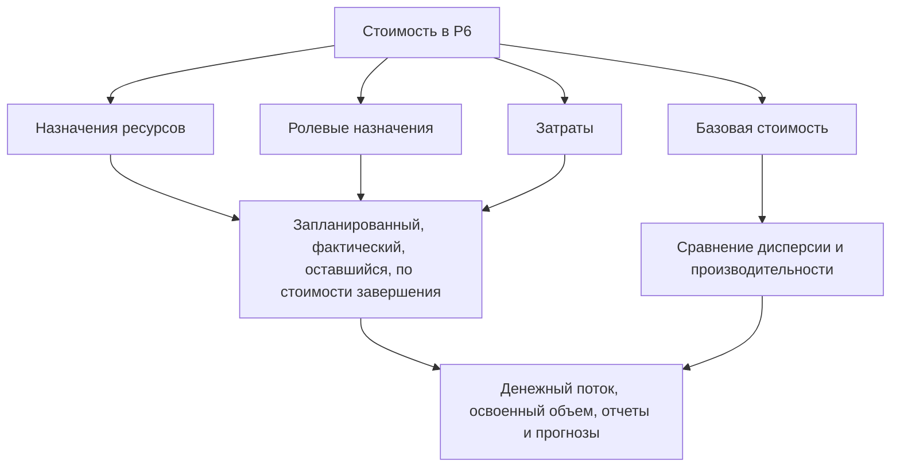

# Где стоимость жизни в P6

Стоимость в Primavera P6 позволяет жить в нескольких местах. Это полезно, но также может сбить с толку. В графике могут отображаться плановая стоимость, фактическая стоимость, остаточная стоимость, стоимость по завершении, стоимость ресурса, стоимость роли, стоимость расходов, поля освоенного объема и базовая стоимость. Эти ценности связаны, но не все они означают одно и то же.

Для групп управления проектами ключевым вопросом является не только «какова стоимость?» Правильный вопрос: откуда берутся эти затраты, что они представляют собой и как их следует использовать?

В этом блоге объясняются основные типы затрат, доступные в P6, различия между ними и случаи использования каждого из них.

## Почему расположение затрат имеет значение

P6 — это прежде всего инструмент планирования, но он также может поддерживать графики затрат, освоенный объем, движение денежных средств и прогнозные отчеты. Чтобы сделать это правильно, стоимость должна быть размещена в правой части модели графика.

Если затраты на рабочую силу вводятся в качестве расходов, гистограммы ресурсов могут не отражать правильную картину. Если фактическая стоимость вводится вручную, но проект ожидает, что она будет получена на основе фактических значений ресурсов, отчеты могут стать противоречивыми. Если базовые затраты отсутствуют, отчеты об отклонениях графика и отклонениях затрат теряют контекст.

Местоположение затрат имеет значение, поскольку источник затрат влияет на то, как они сводятся, обновляются, прогнозируются и составляются отчеты.

## Затраты ресурсов

Затраты на ресурсы возникают из ресурсов, назначенных на действия. Ресурс может представлять рабочую силу, оборудование или другую категорию ресурсов. Каждый ресурс может иметь ставки, единицы измерения и расчеты стоимости.

Например, если для какого-либо вида деятельности используется бригада слесарей-монтажников в течение 80 часов по определенной почасовой ставке, P6 может рассчитать стоимость рабочей силы на основе назначенных единиц и ставки.

Затраты на ресурсы полезны, когда проект хочет связать плановые действия с гистограммами труда, оборудования, производительности и ресурсов.

Используйте стоимость ресурсов, когда:

- Спрос на рабочую силу или оборудование имеет значение.
- Нужны гистограммы ресурсов.
- Стоимость привязана к часам или единицам.
- Заработанная стоимость или прогресс основаны на ресурсах.
- График используется для планирования ресурсов.

Основной риск – техническое обслуживание. Нагруженные ресурсами графики требуют дисциплины. Если единицы измерения, тарифы, календари или фактические значения не поддерживаются, отчеты о затратах не будут надежными.

## Стоимость ролей

Роли — это общие должностные функции, такие как инженер, электрик, планировщик, инспектор или крановщик. В P6 роли можно назначать действиям до того, как станут известны именованные ресурсы.

Ролевые затраты могут способствовать раннему планированию, когда команда знает тип необходимого ресурса, но не знает конкретного человека или команду.

Например, на этапе раннего инженерного планирования для деятельности может потребоваться 120 часов времени «старшего инженера». Названное лицо может еще не быть назначено, но эта роль может обеспечить скорость планирования и смету затрат.

Используйте стоимость ролей, когда:

- График пока в разработке.
- Названные ресурсы еще не подтверждены.
- Проекту требуется высокоуровневая оценка ресурсов или затрат.
- Роли позже будут заменены реальными ресурсами.

Ролевые затраты полезны для планирования на ранней стадии, но их следует пересматривать по мере развития проекта. Если роли остаются после того, как станут известны фактические ресурсы, график может стать слишком общим для детального контроля.

## Расходы

Затраты – это нересурсные затраты, отнесенные непосредственно к видам деятельности. Они полезны для затрат, которые не лучшим образом представлены ресурсами рабочей силы или оборудования.

Примеры включают в себя:

- Разрешения.
- Путешествовать.
- Единовременные выплаты поставщикам.
- Пакеты субподрядчиков.
- Материалы закупаются в фиксированной сумме.
- Плата за тестирование.
- Мобилизационные сборы.

Расходы могут быть запланированными, фактическими, оставшимися или завершенными, в зависимости от того, как проект их отслеживает.

Используйте расходы, когда:

- Стоимость не зависит от ресурсо-часов.
- Стоимость является фиксированной или паушальной статьей.
- Деятельность требует прямых нересурсных затрат.
- Проекту нужен денежный поток для статей, не связанных с трудом.

Риск состоит в том, что расходы могут стать свалкой. Если все затраты вводятся как расходы, в графике может потеряться возможность отдельно объяснять рабочую силу, оборудование и производительность.

## Бюджетная стоимость

Бюджетная стоимость — это запланированные затраты, назначенные на операцию. Это может быть связано с распределением ресурсов, ролями, расходами или их комбинацией.

Бюджетная стоимость важна, поскольку она представляет собой план затрат до его исполнения. Он поддерживает движение денежных средств, базовую стоимость, настройку освоенного объема и отчетность по контролю проекта.

Используйте бюджетную стоимость, чтобы ответить: какова была запланированная стоимость этого мероприятия?

Если бюджетные затраты отсутствуют или несогласованы, график все равно может рассчитывать даты, но не может поддерживать содержательную отчетность по затратам.

## Фактическая стоимость

Фактическая стоимость представляет собой уже понесенные затраты. В зависимости от настройки проекта фактическая стоимость может быть рассчитана на основе фактических единиц ресурсов и ставок, введенных вручную, импортированных из табелей учета рабочего времени или загруженных из внешней системы затрат.

Фактическая стоимость важна для отчетности о ходе работ и полученной стоимости. Он показывает, что было потрачено или записано на данный момент.

Используйте фактическую стоимость, чтобы ответить: какие затраты уже были понесены или зарегистрированы?

Риск заключается в смешивании источников. Если некоторые фактические затраты импортируются из бухгалтерского учета, а другие вводятся вручную в P6, команде необходимо четкое правило, чтобы избежать дублирования или пробелов.

## Оставшаяся стоимость

Оставшаяся стоимость — это прогнозируемая стоимость, необходимая для завершения действия. Он привязан к оставшимся единицам, ставкам ресурсов, оставшимся расходам и предположениям по обновлению.

Оставшаяся стоимость — одно из наиболее важных полей прогноза. Он сообщает команде проекта, сколько затрат останется с текущей даты данных.

Используйте оставшуюся стоимость, чтобы ответить: сколько затрат еще ожидается?

Если оставшаяся продолжительность обновляется, а оставшаяся стоимость — нет, прогноз может стать противоречивым. То же самое верно, когда единицы ресурсов или остаточные значения расходов не сохраняются.

## По стоимости завершения

Стоимость завершения — это ожидаемая общая стоимость операции после объединения фактической и оставшейся стоимости.

Проще говоря:

Фактическая стоимость + оставшаяся стоимость = стоимость завершения

По стоимости завершения помогает показать, будет ли операция, по прогнозам, завершена сверх, меньше или в рамках бюджета.

Используйте «По стоимости завершения», чтобы ответить: какова последняя ожидаемая общая стоимость?

## Базовая стоимость

Базовая стоимость берется из назначенного базового графика. Он используется для сравнения текущих значений затрат с утвержденным планом.

Базовая стоимость важна для отчетности об отклонениях. Без базовой линии проект может знать текущую прогнозируемую стоимость, но не знать, лучше или хуже этот прогноз, чем утвержденный план.

Используйте базовую стоимость, чтобы ответить: как текущие затраты соотносятся с утвержденным планом затрат?

Базовая стоимость особенно важна при использовании P6 для расчета освоенного объема или формальной отчетности PMO.

## Поля стоимости освоенного объема

P6 может поддерживать поля освоенного объема, такие как «Запланированная стоимость», «Освоенный объем», «Фактическая стоимость», «Отклонение стоимости» и «Отклонение графика», в зависимости от настройки проекта.

Освоенный объем использует информацию о графике с учетом затрат для сравнения запланированных трудозатрат, заработанных трудозатрат и фактических затрат.

Эти поля полезны, когда в проекте имеется формальный процесс освоения объема. Они требуют согласованных базовых показателей, правил прогресса, методов определения процента завершения и нагрузки на затраты.

Используйте поля стоимости освоенного объема, когда:

- Проект требует отчетности по EV.
- Определены правила прогресса.
- Базовая стоимость утверждена.
- Фактический источник затрат контролируется.
- Ход деятельности поддерживается стабильно.

Без такого контроля результаты освоенного объема могут выглядеть точными, но при этом ненадежными.

## Какой тип затрат следует использовать?

Используйте затраты ресурсов на рабочую силу и оборудование, которые должны поддерживать планирование ресурсов, производительность и гистограммы.

Используйте стоимость ролей для раннего планирования, когда именованные ресурсы еще неизвестны.

Используйте расходы для прямых затрат, не связанных с ресурсами, единовременных выплат, товаров поставщиков, разрешений, командировочных или субподрядных пакетов.

Используйте поля бюджетной, фактической, оставшейся стоимости и стоимости по завершении, чтобы понять поэтапный жизненный цикл затрат.

Используйте базовую стоимость для сравнения с утвержденным планом.

Используйте поля освоенного объема, если в проекте есть управление, необходимое для поддержки отчетности по EV.

## Распространенные проблемы

Одной из распространенных проблем является дублирование затрат. Одни и те же затраты субподрядчика могут быть введены как стоимость ресурсов, а затем снова как расходы.

Другая проблема – отсутствие фактической стоимости. В графике могут быть указаны бюджет и остаточная стоимость, но фактическая стоимость может находиться в отдельной системе учета и никогда не достигать P6.

Третья проблема — использование расходов на все. Это может привести к общей стоимости, но к слабой прозрачности ресурсов.

Другая проблема – непоследовательный прогресс. Если процент завершения, оставшаяся продолжительность и оставшаяся стоимость не совпадают, стоимость завершения становится ненадежной.

## Хорошая практика

Определите стратегию затрат перед загрузкой графика. Решите, где будут жить рабочая сила, оборудование, материалы, субподрядчики и косвенные затраты.

Используйте согласованные счета затрат, коды действий, ресурсы, роли и категории расходов.

Задокументируйте, будут ли фактические затраты введены в P6, импортированы или сообщены из другой системы.

Просматривайте поля затрат во время каждого цикла обновления. Запланированная, фактическая, остаточная стоимость и стоимость завершения должны представлять собой последовательную историю.

## Заключение

Стоимость в P6 может находиться в ресурсах, ролях, расходах, базовых планах и полях освоенного объема. У каждого места своя цель.

Затраты на ресурсы связывают стоимость с трудом и оборудованием. Ролевые затраты поддерживают раннее планирование. Расходы отражают прямые статьи, не связанные с ресурсами. Запланированные, фактические, остаточные затраты и затраты на момент завершения показывают жизненный цикл затрат. Поля «Базовый план» и «Освоенный объем» поддерживают сравнение и отчеты о производительности.

Строгий график с высокой затратностью не строится путем размещения цифр там, где они подходят. Он создается путем принятия решения о том, кому принадлежит каждый тип затрат, и поддержания этой структуры на протяжении каждого цикла обновления.
## Связанные материалы
- [Действия, начинающиеся с даты данных, без управляющей логики: почему этот показатель графика имеет значение - Обзор](../../metrics/01_activities_starting_in_dd_with_no_logic_driving/02_guide_template.md)
- [Процент завершенных типов в P6](../10_PERCENT%20COMPLETION%20TYPES%20IN%20P6/10_PERCENT%20COMPLETION%20TYPES%20IN%20P6.md)
- [Типы ресурсов в P6](../12_RESOURCE%20TYPES%20IN%20P6/12_RESOURCE%20TYPES%20IN%20P6.md)
