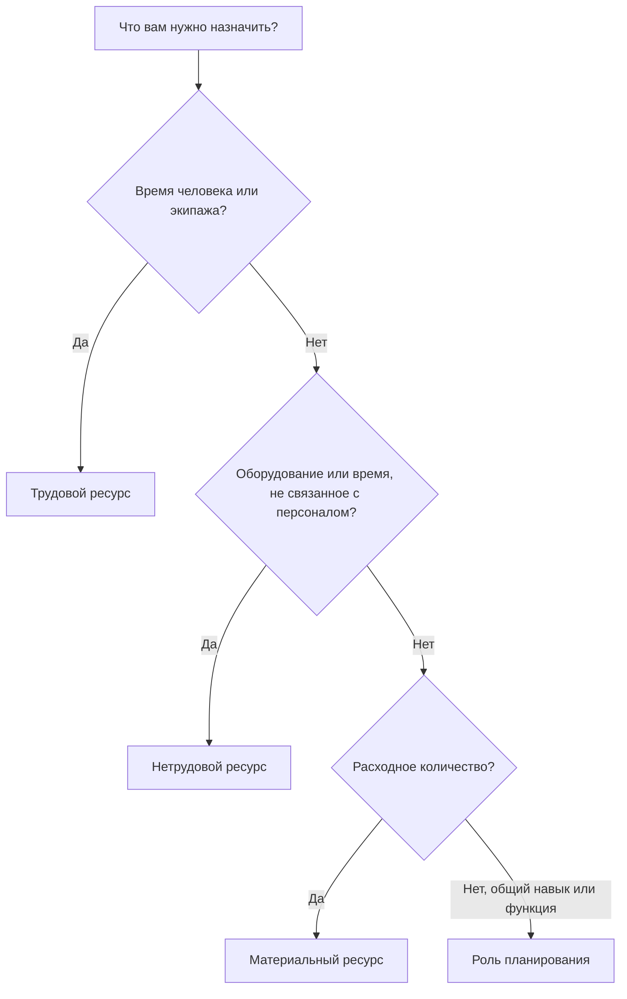

# Типы ресурсов в P6

Ресурсы в Primavera P6 представляют собой людей, оборудование и материалы, необходимые для выполнения работы. Они связывают график с мощностью, производительностью, стоимостью и спросом на ресурсы с течением времени.

График может существовать без ресурсов, но график, насыщенное ресурсами, дает команде проекта более глубокое представление. Он может отображать гистограммы рабочей силы, потребность в оборудовании, использование материалов, кривые затрат, ограничения ресурсов и возможные перегрузки. Чтобы сделать эту информацию полезной, планировщик должен понимать различные типы ресурсов, доступные в P6, и когда использовать каждый из них.

Основными типами ресурсов в P6 являются:

- Труд.
- Нетруд.
- Материал.

P6 также использует роли, которые не совсем совпадают с ресурсами, но тесно связаны между собой и очень полезны при планировании.

## Почему тип ресурса имеет значение

Тип ресурса влияет на то, как P6 обрабатывает единицы, тарифы, затраты, календари и отчеты.

Трудовой ресурс ведет себя иначе, чем материальный ресурс. К крану не следует относиться так же, как к объему бетона. Общая роль инженера — это не то же самое, что именованный ресурс инженера. Если типы ресурсов смешаны неправильно, гистограммы, отчеты о затратах, обзоры производительности и результаты освоенного объема могут ввести в заблуждение.

Тип ресурса отвечает на практический вопрос: какой тип объекта назначается действию?

## Трудовые ресурсы

Трудовые ресурсы представляют собой людей или бригады. Обычно они измеряются в часах, днях или других единицах измерения времени. Трудовые ресурсы могут иметь тарифы, календари, ограничения доступности и значения затрат.

Примеры включают в себя:

- Планировщик.
- Гражданский экипаж.
- Электрик.
- Сварочная бригада.
- Инженер.
- Инспектор.
- Техник по вводу в эксплуатацию.

Используйте трудовые ресурсы, когда график должен отражать человеческие усилия или потребности экипажа. Трудовые ресурсы полезны для составления гистограмм рабочей силы, планов укомплектования персоналом, анализа производительности и прогнозирования затрат на рабочую силу.

Например, для операции под названием «Установка кабельного лотка» может потребоваться 4 электрика на 5 дней. Назначение трудовых ресурсов позволяет графику показать потребность в электриках в этот период.

Трудовые ресурсы также полезны, когда в проекте необходимо сравнить запланированное рабочее время с фактическим рабочим временем.

## Нетрудовые ресурсы

Нетрудовые ресурсы представляют собой оборудование или другие неличные активы многократного использования. Они обычно основаны на времени, как и труд, но не являются человеческими ресурсами.

Примеры включают в себя:

- Журавль.
- Экскаватор.
- Сварочный аппарат.
- Испытательное оборудование.
- Оборудование бригады лесов.
- Специализированный набор инструментов.
- Генератор.

Используйте нетрудовые ресурсы, когда наличие оборудования имеет значение или когда стоимость оборудования необходимо отслеживать с течением времени.

Например, если для подъема тяжелого груза требуется кран на два дня, назначение нетрудового ресурса крана поможет команде проекта увидеть потребность в кранах, избежать конфликтов и спрогнозировать стоимость оборудования.

Нетрудовые ресурсы важны, когда оборудования недостаточно, оно дорогое, распределяется между рабочими участками или является движущей силой последовательности работ.

## Материальные ресурсы

Материальные ресурсы представляют собой расходные материалы. Обычно они измеряются в количествах, а не во времени.

Примеры включают в себя:

- Бетон кубометров.
- Стальные тонны.
- Кабельные метры.
- Катушки для труб.
- Клапаны.
- Покрытие л.
- Панели.

Используйте материальные ресурсы, когда в графике необходимо отслеживать потребление на основе количества или затраты, связанные с материалами.

Материальные ресурсы могут поддерживать кривые материалов, отслеживание количества и загрузку затрат. Они особенно полезны, когда график связан с установленными количествами или освоенным объемом, основанным на количествах.

Например, деятельность может включать прокладку кабеля длиной 500 метров. Назначение кабеля в качестве материального ресурса помогает команде отслеживать запланированное и фактическое установленное количество с течением времени.

Материальные ресурсы не должны использоваться для представления рабочего времени или времени оборудования. Они служат другой цели.

## Роли

Роли — это общие должностные функции или категории навыков. Они не то же самое, что ресурсы, но помогают при планировании до того, как станут известны именованные ресурсы.

Примеры включают в себя:

- Старший инженер.
- Электромонтажник.
- Гражданский инспектор.
- Планировщик.
- Руководитель пуско-наладочных работ.
- Машинист крана.

Роли полезны на раннем этапе планирования, поскольку проект может знать, какой тип навыков необходим, но не знать точно, кто будет выполнять работу.

Например, инженерная деятельность может потребовать 80 часов работы «старшего инженера-электрика». Позже эту роль можно заменить или дополнить именованным ресурсом.

Используйте роли, когда:

- Планирование по-прежнему находится на высоком уровне.
- Названия ресурсов не подтверждены.
- Спрос на ресурсы зависит от типа навыка.
- Организация хочет получить ранние прогнозы по укомплектованию штатов.

Роли следует пересматривать по мере развития проекта. Если график требует детального контроля, роли, возможно, придется заменить реальными ресурсами.

## Календари ресурсов

Ресурсы могут иметь календари. Это важно, поскольку доступность ресурсов может отличаться от доступности активности.

Например, для строительной деятельности может использоваться 6-дневный календарь работ, но назначенный специалист поставщика может быть доступен только с понедельника по пятницу. Если действие зависит от ресурса или используется выравнивание ресурсов, календарь ресурсов может повлиять на график.

Трудовые и нетрудовые ресурсы часто нуждаются в календарях, поскольку люди и оборудование доступны только в определенное время. Материальные ресурсы обычно ведут себя иначе, поскольку они представляют собой количества, а не рабочее время.

Если даты ресурсов выглядят странно, проверьте календарь активности и календарь ресурсов.

## Затраты ресурсов

Ресурсы могут иметь уровень затрат. Трудовые и нетрудовые ресурсы часто используют повременные ставки. Для материальных ресурсов часто используются единичные расценки.

Например:

- Электрик: стоимость за час.
- Кран: стоимость за час или день.
- Бетон: стоимость за куб.м.

Когда ресурсы назначены действиям, P6 может рассчитать запланированную, фактическую, оставшуюся стоимость и стоимость завершения.

Это полезно для графиков затрат, отчетов о освоенном объеме, прогнозов ресурсов и анализа движения денежных средств. Но это работает хорошо только тогда, когда поддерживаются единицы измерения, тарифы, календари и обновления прогресса.

## Выбор правильного типа ресурса

Используйте «Труд», когда ресурсом является человек, команда или человеческие усилия.

Используйте Nonlabor, когда ресурсом является оборудование или актив многократного использования, время которого имеет значение.

Используйте «Материал», если ресурс представляет собой расходуемое количество.

Используйте роли при планировании по навыкам или функциям до того, как будут известны названные ресурсы.

Выбор должен отражать то, как проект хочет планировать, измерять и составлять отчеты о работе.

## Распространенные ошибки

Одна распространенная ошибка — использовать трудовые ресурсы для всего. Поначалу это может облегчить загрузку затрат, но снижает ясность, когда количество оборудования или материалов имеет значение.

Другая ошибка — использование материальных ресурсов для статей, которые на самом деле являются расходами или единовременными выплатами по субподряду. Если проект не требует отслеживания количества, расходы могут быть более уместными.

Третья ошибка — назначение ресурсов без сохранения фактических единиц. График с загрузкой ресурсов полезно только в том случае, если обновления хода выполнения поддерживают актуальность данных о ресурсах.

Другая проблема — путаница ролей и ресурсов. Роли хороши для планирования, но именованные ресурсы лучше, когда важны подробные назначения, календари и фактические данные.

## Хорошая практика

Определите стратегию использования ресурсов перед загрузкой графика.

Решите, какая работа будет использовать трудовые ресурсы, какая работа будет использовать нетрудовые ресурсы, какие материалы требуют отслеживания количества и где вместо этого следует использовать расходы.

Используйте согласованные соглашения об именах и коды ресурсов. Содержите словарь ресурсов в чистоте. Избегайте дублирования ресурсов с немного разными именами.

Просматривайте назначения ресурсов во время каждого цикла обновления. Единицы измерения, затраты, календари и фактические данные должны оставаться в соответствии с процессом управления проектом.

## Заключение

Типы ресурсов в P6 помогают определить, что необходимо для выполнения работы. Трудовые ресурсы представляют собой людей и бригады. Нетрудовые ресурсы представляют собой оборудование и активы многократного использования. Материальные ресурсы представляют собой потребляемые количества. Роли поддерживают планирование по навыкам или функциям до того, как станут известны именованные ресурсы.

Выбор правильного типа ресурса упрощает анализ графика. Он улучшает гистограммы трудозатрат, планирование оборудования, отслеживание материалов, загрузку затрат, освоенный объем и прогнозную отчетность.

Хороший насыщенный ресурсами график — это не только график с прикрепленными ресурсами. Это график, в котором каждый тип ресурсов используется намеренно и поддерживается на протяжении всего срока действия проекта.
## Связанные материалы
- [Действия начались с 0% прогресса в Primavera P6 - Обзор](../../07_metrics_ru/13_activity_started_progress_zero/01_overview_template.md)
- [Где стоимость жизни в P6](../11_WHERE%20THE%20COST%20LIVE%20IN%20P6/11_WHERE%20THE%20COST%20LIVE%20IN%20P6.md)
- [Ограничения ресурсов в P6](../13_RESOURCES%20LIMITS%20IN%20P6/13_RESOURCES%20LIMITS%20IN%20P6.md)
